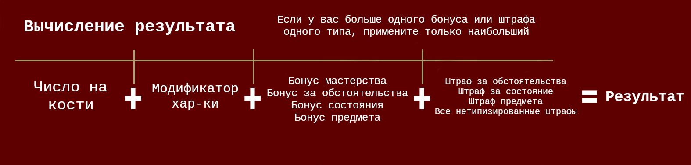
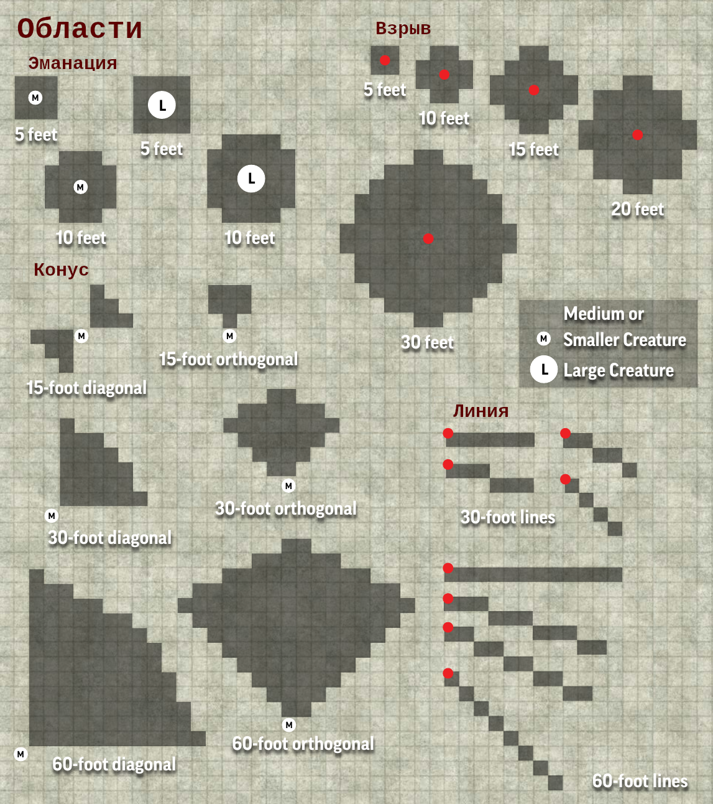
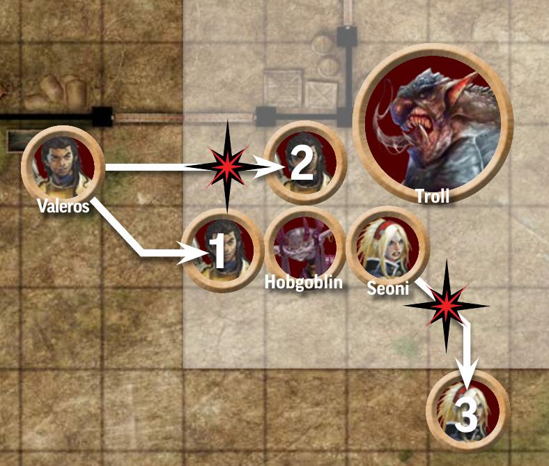
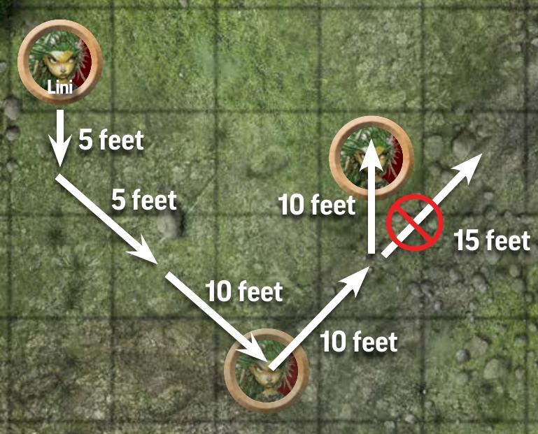
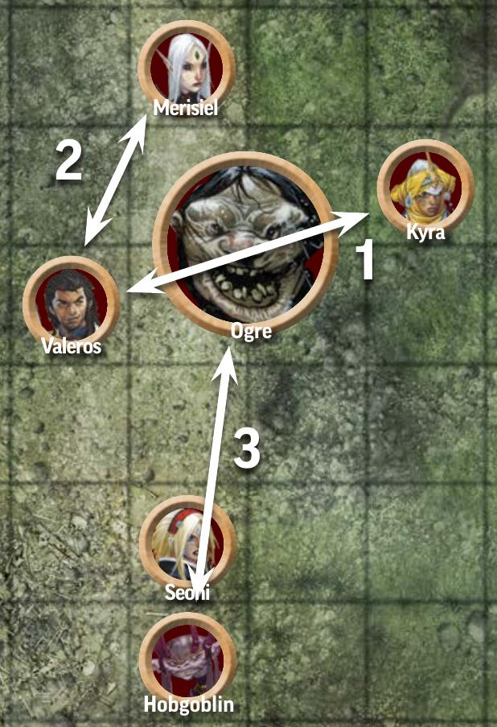
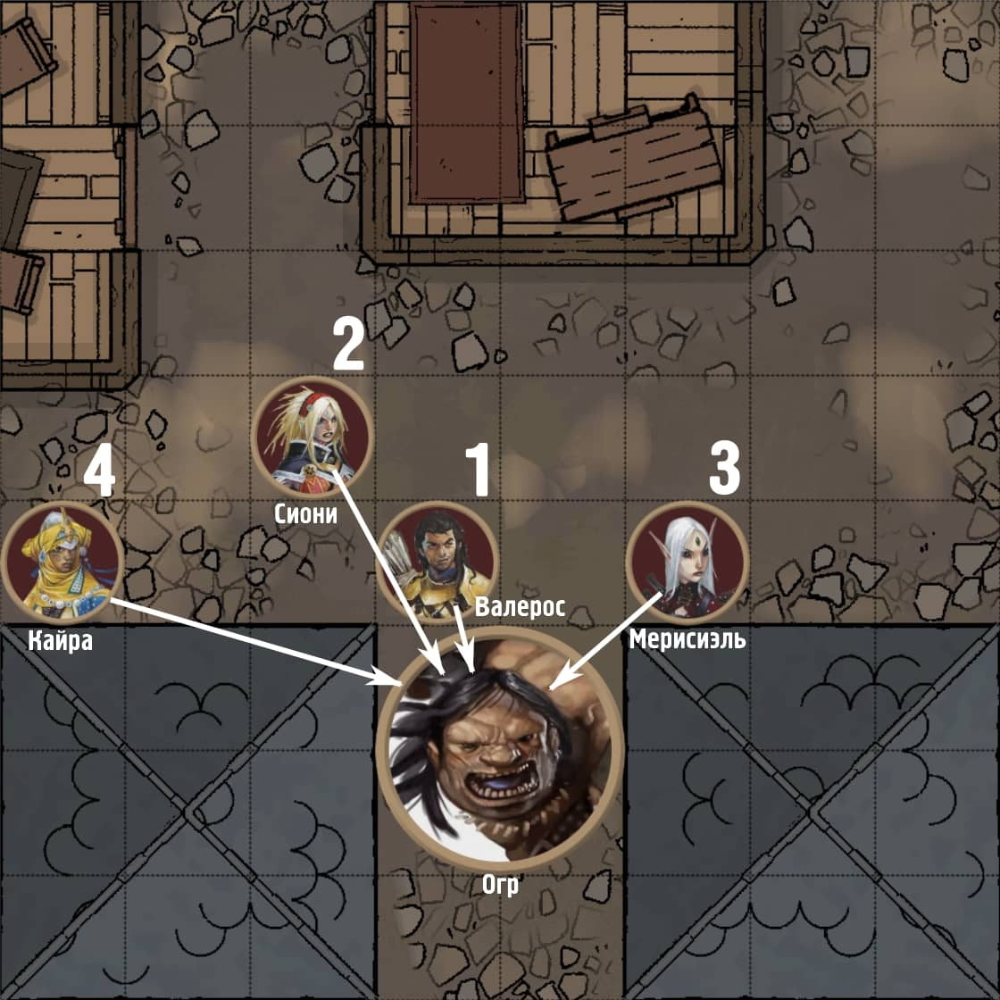

.. _rst--ch9--playing-the-game:

Ведение игры
==============

.. epigraph::

   *К этому моменту у вас есть персонаж и вы готовы играть в Pathfinder! Или быть может вы ГМ и готовитесь начать ваше первое приключение. Как бы там ни было, эта глава предоставляет полные правила упомянутые в Главе 1:* :ref:`rst--ch1--introduction` *. Глава начинается с описания общих правил и соглашений того как ведется игра, и потом представляет подробные аспекты правил каждого режима игры.*

-----------------------------------------------------------------------------

Перед тем как погружаться в основы игры важно понять три режима игры, которые определяют темп приключения и конкретные правила которые вы будете использовать в данное время.
Каждый режим имеет различный темп и представляет разный уровень опасности для персонажей.
Мастер определяет какой режим подходит для истории в данный момент и совершает переход между ними.
Вероятнее всего вы будете переходить между режимами исследования и столкновения в течение приключения до того как отправитесь в поселение чтобы совершить что-нибудь в режиме бездействия.

Самый запутанный из режимов это **режим столкновения**.
Здесь имеют место самые активные действия и он чаще всего используется для сражений или других рискованных ситуаций.
Как правило Мастер переключается в режим столкновения с просьбой игроков "сделать бросок на инициативу" чтобы определить порядок в котором действующие лица будут совершать ходы в течение столкновения.
Затем время делиться на раунды, каждый из которых длится примерно 6 секунд в игровом мире.
Каждый раунд персонаж игрока, другие существа, а иногда бедствия и явления используют свой ход в порядке инициативы.
В начале хода участники получают в свое распоряжение определенное количество действий (обычно 3 для персонажей игроков и других существ) а так же специальное действие называемое **реакция**.
Посредством этих действий вы взаимодействуете с миром в рамках столкновения.

В **режиме исследования** время более гибкое и идет в свободной форме.
Минуты, часы или даже дни игрового мира проходят быстро по мере того как персонажи путешествуют по местности, исследуют необитаемые участки подземелья или отыгрывают роли во время общественных мероприятий.
Часто процесс исследования приводит к столкновению и Мастер переключает игру в соответствующий режим до окончания столкновения и возврата в режим исследования.

Третий режим это **бездействие**.
Во время него игроки подвергаются меньшему риску и течение времени измеряется днями или более.
Именно в это время вы можете выковать магический меч, изучить заклинание или приготовиться к следующему приключению.

Основные правила
-----------------

Прежде чем изучать правила для каждого режима игры вам необходимо понять некоторые основные правила.
Они так или иначе используются в каждом режиме.

.. sidebar:: Игровые соглашения

	В Pathfinder много специальных правил, но вы всегда должны учитывать эти общие правила.

	.. rubric:: Последнее слово за Мастером

	Если вы не уверены как применить правило, решение за Мастером.
	Разумеется Pathfinder это игра, и при рассмотрение правил, Мастеру рекомендуется прислушиваться ко мнению каждого и принять решение которое будет честным и забавным.

	.. rubric:: Частные случаи превыше общих

	Основной принцип Pathfinder это частные правила превыше общих.
	Если два правила конфликтуют более специфичное имеет приоритет.
	Если после этого остается неясность, Мастер определяет какое правило использовать.
	Например, правило гласит что при при атаке скрытого существа вы должны совершить чистую проверку с классом сложности 5 (DC 5) на попадание.
	Чистые проверки не получают преимуществ от модификаторов, бонусов и не получают штрафы, но способность специально созданная чтобы преодолеть скрытность может переопределить и изменить это.
	Если правило не определяет обратного, применяется общее правило из этой главы.
	Хотя некоторые специальные правила могут и указывать на общие правила для предоставления подробностей, всегда по умолчанию должны использоваться общие правила даже если об этом не сказано прямо.

	.. rubric:: Округление

	Вам может потребоваться вычислить часть значения, как пример снизить урон наполовину. Всегда округляйте до меньшего значения если не сказано обратное.
	Например если заклинание наносит 7 урона, а существо получает половину, то оно получит 3 урона.

	.. rubric:: Умножение

	Когда больше одного эффекта умножат одно и то же число, не умножайте несколько раз последовательно. Вместо этого сложите множители в один, уменьшая каждый из них после второго на 1.
	Для примера, если одно свойство удваивает длительность заклинания и другая так же удваивает его длительность, то вы утроите длительность, а не учетверите её.

	.. rubric:: Дублирование эффектов

	Когда вы подверглись какому-то эффекту несколько раз, применяется только эффект высшего уровня или более новый если они одного уровня.
	Например, если вы использовали *Броню Мага* и потом наколдовали её снова, вы получите эффект только от одного из заклинаний.
	Колдовство на ту же цель могло бы дать большую продолжительность если было бы произнесено второй раз как заклинание уровнем выше, в противном случае это не принесет преимуществ.

	.. rubric:: Двусмысленные правила

	Иногда правило можно истолковать по разному.
	Если одна версия слишком хороша чтобы быть правдой, скорее всего так и есть.
	Если судя по формулировке правило имеет сомнительные последствия или не работает как задумано, найдите решение со своей группой вместо того чтобы использовать правило буква в букву.

Принятие решений
-----------------

Pathfinder - игра в которой ваши решения определяют направление истории.
На протяжении игры Мастер описывает что происходит в игровом мире и спрашивает игроков "И так, что будете делать?".
Ваши действия и ответные действия Мастера ведут к уникальному опыту.
Каждая игра отличается, потому что вы вряд ли, если вообще, совершите такие же действия как другая группа игроков.
То же самое касается и Мастеров.
Два разных Мастера проведут одно и то же приключение акцентируя внимание на разных моментах во время исследований и представляя каждое столкновение с разным размахом.

Часто ваши действия не имеют непосредственного риска или последствий.
Если вы идете по лесной тропинке и подходите к развилке Мастер спросит "Какой путь вы выбираете?".
Мы можете правую или левую тропинку.
Вы так же можете сойти с тропы или пойти обратно в город.
Как только ваш выбор сделан, Мастер скажет что происходит после этого.
В конечном счете этот выбор может повлиять на дальнейшие столкновения, но в большинстве случаев сразу ничего опасного не произойдет.
Но иногда результат вашего выбора не определен заранее. В таких случаях вы пытаетесь совершить проверку.

Проверки (Checks)
---------------------------------------------------------------------------------------

Когда успех не определен, будь то ваш взмах мечом по мерзкому чудовищу, попытка перепрыгнуть пропасть, или напряженная попытка вспомнить имя второй племянницы графа на званом вечере - вы совершаете проверку.
В Pathfinder есть много видов проверок, от проверки навыков на атаку до спасбросков, но все они следуют простым шагам.

#. Бросьте d20 и определите применяемые модификаторы, бонусы и штрафы.
#. Вычислите результат
#. Сравните результат с классом сложности
#. Определите степень успешности и эффект

Проверки и классы сложности проявляются по разному.
Когда вы взмахиваете мечом по чудовищу, вы совершаете атакующий бросок против Класса Брони который является классом сложности для попадания по другому существу.
Если вы перепрыгиваете через пропасть, вы совершаете проверку навыка Атлетика с классом сложности основанном на дистанции которую вы пытаетесь перепрыгнуть.
Когда вспоминаете имя второй племянницы графа, вы совершаете проверку Вспомнить Изученное.
Вы так же можете использовать навыки Общество или Знание подходящие по ситуации, и класс сложности зависящий от того насколько распространено знание об имени племянницы, или от того сколько напитков выпил персонаж во время вчерашнего знакомства с ней.

Независимо от деталей, для каждой проверки вы должны бросать d20 и получить результат зависящий от сравнения с классом сложности.

Шаг 1: Бросьте d20 и определите применяемые модификаторы, бонусы и штрафы
~~~~~~~~~~~~~~~~~~~~~~~~~~~~~~~~~~~~~~~~~~~~~~~~~~~~~~~~~~~~~~~~~~~~~~~~~~

Начните с броска d20.
Потом вы определите все соответствующие модификаторы, бонусы и штрафы применимые к броску.
**Модификатор** может быть как положительный так и отрицательный, но **бонус** всегда всегда положительный, а **штраф** всегда отрицательный.
Сумма всех модификаторов, бонусов и штрафов которые вы применяете к броску d20 называется вашим общим модификатором для значения.

Почти все проверки позволяют вам добавлять **модификатор характеристики** к броску.
Модификатор характеристики представляет ваши способности в чистом виде и получается из значения характеристики.
Какой в точности модификатор использовать зависит от предпринимаемых действий.
Обычно взмах мечом использует модификатор **Силы**, тогда как припоминание имени племянницы графа зависит от модификатора **Интеллекта**.

Когда предпринимаете проверку чего-то в чем вы тренированы, вы так же добавите **бонус мастерства**.
Этот бонус зависит от вашего ранга мастерства: нетренированный, обученный, экспертный, мастерский, легендарный.
Если вы нетренированный, ваш бонус равен +0 и вы должны полагаться только на ситуативные бонусы.
Иначе бонус равняется уровню вашего персонажа плюс определенному значению в зависимости от ранга мастерства.
Если вы обученный в навыке, то бонус равняется вашему уровню +2, и высшие уровни мастерства еще больше увеличивают дополнительный бонус.

+-----------------+------------------+
| Ранг мастерства | Бонус мастерства |
+=================+==================+
| нетренированный | 0                |
+-----------------+------------------+
| обученный       | уровень +2       |
+-----------------+------------------+
| экспертный      | уровень +4       |
+-----------------+------------------+
| мастерский      | уровень +6       |
+-----------------+------------------+
| легендарный     | уровень +8       |
+-----------------+------------------+

Так же часто встречаются три других вида бонусов: бонусы за обстоятельства, бонусы предмета, бонусы состояний.
Если к броску применимы разные типы бонусов, то вы добавляете их все.
Но если у вас есть несколько бонусов одного вида, то вы можете использовать только наивысший при броске, другими словами они не "стэкаются".
Например если у вас есть бонус от мастерства и бонус предмета то вы добавляете оба к броску d20, но если у вас два бонуса от предмета для одной проверки то добавляется только бОльшая из них.

**Бонусы за обстоятельства** обычно относятся к ситуациям в которых вы находитесь при проверке.
Например Поднять Щит с баклером дает вам +1 бонус за обстоятельства к КБ.
Нахождение за укрытием дает вам +2 бонус за обстоятельства к КБ.
Если вы за укрытием с поднятым щитом, то получаете только +2 КБ так как это бонусы одного типа и применяется наибольший.

**Бонусы предметов** даются обычным или магическим предметом, который вы одели или используете.
Например, броня дает бонус предмета к КБ, а расширенный алхимический набор дает бонус предмета к проверкам Ремесла, при создании алхимических предметов.

**Бонусы состояний** обычно исходят от заклинаний, других магических эффектов или чего-то применяющего полезные, как правило временные эффекты на вас.
Например заклинание :ref:`spell--h--Heroism` уровня даёт +1 бонус состояния к атаке, проверкам Внимания, спасброскам и проверкам навыков.
Если вы были под действием *героизма* и кто-то наколдовал на вас заклинание *благословение*, которое так же дает бонус состояния +1 на атаку, ваши атаки получат только +1 от состояний.

Штрафы работают похожим образом.
Вы можете иметь **штрафы за обстоятельства**, **штрафы состояний** а иногда даже **штрафы предметов**.
Как и бонусы одного типа, из штрафов применяется только один с худшим значением (наибольшим отрицательным).
Однако, вы можете применить как бонусы так и штрафы одинакового типа на один бросок.
Например, если бы у вас был бонус состояния +1 от заклинания *Героизм*, но штраф состояния -2 от состояния Заболевший, вы бы применили их вместе к броску, так что *Героизм* все так же бы помог, хоть вы и чувствуете себя плохо.

В отличие от бонусов, штрафы могут быть *нетипизированными*, в таком случае они не будут классифицированны как "за обстоятельства", "от предмета" или "от состояния".
В отличие от других штрафов, вы всегда добавляете все ваши нетипизированные штрафы вместо того чтобы брать наихудший.
Например когда вы атакуете, то подвергаетесь штрафу за многократные атаки после первой на этом ходу и когда атакуете цель которая находится за пределами нормального диапазона дальности оружия вы подвергаетесь штрафу на дальность атаки.
Так как оба эти штрафа нетипизированные, при многократных атаках по отдаленной цели, вы бы применили к броску оба штрафа - штраф многочисленных атак и штраф за дистанцию.
После того как вы определили все модификаторы, бонусы и штрафы можете переходить к следующему шагу.

Шаг 2: Вычислите результат
~~~~~~~~~~~~~~~~~~~~~~~~~~~

Это простой шаг.
Добавьте все модификаторы, бонусы и штрафы которые были получены на шаге 1 таким образом получив ваш общий модификатор.
Дальше добавьте его к числу на d20 кости.
Эта сумма ваш результат проверки.

Шаг 3: Сравните результат с классом сложности
~~~~~~~~~~~~~~~~~~~~~~~~~~~~~~~~~~~~~~~~~~~~~~

Этот шаг может быть простым или напряженным.
Иногда вы знаете **класс сложности (КС)** для проверки.
В этих случаях, если результат больше или равен чем КС то вы преуспели! Если вы получили что-то меньше КС то вы провалились.

В остальное время вы можете сразу не знать КС.
Чтобы переплыть реку потребовалось бы сделать проверку Атлетики, но оно не имеет установленного КС.
Как в таком случае узнать об успехе или провале? Вы сообщаете свой результат Мастерам и они говорят преуспели вы, провалили или же произошло что-то другое.
Не смотря на то что вы можете выяснить КС методом проб и ошибок, КС иногда меняется, так что спрашивать Мастера была ли проверка успешной является лучшим способом узнать прошли ли вы ее.

Вычисление КС
"""""""""""""""

Всякий раз когда вы делатее проверку, то сравниваете свой результат с КС.
Когда кто-то или что-то пытается пройти проверку против вас, вместо того, чтобы обе стороны делали проверки друг против друга, Мастер (или игрок, если противник другой игрок) сравнивает их результаты с фиксированным КС на основе соответствующего показателя.
Ваш КС для показателя равняется 10 + общий модификатор показателя.

Шаг 4: Определите степень успешности и эффекта
~~~~~~~~~~~~~~~~~~~~~~~~~~~~~~~~~~~~~~~~~~~~~~~

В большинстве случаев важен не только успех или провал, но и то на сколько впечатляюще вы преуспели или провалились.
Исключительные результаты, независимо от того хорошие или плохие, могут вызвать критический успех или критический провал проверки.

Вы критически преуспеваете при проверке если результат больше КС на 10 или более.
Если проверка являлась атакой, то это называется критическим попаданием.
Так же вы можете критически провалить проверку.
Правила по критическим неудачам, иногда называемым промахами, аналогичны критическому успеху.
Если вы провалили проверку на 10 и более, то это критическая неудача.

Если вы бросили кость на 20 ("естественные 20") ваш успех на одну ступень выше, чем если бы он был выражен просто цифрами.
Аналогично, если вы выбросили 1 на d20 кости ("естественная 1"), то ваш результат на одну ступень хуже.
Обычно это значит что естественная 20 является критическим успехом, а естественная 1 - критическим провалом.
Однако если вы противостоите очень высокому КС, вы можете получить только обычный успех с естественной 20 или даже провалить проверку если 20 в сумме с общим модификатором будет на 10 или более ниже КС.
Также если ваш модификатор характеристики так высок, что его добавление к 1 от броска d20 превысит КС на 10 и более, то вы можете преуспеть даже если вы выбросили естественную 1!
Если способность, магический предмет, заклинание или другой эффект не указывает критические удачи или успехи, рассматривайте их как обычные успех и провал соответственно.

Некоторые другие способности могут менять степень успеха ваших бросков.
При определении эффекта способности, которая меняет степень успеха, в первую очередь всегда используйте изменение результата вызванное естественной 20 или 1, прежде чем примените другие корректировки.

Специфичные проверки
---------------------

В то время как большинство проверок следуют этим простым правилам, полезно знать о нескольких видах проверок, как они используются и как отличаются от остальных.

Атаки
~~~~~~

Когда вы используете действие Удар или любое другое атакующее действие, вы проходите проверку атаки.
Атаки имеют различные формы и часто сильно зависят от используемого оружия, но есть три основных типа: атака в ближнем бою, дистанционная атака и атака заклинанием.
Атаки заклинанием работают чуточку по другому и будут описаны отдельно далее.

**Атака в ближнем бою** использует Силу как основной модификатор характеристики по умолчанию.
Если вы используете оружие или атаку имеющее признак "точное", тогда можете использовать модификатор Ловкости.

.. note::
	**Атака ближнего боя = бросок d20 + модификатор Силы** (или Ловкости для точной атаки) **+ бонус мастерства + другие бонусы + штрафы**

**Дистанционные атаки** используют модификатор Ловкости.

.. note::
	**Дистанционная атака = бросок d20 + модификатор Ловкости + бонус мастерства + другие бонусы + штрафы**

При атаке оружием, будь то ближнего боя или дальнего, вы добавляете ваш бонус мастерства используемого оружия.
Ваш класс определяет уровень мастерства для различных оружий.
Иногда у вас будет разный уровень мастерства для разного оружия.
Например на 5-м уровне, воин получает классовую особенность мастерство с оружием, которая дает ему мастерский уровень владения простым и воинским оружием для выбранной группы оружия, экспертный уровень с улучшенным оружием той же группы и другого простого и воинского оружия, и обученный со всем другим улучшенным оружием.

Бонусы которые вы применяете к атакам могут быть получены из различных источников.
Бонусы за обстоятельства содействия со стороны союзников или от выгодной ситуации.
Бонусы состояний обычно даются от заклинаний и других магических содействий.
Бонус предмета для атаки идет от магического оружия, особенно от рун могущества оружия.

Штрафы на атаки идут так же от ситуаций и эффектов.
Штрафы за обстоятельства получаются от рискованных тактических приемов или пагубных обстоятельств, штрафы состояний от заклинаний и магии действующей против вас, а штрафы предметов случаются когда вы используете некачественный предмет.
При совершении атаки возможно применение двух основных нетипизированных штрафов атаки.
Это штраф многочисленных атак, а второй - штраф за дистанцию.
Первый применяется всякий раз когда вы применяете больше одной атаки в свой ход, а второй только для дистанционного или метательного оружия. Они описаны далее.

Штраф многочисленных атак
""""""""""""""""""""""""""""

Чем больше атак в свой ход вы делаете, тем менее точным вы становитесь. Во время второй атаки за ход вы используете штраф -5 на атаку.
При третьей и последующих атаках вы получаете штраф -10 к атаке.
В каждой проверке имеющей признак атаки учитывается штраф многочисленных атак включая Удары, атаки заклинаниями, определенные действия навыков как например Толчок, и многие другие.

Некоторое оружие и способности уменьшают штрафы многочисленных атак, как например быстрое оружие (EN agile), которое снижает этот штраф до -4 на вторую атаку и -8 на последующие.

+----------------------+---------------------------+---------+
| Атака                | Штраф многочисленных атак | Быстрое |
+======================+===========================+=========+
| Первая               | Нет                       | Нет     |
+----------------------+---------------------------+---------+
| Вторая               | -5                        | -4      |
+----------------------+---------------------------+---------+
| Третья и последующие | -10                       | -8      |
+----------------------+---------------------------+---------+

Всегда вычисляйте ваш штраф множественных атак для оружия используемого при атаке.
Например вы держите длинный меч в одной руке и короткий меч (у которого есть особенность "быстрое") в другой, и собираетесь совершить три Удара этими оружиями в течение хода.
Первый Удар на этом ходу не имеет штрафов независимо от используемого оружия.
Второй Удар будет иметь штраф -5 для длинного меча или -4 для короткого меча.
Как и для второй атаки, штраф для третьей атаки зависит от оружия используемого при Ударе.
Он будет -10 с длинным мечом и -8 с коротким мечом, независимо от оружия использованного при предыдущем Ударе.

Штраф за множественные атаки применяется только во время вашего хода, так что вам не надо следить за этим при использовании Возможности для Атаки или подобной реакции которая позволяет провести Удар во время чьего-то хода.

.. sidebar:: Перемещение и атака

	Два самых простых и обычный действия которые вы будете использовать в бою это Перемещение и Удар (TODO ссылка полностью описаны на стр. 471)

	.. .. rubric:: Последнее слово за Мастером

	**Перемещение** это действие, которое имеет признак "движение" и позволяет пройти на количество футов вплоть до значения вашего показателя Скорость.
	Часто вам будет необходимо Перемещаться множество раз чтобы добраться до врага или убежать от опасности!
	Перемещение часто может спровоцировать реакции или свободные действия.
	Однако в отличие от других действий, передвижение может спровоцировать реакцию не только когда вы начали двигаться, но и за каждые 5 футов которые вы проходите во время использования действия (TODO ссылка стр. 474).
	Действие Шаг (TODO ссылка стр. 471) позволяет вам переместиться не провоцируя реакции, но только на 5 футов за раз.

	**Удар** это действие имеющее признак "атака" и позволяющее атаковать экипированным оружием или без оружия (например кулаками).
	Если вы используете оружие ближнего боя или атаку без оружия, то ваша цель должна быть в пределах досягаемости; если вы атакуете дистанционным оружием, ваша цель должна быть в пределах дистанции.
	Ваша досягаемость это как далеко вы можете вытянуть часть тела чтобы совершить безоружную атаку или крайняя дистанция атаки для оружия ближнего боя.
	Обычно это 5 футов, но специальное оружие и крупные существа имеют большую досягаемость.
	Ваша дистанция это как далеко вы можете атаковать дистанционным оружием или каким-то видом магических атак.
	Различное оружие и магические атаки обладают разную максимальную дистанцию и дистанционное оружие становится менее эффективным при превышении шага дистанции.
	Совершение Удара много раз за ход имеет последствия.
	Штраф многочисленных атак налагается на каждую атаку после первой не зависимо от того был ли это Удар, специальная атака вроде Захват навыка Атлетика или атака заклинанием.

Штраф за дистанцию
"""""""""""""""""""

Дистанционное и метательное оружие имеют свой шаг дистанции, и атаки с ним становятся менее точными против целей находящихся дальше (подробнее стр. 279 TODO ссылку).
Пока цель находится на границе или внутри указанного шага дистанции, так же называемого первым шагом дистанции, вы не получаете штрафов на атаки.
Если вы атакуете цель дальше этой дистанции, то получаете штраф -2 атаки за каждый дополнительный шаг дистанции после первого.
Вы можете атаковать дистанционным или метательным оружием цель на дистанции вплоть до 6 шагов дистанции, но чем дальше, тем тяжелее попасть по цели.

Например шаг дистанции арбалета 120 футов.
Если вы стреляете в цель не далее чем на это расстояние, то вы не получаете штрафов.
Если цель дальше чем в 120 футах от вас, но не далее чем в 240 футах, вы получаете штраф -2 за дистанцию.
Если цель на расстоянии между 240 и 360 футами вы получаете штраф -4, и так далее, пока не достигните последнего шага: между 600 и 720 футами на котором получаете штраф за дистанцию -10.

Класс брони
""""""""""""

Атаки делаются против специального класса сложности называемого Класс Брони (КБ), который показывает на сколько тяжело врагам ударить вас с помощью Удара или других атакующих действий.
Как и с другими проверками и КС, результат атаки должен быть равен или выше вашего КБ чтобы считаться успешным и позволить врагу нанести вам урон.

.. note::
	**Класс Брони = 10 + модификатор Ловкости** (не более ограничения ловкости брони) **+ бонус мастерства + бонус КБ предмета от брони + другие бонусы + штрафы**

Используйте бонус мастерства для одетой категории брони (легкая, средняя, тяжелая).
Если вы не носите броню, используйте ваше мастерство без брони.

Класс Брони может получать бонусы из разных источников как и атака.
Сам по себе доспех дает бонус предмета, так что другие бонусы предметов обычно не применяются к вашему КБ, но магический доспех может увеличить бонус предмета от доспеха.

Штрафы к КБ применяются от ситуаций и эффектов как и бонусы.
Штрафы за обстоятельства исходят от невыгодных ситуаций, а штрафы состояний от эффектов которые препятствуют вашим способностям или от поломанного доспеха.
Вы получаете штраф предмета когда носите низкокачественный доспех (TODO ссылка на стр 273).

.. _ch9--Spell-Attack-Rolls:

Атаки заклинаниями (Spell Attack Rolls)
~~~~~~~~~~~~~~~~~~~~~~~~~~~~~~~~~~~~~~~~

Если вы колдуете заклинания, вероятно, вы способны совершать атаки заклинаниями.
Они обычно совершаются, когда заклинание атакует существо, чтобы преодолеть его КБ.

Модификатор характеристики для атак заклинанием зависит от того, как вы получили доступ к вашим заклинаниям.
Если ваш класс предоставляет вам способность колдовать, используйте модификатор ключевой характеристики.
Врожденные заклинания используют модификатор Харизмы, если только способность, дающая вам его, не говорит другое.
Заклинания фокусировки и другие источники заклинаний указывают какой модификатор способности использовать для атаки заклинанием.
Если у вас есть заклинания от нескольких источников или обычаев, вы используете разные модификаторы характеристик для атак заклинаниями из разных источников заклинаний.
Например, дварф жрец со способностью родословной Каменотес использовала бы её модификатор Харизмы при произнесении заклинания *слияние с камнем* дарованное этой способностью, так как это врожденное заклинание, но она бы использовала модификатор Мудрости при использовании заклинания *исцеление* и других используя сакральный обычай жреца.

.. note::
	**Атака заклинанием = бросок d20 + модификатор характеристика колдовства + бонус мастерства + другие бонусы + штрафы**

Если вы способны колдовать, то у вас есть уровень мастерства в атаках заклинаниями и значит вы всегда добавляете бонус мастерства.
Как и ваш модификатор характеристики, уровень мастерства может варьироваться от заклинания к заклинанию.
Атаки заклинаниями могут получать преимущества от бонусов обстоятельств и бонусов состояний, а вот бонусы предметов редки.
Штрафы влияют на атаки заклинаниями так же как и на любые другие атаки - включая штраф за множественные атаки.

Множество раз вместо того чтобы совершать атаки заклинанием, тем кто находится в его зоне действия или тем, на кого оно направлено, требуется пройти спасбросок против **КС заклинания**, чтобы определить как оно на них подействовало.

Ваш КС заклинания рассчитывается по формуле.

.. note::
	**КС заклинания = 10 + модификатор Характеристики колдовства + бонус мастерства + другие бонусы + штрафы**

Восприятие
~~~~~~~~~~~~~

Восприятие измеряет вашу способность вы в курсе окружающей обстановки.
Каждое существо обладает Восприятием, которое использует чувства существа и ограничено ими (TODO ссылка стр. 464).
Всякий раз когда вам надо пройти проверку на основе вашей осведомленности, вы совершаете проверку Восприятия.
Ваше Восприятие использует модификатор Мудрости и рассчитывается по следующей формуле.

.. note::
	**Проверка Внимания = бросок d20 + модификатор Мудрости + бонус мастерства + другие бонусы + штрафы**

Почти все существа хотя бы обучены Восприятию, так что вы почти всегда добавляете бонус мастерства в проверки Восприятия.
Вы можете добавить бонус за обстоятельства при выгодной ситуации или обстановке и обычно получаете бонусы состояния от заклинаний или других магических эффектов.
Предметы так же могут дать бонус Восприятия при определенных обстоятельствах.
Например хорошая подзорная труба дает бонус предмета +1 к Восприятию при осмотре чего-либо на дальней дистанции.
Штрафы за обстоятельства случаются когда окружение или ситуация (например туман) затрудняют ваши ощущения, в то время как штрафы состояния идут от состояний, заклинаний и магических эффектов которые затуманивают восприятие.
Вы очень редко встретите штрафы предметов или нетипизированные штрафы на Восприятие.

Многие способности сравниваются к вашим **КС Восприятия**. Ваш КС Восприятия равен 10 + общий модификатор Восприятия.

Восприятие для инициативы
"""""""""""""""""""""""""""""""""""""""""""

Часто вы будете делать проверки Восприятия чтобы определить инициативу и порядок ходов.
Когда это происходит, вместо того чтобы сравнивать результаты с КС, все участники столкновения будут сравнивать результаты друг с другом.
Существо с наивысшим результатом ходит первым, второй наибольший результат ходит вторым, и так далее.
Иногда, вместо Восприятия, вас могут попросить бросить проверку навыка в качестве инициативы, но вы сравниваете результаты как если бы вы просто кидали Восприятие.
Полные правила об инициативе можно найти в разделе про режим столкновений (TODO ссылка стр. 468)

Спасброски (Saving Throws)
~~~~~~~~~~~~~~~~~~~~~~~~~~~~~~~~~~~~~~~~~~~~~~~~~~~~~~~~~~~~~~~~~~~~~~~~~~~~~~~~~~~~

Есть три типа спасбросков: Стойкость, Рефлекс, Воля.
Во всех случаях спасброски показывают вашу способность сбросить вредные эффекты недугов, урона или состояний.
Вы всегда будете добавлять бонус мастерства к каждому спасброску.
Ваш класс может иметь разные уровни мастерства для разных спасбросков, но вы будете как минимум обучены.
Некоторые ситуации и заклинания могут давать бонусы обстоятельства или бонусы состояний, а еще вы можете раздобыть доспех со *стойкостью* или другие предметы которые дают бонус предметов.

**Спасброски стойкости** позволяют избежать или уменьшить воздействие способностей и недугов ослабляющих тело.
Они используют ваш модификатор Телосложения и вычисляются по формуле.

.. note::
	**Спасбросок Стойкости = бросок d20 + модификатор Телосложения + бонус мастерства + другие бонусы + штрафы**

**Спасброски рефлекса** отражают как быстро вы можете отреагировать на ситуацию или избежать эффектов направленных на вас.
Они используют ваш модификатор Ловкости и вычисляются по формуле.

.. note::
	**Спасбросок Рефлекса = бросок d20 + модификатор Ловкости + бонус мастерства + другие бонусы + штрафы**

**Спасброски воли** говорят как хорошо вы можете противостоять нападениям на ваш разум и дух.
Они используют ваш модификатор Мудрости и вычисляются по формуле.

.. note::
	**Спасбросок Воли = бросок d20 + модификатор Мудрости + бонус мастерства + другие бонусы + штрафы**

Иногда вам нужно знать ваш КС для указанного спасброска.
КС для спасбросков равен 10 + общий модификатор спасброска.

В большинстве случаев когда вы делаете спасбросок то не тратите действие или реакцию.
Вам даже не надо быть способным действовать чтобы сделать спасбросок.
Однако, в некоторых особых случаях вы возможно используете действие для совершения спасброска.
Например, вы можете попытаться избавиться от состояний "тошнота" потратив действие для спасброска Стойкости.

.. sidebar:: Эффекты удачи и неудачи

	Эффекты удачи и неудачи могут изменять то, как вы кидаете кости.
	Эти способности могут позволить вам перебросить неудачный бросок, заставить перебросить удачный, позволить бросить дважды и выбрать лучший результат или заставить бросить дважды и выбрать худший.

	Вы не можете иметь более одного эффекта удачи и одного эффекта неудачи при одном броске.
	Например, если эффект позволяет вам бросить дважды и использовать лучший результат, вы не можете после этого использовать Удачу Полурослика (эффект удачи) чтобы перебросить неудачно выпавшие кости.
	Если может быть применено несколько удачных эффектов, необходимо выбрать тот который будет использоваться.
	Если может быть применено два неудачных эффекта, Мастер решает какой из них хуже и применяет его.

	Если к одному броску могут быть применены эффекты удачи и неудачи, они отменяют друг друга и вы бросаете кости как обычно.

.. _ch9--Basic-Saving-Throws:

Простые спасброски (Basic Saving Throws)
""""""""""""""""""""""""""""""""""""""""""

Иногда вас попросят пройти простой спасбросок.
Этот тип спасброска работает так же как и другие, "простота" заключается в эффектах.
Проходя простой спасбросок вы будете определять критический успех, успех, неудачу или критическую неудачу как при любом спасброске.
Затем применяется один из результатов в зависимости от успехов, независимо от того чем был вызван спасбросок.

|	**Критический успех**. Вы не получаете урона от заклинания, опасности или эффекта спровоцировавшего спасбросок.
|	**Успех**. Вы получаете половину урона от эффекта.
|	**Неудача**. Вы получаете полный урон от эффекта.
|	**Критическая неудача**. Вы получаете двойной урон от эффекта.

Проверки навыков
~~~~~~~~~~~~~~~~~

В Pathfinder много навыков от Атлетики и Медицины до Оккультизма.
Каждый предоставляет вам набор связанных действий которые полагаются на проверки навыков.
Каждый навык имеет ключевую характеристику связанную с ним.
Например Атлетика имеет дело с физическими умениями, такими как плаванье и прыжки, так что ее ключевая характеристика Сила.
Медицина имеет дело со способностью диагностировать и лечить раны и недуги, поэтому ее ключевая характеристика Мудрость.
Ключевые характеристики для каждого навыка указаны в главе 4: Навыки (TODO ссылка).
Не важно какой навык вы используете, вы вычисляете результат проверки по следующей формуле.

.. note::
	**Проверка навыка = бросок d20 + модификатор ключевой характеристики + бонус мастерства + другие бонусы + штрафы**

Вы вряд ли обучены всем навыкам.
При использовании навыка в котором вы нетренированный, ваш бонус мастерства равен +0: иначе он равен вашему уровню а так же +2 за каждый уровень мастерства начиная с "обученный".
Уровень мастерства специфичен для навыка который вы используете.
Содействие от другого персонажа или других выгодных ситуаций может дать бонус за обстоятельства.
Бонус состояния можно получить от полезного заклинания или магического эффекта.
Иногда инструменты или средства относящиеся к навыку могут добавить бонус предмета при проверке навыка.
Невыгодные ситуации могут дать вам штраф за обстоятельства при проверке навыка, а вредные заклинания, магия или состояния могут налагать штраф состояния.
Использование низкокачественных или импровизированных предметов может добавлять штрафы предметов.
Иногда действие навыка может являть атакой и в таком случае к проверке навыка может применяться штраф множественных атак (TODO ссылка)

Когда способность требует от вас использовать КС навыка вы можете вычислить его так: 10 + общий модификатор навыка.

Заметки об общих модификаторах
~~~~~~~~~~~~~~~~~~~~~~~~~~~~~~~~~

При создании персонажа и во время приключений вы будете записывать общий модификатор для разных важных проверок на листе персонажа.
Так как многие бонусы и штрафы зависят от текущих обстоятельств, заклинаний или других временных магических эффектов вы обычно не записываете их.

Бонусы предметов и штрафы, напротив, более постоянны, из-за чего вы будете записывать их наперёд.
Например, если вы используете оружие с руной мощи +1, вы хотите записать бонус предмета +1 к атакам этим оружием, поскольку вы всегда будете использовать его всегда с этим оружием.
Но если у вас есть хорошая подзорная труба, вы не будете добавлять бонус предмета к заметкам о Восприятии, так как вы получаете этот бонус только при взгляде через эту подзорную трубу на большие расстояния.

Особые проверки
-----------------

Некоторые проверки используют особые правила. Наиболее примечательные это чистые проверки и тайные проверки.

Чистые проверки
~~~~~~~~~~~~~~~~

Когда есть вероятность что что-то произойдет или не случиться и это зависит только от шанса, то вы проходите чистую проверку.
К чистой проверке никогда не добавляются никакие модификаторы, бонусы или штрафы.
Просто бросьте d20 и сравните результат с КС.
Только способности которые напрямую влияют на чистые проверки могут изменить КС; большинство из таких эффектов применяются только к определенным чистым проверках.

Если более одной чистой проверки будут вызывать или предотвращать что-либо, просто бросьте d20  и используйте больший КС.
В редких случаях когда КС чистой проверки равен 1 или меньше, она автоматически считается успешной.
И напротив, если КС чистой проверки выше 20 вы автоматически проваливаете спасбросок.

Тайные проверки
~~~~~~~~~~~~~~~~

Иногда вы, как игрок, не должны знать точный результат и эффект проверки.
В этих ситуациях правила (или Мастер) требуют сделать тайную проверку.
Признак "тайна" присваивается всему с чем связаны тайные проверки.
Эти виды проверок рассчитываются по тем же формулам что и обычные, но их делает Мастер не показывая результат.
Вместо этого Мастер просто описывает информацию или эффект определенный результатом проверки.
Если не знаете о секретной проверке (например Мастер делает тайный спасбросок Стойкости против яда который вы не заметили), то вы не можете использовать эффекты удачи или неудачи (TODO ссылка сайдбар стр. 449) при этой проверке, если только они не применяются автоматически, в таком случае Мастер должен их учесть.
Если вы знаете что Мастер делает тайную проверку, как это обычно бывает при Вспоминании Изученного или Поиске, вы обычно можете использовать эффекты удачи или неудачи при проверке.
Просто сообщите Мастеру об этом и он ее использует.
Мастер может сделать любую проверку секретной даже если она делается в открытую.
Возможно и обратное, Мастер может позволить вам кидать все проверки даже если она должна быть секретной.
Некоторые группы игроков считают такой подход проще, кидать тайные проверки самим и потом стараются избегать поведения персонажа не основанного на его личных знаниях, в то же время другие любят секреты.
(описывается ситуация когда например рейнджер искал следы, но при тайной проверке кинул 1 и очевидно провалил, но его персонаж продолжает вести группу по ложному следу будучи уверенным что они на верном пути)

Урон
-----

Посреди боя вы проходите проверки чтобы определить, можете ли вы нанести урон противнику с помощью оружия, заклинания или алхимической смеси.
При успешной проверке вы попадаете и наносите урон.
Урон снижает Очки Здоровья существа 1 к 1 (существо получило 6 урона, теряет 6 очков здоровья).
Полные правила могут быть найдены в разделе Очки Здоровья, Исцеление, при смерти (TODO ссылка стр. 459).

Урон иногда дается в виде фиксированного значения, но чаще вы будете делать броски на урон чтобы определить сколько урона вы нанесли.
Урон обычно указывается как число количество и тип кости определенной оружием, безоружной атакой или заклинанием и часто изменяется различными модификаторами, бонусами и штрафами.
Как и проверки, урон, особенно оружием ближнего боя, часто изменяется модификаторами, штрафами и бонусами.
Когда совершаете урон вы проходите следующие шаги, описанные далее.

#. Бросьте кость указанную оружием, безоружной атакой, заклинанием, и примените модификаторы, бонусы и штрафы.
#. Определите тип урона.
#. Примените устойчивости, слабости и сопротивления цели к урону.
#. Если урон все еще есть, уменьшите Очки Здоровья цели на это значение.

Шаг 1: Бросьте кости указанные оружием, безоружной атакой, заклинанием, и примените модификаторы, бонусы и штрафы.
~~~~~~~~~~~~~~~~~~~~~~~~~~~~~~~~~~~~~~~~~~~~~~~~~~~~~~~~~~~~~~~~~~~~~~~~~~~~~~~~~~~~~~~~~~~~~~~~~~~~~~~~~~~~~~~~~~~~~~~~~

Ваше оружие, безоружная атака, заклинание или иногда даже магический предмет определяют какую и сколько костей вы бросаете для урона.
Например если вы используете обычный длинный меч, вы кидаете 1d8. Если произносите заклинание *огненный шар* 3-го уровня, вы кидаете 6d6. Иногда, особенно в случае с оружием, вы применяете модификаторы, бонусы и штрафы на урон.

Когда вы используете оружие ближнего боя, безоружную атаку и метательное оружие, наиболее часто для урона используется модификатор Силы.
Оружие с признаком "тяговое" (TOD EN propulsive) иногда добавляет половину вашего модификатора силы.
Обычно вы не добавляете модификатор характеристики к урону заклинаниями, дистанционным оружием или алхимическими бомбами и подобным предметам.

Как и при проверках вы можете добавить бонус за обстоятельства, состояние или бонус предмета к урону, но если есть несколько бонусов одного типа, используется только самый большой.
И опять же как и с проверками, вы можете добавлять штрафы за обстоятельство, состояние, предмет и нетипизированные штрафы к урону и точно так же применяете только наивысший штраф если могут действовать несколько штрафов одинакового типа, но все нетипизированные штрафы применяются вместе.
Используйте следующие формулы.

.. note::
	**Урон ближнего боя = кость(и) урона оружия или безоружной атаки + модификатор Силы + бонусы + штрафы**

.. note::
	**Урон дальнего боя = кость(и) урона оружия + модификатор Силы** (для метательного оружия) **+ бонусы + штрафы**

.. note::
	**Урон заклинанием (и подобными эффектами) = кость(и) урона эффекта + бонусы + штрафы**

Если штрафы атаки снизят урон до 0 или более, вы все равно наносите 1 (единицу) урона.

.. versionadded:: /errata-r1
	Минимальный урон при сопротивлениях.

Как только брошены кости на урон и были применены модификаторы, бонусы и штрафы, переходите к шагу 2.
Хотя иногда стоит учесть особые аспекты описанные ниже.

Увеличение урона
"""""""""""""""""

В некоторых случаях при броске вы увеличиваете количество костей урона.
Магическое оружие гравированное *разящей* руной может дополнительно добавить одну или более костей оружия к урону. Дополнительные кости будут такого же размера как и оригинальные.
На определенном уровне многие персонажи получают от классовой специализации оружия способность наносить дополнительный урон.

Продолжительный урон
"""""""""""""""""""""

Продолжительный урон это состояние которое вызывает повторный урон после изначального эффекта.
В отличие от нормального урона, когда вы подверглись ему, то не получаете урон сразу.
Вместо этого вы получаете урон в конце вашего хода, после которого вы проходите чистую проверку с КС 15 чтобы узнать восстановились ли вы от продолжительного урона.
Смотрите Приложение Состояния (TODO ссылка стр. 261) для полного описания.

Двойной урон и половинный урон
"""""""""""""""""""""""""""""""""

Порой вам надо будет удвоить урон или уменьшить вполовину, если например Удар был критическим или когда вы преуспели при простом спасброске Рефлекса против заклинания.
Когда это происходит вы считаете урон как обычно добавляя модификаторы, бонусы и штрафы.
Потом вы удваиваете или делите пополам по мере необходимости (округляя до меньшего целого если делите).
Мастер может разрешить вам бросит кости дважды и удвоить модификаторы, бонусы и штрафы вместо того чтобы удваивать конечный результат, но обычно это лучше подходит для атак по одиночным целям или заклинаниям на низких уровнях, когда у вас мало костей урона.
Эффекты полученные от критических попаданий, как продолжительный урон от *огненной* руны или дополнительный урон от признака оружия "фатальное" - не удваиваются.

Шаг 2: Определите тип урона
~~~~~~~~~~~~~~~~~~~~~~~~~~~~~

После того как вы посчитали количество наносимого урона, вам надо будет определить тип урона.
Есть много типов урона и иногда определенные типы применяются по разному.
Удар дубинкой наносит дробящий урон.
Укол копьем - колющий урон.
Разряд заклинания *удар молнии* наносит урон электричеством.
Иногда вы можете применить точный урон, нанося больше урона попав существу в уязвимое место или когда цель как нибудь уязвима.
Типы урона описаны тут (TODO ссылка стр. 452)

Типы урона и признаки
"""""""""""""""""""""""

Когда атака наносит тип урона, атакующее действие получает его признак.
Например Удары и атакующие действия с экипированным мечом имеющим активную *огненную* руну, получают признак "огненные", так как руна дает оружию способность наносить урон огнем.

.. rst-class:: sidebar-wide
.. sidebar:: Типы урона

	Урон имеет несколько различных типов и категорий которые описаны ниже

	.. rubric:: Физический урон

	Урон нанесенный оружием, многими физическими опасностями и несколькими заклинаниями вместе называются физическим уроном.
	Основные типы физического урона это дробящий, колющий и режущий.
	**Дробящий урон** наносятся оружием или опасностями которые наносят травмы тупыми предметами, как удар дубиной или обвал камней.
	**Колющие урон** причиняются ударами и уколами, будь то клыки дракона или удар копьем.
	**Режущие урон** наносятся порезами от меча или ловушки с лезвиями.

	Призраки и другие бестелесные существа имеют высокую сопротивляемость к немагическому физическому урону (атакам без признака "магическая").
	Более того, большинство бестелесных существ имеет дополнительную, хотя и меньшую, сопротивляемость магическому физическому урону (например урон булавой с признаком "магическая") и большинству других типов урона.

	.. rubric:: Энергетические урон

	Многие заклинания и другие магические эффекты причиняют энергетический урон.
	Энергетический урон так же наносится природными стихиями, такими как мороз во время метели или разбушевавшийся лесной пожар.
	Большинство энергетических типов урона это кислота, холод, электричество, огонь и звук.
	**Кислотный урон** может быть нанесен газами, жидкостями и некоторыми твердыми веществами растворяющими плоть и твердые материалы.
	**Урон холодом** замораживает материал при контакте с охлаждающим газом или льдом.
	**Электрический урон** поступает от разрядов молний или искр.
	**Огненный урон** жжет от тепла или возгорания.
	**Звуковой урон** причиняет вред высокочастотными вибрациями и звуковыми волнами.
	Часто вы наносите энергетический урон колдуя заклинания, что полезно против существ имеющих иммунитеты или сопротивления физическому урону.

	Два особых тип энергетического урона воздействует на живых и неживых.
	Позитивная энергия часто проявляется как целительная для живых существ но может вызывать **позитивный урон** который ослабляет тела нежити а так же разрушают и ранят бестелесную нежить.
	Негативная энергия восстанавливает сверхъестественные неживые силы нежити, в то же время вызывает **негативный урон**, который вредит живым.

	Мощнейшая и чистая магическая энергия может проявляться в виде **урона силой**.
	Немногое может сопротивляться этому типу урона, даже бестелесные существа как призраки и духи уязвимы к ним.

	.. rubric:: Урон мировоззрением

	Оружие и эффекты помеченные конкретным мировоззрением могут наносить урон **хаосом**, **злом**, **добром** или **принципиальностью**.
	Эти типы урона применимы только к существам которые имеют признак противоположного мировоззрения.
	Урон хаосом вредит только принципиальным существам, урон злом только добрым существам, урон добром только злым существам, а урон принципиальностью только хаотичным существам.

	.. rubric:: Ментальный урон

	Иногда эффект может быть направлен на разум существа с достаточной психической силой чтобы нанести урон.
	Когда это происходит наносится **ментальный урон**. 
	Неразумные существа и существа с запрограммированным или примитивным интеллектом зачастую иммунны к ментальному урону и эффектам.

	.. rubric:: Урон ядом

	Яды, токсины и тому подобное эффекты причиняют **урон ядом** которому подвергаются существа по средством контакта, глотания, вдыхания или ранений.
	В добавок они могут быть от атак монстров, алхимических предметов и заклинаний, урон ядом часто вызван продолжительными недугами которые описаны подробнее на стр. 457 (TODO ссылка).

	.. rubric:: Урон от кровотечения

	Другой особый тип физического урона - кровотечение.
	Это продолжительный урон представленные потерями крови.
	Таким образом ему не подвержены неживые существа или те, кому не нужна кровь для существования.
	Применима слабость и сопротивление к физическому урону.

	.. rubric:: Точный урон

	Иногда вы можете нанести точную атаку.
	Когда вы попадаете способностью которая дает **точные урон**, вы увеличиваете урон от атаки таким же типом урона.
	Например внезапная атака от плута, немагическим кинжалом который наносит 1d6 точного урона, увеличивает колющий урон на 1d6.

	Некоторые существа иммунны к точному урону независимо от его типа.
	Как правило это бесформенные создания без какой-либо уязвимой анатомии.
	Существо с иммунитетом к точному урону проигнорировало бы дополнительные 1d6 урона из примера выше, но все равно бы получило 1d6 колющего урона от атаки.
	Так как точный урон всега имеет тот же тип что и вызвавшая их атака, существо с сопротивлением к физическому урону как горгулья, противостояло бы и точному урону несмотря на отсутствие сопротивления к ним.

	.. rubric:: Драгоценные материалы

	В то время как драгоценные материалы не только могут изменить урон тем что они присутствуют в оружии, но так же преодолеть сопротивления существ или использовать их слабости.
	Например серебренное оружие особенно эффективно против ликантропов и обходит сопротивления физическому урону многих дьяволов.

Шаг 3: Примените иммунитеты, слабости и сопротивления цели к урону
~~~~~~~~~~~~~~~~~~~~~~~~~~~~~~~~~~~~~~~~~~~~~~~~~~~~~~~~~~~~~~~~~~~~~~~~~~

Защиты от определенного типа урона или эффектов называются иммунитеты или сопротивления, а уязвимости называются слабостями.
Сначала применяйте иммунитеты, потом слабости и затем сопротивления.
Иммунитет, слабость или сопротивление к мировоззрению применяются только к урону этого типа, а не к урону от атакующего существа этого мировоззрения.

Иммунитет (Immunity)
""""""""""""""""""""""""""""""""""""""""""""""""""""""""""""

Когда у вас есть иммунитет к определенному типу урона, вы его полностью игнорируете.
Если у вас есть иммунитет к определенному состоянию или типу эффекта, это состояние или тип эффекта не может действовать на вас.
Если у вас есть иммунитет к эффекту с определенным признаком (таким как смертельный эффект, яд или болезнь) вы невосприимчивы к любому эффекту с таким признаком.
Часто эффект может быть и типом урона и признаком (особенно это относится к энергетическим и стихийным типам урона).
В таких случаях иммунитет применяется для всего эффекта а не только урону.
Вы все так же можете быть целью для способностей к которым вы иммунны, просто эффект на вас не работает.
Однако некоторые комплексные эффекты могут иметь составляющие которые влияют на вас даже если вы иммунны к одному из его признаков; например заклинание которое наносит урон огнем и кислотой может нанести кислотный урон даже если вы иммунны к огню.

Иммунитет к критическим попаданиям работает немного по другому.
Когда существо иммунное к критическим попаданиям получает критические попадания от Удара или другой атаки наносящей урон, оно получает обычные урон вместо удвоенных.
Это не делает цель иммунной к другим критическим эффектам или другим действиям имеющим признак "атака" (как например Захват или Толчок).

Другое исключение это иммунитет к несмертельным атакам.
Если вы иммунны к несмертельным атакам, это применяется ко всему урону от атак с признаком "несмертельная" независимо от того какой тип урона используется.
Не важно как сильно вы ударили цель кулаком, вы не нанесете урон, если только ваши кулаки не теряют признак "несмертельные" как если бы вы были монахом.

Временный иммунитет (Temporary Immunity)
""""""""""""""""""""""""""""""""""""""""""""""""""""""""""""

Некоторые эффекты дают вам иммунитет от этого же эффекта на некоторый промежуток времени.
Если эффект дает вам временный иммунитет, повторное применение того же эффекта не влияет на вас на пока длится временный иммунитет.
Если только не говорится что эффект применяется только к определенной способности существа, не имеет значения кто создал этот эффект.
Например, заклинание *слепота* гласит, "Цель временно иммунна к слепоте на 1 минуту".
Если кто нибудь снова колдует *слепоту* на это существо до окончания 1 минуты, заклинание не подействует.

Временный иммунитет не предотвращает или заканчивает длящийся в данный момент эффект от которого защищался бы иммунитет.
Например если способность сделала вас испуганным и после этого вы получили временный иммунитет от испуга, вы не теряете состояние "испуганный" из-за появления иммунитета, вы просто не испугаетесь снова до окончания временного иммунитета.

Слабость (Weakness)
""""""""""""""""""""""""""""""""""""""""""""""""""""""""""""

Если у вас есть слабость к определенному типу урона или урону от определенного источника, то такой урон особенно эффективен против вас.
Когда вы получаете такой тип урона, увеличьте его на значение слабости.
Например если вам нанесли 2d6 урона огнем и у вас есть слабость к огню 5, вы получите 2d6+5 урона огнем.

Если у вас есть более одной слабости к одной атаке (нанесению урона), используйте только самый большой.
Обычно это случается только когда монстр слаб одновременно и к типу физического урона и материалу из которого сделано оружие.

Сопротивление (Resistance)
""""""""""""""""""""""""""""""""""""""""""""""""""""""""""""

Если у вас есть сопротивление типу урона, каждый раз когда вы получаете урон этого типа, уменьшите его количество на указанную величину (вплоть до 0).
Сопротивление может уточнять сочетание типов урона или других признаков.
Например вы можете столкнуться с монстром имеющим сопротивление к немагическому дробящему урону, это значит что он получит меньше урона от дробящих немагических атак, но получит нормальный урон от вашей *булавы +1* (так как она магическая) или немагического копья (так как это колющий урон).
Сопротивление так же может иметь исключение.
Например сопротивление 10 к физическому урону (кроме серебра) уменьшит любой урон на 10 если только оно не было нанесено серебряным оружием.

Если у вас есть несколько типов сопротивлений для одного вида урона, используйте только наибольший.

Есть возможность иметь сопротивление ко всему урону.
Когда эффект наносит урон нескольких видов и у вас есть сопротивление всему урону, применяйте сопротивление для каждого типа урона индивидуально.
Если атака нанесет 7 режущего урона и 4 огнем, сопротивление 5 ко всему урону уменьшит режущий до 2 и нивелирует огненный урон.

Шаг 4: Если урон все еще есть, уменьшите Очки Здоровья цели на это значение
~~~~~~~~~~~~~~~~~~~~~~~~~~~~~~~~~~~~~~~~~~~~~~~~~~~~~~~~~~~~~~~~~~~~~~~~~~~~

После применения иммунитетов, сопротивлений и слабостей цели, если все еще остался урон, отнимите их из Очков Здоровья цели 1 к 1.
Больше подробностей об Очках Здоровья можно найти в разделе Очки Здоровья, Исцеление и при смерти (TODO ссылка стр. 459)

Несмертельные атаки
""""""""""""""""""""""""""""""""""""""""""""""""""""""""""""

Вы можете совершить несмертельную атаку чтобы нокаутировать кого-нибудь вместо того чтобы убивать (Нокаут и при смерти TODO ссылка стр. 459).
Оружие с признаком "несмертельное" делает это автоматически.
Если вы пытаетесь совершить несмертельную атаку оружием без признака "несмертельное", то получаете штраф за обстоятельства -2 на атаку.
Вы также получаете этот штраф если совершаете смертельную атаку оружием с признаком "несмертельное".

Состояния
-----------

Результаты различных проверок могут применить на вас состояния, или что реже на предмет.
Состояния каким либо способом изменяют ваше состояние бытия.
Вы можете быть охвачены страхом или стать быстрее с помощью заклинания или магического предмета.
Одно состояние представляет что происходит существо пьет вашу кровь или жизненную силу, а другое отношение существ по отношению к вам и то как они взаимодействуют с вами.

Состояния являются продолжительными.
Когда вы подвержены состоянию, его эффект длится пока не закончится, состояние пропадет или условия состояния не подойдут к концу.
Правила по состояниям кратко изложены далее и полностью описаны на стр. 618-623 (TODO ссылка).

.. rst-class:: sidebar-wide
.. sidebar:: Состояния

	Эти состояния часто появляются в игре и подробно описаны на страницах 618-623 (TODO ссылка).
	Вот краткое описание каждой из них.

	| **Слепой**: Вы не можете видеть.
	| **Сломано**: Предмет неисправен и не может быть использован как обычно до починки.
	| **Неуклюжесть**: Вы не можете двигаться так же легко и грациозно как обычно.
	| **Скрыт**: Туман или подобная завеса делает вас труднодоступным для прицеливания и менее заметным.
	| **Замешательство**: Ваши атаки беспорядочны.
	| **Под контролем**: Другое существо определяет ваши действия.
	| **Ослеплен**: Для вас все является Скрытым.
	| **Глухота**: Вы не можете слышать.
	| **Обречен**: Ваша душа в опасности, вы близки к смерти.
	| **Истощен**: Кровопотеря или подобный эффект истощили вашу жизненную силу.
	| **При смерти**: Вы приближаетесь к смерти.
	| **Перегружен**: Вы несете больше веса чем можете.
	| **Ослаблен**: Ваши силы были истощены.
	| **Заворожен**: Вы вынуждены фокусировать свое внимание на чем-то.
	| **Утомление**: Ваша защита снижена и вы не можете сосредоточиться во время исследования.
	| **Застигнут врасплох**: Вы не способны защищаться в полной мере.
	| **Бегство**: Вы должны сбежать.
	| **Дружественный**: Неигровой персонаж хорошо к вам относится.
	| **Напуган**: Страх делает вас менее способным атаковать и защищаться.
	| **Схвачен**: Существо, объект или магия держит вас на месте.
	| **Любезный**: Неигровой персонаж хочет вам помочь.
	| **Спрятанный**: Существо, от которого вы прячетесь, знает ваше местоположение, но не может вас увидеть.
	| **Враждебный**: Неигровой персонаж хочет нанести вам вред.
	| **Обездвижен**: Вы не можете двигаться.
	| **Безразличный**: Неигровой персонаж не имеет определенного мнения о вас.
	| **Невидимый**: Существа вас не видят.
	| **Замечен**: Вы у всех на виду.
	| **Парализованный**: Ваше тело застыло на месте.
	| **Продолжительный урон**: Вы получаете урон каждый раунд.
	| **Окаменение**: Вы превращены в камень.
	| **Распластан на земле**: Вы лежите на земле и вас легко атаковать.
	| **Ускоренный**: Вы получаете дополнительное действие каждый ход.
	| **Сдерживаем**: Вы связаны и не можете двигаться, или вас крепко опутало существо.
	| **Тошнота**: У вас болит желудок.
	| **Замедлен**: Вы теряете действие каждый ход.
	| **Ошеломлен**: Вы не можете использовать действия.
	| **Одурманен**: Вам трудно пользоваться умственными способностями и вы испытываете трудности при произнесении заклинаний.
	| **Без сознания**: Вы усыплены или в вырублены (нокаут).
	| **Необнаруженный**: Существо которое вас не замечает не знает где вы.
	| **Недружественный**: Вы не нравитесь неигровому персонажу с этим состоянием.
	| **Незамеченный**: Существо абсолютно не знает о вашем присутствии.
	| **Ранен**: Вы были исцелены будучи при смерти, но все еще не восстановились полностью.

Эффекты
--------

Все что вы делаете в игре имеет **эффект**.
Многие из них просты в использовании во время игры.
Если вы говорите Мастеру что вытащили меч, не требуется проверок, и результат - ваш персонаж теперь держит меч.
В других случаях конкретный эффект требует более подробных правил, регулирующих последствия вашего выбора.
Многие заклинания, магические предметы и способности создают специальные эффекты, и ваш персонаж будет целью эффектов вызванных существами, бедствиями, окружающей средой и другими персонажами.

Хотя проверка может определить общее воздействие или силу эффекта, проверка не всегда является частью создания эффекта.
Наложение заклинания *полёт* на себя создает эффект, который позволяет вам парить в воздухе, но наложение заклинания не требует проверки.
И наоборот, использование навыка Запугивание для Деморализации противника требует проверки, и ваш результат проверки определяет результат эффекта.

Для понимания и применения эффектов используются следующие общие правила.

Продолжительность
~~~~~~~~~~~~~~~~~~

Большинство эффектов обособленны, создавая мгновенный эффект, когда вы сообщаете Мастеру, какие действия вы собираетесь использовать.
Стрельба из лука, передвижение в другое место или вытаскивание чего-то из вашего снаряжения, все это совершается сразу.
Другие эффекты наоборот длятся какое-то время.
Как только продолжительность истекла, эффект заканчивается.
Правила обычно используют следующие соглашения для продолжительности, хотя заклинания имеют некоторую особую продолжительность, подробно описанные на страницах 304-305. (TODO ссылка)

Для эффекта, который длится несколько раундов, оставшаяся продолжительность уменьшается на 1 в начале каждого хода существа, которое создало эффект.
Это характерно для благотворных эффектов, нацеленных на вас или ваших союзников.
Вредные эффекты часто длятся "до конца следующего хода цели" или "через" количество их ходов (например, "через следующие 3 хода цели"), что означает, что продолжительность эффекта уменьшается в конце хода существа, а не в начале.

Вместо того, чтобы длиться фиксированное количество раундов, продолжительность может закончиться только при выполнении определенных условий (или когда они перестают выполняться).
Если это так, то последствия сохраняются до тех пор, пока эти условия не будут выполнены.

Дистанция и досягаемость
~~~~~~~~~~~~~~~~~~~~~~~~~

Действия и другие способности, создающие эффект, обычно работают в пределах заданной дистанции или охвата.
Большинство заклинаний и способностей указывают **дистанцию** - максимальное расстояние от существа или объекта, создающего эффект, в котором эффект может произойти.

Дистанционное и метательное оружие имеет **шаг дистанции**.
Атаки с таким оружием работают нормально до этой дистанции.
Атаки против целей за пределами этой дистанции получают штраф -2, который ухудшается на 2 за каждый дополнительный шаг дистанции, вплоть до максимального штрафа -10 после пяти дополнительных шагов дистанции.
Атаки за пределами этой дистанции невозможны.
Например, если вы используете короткий лук ваши атаки против целей в пределах 60 футов не будут иметь штрафа, штраф -2 для целей в диапазоне 60-120 футов, -4 для целей на дистанции 120-180 футов, и так далее до максимальных 360 футов.

**Досягаемость** это то, как далеко вы можете дотянуться своим телом или оружием.
Удары в ближнем бою полагаются на досягаемость.
Досягаемость также создает область вокруг вас в которой существа могут спровоцировать ваши реакции.
Ваша досягаемость обычно 5 футов, но оружие с признаком "досягаемость" может увеличить ее.
Существа большего размера могут иметь большую досягаемость; огр имеет досягаемость 10 футов.
В отличие от измерения большинства расстояний, 10-футовая досягаемость может достигать 2 квадратов по диагонали.
Досягаемость более 10 футов измеряется как обычно; 20-футовая досягаемость достигает 3 квадратов по диагонали; 25-футовая - 4 квадрата и так далее.

Цели
~~~~~

Некоторые эффекты требуют выбрать определенные цели.
Прицеливание может быть трудным или невозможным, если выбранное вами существо необнаружено, если оно не соответствует ограничениям на кого вы можете нацелиться, или если какая-то другая способность не позволяет ему быть целью.

Некоторые эффекты требуют, чтобы цель была готова.
Только вы можете решать готов ли ваш персонаж, а Мастер решает это за неигровых персонажей.
Даже если вы или ваш персонаж не знает что это за эффект, например если персонаж без сознания, вы все равно определяете готовность.

Некоторые эффекты нацелены на союзников, или другим образом относятся к союзникам.
Это должен быть кто-то на вашей стороне, обычно другой игровой персонаж, но это может быть и посторонний которого вы хотите защитить.
Вы не являетесь своим союзником.
Если не ясно кто является союзником или врагом, решает Мастер.

.. _ch9--Areas:

Области (Areas)
~~~~~~~~~~~~~~~~~~~~~~~~

Некоторые эффекты занимают область заданной формы и размера.
Эффект области всегда имеет начальную точку и распространяется от этой точки.
Есть четыре типа областей: эманация, взрыв, конус, линия.
Когда вы играете в режиме столкновения и используете сетку, области измеряются таким же способом как и перемещение (TODO ссылка 463), но дистанции областей никогда не уменьшаются из-за сложной местности (TODO ссылка 475) или небольшого укрытия (TODO ссылка 476).
Мы можете использовать представленные диаграммы в качестве шаблонов, вместо того чтобы считать квадраты каждый раз.
Многие эффекты области описывают только воздействие на существ в ее пределах.
Мастер определяет любые воздействия на окружающую среду и ничейные объекты.

Взрыв
""""""

Эффект взрыва распространяется во всех направлениях от одного угла квадрата в пределах дистанции действия эффекта, распространяясь во всех направлениях до заданного радиуса.
Например, когда вы колдуете *огненный шар* , он взрывается в углу квадрата в пределах 500 футов от вас и создает 20-футовый взрыв, то есть он простирается на 20 футов во всех направлениях от угла квадрата, который вы выбрали, влияя на каждое существо, которое занимает пространство (или даже один квадрат его пространства, для больших существ) в пределах взрыва.

Конус
""""""

Конус выстреливает из вас в направлении четверти круга на сетке.
Когда вы целитесь конусом ортогонально, первый квадрат этого конуса должен иметь общую грань с пространством занимаемым вами, или если вы целитесь диагонально, он должен касаться угла вашего пространства.
Если ваш размер Большой или более, первый квадрат конуса может быть на границе любого смежного квадрата вашего пространства.
Вы не можете выстреливать конусом который будет перекрывать ваше пространство.
Конус простирается на несколько футов, расширяясь по мере движения, как показано на диаграмме областей.
Например, когда зеленый дракон использует свое дыхание, он выдыхает конус ядовитого газа, который возникает на краю одного из квадратов его пространства и задевает площадь четверть круга в 30 футов по каждому из краев.

Если вы выпускаете конус из кого-то или чего-то другого, следуйте тем же правилам, по которым первый квадрат должен соприкасаться с пространством объекта из которого исходит конус, а не вашего.

Эманация
"""""""""

Эманация исходит из каждой стороны вашего пространства, распространяясь на определенное количество футов во всех направлениях.
Например, эманация заклинания *благословение* излучается на 5 или более футов от колдующего.
Так как стороны пространства цели используются как начальные точки эманации, то эманация от Большого существа заполняет большую область чем от Среднего или маленького существа.
Эффект эманация включает в себя цель эманации, но существо, создающее этот эффект может исключить эту цель если пожелает.

.. versionadded:: /errata-r1
	Предложение о включении и исключении цели эманации из эффекта.

Линия
""""""

Линия выстреливает из вас по прямой линии в направлении выбранному вами.
Линия затрагивает всех существ чьи пространства она пересекает.
Ширина линии 5 футов, если только в эффекте не сказано иначе.
Например область заклинания *стрела молнии* это 60-футовая линия шириной 5 футов.

.. _ch9--Line-of-Effect:

Линия эффекта (Line of Effect)
~~~~~~~~~~~~~~~~~~~~~~~~~~~~~~~~~

При создании эффекта вам обычно нужен свободный путь к цели заклинания, исходной точке области эффекта или месту, где вы что-то создаете заклинанием или другой способностью.
Это называется линия эффекта.
У вас есть линия эффекта если только существо не за твердой физической преградой.
Видимость не имеет значения для линии эффекта, как и решетки и другие преграды, которые не являются твердыми сплошными объектами.
Если вы не уверены насколько сплошным является преграда, обычно для поддержания линии эффекта достаточно 1-футового квадратного зазора, хотя последнее слово за Мастером.

Существа или цели в области эффекта должны иметь линию эффекта до точки из которой исходит этот эффект чтобы попасть под его действие.
Если между целью и область из которой распространяется эффект нет линии эффекта, то он не применяется к цели.
Например, если есть сплошная стена между источником области *огненного шара* и существом в области радиуса взрыва, стена блокирует эффект - существо незатронуто *огненным шаром* и не должно проходить спасбросок против него.
Аналогично, любые текущие эффекты, создаваемые способностью с областью, перестают влиять на любого, кто выходит за пределы линии эффекта.

Линия обзора
~~~~~~~~~~~~~

Некоторые эффекты требуют наличия линии обзора до цели.
До тех пор, пока вы можете четко воспринимать (чувствами) область (подробнее в Восприятии стр. 464 TODO ссылка) и она не блокирована сплошным препятствием (описание Укрытия стр. 476-477 TODO ссылка), то у вас есть линия обзора.
Область во тьме препятствует линии обзора если у вас нет ночного зрения, но опускающиеся решетки и другие несплошные препятствия нет.
Если вы не уверены насколько сплошным является преграда, обычно для поддержания линии обзора достаточно 1-футового квадратного зазора, хотя последнее слово за Мастером.

Недуги
--------

Болезни и яды являются видами недугов, так же как и проклятия и радиация.
Недуг может заразить существо на долгое время, прогрессируя в стадии которые ослабляют еще сильнее.
Уровень недугов равен уровню монстра, опасности или предмета спровоцировавшего его, или в случае с заклинаниями, указано в его описании.

Формат
~~~~~~~

Описываясь в заклинании, как предмет или в описании монстра, недуги описываются следующим образом.

Название и признаки
"""""""""""""""""""""

В начале идет название, после него следуют признаки в скобках, включая признак вида недуга (проклятье, болезнь, яд и так далее).
Если недуг требует указания уровня, он следует в скобках, после чего идут необычные детали, как например ограничения на избавление от состояний вызванных недугом.

.. sidebar:: Пример недуга
	
	Чтобы увидеть как работает яд, давайте взглянем на алхимический предмет мышьяк (TODO ссылка стр. 550).
	В описании предмета указано что вы не можете уменьшить состояние заболевания.

	| **Спасбросок** КС 18 Стойкость;
	| **Возникновение** 10 минут;
	| **Максимальная длительность** 5 минут;
	| **Стадия 1** 1d4 урон ядом и болен 1 (1 минута);
	| **Стадия 2** 1d6 урон ядом и болен 2 (1 минута);
	| **Стадия 3** 2d6 урон ядом и болен 3 (1 минута);

	Например если вы выпили бокал вина с примесью мышьяка, то попробуете пройти первичный спасбросок Стойкости против указанного КС 18.
	Если провалитесь то перейдете на 1 стадию.
	Из-за времени возникновения ничего не произойдет в течении 10 минут, но после них вы получить 1d4 урона ядом и станете больны 1.
	Как описано, вы не можете избавиться от больного состояния.
	Периодичность 1 стадии равен 1 минуте (как в скобках), поэтому вы пытаетесь пройти новый спасбросок через минуту.
	Если вы справились, то уменьшаете стадию на 1 и восстанавливаетесь от яда.
	Если проваливаете то переходите на 2 стадию, получаете 1d6 урона ядом и становитесь заболевшим 2.
	
	Если ваш изначальный спасбросок против мышьяка критически провалился, вы получите сразу 2-ю стадию.
	После 10 минут возникновения, вы получите 1d6 урона ядом и становитесь заболевшим 2.
	Успех при втором спасброске уменьшит стадию на 1 и вы получите 1d4 урона.
	Провалив второй спасбросок увеличит стадию еще на 1 до 3-ей.

	Если вы достигли 3 стадии отравления, провалив 2 стадию или критически провалив 1-ю, вы получаете 2d6 урона ядом и становитесь заболевшим 3.
	Если вы провалили или критически провалили спасбросок на стадии 3 то повторите эффект стадии 3.

	Так как яд имеет максимальное время действия 5 минут, вы восстанавливаетесь после него через 5 минут неважно на какой стадии вы были.

Спасбросок
""""""""""""""""""""

Когда вы сталкиваетесь с недугом то должны пройти спасбросок против него.
Первая попытка предотвратить недуг называется первичный спасбросок.
Недуг обычно требует спасброска Стойкости, но точный спасбросок и КС описаны после названия и вида недуга.
Заклинания которые могут отравить вас обычно имеют КС заклинаний колдуна.

При успешном первичном спасброске недуг на вас не действует.
Вам не надо пытаться проходить дальнейшие спасброски против недуга, если только вы не подвергнитесь его эффекту снова.

Если вы провалили первичный спасбросок, по истечении периода возникновения недуга (если применяется), вы переходите к первой стадии недуга и подвергаетесь указанному эффекту.
При критической неудаче, после периода возникновения (если применяется), вы переходите ко второй стадии недуга и подвергаетесь описанному эффекту.
Стадии описаны далее.

Возникновение
""""""""""""""""""""

Некоторые недуги имеют период возникновения.
В этом случае эффекты недуга не появляются после проваленного первичного спасброска, а только после периода возникновения.
Если период возникновения не указан, значит вы получаете первую стадию (вторую в случае критического провала) сразу после провала первичного спасброска.

Максимальная длительность
""""""""""""""""""""""""""

Если недуг длится только определенное время, оно указывается как максимальная длительность.
По истечении времени недуг проходит.
Иначе недуг длится пока вы не пройдете спасброски чтобы восстановиться, как описано в разделе Стадии.

Стадии
"""""""

Обычно недуг имеет несколько стадий, каждая из которых указывает эффект и периодичность в скобках.
Когда вы достигаете определенной стадии недуга, вы подвергаетесь воздействиям, перечисленным для этой стадии.

По окончании указанного периода стадии вы должны пройти новый спасбросок.
При успехе стадия уменьшается на 1, при критическом успехе на 2.
После этого вы начинаете подвергаться эффектам новой стадии.
Если стадия снижается меньше 1 - недуг заканчивается и вам не надо проходить дальнейшие проверки, если только вы не подвергнитесь недугу снова.

При неудаче стадия увеличивается на 1, при критической неудаче на 2.
После этого вы начинаете подвергаться эффектам новой стадии.
Если стадия превысит максимально указанную вы подвергаетесь эффектам самой высокой стадии.

Состояния от недугов
~~~~~~~~~~~~~~~~~~~~~~~~~~~~~~~~~~~~~~~~~~~~~~~~~~~~~~~~~~~~~~~~~~~~~~~~~~~~~~~~~~~~

Недуги могут дать вам состояния с большей или меньшей длительностью.
Например, если недуг сделал вас истощенным но имеет продолжительность 5 минут, вы остаетесь истощенным даже после окончания недуга, как и обычно для состояния "истощен".
Или вы могли бы успешно пройти чистую проверку чтобы убрать продолжительный урон от длящегося недуга, но вам все еще надо пройти спасбросок чтобы избавиться от самого недуга, и провал может дать новый продолжительный урон.

Множественное воздействие
~~~~~~~~~~~~~~~~~~~~~~~~~~~~~~~~~~~~~~~~~~~~~~~~~~~~~~~~~~~~~~~~~~~~~~~~~~~~~~~~~~~~

Повторное воздействие того же проклятья или болезни что уже действуют на вас, не имеют эффекта.
Однако, в случае яда провал изначального спасброска против нового воздействия увеличивает стадию на 1 (на 2 при крит.неудаче) не затрагивая максимальную длительность.
Это так же работает если у вас еще не наступил период возникновения, хотя это не меняет время до возникновения.

Вирулентные недуги
~~~~~~~~~~~~~~~~~~~~~~~~~~~~~~~~~~~~~~~~~~~~~~~~~~~~~~~~~~~~~~~~~~~~~~~~~~~~~~~~~~~~

У недуга может быть признак "вирулентный" и тогда его тяжелее вылечить.
Вам необходимо пройти два успешных спасброска подряд чтобы уменьшить стадию на 1.
Критический успех так же снижает стадию на 1 а не на 2.

.. _ch9--Counteracting:

Противодействие (Counteracting)
----------------------------------------------------------------------------------------

Некоторые эффекты пытаются противодействовать заклинаниям, недугам, состояниям или другим эффектам.
Проверки противодействия сравнивают мощность двух сил и определяют кто победил.
Успешное противодействие - заканчивает эффект, если только не описано обратное.

При попытке противодействия, добавьте модификатор соответствующего навыка или другой подходящий модификатор для вашей проверки против КС цели.
Если вы противодействуете недугу, то КС указан в его описании.
Если это заклинание, используйте КС колдуна.
Мастер может рассчитать КС на основе уровня эффекта.
Для заклинаний, модификатор проверки противодействия равен модификатору характеристики колдовства + бонус мастерства в колдовстве + любые бонусы и штрафы применимые к проверкам противодействия.
То, чему вы можете противодействовать зависит от результата проверки и уровня цели.
Если эффект - заклинание, то его уровень является уровнем противодействия.
Иначе, уровень противодействия определяется делением уровня пополам с округлением до большего целого.
Если уровень эффекта неясен и исходит от существа, поделите уровень существа пополам и округлите до большего целого.

| **Критический успех**. Противодействуете цели если ее уровень противодействия не более чем на 3 уровня выше, чем ваш уровень противодействия эффекту.
| **Успех**. Противодействуете цели если ее уровень противодействия не более чем на 1 уровень выше, чем ваш уровень противодействия эффекту.
| **Неудача**. Противодействуете цели если ее уровень противодействия ниже, чем ваш уровень противодействия эффекту.
| **Критическая неудача**. Противодействие не удалось.

Очки Здоровья, Исцеление и при смерти
--------------------------------------

Все существа и объекты имеют Очки Здоровья (ОЗ).
Ваши максимальные Очки Здоровья представляют ваше здоровье и заряд героизма когда отдохнули и чувствуете себя хорошо.
Максимальные ОЗ включают ОЗ полученные на 1-м уровне от родословной и класса, тех которые вы получаете на последующих уровнях и от других источников (как например общая способность Живучесть).
Когда вы поучаете урон, вы уменьшаете ваши Очки Здоровья на количество урона.

Некоторые заклинания, предметы и другие эффекты, как и простой отдых, могут восстанавливать ОЗ живых и неживых существ.
Когда вы исцелены, то получаете ОЗ в указанном количестве вплоть до максимума.

Нокаут и при смерти
~~~~~~~~~~~~~~~~~~~~

Очки здоровья существа не могут опуститься ниже 0.
Когда большинство существ достигают 0 ОЗ они умирают и убираются из игры, если только атака не была несмертельной, в этом случае они в нокауте на значительное время (обычно 1 минута или более).
Когда нежить или конструкт достигает 0 ОЗ они уничтожаются.

Игровые персонажи, их компаньоны и другие значимые персонажи и существа не умирают достигнув 0 ОЗ.
Вместо этого они попадают в нокаут и находятся при смерти.
По усмотрению Мастера, злодеи, мощные монстры, специальные неигровые персонажи и враги со специальными способностями, которые, вероятно, вернут их в бой, также могут использовать эти правила.

Как игровой персонаж, когда ваши ОЗ опускаются до 0, вы в нокауте со следующими эффектами:

* Вы мгновенно перемещаетесь в порядке инициативы на позицию сразу перед ходом, во время которого ваше здоровье снизилось до 0.
* Вы получаете состояние "при смерти 1". Если эффект нокаутировавший вас был критически успешен со стороны атаковавшего или был результатом вашей критической неудачи, вместо этого вы получаете "при смерти 2". Если у вас есть состояние "раненый" (TODO ссылка стр. 460), увеличьте значение "при смерти" на величину состояния "раненый". Если урон был от несмертельной атаки или эффекта, вы не получаете состояние "при смерти", а находитесь без сознания с 0 ОЗ.

.. versionchanged:: /errata-r1
	Изменена формулировка первого пункта. Убрано упоминание "эффекта", который вас отправил в нокаут.

Получение урона при смерти
"""""""""""""""""""""""""""""""""""

Если вы получили урон находясь при смерти, увеличьте ваше состояние "при смерти" на 1 или 2, если атакующий нанес критическое попадание, или вы сами критически провалили проверку.
Если у вас есть состояние "раненый", не забудьте добавить его величину к состояние "при смерти".

.. _ch9--Recovery-Checks:

Проверки восстановления (Recovery Checks)
~~~~~~~~~~~~~~~~~~~~~~~~~~~~~~~~~~~~~~~~~~~~~~~

Когда вы умираете, в начале каждого вашего хода вы должны попытаться сделать чистую проверку с КС равным 10 + ваш текущий уровень "при смерти" чтобы узнать становится вам лучше или хуже.
Это называется проверка восстановления.
Результаты проверки следующие.

| **Критический успех**. Состояние "при смерти" уменьшается на 2.
| **Успех**. Состояние "при смерти" уменьшается на 1.
| **Неудача**. Состояние "при смерти" увеличивается на 1.
| **Критическая неудача**. Состояние "при смерти" увеличивается на 2.

Состояния относящиеся к смерти и умиранию
~~~~~~~~~~~~~~~~~~~~~~~~~~~~~~~~~~~~~~~~~~

Чтобы понять правила нокаутов и как умирание работает в игре вам надо немного больше  информации о состояниях использующихся в этих правилах.
Далее представлены правила о состояниях при смерти, без сознания, раненый и обреченный.

При смерти
"""""""""""

Вы истекаете кровью и находитесь на пороге смерти.
Пока вы имеете это состояние то находитесь без сознания.
Состояние "при смерти" всегда имеет величину.
Если оно достигает 4, вы умираете.
Если вы при смерти, то должны проходить проверки восстановления в начале каждого хода, чтобы определить становится вам лучше или хуже.

Если вы теряете состояние "при смерти" преуспев в проверке восстановления и снова имеете 0 ОЗ, то остаетесь без сознания, но можете очнуться как описано на стр. 460 (TODO ссылка).
Вы теряете лишаетесь состояния "при смерти" если у вас есть 1 ОЗ или более.
Каждый раз после потери состояния "при смерти" вы получаете состояние "раненый 1" или увеличиваете "раненый" на 1 если оно у вас уже есть.

Без сознания
"""""""""""""

Вы спите или в нокауте.
Вы не можете действовать.
Вы получаете штраф состояния -4 к КБ, Восприятию и спасброскам Рефлекса, и имеете состояния "слепой" и "застигнут врасплох".
Когда вы получаете это состояние то падаете распластанным на землю, роняете экипированные в руках предметы, или держите, если эффект требует обратного или Мастер решил что вы в таком положении что не теряете их.

**Если без сознания потому что при смерти**, вы не можете очнуться пока у вас 0 ОЗ.
Если вам восстановили 1 ОЗ или более посредствам исцеления, вы теряете состояние "при смерти" и "без сознания" и можете действовать как обычно на следующем ходу.

**Если без сознания с 0 ОЗ но не при смерти**, вы естественным образом возвращаетесь к 1 ОЗ и пробуждаетесь после достаточного кол-ва времени.
Мастер определяет как долго вы остаетесь без сознания, минимум от 10 минут до нескольких часов.
Если вы получаете исцеление в это время, то теряете без сознательное состояние и можете действовать как обычно на следующем ходу.

**Если без сознания и у вас более 1 ОЗ** (обычно потому что вы спите или из-за эффекта), вы приходите в сознание одним из перечисленных способов.
Каждый из которых лишает вас без сознательного состояния.

* Вы получили урон, он не опустил ОЗ до 0 (если урон опустил ОЗ до 0, вы остаетесь без сознания и получаете состояние "при смерти").
* Вы были исцелены, но не по средствам естественного исцеления от отдыха.
* Кто-то толкает или трясет вас с помощью действия Взаимодействие.
* Вокруг вас раздается громкий шум - хотя это не происходит автоматически. В начале вашего хода вы проходите проверку Восприятия против КС шума (или слабейшего КС шума, если источников шума несколько), пробуждаясь если проверка была успешной. Для битвы это обычно КС 5, но если существа пытаются не шуметь вокруг вас, проверка Восприятия делается против их КС Скрытности. Некоторые магические эффекты усыпляют вас так сильно, что вам нельзя пройти эту проверку.
* Если вы просто спите, Мастер решает пробудить вас потому что у вас был спокойный ночной сон или что-то нарушило этот отдых.

Раненый
""""""""

Вы были серьезно травмированны в бою.
Каждый когда вы теряете состояние "при смерти", получаете состояние "ранен 1" если у вас его не было.
Если вы уже были ранены, то увеличиваете его значение на 1.
Если вы получили состояние "при смерти" имея "раненый", то увеличьте "при смерти" на величину состояния "раненый".
Состояние "раненый" пропадает если кто-то успешно восстановил вам ОЗ с помощью Лечения Ран, или вы восстановили полные ОЗ и отдохнули 10 минут.

Обречен
""""""""

Твоя жизнь угасает, приближая тебя к смерти.
Некоторые мощные заклинания и злые существа могут нанести вам состояние "обречен".
Обреченность всегда имеет значение.
Максимальное значение "при смерти" при котором вы умрете уменьшается на значение "обречен".
Например, если вы были "обречены 1", вы умрете при достижении "при смерти 3" вместо обычных "при смерти 4".
Если ваше максимальное значение "при смерти" когда-либо уменьшится до 0 вы умрете мгновенно.
После смерти вы перестаете быть обреченным.

Ваше значение обреченности уменьшается на 1 каждый раз когда вы отдыхаете целую ночь.

Смерть
~~~~~~~~~~~~~~~~

После того как вы умерли, вы не можете действовать или страдать от заклинаний которые нацелены на существ (если только они не предназначены для мертвых существ), и по всем остальным признакам вы считаетесь объектом.
Когда вы мертвы, ваши ОЗ опущены до 0, если значение было отличное от 0, и их нельзя увеличить пока вы мертвы.
Некоторая магия может вернуть существ к жизни, как например ритуал *воскрешения* или заклинание *поднять мертвого*.

Героическое восстановление
~~~~~~~~~~~~~~~~~~~~~~~~~~~

Если у вас есть хотя бы 1 Очко Героизма (TODO ссылка стр. 467) вы можете потратить их все в начале хода или когда ваше состояние "при смерти" увеличится.
Вы полностью теряете состояние "при смерти" и становитесь стабилизированным с 0 ОЗ.
Вы не получаете (или увеличиваете) состояние "ранен" от потери "при смерти" таким способом, но если у вас уже было состояние "ранен", вы не теряете и не уменьшаете его.

.. versionchanged:: /errata-r1
	Формулировка приведена в соответствие с остальными упоминаниями в книге. Изначально говорилось, что ты приходишь в сознание с 1 ОЗ.

Эффекты смерти и мгновенная смерть
~~~~~~~~~~~~~~~~~~~~~~~~~~~~~~~~~~~

Некоторые заклинания и способности могут убить вас мгновенно или приблизить вас близко к смерти без необходимости уменьшать ОЗ до 0.
Эти способности имеют признак "смерть" и обычно связаны с негативной энергией и противоположны жизни.
Если ваши ОЗ уменьшены до нуля эффектом смерти, вы умираете мгновенно без необходимости получать "при смерти 4".
Если эффект говорит что убивает вас сразу, то вы умираете без снижения ОЗ до 0 и достижения "при смерти 4".

Огромный урон
~~~~~~~~~~~~~~

Вы умираете мгновенно если получили урон равный или больше ваших максимальных удвоенных ОЗ за раз.

Временные очки здоровья
~~~~~~~~~~~~~~~~~~~~~~~~

Некоторые заклинания или способности дают вам временные Очки Здоровья.
Учитывайте их отдельно от ваших текущих и максимальных ОЗ, когда вы получаете урон, сначала уменьшайте ваши временные ОЗ.
Большинство временных ОЗ длятся ограниченное время.
Вы не можете вернуть утраченные временные ОЗ исцелением, но можете получить еще от других способностей.
Вы можете иметь временны ОЗ только от одного источника за раз.
Если у вас уже есть временные ОЗ когда вы получаете еще, выберите сохранить ли имеющиеся и их длительность или получить новые и их длительность.

Быстрое исцеление и регенерация
~~~~~~~~~~~~~~~~~~~~~~~~~~~~~~~~~~~~~~~~~~~~~~~~~~~~

Некоторые способности дают быстрое исцеление, и у некоторых существ есть регенерация.
Существо с одной из этих способностей восстанавливает указанное количество Очков Здоровья в начале его хода.
Существо с регенерацией имеет дополнительные преимущества: его состояние "при смерти" никогда не увеличивается, больше чем до "при смерти 3", пока его регенерация активна.
Однако, если оно получает вид урона указанный в описании регенерации, его регенерация не работает до конца его следующего хода, в том числе для спровоцировавшего урона.

.. versionadded:: /errata-r1
	Раздел о быстром лечении и регенерации.

Предметы и очки здоровья
~~~~~~~~~~~~~~~~~~~~~~~~~

Предметы имеют Очки Здоровья как и существа, но правила о нанесении им урона отличаются (TODO ссылка стр 272).
Предмет имеет характеристику Твердость, которая уменьшает урон наносимый предмету на это значение.
Предмет получает оставшийся урон.
Если ОЗ предмета уменьшено до 0, он уничтожен.
Предмет так же имеет Предел Поломки.
Если его ОЗ опустятся до этого значения или ниже, то он сломан, что означает невозможность его использовать как обычно и он не дает бонусов.
Урон неиспользуемого предмета обычно требует прямой атаки по нему и может быть затруднено его Твердостью или иммунитетами.
Обычно вы не можете атаковать используемые предметы (надетые на существе).

Действия
---------------

Вы воздействуете на окружающий мир в первую очередь с помощью действий, которые производят эффекты.
Действия точнее всего измеряются и ограничены во время режима столкновения, но даже когда вам не важно строго их отслеживать, они остаются способом, которым вы взаимодействуете с игровым миром.
Есть четыре типа вида действий: одиночное, активность, реакция и свободное.

.. sidebar:: Обозначения действий
	
	Эти обозначения появляются в описаниях как сокращения видов действий.

	| |д-1| Одиночное действие
	| |д-2| Двойное действие
	| |д-3| Тройное действие
	| |д-р| Реакция
	| |д-св| Свободное действие

**Одиночное действие** может быть завершено за очень короткое время.
Они самодостаточны, и их эффекты производятся в пределах одного действия.
Во время режима столкновения вы получаете 3 действия в начале своего хода, которые вы можете использовать, как описано на странице 468 (TODO ссылка).

**Активности** обычно занимают больше времени и требуют использовать несколько действий которые должны быть выполнены последовательно.
Шаг-это одиночное действие, но Внезапное Нападение - это действие, в котором вы используете Перемещение и Удар, чтобы произвести его эффект.

**Реакции** имеют триггеры которые должны быть выполнены чтобы вы использовали реакцию.
Вы можете использовать реакцию в любое время когда сработал триггер, не зависимо от того ваш ли это ход.
Во время столкновений вы получаете 1 реакцию каждый раунд, которую вы можете использовать как описано на странице 468 (TODO ссылка).
Вне столкновений вы можете использовать реакции более гибко и на усмотрение Мастера.
Реакции обычно срабатывают из-за других существ или событий которые вы не контролируете. 

**Свободные действия** не расходуют действия или реакцию по время хода.
Свободные действия следуют тем же правилам что и одиночные действия (за исключением расходования действий), а свободные действия с активацией используют правила реакций (за исключением расходования реакции).

Активности
~~~~~~~~~~~~

Активности обычно включают в себя использование нескольких действий для большего эффекта, чем вы можете произвести с помощью одиночного действия, или объединяют несколько отдельных действий для эффекта, отличного от простой суммы этих действий.
В некоторых случаях, обычно при колдовстве, активность может состоять из одного действия, одной реакции или даже одного свободного действия.

Активность может заставить использовать вас определенные действия.
Вы не должны тратить дополнительные действия для выполнения, они уже включены в активность (смотрите Вспомогательные Действия TODO ссылка 462).

Чтобы получить эффект активности, вам необходимо использовать все ее действия разом.
При столкновениях это значит, что надо сделать выполнить за один ход.
Если во время столкновения активность прерывается или нарушается (TODO ссылка 462), вы теряете все действия потраченные на нее.

Активности режимов исследования и бездействия
"""""""""""""""""""""""""""""""""""""""""""""""

Вне столкновений активности могут занимать минуты, часы или даже дни.
Эти активности обычно имеют признаки "исследования" или "бездействия", чтобы указать для какого режима они предназначены.
Вы часто можете и дальше заниматься чем-то другим, пока вы выполняете эти активности, при условии, что они не являются значительными активностями сами по себе.
Например, если вы Чините предмет, то можете ходить чтобы размять ноги или поговорить с кем-то, но вы не можете в это же время заниматься Расшифровкой Писаний.

Если активность прервана или нарушена вне столкновения, как описано далее в Прерывание Действий, то вы обычно теряете время затраченное на выполнение, но не более этого.

.. sidebar:: Углубленные правила по действиям
	
	Эти правила проясняют некоторые особенности использования действий.

	.. rubric:: Одновременные действия

	Вы можете использовать за раз только одно одинарное действие, активность или свободное действие, которое не имеет триггера.
	Вы должны закончить одно прежде чем начать другое.
	Например, активность Внезапное Нападение гласит что вы должны Переместиться дважды и потом Ударить, поэтому вы не можете использовать Взаимодействие чтобы открыть дверь во время движения, так же как и сделать часть движения, ударить и затем закончить движение.

	Свободные действия с триггерами и реакции работают иначе.
	Вы можете использовать их когда происходит триггер, даже если он происходит во время другого действия.

	.. rubric:: Вспомогательные Действия

	Действие может разрешать вам использовать действия попроще, обычно одно из Основных Действий со страницы 469 (TODO ссылка), при других обстоятельствах или с другим эффектом.
	Эти вспомогательные действия все еще обладают своими обычными признаками и эффектами, но изменяются как указано в крупном действии.
	Например, активность которая позволяет вам переместиться на расстояние до половины вашей Скорости, изменяет вашу нормальную дистанцию Перемещения.
	Перемещение все еще будет иметь признак "движение", спровоцирует реакции случающиеся при перемещении и так далее.
	Вспомогательное действие не получает никакие признаки крупного действия, если только не сказано об обратном.
	Действие, которое позволяет вам использовать вспомогательное действие не требует тратить больше действий или реакций для этого, их стоимость уже включена в крупное действие.

	Использование активности не тоже самое что использование любых его вспомогательных действий.
	К примеру, состояние "ускоренный" полученное от заклинания *спешка* позволяет вам каждый ход потратить дополнительное действие на Перемещение или Удар, но вы не можете использовать это дополнительно действие на активность которая включает в себя Перемещение или Удар.
	Другой пример - если вы используете действие которое уточняет, "Если следующее действие, которое вы используете, является Ударом", то активность включающая в себя Удар не будет считаться, потому что ваше следующее действие это начало активности, а не использование простого действия Удар.

Действия с триггерами
~~~~~~~~~~~~~~~~~~~~~~

Вы можете использовать действия с триггерами и реакциями только в ответ на определенные события.
Каждая такая реакция и свободное действие перечисляет триггер, который должен произойти, чтобы выполнить его.
Когда его триггер соответствует, и *только* тогда когда он соответствует, вы можете использовать реакцию или свободное действие, хотя вам не обязательно использовать действие, если вы этого не хотите.

Здесь только некоторые простые реакции и свободные действия которые могут использовать все персонажи.
Вы с большей вероятностью получаете действия с триггерами от своего класса, способностей и магических предметов.

Ограничения триггеров
"""""""""""""""""""""""

Триггеры, указанные в описаниях реакций и некоторых свободных действия, ограничивают использование этих действий.
Вы можете использовать только одно действие в ответ на данный триггер.
Например, если у вас есть реакция и свободное действие у которых есть триггер "начало вашего хода", вы можете использовать любой из них, но не оба.

Если два триггера похожи, но не идентичны, Мастер определяет, можно ли использовать действие в ответ на каждый триггер или они фактически одно и то же.
Обычно это решение будет основываться на том, что происходит в повествовании.

Это ограничение одного действия на триггер распространяется на каждое существо, более одного существа могут использовать реакцию или свободное действие в ответ на данный триггер.

Другие действия
~~~~~~~~~~~~~~~~~

Иногда вам нужно предпринять что-то, что еще не описано определенными действиями в игре.
Когда это происходит, правила говорят вам, сколько действий вам нужно потратить, а также какие признаки ваше действие может иметь.
Например, заклинание которое позволяет вам сменить цели может гласить что вы можете сделать это "потратив одиночное действие, имеющее признак концентрации".
Мастер так же может использовать такой подход, когда персонаж пытается сделать что-то не описанное правилами.

Получение и потеря действий
~~~~~~~~~~~~~~~~~~~~~~~~~~~~

Состояния могут менять количество используемых действий в ход или можете ли вы использовать их вовсе.
Состояние "замедленный", например, заставляет вас терять действия, в то время как состояние "ускоренный" добавляет действия.
Состояния подробно описаны в приложении на страницах 618-623 (TODO ссылка).
Когда вы теряете действия, не зависимо от состояний или иным путем, вы выбираете какое потерять, если есть разница.
Например, заклинание *спешка* делает вас "ускоренным", но ограничивает на что вы можете потратить действие.
Если вы теряете действие во время эффекта *спешки*, вы можете выбрать потерять действие от *спешки*, так как оно более ограничено чем ваши основные.

Некоторые эффекты еще более ограничены.
Определенные способности вместо или в дополнение к изменению количества действий, конкретно говорят что вы не можете использовать реакции.
Самые ограничивающие виды сокращения действий такие в которых эффект указывает, что вы совсем не можете действовать, это значит, что вы не можете использовать никакие действия, даже говорить.
Когда вы не можете действовать, вы не получаете действия и реакции в начале хода.

.. _ch9-Disrupting-Actions:

Прерывание действий (Disrupting Actions)
~~~~~~~~~~~~~~~~~~~~~~~~~~~~~~~~~~~~~~~~~~

Различные способности и состояния, такие как :ref:`action-Attack-of-Opportunity`, могут прерывать действия.
Когда действие прерывается, вы все еще используете действие или реакцию которую совершили и расходуете его стоимость, но эффект действия не происходит.
В случае активности, вы обычно до конца хода теряете все действия потраченные на нее.
Например, если вы начинали активность :ref:`action--Cast-a-Spell` требующую 3 действия, а первое действие было прервано, вы теряете все 3 действия которые расходовали.

Мастер решает какие эффекты вызывает прерывание, помимо простой отмены эффекта, которые бы случились при прерывании действия.
Например, :ref:`action--Leap` прерванный в процессе не отправит вас назад туда, где вы его начали, а прерванная передача предмета может вызвать падение предмета на землю вместо того чтобы оставаться в руках существа? которое пыталось отдать его.

Передвижение
---------------------------------------------------------------------------------------

Ваше передвижение и расположение определяют как вы можете взаимодействовать с миром.
Передвижение в режимах исследования и бездействия относительно свободны.
Передвижение в режиме столкновения, наоборот регулируется правилами описанными в разделе "Передвижение во время столкновения" (TODO ссылка стр 473).
Следующие правила применяются не зависимо от режима игры.

Виды перемещения
~~~~~~~~~~~~~~~~~~~~~~~~~~~~~~~~~~~~~~~~~~~~~~~~~~~~~~~~~~~~~~~~~~~~~~~~~~~~~~~~~~

Существа в Pathfinder парят в облаках, покоряют отвесные скалы и двигаются под землей.
У большинства существ есть Скорость, которая определяет как быстро они могут передвигаться по земле.
Некоторые способности дают вам другие способы двигаться, как например по воздуху или под землей.

Каждый из этих видов передвижения имеет свой показатель Скорости.
Многие существа имеют эти Скорости.
Различные виды передвижения перечислены далее.
Так как Перемещение может быть использовано только с вашей нормальной Скоростью, перемещение с использованием одного из этих видов передвижения требует использования специального действия, а так же вы не можете Шагать во время их использования.
Так как Скорость сама по себе относится к вашей наземной скорости, то правила, касающиеся этих специальных типов движения, уточняют применяемые к ним типы движения.
Хотя у Скорости нет проверок, но могут быть бонусы предметов, за обстоятельства и бонусы состояний и штрафы.
Они не могут снизить вашу Скорость ниже 5 футов если только не указано иное.

Переключение с одного вида движения на другое требует закончить действие, которое имеет первый вид движения, и использовать действие, которое имеет второй вид движения.
Например, если вы Взобрались на 10 футов по уступу, вы потом можете Переместиться на 10 футов вперед.

Скорость
""""""""""""""""""""""""""""""""""""""""""""""""""""""""""""

Многие персонажи и монстры обладают характеристикой скорости, так же называемой наземной Скоростью, которая отражает как быстро они могут двигаться по земле.
Когда вы используете действие Перемещение, вы двигаетесь на количество футов равное вашей Скорости.
Многие другие способности также позволяют вам двигаться, от Ползания до Прыжков, и большинство из них в какой-то мере основаны на вашей Скорости.
Всякий раз, когда правило упоминает Скорость без уточнения ее вида, оно относится к наземной Скорости.

Скорость рытья
""""""""""""""""""""""""""""""""""""""""""""""""""""""""""""

Скорость рытья позволяет вам рыть сквозь землю.
Вы можете использовать действие Рыть (TODO ссылка 472) если у вас есть скорость рытья.
Рытье обычно не оставляет за вами тоннель, если только способность не заявляет об этом прямо.
Большинству существ надо задерживать дыхание во время рытья, и может требоваться виброчувствительность (TODO ссылка 465) для точного ориентирования.

Скорость карабканья (взобраться)
""""""""""""""""""""""""""""""""""""""""""""""""""""""""""""

Скорость карабканья позволяет вам двигаться вверх и вниз по наклонным и вертикальным поверхностям.
Вместо необходимости совершать проверки Атлетики для Карабканья, вы автоматически преуспеваете и двигаетесь со скоростью карабканья, вместо указанного расстояния.

Вы все еще можете совершать проверки Атлетики для Карабканья в опасных условиях, экстремально опасных поверхностях, или чтобы преодолеть горизонтальные участки как например уступы или вершины.
Вы также можете решить совершить проверку Атлетики для Карабканья, чтобы попытаться получить критический успех, а не принимать автоматический успех.
Ваша скорость карабканья дает вам бонус за обстоятельства +4 к проверкам Атлетики при Карабканье.

Если у вас есть скорость карабканья, вы не являетесь застигнутым врасплох во время карабканья.

Скорость полета
""""""""""""""""""""""""""""""""""""""""""""""""""""""""""""

Пока у вас есть скорость полета, вы можете использовать действия Лететь и Остановить Падение. (TODO ссылка стр 472).
Вы так же можете попытаться совершить Маневрирование в Полете если обучены Акробатике.

Ветер может влиять на то как вы Летите.
В общем, движение против ветра использует те же правила что и движение по трудным поверхностям (или еще более трудным, при полете вверх), а движение по ветру позволяет вам двигаться на 10 футов за каждые 5 футов скорости (не объединяется с движением строго вниз).
Для подробной информации о расходовании перемещений смотрите раздел Перемещение в Столкновениях (TODO ссылка стр 473).

Движение вверх и вниз относительны гравитации там где вы находитесь, если вы в области с нулевой гравитацией, то движение вверх и вниз равнозначно движению по горизонтали.

Скорость плавания
""""""""""""""""""""""""""""""""""""""""""""""""""""""""""""

Со скоростью плавания, вы можете двигаться в воде с небольши усилием.
Вместо проверки Атлетики в Плавании вы автоматически преуспеваете и двигаетесь со скоростью Плаванья вместо указанной дистанции.
Движение вверх и вниз все еще читается движение по трудной поверхности.

Вы все еще должны проходить проверки Плавания в опасных условиях или чтобы пересечь бурные воды.
Вы также можете решить совершить проверку Атлетики для Плавания, чтобы попытаться получить критический успех, а не принимать автоматический успех.
Ваша скорость плавания дает вам бонус за обстоятельства +4 к проверкам Атлетики при Плавании.

Обладание скоростью плавания не обязательно означает что вы можете дышать под водой, так что вы скорее всего должны задерживать дыхание под водой чтобы не утонуть.

.. _ch9--Falling:

Падение (Falling)
~~~~~~~~~~~~~~~~~~~~~~~~~~~~~~~~~~~~~~~~~~~~~~~~~~~~~~~~~~~~~~~~~~~~~~~~~~~~~~~~~~

Когда вы падаете более чем с 5 футов, во время приземления вы получаете дробящий урон равный половине расстояния.
Расстояния более 1500 футов приравниваются к 1500 футам (750 урона).
Если вы получили урон при падении, то падаете ничком.
Вы падаете на 500 футов в первый раунд падения, и по 1500 футов за каждый раунд после этого.

Вы можете среагировать и Схватиться за Уступ, чтобы уменьшить урон от некоторых падений.
В дополнение, если вы падате в воду, снег или на другу относительно мягкую поверхность, вы можете считать падение как если бы оно было на 20 футов короче, или на 30 футов если вы умышленно ныряли.
Уменьшение расстояния не может быть более чем глубина (например при падении в воду глубиной 10 футов, вы считаете это падением на 10 футов короче).

Падение на существо
""""""""""""""""""""""""""""""""""""""""""""""""""""""""""""

Если вы приземляетесь на существо, оно должно пройти спасбросок Рефлекса с КС 15.
Приземление на существо после длительного падение почти невозможно.

| **Критический успех**. Существо не получает урон.
| **Успех**. Существо получает дробящий урон равный 1/4 урона полученного вами.
| **Неудача**. Существо получает дробящий урон равный 1/2 урона полученного вами.
| **Критическая неудача**. Существо получает такое же количество дробящего урона что и вы.

Падающие объекты
""""""""""""""""""""""""""""""""""""""""""""""""""""""""""""

Упавший объект получает урон так же как и падающее существо.
Если объект приземляется на существо, оно может сделать спасбросок Рефлекса по тем же правилам, что и существо падающее на другое существо.
Опасности и заклинания включающие в себя падающие объекты, как например камнепад, имеют свои правила взаимодействия с существами и наносимым уроном.

Восприятие
--------------------------------------------------------------------------------------

Ваше Восприятие определяет вашу способность замечать что-либо, искать что-то скрытое, и понять что происходит что-то подозрительное.
Эта характеристика часто используется чтобы определить инициативу в столкновении, и оно так же используется для действия Поиск.

Правила описывающие проверку Восприятия находятся на стр 448 (TODO ссылка).
Дальнейшие правила описывают как воздействует освещенность и видимость на вашу способность ощущать мир, а так же правила по которым Восприятие помогает увидеть и обнаружить существ.

Свет
~~~~~~~~~~~~~~~~~~~~~~

Количество света в области влияет на то, как вы видите.
Есть три уровня света: яркий свет, тусклый свет и темнота.
Правила в этой книге предполагают, что все существа находятся на ярком свету, если не указано обратное.
Источник света указывает в каком радиусе он излучает яркий свет, и тусклый свет в двойном радиусе.

Яркий свет
""""""""""""""""""

При ярком свете, таком как солнечный, существа и предметы хорошо видны всем со средним зрением и лучше.
Некоторые виды существ "ослеплены" или "слепнут" от яркого света.

Тусклый свет
""""""""""""""""""

Области в тени или освещенные слабым источником света освещены тускло.
Существа и объекты находящие в тусклом свете имеют состояние "скрыт", если только смотрящий не обладает ночным зрением или сумеречным зрением (смотрите Особые Чувства на странице 465 TODO ссылка), или точное чувство отличное от зрения.

Темнота
""""""""""""""""""

Существо или объект в темноте "спрятан" или "необнаружен", если только смотрящий не обладает ночным зрением или точным чувством отличным от зрения.
Существо без ночного зрения или другого способа ориентироваться в темноте получает состояние "слепой" когда находится в темноте, хотя оно может видеть освещенные области вне темноты.
Если существо может видеть освещенную область, оно может нормально видеть существам в этой освещенной области.
На усмотрение Мастера, после нахождения в темноте, неожиданное появление яркого света может "ослепить" вас на короткое время.

Чувства
~~~~~~~~~~~~~~~~~~~~~~~~

Способ, которым существа Воспринимают зависит от имеющихся у них чувств.
Основные идеи которые вам надо понять о чувствах это то что они бывают точными и неточными.
И есть три состояния обнаружения цели, цель может быть: замечена, спрятана, или необнаружена.
Зрение, слух и нюх - три основных чувства, но они не одинаково точны.

Точные чувства (Precise Senses)
""""""""""""""""""""""""""""""""""""""""

Среднее зрение это точное чувство, оно может быть использовано чтобы ощущать мир в деталях.
Единственный способ нацелиться на существо без проблем это использовать точное чувство.
Обычно, с помощью точного чувства, вы можете автоматически обнаружить существо, если только оно не "спрятано" или загорожено окружением, в таком случае вы можете использовать основное действие Поиск, чтобы лучше обнаружить существо.

Неточные чувства (Imprecise Senses)
""""""""""""""""""""""""""""""""""""""""

Слух это неточное чувство, оно не может обнаружить все детали в отличие от точного чувства.
Обычно вы можете автоматически ощутить присутствие существа с помощью неточного чувства, но оно будет иметь состояние "спрятанный" вместо "замеченный".
Оно может быть "необнаруженно" вами если использует Скрытность или оно находится в обстановке искажающей чувство, например шумная комната, в случае со слухом.
В этих случаях вы должны использовать основное действие Поиск чтобы обнаружить существо.
В лучшем случае, неточное чувство может быть использовано чтобы сделать "необнаруженное" существо едва "спрятанным", но не может сделать его "обнаруженным".

Смутные чувства (Vague Senses)
""""""""""""""""""""""""""""""""""""""""

Персонаж так же может иметь смутные чувства, такие которые предупреждают вас что что-то находится здесь, но их не достаточно, чтобы обнаружить где это "что-то" точно находится.
Наиболее полезное из этих чувств, для обычного персонажа, это нюх.
В лучшем случае, смутное чувство может быть использовано чтобы почувствовать присутствие незамеченного существа, сделав его "необнаруженным".

Когда одно существо замечает другое, Мастер почти всегда использует самое точное из доступных чувств.

Правила Pathfinder предполагают, что существо имеет зрение как единственное точное чувство и слух как единственное неточное.
Однако, некоторые персонажи и существа, обладают точные и неточные чувства не соответствующие этому предположению.
Например, персонаж с плохим зрением может относить это чувство к неточному, животное со способностью нюх может использовать его как неточное, и существо с эхолокацией может использовать слух как точное чувство.
Такие чувства обычно имеют специальные названия и описаны как "эхолокация (точное)", "нюх (неточное) 30 футов", и тому подобные.

Особые чувства (Special Senses)
~~~~~~~~~~~~~~~~~~~~~~~~~~~~~~~~~~~~~~~~~~~~~~~~

В то время как люди могут испытывать трудности чтобы различить существ в тусклом свете, эльф может прекрасно видеть их.
И хотя эльфы не испытывают трудностей со зрением при лунном свете, их зрение не видит в полной темноте, чего не скажешь о дварфах.

Особые чувства дают большую осведомленность, что позволяет существу с этим чувством игнорировать или нивелировать эффекты состояний "необнаружен", "спрятан" и "скрыт" (подробнее далее в разделе "Обнаружение существ", когда дело касается недостатков обычного зрения.
Далее приведены примеры распространенных особых чувств.

Ночное зрение и Сильное ночное зрение (D arkvision and Greater Darkvision)
"""""""""""""""""""""""""""""""""""""""""""""""""""""""""""""""""""""""""""""

Существо с ночным зрением и сильным ночным зрением  может прекрасно видеть в темноте и при тусклом свете, хотя и в черно-белом спектре.
Некоторые виды магической тьмы, как например заклинание :ref:`spell--d--Darkness` 4-го уровня, препятствует ночному зрению.
Однако, существо обладающее сильным ночным зрением может видеть даже в такой магической темноте.

Сумеречное зрение (Low-Light Vision)
"""""""""""""""""""""""""""""""""""""""""""""""""""""""""""""""""""""""""""""

Существо с сумеречным зрением может хорошо видеть при тусклом свете, как будто это яркий свет.
Оно игнорирует состояние "скрыт" вызванное тусклым освещением.

Нюх (Scent)
"""""""""""""""""""""""""""""""""""""""""""""""""""""""""""""""""""""""""""""

Нюх участвует в восприятие существ или предметов по запаху и обычно является смутным чувством.
Дистанция описывается в способности и способность работает, только если обнаруживаемое существо или предмет источает запах (например бестелесные существа обычно не пахнут).

Если существо источает сильный запах или находится против ветра, Мастер может удвоить или даже утроить дистанцию нюха чтобы обнаружить существо, а так же уменьшить ее если существо находится с подветренной стороны.

Виброчувствительность (Tremorsense)
"""""""""""""""""""""""""""""""""""""""""""""""""""""""""""""""""""""""""""""

Виброчувствительность позволяет существу ощущать вибрации от движения через твердую поверхность.
Обычно это неточное чувство с ограниченной дистанцией (указано в способности).
Виброчувствительность работает только если существо на той же поверхности что и субъект, и только если субъект движется по поверхности один (или зарывается в нее).

.. _ch9--Detecting-Creatures:

Обнаружение существ (Detecting Creatures)
~~~~~~~~~~~~~~~~~~~~~~~~~~~~~~~~~~~~~~~~~~~~~~~~~~~~~~~~~~~~~~~~~~

.. sidebar:: Обнаружение другими чувствами
	
	Если монстр использует чувство отличное от зрения, Мастер может адаптировать переменные, которые не позволяют его противникам быть обнаруженными, к эквивалентам, которые работают с чувствами монстра.
	Например, существо с эхолокацией может использовать слух как основное чувство.
	Это значит что его добыча будет "скрыта" в шумном помещении, "спрятанно" при сильном грохоте, или даже невидимо в области действия заклинания *тишина*.

	.. rubric:: Использование Скрытности с другими чувствами

	Навык Скрытности предназначен для использования действия Спрятаться, чтобы избежать зрительного обнаружения, и Избежать Обнаружения и Красться чтобы не быть увиденным и услышанным.
	Для многих особых чувств, игрок может описать как он избегает обнаружения ими используя наиболее подходящее из действия Скрытности.
	Например, существо наступает на землю тихо чтобы избежать обнаружения виброчувствительностью, это использование действия Красться.

	В некоторых случаях, проверка навыка Скрытности на основе Ловкости не имеет особого смысла.
	Например, когда сталкиваетесь с существом которое может чувствовать сердцебиение, игровой персонаж может медитировать, чтобы замедлить биение сердца используя Мудрость вместо Ловкости, как модификатор характеристики для проверки Скрытности.
	Когда существо, которое может обнаружить вас, обладает несколькими чувствами, как например оно может услышать вас или увидеть, игровой персонаж будет использовать наименьший из применимых модификатор характеристики.

Есть три состояние которые измеряют степень ощущения существа: замечен, спрятан, и необнаружен.
Однако, состояния "скрыто" и "невидимо" могут частично замаскировать существо, а состояние "незамечен" обозначают что вы не имеете понятия о том что существо поблизости.
Вы дополнительно можете прочитать описания состояний в приложении с состояниями на стр 618-623 (TODO ссылка).

За исключением невидимости, эти состояния относительны наблюдателя, возможно такое, что существо замечено вами, но спрятано для ваших союзников.
Когда вы пытаетесь целиться в существо которое трудно заметить зрением или другим чувством, применяются различные помехи.
Большинство этих правил применяется как к существам, так и к объектам, которые вы пытаетесь обнаружить.

Обычно, Мастер следит за тем как хорошо существа могут обнаруживать друг друга, так как ни одна группа не обладает всей информацией.
Например, вы можете думать что существо находится в последнем месте где вы его обнаружили, но ему удалось Прокрасться в другое место.
Или вы можете думать что существо не видит вас в темноте, но оно обладает ночным зрением.

Вы можете попытаться избежать обнаружения использовав навык Скрытность (стр 251 TODO ссылка) чтобы Избежать Обнаружения, Спрятаться или Прокрасться, или использовать Обман чтобы Отвлечь Внимание (стр 245 TODO ссылка)

.. _ch9--Observed:

Замечен (Observed)
""""""""""""""""""""""""""

В большинстве случаев вы можете ощущать существ не испытывая трудностей и целиться в них как обычно.
Существа в этом состоянии находятся на виду.
Чтобы заметить что-либо требуется точное чувство, что для большинства существ является зрением, но смотрите сноску "Обнаружение другими чувствами" (TODO ссылка) по поводу советов о существах которые не используют зрение как точное чувство.
Если вы не можете заметить существо, то оно спрятано, необнаружено или незамечено, и вам надо учитывать эти ограничения если вы собираетесь целиться в него.
Даже если существо замечено, оно может быть скрыто.

.. _ch9--Hidden:

Спрятан (Hidden)
""""""""""""""""""""""""""

Спрятавшееся существо едва заметно.
Вы знаете какое пространство занимает существо, но не более.
Возможно существо только что зашло за укрытие и успешно использовало действие Спрятаться.
Ваша цель может быть в густом тумане или за водопадом, где вы можете видеть некоторое движение, но не можете определить точное местоположение.
Может быть вы были ослеплены или существо под действием *невидимости*, но вы использовали основное действие Поиск чтобы определить его примерное местоположение только на слух.
Независимо от этого, для спрятанного существа вы "застигнуты врасплох".

Когда вы целитесь в спрятанное существо, до использования желаемого действия, вы обязаны пройти чистую проверку с КС 11.
Если она оказалась неудачной, вы не вредите существу, хотя использованное действие расходуется, как и любое заклинание, и другие ресурсы.
Вы остаетесь застигнуты врасплох по отношению к существу, независимо от того смогли вы прицелиться в него или нет.

.. _ch9--Undetected:

Необнаружен (Undetected)
""""""""""""""""""""""""""

Если существо необнаружено, вы не знаете какое пространство оно занимает, для него вы считаетесь застигнуты врасплох, и вы не можете с легкостью целиться в него.
Используя основное действие Поиск вы помогаете себе найти существо, обычно делая его "спрятанным" от вас а не "необнаруженным".
Если существо необнаружено, это не обязательно значит что вы не осведомлены о его присутствии, вы можете подозревать о необнаруженных существах в помещении с вами, хотя и не можете найти их.
Состояние "незамеченный" скрывает существ о которых вы абсолютно не подозреваете.

Целиться в необнаруженное существо тяжело.
Если вы подозреваете что поблизости существо, вы можете атаковать квадрат на поле.
Это работает так же как прицеливание в "спрятанное" существо, но чистая проверка и атака бросаются Мастером скрытно.
Мастер не скажет причину промаха, было ли это из-за чистой проверки, недостаточного показателя атаки, или выбора неверного квадрата.
Таким же способом Мастер может разрешить вам попытаться нацелиться на необнаруженное существо некоторыми заклинаниями или другими способностями.
Необнаруженные существа подвергаются эффектам по области как обычно.

Например, подозревая что вражеский эльф волшебник использовал *невидимость* и Прокрался.
Вы думаете, что Скорость эльфа 30 футов, он возможно прошел 15 футов к открытой двери.
Вы подходите и атакуете пространство возле двери, в 15 футах от места где начал эльф.
Мастер тайно делает чистую проверку и атаку, но он знает что вы ошиблись и эльф был на соседней клетке!
Мастер говорит что вы промахиваетесь, поэтому вы решаете атаковать соседнюю клетку на всякий случай.
На этот раз это верная клетка, Мастер тайно делает чистую проверку и атаку, обе успешны и значит вы попадаете по цели!

.. _ch9--Unnoticed:

Незамеченный (Unnoticed)
""""""""""""""""""""""""""

Если вы понятия не имеете о присутствии существа, то оно незамечено для вас.
"Необнаруженные" существа так же могут быть "незамеченными".
Это состояние обычно важно для способностей которые могут быть использованы только против целей абсолютно не знающих о вашем присутствии.

Скрытие и невидимость
~~~~~~~~~~~~~~~~~~~~~~~~~~~~~~~~~~~~~~~~~~~~~~~~~~~~~~~~~~~~~~~~~~

Состояния "скрыт" и "невидимый" описывают обстоятельства, при которых существо трудно заметить.

.. _ch9--Concealed:

Скрытый (Concealed)
""""""""""""""""""""""""""

Это состояние относится к существу находящемся в тумане, тусклом свете, или между чем-то, что затрудняет видимость, но не является физическим барьером.
Эффект или вид местности который описывает область сокрытия, делает всех существ скрытыми.

Когда вы целитесь в скрытое от вас существо, вы должны пройти чистую проверку с КС 5 прежде, чем определять эффект дальнейшей атаки.
Если проверка неудачна, вы не воздействуете на цель.
Состояние скрытности не меняет основные категории обнаружения существа.
Существо в легком тумане является "замеченным, хотя все еще скрыто.

.. _ch9--Invisible:

Невидим (Invisible)
""""""""""""""""""""""""""

Существо в состоянии невидимости (от заклинания *невидимость* или от *зелья невидимости*) автоматически считается "необнаруженным" для любых существ полагающихся только на зрение, как на единственное точное чувство.
Точные чувства отличные от зрения игнорируют состояние невидимости.

Вы можете использовать основное действие Поиск чтобы попытаться выяснить положение невидимого существа, сделав его лишь "спрятанным" от вас.
Это длится до момента, пока невидимое существо успешно использует Красться чтобы снова стать "необнаруженным".
Если существо "замечено" когда становится невидимым, оно становится "спрятанным", так как вы знаете где оно было когда стало невидимым, хотя оно может использовать Красться чтобы стать "необнаруженным".

Другие эффекты могут сделать невидимое существо "спрятанным" или даже "замеченым", но "сокрытым".
Например, если вы отслеживали следы невидимого существа по снегу, они сделают его "спрятанным".
Подобным образом, набросив сетку на невидимое существо сделает его "замеченным", но "сокрытым" пока сетка находится на существе.

Очки геройства
------------------------------------

Ваши геройские поступки дают вам Очки Геройства, которые дают вам удачу или способность не умереть при смерти.
В отличие от большинства характеристик вашего персонажа, которые сохраняются длительное время, Очки Геройства сохраняются только во время игровой сессии.

Мастер в ответе за награждение Очками Геройства (руководство по этому находится на странице 507 TODO ссылка).
Обычно каждый персонаж получает 1 Очко Геройства в начале сессии и может получить больше за совершение геройских подвигов, чего-нибудь бескорыстного, смелого или за пределами ожиданий.
У вас может быть максимум 3 Очка Геройства, и вы теряете все в конце сессии.

Вы можете потратить ваши Очки Геройства двумя способами.
Это не действия и вы можете израсходовать Очки Геройства даже если не можете действовать.
Вы можете потратить Очко Геройства от имени вашего фамильяра или животного компаньона.

* **Потратьте 1 Очко Геройства** чтобы заново пройти проверку. Вы обязаны использовать второй результат. Это эффект удачи (значит, что вы не можете использовать более 1 очка за проверку).
* **Потратить все Очки Геройства** (минимум 1) чтобы избежать смерти. Вы можете сделать это когда состояние "при смерти" будет увеличиваться. Вы полностью теряете состояние "при смерти" и стабилизируетесь с 0 ОЗ. Вы не получаете состояние "ранен" или увеличиваете его значение от потери состояния "при смерти", но если у вас уже было состояние "ранен", вы не лишаетесь его и не уменьшаете его.

Описание героических поступков
~~~~~~~~~~~~~~~~~~~~~~~~~~~~~~~

Так как расходование Очков Геройства отражает ваши героические поступки или дела превосходящие ожидания, если вы тратите Очко Геройства, вы должны описать ваш поступок или действие другим игрокам.

Поступок вашего персонажа может основываться на уроке, полученном в прошлом приключении, спровоцирован решимостью спасти кого-то другого, или может зависеть от предмета, который попал к нему из-за предыдущего подвига.
Если вы не хотите описывать поступок или нет каких-то хороших идей как это сделать, попросите Мастера придумать что-то для вас.
Это может быть совместный процесс.
Мастер может напомнить вам о давно забытом событии произошедшем в кампании, вам остается только придумать как это событие пришло вам на ум в нужный момент, и помогло выйти за свои пределы.

.. rst-class:: game-mode

Режим столкновения
-----------------------------------------------------------------------------

.. epigraph::

   *Когда важно каждое отдельное действие, вы переходите в режим столкновения.
   В этом режиме время делится на раунды, каждый из которых это 6 секунд в игровом мире.
   Каждый раунд, каждый участник получает ход в установленном порядке.
   Во время вашего хода вы можете использовать действия и в зависимости от подробностей столкновения, вы можете иметь возможность использовать реакции и свободные действия во время своего или чужих ходов*

-----------------------------------------------------------------------------

Структура
~~~~~~~~~~~~~~~~~~~~~~~~~~~~~~~~~~~~~~~~~~~~~~~~~~~~~~~~~~~~~~~~~~~~~

Столкновение играется как последовательность раундов, во время которых игровые персонажи, противники и другие участники действуют по очереди.
Вы делаете броски на инициативу, чтобы определить очередность в начале столкновения и потом играете раунд за раундом пока не придете к завершению и столкновение окончится.
Правила в этом разделе подразумевают боевые столкновения, битвы, но общая структура может использоваться для любых видов столкновений.

Этап 1: Бросок на инициативу
""""""""""""""""""""""""""""""""""""""""""""""""""""""""""""

Когда Мастер просит сделать это, вы бросаете на инициативу чтобы определить ваше место в порядке инициативы, которая является последовательностью в которой участники столкновения будут получать свои ходы.
Бросок на инициативу означает начало столкновения.
Наиболее часто вы будете определять инициативу вступая в битву.

Обычно, вы делаете проверку Восприятия чтобы определить вашу инициативу - чем вы более внимательны к окружению, тем быстрее вы можете отреагировать.
Хотя иногда, Мастер может попросить сделать другой вид проверки.
Например, если вы Избегали Обнаружения во время исследования (стр 479 TODO ссылка), вы проходите проверку Скрытности.
Социальные столкновения могут требовать проверок Дипломатии или Обмана.

Мастер делает проверки инициативы для всех участников кроме игровых персонажей.
Если присутствует группа идентичных существ, Мастер может сделать одну проверку на всю группу, и ходить ими в любом порядке.
Однако это может сделать битвы менее предсказуемыми и более опасными, так что Мастер может кидать инициативу для некоторых или всех существ по отдельности, если это не будет доставлять неудобства.

В отличие от обычной проверки, где результаты сравниваются с КС, результаты инициативы упорядочиваются.
Порядок устанавливается очередность в которой действуют участники столкновения - порядок инициативы. Персонаж с наивысшей инициативой ходит первым. За ним следует второй и так далее, пока не дойдет до последнего с наименьшим результатом.

Если ваша инициатива равна кому-то из противников, он ходит первым.
Если у вас одинаковая инициатива с другим игровым персонажем, вы можете сами решить кто будет ходить первым.
После этого ваше место в порядке инициативы обычно не меняется.

Этап 2: Играть раунд
""""""""""""""""""""""""""""""""""""""""""""""""""""""""""""

Раунд начинается когда участник с наивысшим броском инициативы начинает ход, и заканчивается когда кончается ход участника с наименьшей инициативой.
Процесс получения хода описывается далее.
Существа так же могут действовать вне своих ходов с помощью реакций и свободных действий.

Этап 3: Начать следующий раунд
""""""""""""""""""""""""""""""""""""""""""""""""""""""""""""

Когда все в столкновении походили, раунд кончается и начинается следующий.
Не кидайте инициативу по новой, следующий раунд проходит в том же порядке, что и предыдущий, повторяя цикл до окончания столкновения.

Этап 4: Конец столкновения
""""""""""""""""""""""""""""""""""""""""""""""""""""""""""""

Когда ваши враги побеждены, достигнуто какое-то перемирие в переговоре, или какое-то другое событие или обстоятельство закончило бой, то столкновение заканчивается.
Вы и другие участники больше не следуете установленному порядку и продолжается более свободный вид игры, обычно переходя в режим исследования.
Иногда в конце столкновения, Мастер наградит группу Очками Опыта или вы найдете ценные предметы.

Ходы
~~~~~~~~~~~~~~~~~~~~~~~~~~~~~~~~~~~~~~~~~~~~~~~~~~~~~~~~~~~~~~~~~~~~~

Когда наступает ваш ход вы можете использовать одиночное действие (|д-1|), короткие активности (|д-2| и |д-3|), реакции (|д-р|) и свободные действия (|д-св|).
Когда вы закончили, ваш ход кончается и персонаж следующий за вами в порядке инициативы начинает свой ход.
Иногда важно отметить во время вашего хода что-то происходит, таким образом ход делится на три этапа.

Этап 1: Начало вашего хода
""""""""""""""""""""""""""""""""""""""""""""""""""""""""""""

Много всего происходит автоматически при начале вашего хода, это общепринятая точка отслеживания хода времени для эффектов которые длятся несколько раундов.
В начале каждого вашего хода, пройдите эти этапы в любом порядке:

* Если вы создавали эффект длящийся определенное количество раундов, уменьшите оставшееся количество раундов на 1. Эффект заканчивается если его продолжительность становится равной 0. Например, если во время первого хода, вы использовали на себя заклинание, которое длится 3 раунда, оно подействует на вас на этом ходу, уменьшите его продолжительность до 2 раундов в начале 2-го хода, уменьшите продолжительность до 1 раунда в начале вашего 3-го хода, и закончится в начале вашего четвертого хода.
* Вы можете использовать 1 свободное действие или реакцию с триггером "Начало вашего хода" или подобными.
* Если вы "при смерти", совершите проверку восстановления (стр 459 TODO ссылка).
* Делайте все что должно случиться в начале вашего хода.

Последний шаг в начале вашего хода всегда один и тот же.

* Восстановите 3 действия и 1 реакцию. Если вы не потратили свою реакцию с прошлого хода - вы теряете ее. Вы не можете сохранить действия или реакции с одного хода чтобы использовать их в другом. Если состояние не позволяет вам действовать, вы не получаете действий и реакцию. Некоторые способности или состояния (такие как "ускорен" и "замедлен") могут менять количество получаемых действий и восстановите ли вы свою реакцию. Если вы теряете действия и получаете дополнительные действия (как если бы вы были "ускорены" и "замедленны"), вы получаете какие действия терять.

Этап 2: Действуйте
""""""""""""""""""""""""""""""""""""""""""""""""""""""""""""

Во время хода вы можете использовать действия в любом порядке каком пожелаете, но вы должны закончить одно действие или активность преде чем использовать следующее.
Например, вы не можете использовать одиночное действие во время использования активности из 2 действий.
То, какие действия вы можете использовать, часто зависит от ваших классовых особенностей, навыков, способностей и предметов, но есть стандартные действия которые могут использовать все, они описаны далее в разделе "Основные действия".
Некоторые эффекты могут не давать вам действовать.
Если вы не можете действовать, это значит что вы не можете использовать действия, включая реакции и свободные действия.

Если вы начинаете активности из 2 или 3 действий, вы обязаны суметь закончить их на вашем ходу.
Например, вы не можете, начать использовать Прыжок в Высоту с последним оставшимся действием на одном ходу и потом завершить его как первое действие на следующем.

Как только вы потратили все 3 действия, ваш хода заканчивается (как описано в Шаге 3) и начинается ход следующего существа.
Однако, вы можете использовать только некоторые из своих действий и закончить ход досрочно.
Как только вы заканчиваете ход, вы теряете все оставшиеся действия, но не реакции или возможность использовать свободные действия.

Этап 3: Завершение вашего хода
""""""""""""""""""""""""""""""""""""""""""""""""""""""""""""

Как только вы закончили все что хотели сделать доступными действиями, вы достигаете конца хода.
Совершите следующие шаги в любом порядке.
После этого право хода передается следующему существу в порядке инициативы.

.. sidebar:: Отслеживание инициативы
	
	Мастер следит за порядком инициативы во время столкновений.
	Это обычно нормально что игроки знают порядок инициативы, так как они видят кто когда ходит и осведомлены о результатах действий других.
	Однако Мастер может захотеть скрыть имена противников, которых игровые персонажи еще не идентифицировали.

	Когда порядок столкновения определен, обычно не обязательно отслеживать изначальные значения инициативы.
	Мастер может создать простой список, использовать очередность карт или другие показатели, или использовать "Планшет для битв Pathfinder", в котором есть магнитные указатели позволяющие легко менять порядок.

	.. rubric:: Изменение порядка инициативы

	Любой способ отслеживания порядка инициативы должен быть гибким, потому что порядок может меняться.
	Существо может использовать основное действие Выждать чтобы изменить свое место в очереди, в этом случае вам надо стирать его из списка или переместить его указатель в сторону пока оно не вернется в порядок инициативы.
	Когда существо отправляется в нокаут, его место в очереди тоже меняется (смотри "Нокаут и при смерти" на стр 459 TODO ссылка).
	Хотя использование основного действия Приготовиться не меняет место существа в порядке инициативы, потому что заданное действие становится реакцией.

* Закончите любые эффекты которые длятся до конца вашего хода. Например, заклинания с поддерживаемой продолжительностью заканчиваются в конце хода если только вы не используете действие Поддержать Заклинание в течение хода. Некоторые эффекты от противников так же могут длиться определенное количество ваших ходов, и вы уменьшаете продолжительность на 1 во время этого шага, и заканчиваете если продолжительность эффекта уменьшается до 0.
* Если у вас есть состояние с продолжительным уроном, вы получаете урон в этот момент. После того как вы получите урон вы можете предпринять чистую проверку чтобы закончить продолжительный урон. Потом вы пытаетесь пройти спасброски против действующих недугов. Многие другие состояния меняются в конце вашего хода, как например "напуган" чья сила уменьшается. Это происходит в последнюю очередь, когда вы получили продолжительный урон, сделали чистые проверки и спасброски от недугов.
* Вы можете использовать 1 свободное действие или реакцию с триггером "Заканчивается ваш ход" или подобным.
* Делайте все что должно случиться в конце вашего хода.

.. rst-class:: actions-descr

Основные действия
~~~~~~~~~~~~~~~~~~~~~~~~~~~~~~~~~~~~~~~~~~~~~~~~~~~~~~~~~~~~~~~~~~~~~

Простые действия представляют обычные задачи, такие как перемещение, атака и помощь другим.
Любое существо может использовать основные действия, за исключением некоторых экстремальных ситуаций, и многие из этих действий используются очень часто.
В особенности - Взаимодействовать, Шаг, Перемещение и Удар.
Многие способности и другие действия требуют использовать одно из этих основных действий или изменить их чтобы произвести другой эффект.
Например, более сложное действие может позволить вам Переместиться с удвоенной скоростью, вместо обычной, и большое количество активностей включает в себя Удар.

Действия которые используются менее часто, но все равно доступны многим существам, перечислены в разделе "Специальные основные действия" на стр 472 (TODO ссылка).
Они обычно имеют требования, которым скорее всего удовлетворяют не все персонажи, как например владение щитом или иметь скорость рытья.

В дополнение к действиям в этих двух разделах, действия для колдовства могут быть найдены на страницах 302-305 (TODO ссылка), и действия использующие магические предметы описаны на страницах 531-534 (TODO ссылка).

Общедоступные основные действия
""""""""""""""""""""""""""""""""""""""""""""""""""""""""""""

.. _action--Aid:

Помощь (Aid) |д-р|
^^^^^^^^^^^^^^^^^^^^^^^^^^^^^^^^^^^^^^^^^^^^^^^^^^^^^^

**Триггер**: Союзник почти использовал действие которое требует проверки навыка или атаки

**Требования**: Союзник готов принять помощь и вы готовы помочь (см. далее)

----------

Вы пытаетесь помочь союзнику с задачей.
Чтобы использовать реакцию вы должны сначала подготовиться к помощи, обычно используя действие во время своего хода.
Вы должны объяснить Мастеру как вы пытаетесь помочь, и они решают сможете ли вы это сделать.

Когда вы используете реакцию Помощь, пройдите проверку навыка или атаку определенную Мастером.
Стандартный КС равен 20, но Мастер может изменить его для особенно сложных или легких задач.
В зависимости от ситуации, Мастер может добавить любые подходящие признаки для вашего подготовительного действия или для реакции Помощь, или даже позволить вам сделать проверку отличную от навыка или атаки.

| **Критический успех**: Вы даете вашему союзнику бонус за обстоятельства +2 для проверки. Если ваш уровень мастерства для проверки "мастерский", то бонус становится +3, а если "легендарный" +4.
| **Успех**: Вы даете союзнику бонус за обстоятельства +1 для проверки.
| **Критическая неудача**: Ваш с союзник получает штраф за обстоятельства -1 для проверки.

.. _action--Crawl:

Ползти (Crawl) |д-1|
^^^^^^^^^^^^^^^^^^^^^^^^^^^^^^^^^^^^^^^^^^^^^^^^^^^^^^

- движение

**Требования**: Вы распластаны на земле и ваша Скорость как минимум 10 футов.

----------

Вы перемещаетесь 5 футов ползком и остаетесь распластанными на земле.

.. _action--Delay:

Выждать (Delay) |д-св|
^^^^^^^^^^^^^^^^^^^^^^^^^^^^^^^^^^^^^^^^^^^^^^^^^^^^^^

**Триггер**: Ваш ход начинается

----------

Вы ждете правильного момента чтобы действовать.
Ваш оставшийся ход еще не произошел.
Вместо этого вы убираетесь из порядка инициативы.
Вы можете вернуться в порядок инициативы свободным действием, инициируемым концом хода любого другого существа.
Это навсегда изменяет ваше инициативу.
Вы не можете использовать реакции пока не вернетесь в порядок инициативы.
Если вы Выжидаете целый раунд без возвращения в порядок инициативы, теряются действия хода который вы Выжидали, ваша инициатива не меняется, и ваш ход наступит в то же время что и должен.

Когда вы Выжидаете, любой постоянный урон или другие негативные эффекты, которые обычно случаются в начале или конце вашего хода, происходят мгновенно как только вы используете действие Выждать.
Заканчиваются любые положительные эффекты, которые закончились бы в любой момент вашего хода.
Мастер может решить, что другие эффекты тоже заканчиваются когда вы используете Выждать.
По сути, вы не можете Выжидать чтобы избежать негативных последствий которые случатся во время вашего хода или чтобы продлить полезные эффекты которые закончатся.

.. _action--Drop-Prone:

Упасть на землю (Drop Prone) |д-1|
^^^^^^^^^^^^^^^^^^^^^^^^^^^^^^^^^^^^^^^^^^^^^^^^^^^^^^

- движение

Вы распластываетесь по земле

.. _action--Escape:

Вырваться (Escape) |д-1|
^^^^^^^^^^^^^^^^^^^^^^^^^^^^^^^^^^^^^^^^^^^^^^^^^^^^^^

- атака

Вы пытаетесь вырваться когда схвачены, обездвижены или сдерживаемы.
Выберите одно существо, объект, эффект заклинания, опасность, или другое препятствие применяющее на вас эти состояния.
Пройдите проверку используя модификатор вашей безоружной атаки против КС эффекта.
Это обычно КС Атлетики схватившего вас существа, КС Воровства связавшего вас, КС заклинания для эффекта заклинания или указанный КС Вырваться для объектов, опасностей или других препятствий.
Вы можете попытаться использовать проверку Акробатики или Атлетики вместо модификатора безоружной атаки (но эти действия все еще будут иметь признак "атака").

| **Критический успех**: Как **успех**, а так же вы можете Переместиться на расстояние до 5 футов.
| **Успех**: Вы освобождаетесь и избавляетесь от состояний "схвачен", "обездвижен" и "сдерживаем" наложенных выбранной целью.
| **Критическая неудача**: Вы не освобождаетесь и не можете попытаться Выбраться снова до следующего хода.

.. _action--Interact:

Взаимодействовать (Interact) |д-1|
^^^^^^^^^^^^^^^^^^^^^^^^^^^^^^^^^^^^^^^^^^^^^^^^^^^^^^

- воздействие

Вы используете вашу руку или руки чтобы воздействовать на объект или местность.
Вы можете взять ничейный или хранимый объект, открыть дверь, или произвести подобный эффект.
Возможно вам придется пройти проверку навыка чтобы определить успешность взаимодействия.

.. _action--Leap:

Прыжок (Leap) |д-1|
^^^^^^^^^^^^^^^^^^^^^^^^^^^^^^^^^^^^^^^^^^^^^^^^^^^^^^

- движение

Вы делаете осторожный короткий прыжок.
Вы можете Прыгнуть горизонтально на 10 футов, если ваша Скорость как минимум 15 футов, горизонтально на 15 футов если скорость как минимум 30 футов.
Вы приземляетесь в месте где заканчивается Прыжок (значит что вы можете пересечь 5-футовую яму, или 10-футовую яму если ваша скорость 30 футов или более).

Если вы Прыгаете вертикально, вы можете переместиться на 3 фута вертикально и 5 футов горизонтально на приподнятую поверхность.

Прыжки на большую дистанцию требуют использовать навык Атлетика.

.. _action--Ready:

Приготовиться (Ready) |д-2|
^^^^^^^^^^^^^^^^^^^^^^^^^^^^^^^^^^^^^^^^^^^^^^^^^^^^^^

- концентрация

Вы готовитесь использовать действие которое произойдет вне вашего хода.
Выберите одиночное или свободное действие которое вы можете использовать и определите триггер.
После этого ваш ход завершается.
Если определенный вами триггер случается до начала вашего следующего хода, вы можете использовать выбранное действие как реакцию (при условии, что вы все еще отвечаете требованиям, чтобы использовать его).
Вы не можете Приготовиться использовать свободное действие которое уже имеет триггер.

Если у вас есть штраф за множественной атаки и ваше подготовленное действие является атакующим, то это действие получает штраф множественной атаки соответствующий времени его Приготовления.
Это один из нескольких случаев когда штраф множественных атак применяется вне вашего хода.

.. _action--Release:

Отпустить (Release) |д-св|
^^^^^^^^^^^^^^^^^^^^^^^^^^^^^^^^^^^^^^^^^^^^^^^^^^^^^^

- воздействие

Вы отпускаете что-то что держите в руке или руках.
Это может означать падение предмета, убрать одну руку с оружия и продолжать держать его другой, отпустить веревку держащую люстру, или выполнение подобного действия.
В отличие от многих действий воздействия (с признаком "воздействие"), Отпустить не провоцирует реакции которые могут сработать от действий с признаком "воздействие" (такие как Возможность для Атаки).

Если вы хотите приготовиться Отпустить что-то вне вашего хода, используйте активность Приготовиться.

.. _action--seek:

Поиск (Seek) |д-1|
^^^^^^^^^^^^^^^^^^^^^^^^^^^^^^^^^^^^^^^^^^^^^^^^^^^^^^

- концентрация
- тайна

Вы осматриваете область на наличие существ или объектов.
Если вы ищите существ, выберите область которую вы осматриваете.
Если необходима точность, Мастер может позволить выбрать 30-футовый конус или 15-футовый взрыв в поле зрения.
Вы можете получить штраф, если область находится далеко.

Если вы осуществляете Поиск объектов (включая потайные двери или опасности), вы ищите вплоть до 10 футах смежных с вами.
Мастер может решить, что вы должны делать Поиск в виде активности, тратя больше действий или даже минуты или часы, если ищите в особенно захламленной области.

Мастер совершает одиночную тайную проверку Восприятия для вас и сравнивает результат с КС Скрытности любых необнаруженных или спрятанных существ в области, или с КС чтобы обнаружить каждый объект в области (как определено Мастером или кем-то Скрывшим Объект).
Обнаруженное вами существо может остаться "спрятанным", вместо того чтобы стать "замеченым", если вы используете неточное чувство или эффект (такой как *невидимость*) препятствует заметности субъекта.

| **Критический успех**: Если вы искази существ, любое необнаруженное или спрятанное существо становится "замеченным" для вас. Если вы искали объект, вы узнаете его местоположение.
| **Успех**: Если вы искали существ, то любое необнаруженное существо, против которого вы прошли проверку, становится "спрятанным" от вас а не "необнаруженным", а любое "спрятанное" существо становится "замеченным" для вас. Если вы искали объект, вы узнаете его местоположение или получаете подсказку о его примерном местонахождении, по решению Мастера.

.. _action--Sense-Motive:

Понять намерение (Sense Motive) |д-1|
^^^^^^^^^^^^^^^^^^^^^^^^^^^^^^^^^^^^^^^^^^^^^^^^^^^^^^

- концентрация
- тайна

Вы пытаетесь понять является ли поведение существа нетипичным (?).
Выберите одно существо и оцените его на предмет странного языка тела, признаков нервозности, и других знаков что оно может пытаться обмануть кого-то.
Мастер делает для вас одну тайную проверку Восприятия и сравнивает результат с КС Обмана существа, КС заклинания действующего на ментальное состояние существа, или другой допустимый КС на усмотрение Мастера.
Обычно вы не можете Понять Намерения того же существа снова, пока ситуация не измениться значительным образом.

| **Критический успех**: Вы определяете истинные намерения существа и понимаете что за ментальная магия действует на него.
| **Успех**: Вы можете сказать вело ли существо себя нормально, но вы не знаете его точные намерения или что за магия действует на него.
| **Неудача**: Вы определяете, во что обманчивое существо хочет, чтобы вы верили. Если они не обманывают, вы считаете, что они ведут себя нормально.
| **Критическая неудача**: Вы получаете ложное представление о намерениях существа.

.. sidebar:: Разговор
	
	Пока вы можете действовать, вы так же можете говорить.
	Вам не надо тратить никакие виды действий чтобы говорить, но так как раунд длится 6 секунд, вы обычно можете сказать около одного предложения за раунд.
	Специальные использования речи, такие как проверки навыка Обман чтобы Солгать, требуют потратить действие и следовать правилам.
	Все разговоры имеют "слуховой" признак.
	Если вы общаетесь способом отличным от обычной речи, могут применяться другие правила.
	Например, использование языка жестов имеет "визуальный" признак а не "слуховой".

.. _action--Stand:

Встать (Stand) |д-1|
^^^^^^^^^^^^^^^^^^^^^^^^^^^^^^^^^^^^^^^^^^^^^^^^^^^^^^

- движение

Встаете из лежачего положения и больше не распластаны на земле.

.. _action--Step:

Шаг (Step) |д-1|
^^^^^^^^^^^^^^^^^^^^^^^^^^^^^^^^^^^^^^^^^^^^^^^^^^^^^^

- движение

**Требования**: Ваша скорость как минимум 10 футов.

----------

Вы осторожно двигаетесь на 5 футов.
В отличие от множества видов движения, Шаг не провоцирует реакции, такие как Возможность для Атаки, которая может быть спровоцирована действием с признаком "перемещение", или при входе в квадрат или выходе с него.

Вы не можете использовать Шаг чтобы встать на труднопроходимую поверхность (стр 475 TODO ссылка), и вы не можете использовать Шаг применяя Скорость отличную от земной.

.. _action--Stride:

Перемещение (Stride) |д-1|
^^^^^^^^^^^^^^^^^^^^^^^^^^^^^^^^^^^^^^^^^^^^^^^^^^^^^^

- движение

Вы двигаетесь вплоть до вашего значения Скорость (стр 463 TODO ссылка).

.. _action--Strike:

Удар (Strike) |д-1|
^^^^^^^^^^^^^^^^^^^^^^^^^^^^^^^^^^^^^^^^^^^^^^^^^^^^^^

- атака

Вы атакуете экипированным оружием или с помощью безоружной атаки, целясь в одно существо в пределах досягаемости (для ближней атаки) или дистанционным оружием (для дистанционной атаки).
Бросьте кубики на атаку для оружия ближнего или дальнего боя которое вы используете, и сравните результат с КБ цели чтобы определить эффект.
Смотрите Атаки на странице 446 (TODO ссылка) и Урон на странице 450 (TODO ссылка) по поводу подробностей о вычислении атаки и урона.

| **Критический успех**: Как **успех**, но вы наносите двойной урон (стр 451 TODO ссылка).
| **Успех**: Вы наносите урон в соответствии с оружием или безоружной атакой, включая любые модификаторы, бонусы и штрафы имеющиеся для урона.

.. _action--Take-Cover:

Укрыться (Take Cover) |д-1|
^^^^^^^^^^^^^^^^^^^^^^^^^^^^^^^^^^^^^^^^^^^^^^^^^^^^^^

**Требования**: Вы получаете преимущество от укрытия, находитесь рядом с чем-то, что позволяет вам укрыться, или "распластаны на земле".

----------

Вы прижимаетесь к стене или садитесь за препятствие чтобы лучше укрыться за ним (стр 477 TODO ссылка).
Если у вас будет обычное укрытие, то вы получаете большое укрытие, которое дает бонус обстоятельства +4 к КБ, спасброскам Рефлекса против эффектов по области, и проверкам Скрытности для Спрятаться, Красться или другим способом избегать обнаружения.
Иначе, вы получаете преимущества стандартного укрытия (бонус обстоятельства +2).
Это длится пока вы не покините свою позицию, используете атакующее действие, потеряете сознание (состояние "без сознания"), или завершите эффект используя свободное действие.

Специальные основные действия
"""""""""""""""""""""""""""""""""""""

Эти действия полезны в определенных обстоятельствах.
Некоторые требуют у вас наличия специального вида перемещения (стр 463 TODO ссылка).

Остановить падение (Arrest a Fall) |д-р|
^^^^^^^^^^^^^^^^^^^^^^^^^^^^^^^^^^^^^^^^^^^^^^^^^^^^^^

**Триггер**: Вы падаете.

**Требования**: У вас есть Скорость полета.

----------

Вы используете проверку Акробатики чтобы замедлить падение.
Обычно КС равен 15, но он может быть выше из-за завихрений воздуха или других обстоятельств.

| **Успех**: Вы мягко приземляетесь, не получая урона от падения.

Отвести взгляд (Avert Gaze) |д-1|
^^^^^^^^^^^^^^^^^^^^^^^^^^^^^^^^^^^^^^^^^^^^^^^^^^^^^^

Вы отводите взгляд от опасности.
Вы получаете бонус обстоятельства +2 для спасбросков против визуальных способностей, которые требуют от вас смотреть на существо или объект, как например взгляд медузы, превращающий в камень.
Вы отворачиваетесь до начала следующего хода.

.. _action--Burrow:

Рыть (Burrow) |д-1|
^^^^^^^^^^^^^^^^^^^^^^^^^^^^^^^^^^^^^^^^^^^^^^^^^^^^^^

- движение

**Требования**: У вас есть Скорость рытья.

----------

Вы прокапываете путь через грязь, песок, или подобный рыхлый материал, со скоростью вашей Скорости рытья.
Вы не можете рыть через камни или другие субстанции более плотные чем грязь/почва, если только у вас нет способности позволяющей делать это.

.. _action--Fly:

Лететь (Fly) |д-1|
^^^^^^^^^^^^^^^^^^^^^^^^^^^^^^^^^^^^^^^^^^^^^^^^^^^^^^

- движение

**Требования**: У вас есть Скорость полета.

----------

Вы двигаетесь по воздуху со Скоростью полета.
Движение вверх (прямо или по диагонали) использует правила передвижения по трудной поверхности.
Вы можете двигаться ровно вниз на 10 футов за каждые потраченные 5 футов.
Если вы Летите до земли, вы не получаете урона от падения.
Вы можете использовать действие Лететь чтобы пролететь 0 футов, тем самым зависнуть на месте.
Вы упадете, если во время хода не использовали действие Лететь и в конце хода находитесь в воздухе.

.. _action--Grab-an-Edge:

Схватиться за уступ (Grab an Edge) |д-р|
^^^^^^^^^^^^^^^^^^^^^^^^^^^^^^^^^^^^^^^^^^^^^^^^^^^^^^

- воздействие

**Триггер**: Вы падаете с края/поручня или пролетаете мимо него.
**Требования**: Ваши руки не связаны за спиной или не сдерживаются другим образом.

----------

Когда вы падаете с края/поручня или пролетаете мимо него, вы можете попытаться схватить его и возможно остановить падение.
Вы должны успешно пройти спасбросок Рефлекса, обычно против КС Карабканья.
Если вы схватились за уступ или поручень, вы можете Вскарабкаться  на него используя Атлетику.

| **Критический успех**: Вы хватаетесь за уступ или поручень даже если ваши руки заняты, используя подходящий используемый предмет в руках (например цепляетесь боевым топором за уступ). Вы все еще получаете урон от расстояния которое вы падали, но считаете падение короче на 30 футов.
| **Успех**: Если у вас есть хотя бы одна свободная рука, вы хватаетесь за уступ или поручень, останавливая падение. Вы все еще получаете урон от расстояния которое вы падали, но считаете падение короче на 20 футов. Если ваши руки не свободны, вы продолжаете падать, как если бы провалили проверку.
| **Критическая неудача**: Вы продолжаете падать, и если вы падали 20 или более футов до использования этой реакции, вы получаете 10 дробящего урона от удара за каждые 20 футов падения.

.. _action--Mount:

Оседлать (Mount) |д-1|
^^^^^^^^^^^^^^^^^^^^^^^^^^^^^^^^^^^^^^^^^^^^^^^^^^^^^^

- движение

**Требования**: Вы рядом с существом которое как минимум на размер больше вас и готово быть вашим ездовым животным.

----------

Вы седлаете существо.
Если вы уже верхОм, можете использовать это действие чтобы спешиться, передвинув ездовое животное на смежное пространство.

Указать (Point Out) |д-1|
^^^^^^^^^^^^^^^^^^^^^^^^^^^^^^^^^^^^^^^^^^^^^^^^^^^^^^

- слуховое
- воздействие
- визуальное

**Требования**: Существо необнаружено одним или более союзником, но не необнаружено для вас.

----------

Вы показываете существо, которое вы видите, одному или более союзникам, жестом указывая направление и словесно описывая расстояние.
Это существо "спрятано" для ваших союзников а не "необнаружено" (стр 466 TODO ссылка).
Это действует только на союзников которые могут видеть вас и в месте где они могут обнаружить цель.
Если ваши союзники не могут слышать или понимать вас, они должны пройти проверку Восприятия против КС Скрытности существа или они неверно поймут и посчитают что цель в другом месте.

.. _action--Raise-a-Shield:

Поднять щит (Raise a Shield) |д-1|
^^^^^^^^^^^^^^^^^^^^^^^^^^^^^^^^^^^^^^^^^^^^^^^^^^^^^^

**Требования**: Вы экипированы щитом.

----------

Вы размещаете щит чтобы защититься.
Когда вы подняли щит, вы получаете его бонус за обстоятельства к КБ.
Щит остается поднятым до начала вашего следующего хода.

Активности в столкновениях
~~~~~~~~~~~~~~~~~~~~~~~~~~~~~~~~~~~~~~~~~~~~~~~~~~~~~~~~~~~~~~~~~~~~~

Активности занимающие больше чем один ход обычно не могут использоваться во время столкновений.
Заклинания со временем использования в минуту и более это типичный пример, как и некоторые действия навыков.
Когда вы совершаете активность во время столкновения, вы обязаны потратить требуемые на это действия.
Если активность прерывается в процессе, вы теряете все действия которые вы потратили на нее.
Активности описаны на странице 461 (TODO ссылка).

Реакции в столкновениях
~~~~~~~~~~~~~~~~~~~~~~~~~~~~~~~~~~~~~~~~~~~~~~~~~~~~~~~~~~~~~~~~~~~~~

Ваши реакции позволяют вам мгновенно ответить на происходящее вокруг вас.
Мастер определяет можете ли вы использовать реакции до начала вашего первого хода, в зависимости от ситуации в которой происходит столкновение.

Когда начинается ваш первый ход, вы получаете действия и реакцию.
Вы можете использовать 1 реакцию за раунд.
Вы можете использовать ее в чей угодно ход (включая ваш собственный), но только когда случается ее триггер.
Если вы не используете реакцию, вы теряете ее в начале вашего следующего хода, однако обычно вы получаете новую в начале хода.

Некоторые реакции специально предназначены для использования в бою и могут кардинально изменить ход сражения.
Один из таких примеров - Возможность для Атаки, которую Воин получает на 1-м уровне.

.. rst-class:: description
.. _action-Attack-of-Opportunity:

Возможность для атаки (Attack of Opportunity) |д-р|
""""""""""""""""""""""""""""""""""""""""""""""""""""""

**Триггер**: Существо в вашей досягаемости использует перемещение или действие с признаком "воздействие", делает дистанционную атаку, или покидает квадрат во время движения.

----------

Вы набрасываетесь на врага, который открылся для атаки.
Совершите Удар в ближнем бою по существу спровоцировавшего атаку.
Если ваша атака критическая и триггер был действием с признаком "воздействия" вы прерываете его.
Этот Удар не считается для вашего штрафа множественной атаки, так же как и уже имеющийся штраф множественных атак не применяется к этому Удару.

Эта реакция позволяет вам Ударить в ближнем бою если существо в пределах досягаемости использует перемещение или действие с признаком "воздействие", делает дистанционную атаку, или покидает квадрат во время движения.
Диаграмма "Провоцирующие движения" на стр 474 (TODO ссылка) иллюстрирует примеры которые могут провоцировать Возможность для атаки от существ без досягаемости с с ней.

Заметьте, что эта реакция позволяет использовать модифицированное основное действие Удар.
Это согласно правилам о вспомогательных действиях на странице 462 (TODO ссылка).
Так как ваша Возможность для Атаки происходит вне вашего хода, атака не подвергается штрафу многочисленных атак.

Перемещение в столкновениях
~~~~~~~~~~~~~~~~~~~~~~~~~~~~~~~~~~~~~~~~~~~~~~~~~~~~~~~~~~~~~~~~~~~~~

Ваше перемещение во время режима столкновения зависит от действий и других используемых способностей.
Когда вы Перемещаетесь, Шагаете, Плывете или Карабкаетесь, максимальное расстояние на которое вы можете переместиться зависит от вашей скорости.
Некоторые способности или магические предметы могут дать вам другие виды передвижения, позволяя вам быстро рыть землю, карабкаться, летать или плавать (стр 463 TODO ссылка).

Когда правила ссылается на "стоимость движения" или "расход движения", они описывают как много футов вашей Скорости вы должны использовать чтобы попасть из одной точки в другую.
Обычно, движение стОит 5 футов за квадрат когда вы двигаетесь по сетке, или количество футов если не используете сетку.
Однако, иногда тяжело пройти определенное расстояние из-за сложной местности (стр 475 TODO ссылка) или других факторов.
В таких случаях вы можете потратить другое количество передвижения чтобы пройти из одного места в другое.
Например, вид передвижения может требовать использовать 10 футов передвижения чтобы пройти 1 квадрат, и движение через некоторые виды местности стоит дополнительно 5 футов за квадрат.

Перемещение по сетке
""""""""""""""""""""""""""""""""""""""""""""""""""""""

Если столкновение включает битву, часто является хорошей идеей отслеживать перемещение и относительное положение участников используя игровое поле Pathfinder, составное поле или другой вид сетки чтобы изобразить местность, и фигурки представляющие бойцов.
Когда персонаж перемещается по сетке, каждый квадратный дюйм игровой области это 5 футов игрового мира.
Следовательно, существо, двигающееся по прямой линии тратит 5 футов своего перемещения за каждый квадрат на карте.

Потому что движение по диагонали покрывает большее расстояние, вы рассчитываете такие передвижения по другому.
Первый квадрат диагонального движения считается за 5 футов, но второй уже за 10 футов, и после этого вы чередуете.
Например, при перемещении по диагонали через 4 квадрата, вы будете считать 5 футов, потом 10 футов, потом 5 футов и потом 10 футов, итого пройдя 30 футов.
Вы считаете ваше диагональное передвижение в течение всего хода, но сбрасываете в конце хода.

Размер, пространство и досягаемость
""""""""""""""""""""""""""""""""""""""""""""""""""""""

Существа и объекты разных размеров занимают разное количество пространства.
Размеры и пространство которое они занимают на сетке указано в таблице 9-1: Размер и досягаемость (стр 474 TODO ссылка).
Таблица 9-1 так же перечисляет типичные досягаемости для существ каждого размера, для обоих высоких (большинство двуногих) и длинных (большинство четырехногих) существ.
Смотрите страницу 455 для подробностей о досягаемости (TODO ссылка).

Колонка "Пространство" указывает сколько футов занимает существо, Большое существо занимает 10-на-10 футов пространства (4 квадрата на сетке).
Иногда часть существа может продолжаться за границы этого пространства, как например у гигантского осьминога с его щупальцами.
В этих случаях Мастер обычно разрешает вам атаковать вытянутые части, даже если вы не можете достичь основной части существа.
Маленькие и Средние существа занимают как минимум 1 квадрат сетки, и существа существа такого размера обычно не могут занимать одно пространство, за исключением случаев когда персонаж верхом на ездовом животном.
Правила о движении через пространства занимаемые другими существами описаны далее.

.. table:: Таблица 9-1: Размер и досягаемость

	+--------------------------+--------------+----------------+-----------------+
	| Размер                   | Пространство | | Досягаемость | | Досягаемость  |
	|                          |              | | (высокое)    | | (длинное)     |
	+==========================+==============+================+=================+
	| Крошечный (Tiny)         | < 5 футов    | 0 футов        | 0 футов         |
	+--------------------------+--------------+----------------+-----------------+
	| Маленький (Small)        | 5 футов      | 5 футов        | 5 футов         |
	+--------------------------+--------------+----------------+-----------------+
	| Средний (Medium)         | 5 футов      | 5 футов        | 5 футов         |
	+--------------------------+--------------+----------------+-----------------+
	| Большой (Large)          | 10 футов     | 10 футов       | 5 футов         |
	+--------------------------+--------------+----------------+-----------------+
	| Огромный (Huge)          | 15 футов     | 15 футов       | 10 футов        |
	+--------------------------+--------------+----------------+-----------------+
	| Исполинский (Gargantuan) | 20 футов и > | 20 футов       | 15 футов        |
	+--------------------------+--------------+----------------+-----------------+

Несколько крошечных существ могут занимать один квадрат.
Один квадрат могут занимать как минимум четыре, хотя Мастер может решить что может поместиться больше.
Крошечные существа могут занимать пространство в котором уже находится существо большего размера, и если их досягаемость 0 футов, они обязаны делать так чтобы атаковать.

Перемещения которые провоцируют реакции
""""""""""""""""""""""""""""""""""""""""""""""""""""""

Некоторые реакции и свободные действия провоцируются существами использующими действия с признаком "движение".
Наиболее примечательный пример это Возможность для Атаки.
Действия с признаком "движение", могут провоцировать реакции или свободные действия на протяжении всего пройденного расстояния.
Каждый раз когда вы выходите из квадрата (или двигаетесь 5 футов без использования сетки) в досягаемости существа, ваше перемещение вызывает эти реакции и свободные действия (хотя не более одного раза за перемещение, для реагирующего существа).
Если вы используете действие с признаком "движение" но не выходите из квадрата, триггер случится в конце действия или способности.

Некоторые действия, такие как Шаг, уточняют что они не провоцируют реакции или свободные действия реагирующие на перемещение.

	Провоцирующие перемещения

	#. Валерос может приблизиться к позиции 1 действием Перемещение, не вызывая реакции.
	#. Если Валерос приближается таким образом к позиции 2, он провоцирует реакции хобгоблина и тролля. Тролль имеет досягаемость 10 футов, таким образом, Валерос провоцирует реакции от обоих врагов, когда он выходит из второго квадрата и переходит в третий.
	#. Если Сиони Перемещается в позицию 3, она провоцирует реакции от хобгоблина и тролля. Из-за досягаемости в 10 футов, тролль может использовать реакцию когда Сиони покидает оба квадрата. Она может дважды Шагнуть чтобы добраться туда не провоцируя реакции, но это потребует 2-х действия вместо 1-го.

Перемещение через пространство существа
""""""""""""""""""""""""""""""""""""""""""""""""""""""

Вы можете пройти через пространство существа которое готово к этому.
Если вы хотите пройти через пространство, занятое существом которое не желает вас пропускать, вы можете Проскочить через его пространство, используя Акробатику.
Вы не можете закончить свой ход в квадрате занятом другим существом, хотя вы можете закончить перемещение в его квадрате, после чего сразу использовать другое перемещение, чтобы покинуть этот квадрат.
Если два существа случайно заканчивают ход в одном квадрате, Мастер решает какое из них будет вынуждено уйти из квадрата (или упадет плашмя на землю).

Выведенные из строя и распластанные существа
^^^^^^^^^^^^^^^^^^^^^^^^^^^^^^^^^^^^^^^^^^^^^^^^^

Вы можете находиться в одном пространстве с распластанным на земле если оно готово у этому, без сознания или мертво, и если оно вашего или меньшего размера.
В некоторых ситуациях Мастер может позволить вам взбираться на мертвое тело или существо без сознания которое больше вас.
Распластанное существо не может встать, когда кто-то занимает его пространство, но оно может Ползти в место, где сможет встать, или может попытаться Толкнуть другое существо в сторону.

Существа разных размеров
^^^^^^^^^^^^^^^^^^^^^^^^^^^^^^^^^^^^^^^^^^^^^^^^^

В большинстве случаев, вы можете двигаться через пространство существа как минимум на три размера больше вас (таблица 9-1 TODO ссылка).
Это значит, что существо Среднего размера может двигаться через пространство Исполинского существа, а Маленькое существо через пространство Огромного существа.
Аналогично и большие существа могут двигаться через пространство существ на три или меньше размеров меньше своего.
Вы все еще не можете закончить движение в пространстве занятом существом.

Крошечные существа являются исключениями.
Они могут проходить через пространства существ и могут даже заканчивать там свои ходы.

Объекты
^^^^^^^^^^^^^^^^^^^^^^^^^^^^^^^^^^^^^^^^^^^^^^^^^

Так как предметы не так подвижны, как существа, они больше заполняют собой место.
Это значит, что вы не всегда можете двигаться через их пространство, как это делается в случае с существами.
Вы можете занять пространство со статуей вашего размера, но не с широкой колонной.
Мастер решает, можете ли вы двигаться по пространству объекта как обычно, применяются ли для этого специальные правила, или вы вовсе не можете пройти по этому квадрату.

.. _ch9--Forced-Movement:

Принудительное перемещение
""""""""""""""""""""""""""""""""""""""""""""""""""""""

Когда эффект обязывает вас переместиться, или если вы начали падать, расстояние которое вы преодолеете определяется эффектом который двигает вас, а не вашей скоростью.
Так как вы не действуете сами чтобы перемещаться, это не провоцирует реакции срабатывающие от движения.

Если принудительное перемещение сдвинет вас в пространство которое вы не можете занять, так как на пути объект или у вас нет нужного вида перемещения, вы останавливаетесь в последнем месте которое можете занять.
Обычно существо или эффект, принуждающий к движению, выбирает путь, по которому пойдет жертва.
Если вас толкнули или притянули, обычно вы можете быть перемещены по опасной местности, оттолкнуты с уступа и т.п.
Способности, которые перемещают вас каким-то иным образом, не могут ставить вас в опасные места, если только в их описании не сказано обратное.
Во всех случаях, Мастер имеет последнее слово если есть сомнения о том, куда можно принудительно переместить существо.

	Подсчет перемещений

	Лини решает Переместиться.
	Ее Скорость 20 футов.
	Она идет строго на юг, тратя 5 футов Скорости, потом по диагонали, тратя еще 5 футов.
	Ее следующее движение по диагонали стоит 10 футов, так как это ее второе диагональное движение за ход.
	Она тратит все свои 20 футов Скорости и заканчивает Перемещение.

	Она использует Поиск и что-то привлекает ее внимание на северо-востоке, поэтому она решает пойти туда.
	Однако, осыпавшиеся камни это сложная местность, поэтому каждый квадрат стоит дополнительно 5 футов Скорости.
	Она двигается по диагонали, тратя 10 футов перемещения, так как это ее нечетная диагональ.
	Она хочет пойти снова на северо-восток, но это будет стоит ей 15 футов (10 футов за четную диагональ и 5 за сложную местность).
	Вместо этого она решает пойти ровно на север.
	Это стоит ей 10 футов, так что она использует все 20 футов своей Скорости и ее действия заканчиваются.

Местность
"""""""""""""""""""""""""""""""""""""""""""""""""""""""""""""""""""""""""""""

Несколько видов местности могут усложнить ваше перемещение: замедлив, нанеся урон или подвергнув вас опасности.

Сложная местность (Difficult Terrain)
^^^^^^^^^^^^^^^^^^^^^^^^^^^^^^^^^^^^^^^^^^^^^^^^^^^^^^^^^^^^^^^^^^^^^^^

Сложной местностью является любая, которая затрудняет ваше перемещение, варьируется от особенно неровных или неустойчивых поверхностей до толстого грунтового покрытия и бесчисленных других препятствий.
Перемещение на квадрат **сложной местности** (или перемещение по пяти футам сложной местности, если вы не используете сетку) стоит дополнительные 5 футов движения.
Перемещение на квадрат **особо сложной местности** стоит дополнительные 10 футов движения.
Эта дополнительная стоимость передвижения не увеличивается при движении по диагонали.
Вы не можете Шагнуть на сложную местность.

Перемещение, которое вы совершаете когда прыгаете, игнорирует перепрыгиваемую местность.
Некоторые способности (такие как полет или бестелесность) позволяют вам избегать замедления перемещения от некоторых типов сложной местности.
Другие определенные способности позволяют вам игнорировать сложную местность пешком.
Такие способности так же разрешают вам двигаться по особо сложной местности с нормальной стоимостью перемещения для сложной местности, хотя и не позволит игнорировать особо сложную местность, если только способность не говорит обратное.

Опасная местность (Hazardous Terrain)
^^^^^^^^^^^^^^^^^^^^^^^^^^^^^^^^^^^^^^^^^^^^^^^^^^^^^^^^^^^^^^^^^^^^^^^

Опасная местность наносит вам урон, когда вы двигаетесь по ней.
Бассейн кислоты и яма горящих углей являются примерами такой местности.
Количество и тип урона зависит от конкретной опасной местности.

Узкие поверхности (Narrow Surfaces)
^^^^^^^^^^^^^^^^^^^^^^^^^^^^^^^^^^^^^^^^^^^^^^^^^^^^^^^^^^^^^^^^^^^^^^^

Узкая поверхность так опасно тонка, что вам надо Балансировать (Акробатика стр 240 TODO ссылка) иначе упадете.
Даже при успехе, вы "застигнуты врасплох" на узкой поверхности.
Каждый раз, когда по вам попадают или вы проваливаете спасбросок на узкой поверхности, вы должны успешно пройти спасбросок Рефлекса (с тем же КС что и для Акробатики при Балансировании) или упасть.

Неровная поверхность (Uneven Ground)
^^^^^^^^^^^^^^^^^^^^^^^^^^^^^^^^^^^^^^^^^^^^^^^^^^^^^^^^^^^^^^^^^^^^^^^

Неровная поверхность это неустойчивая область в которой вам надо Балансировать (Акробатика стр 240 TODO ссылка) или вы распластаетесь по земле и возможно поранитесь, в зависимости от особенностей неровной поверхности.
Вы "застигнуты врасплох" на неровной поверхности.
Каждый раз, когда по вам попадают или вы проваливаете спасбросок на неровной поверхности, вы должны успешно пройти спасбросок Рефлекса (с тем же КС что и для Акробатики при Балансировании) или упасть и распластаться на земле.

Склоны (Inclines)
^^^^^^^^^^^^^^^^^^^^^^^^^^^^^^^^^^^^^^^^^^^^^^^^^^^^^^^^^^^^^^^^^^^^^^^

Склоны это настолько крутые области, что вам требуется Карабкаться, используя навык Атлетики чтобы продвинуться выше.
Вы застигнуты врасплох когда Карабкаетесь по склонам.

Взятие в тиски
"""""""""""""""""""""""""""""""""""""""""""""""""""""""""""""""""""""""""""""

Когда вы и союзник берете в тиски врага, ему тяжелее защищаться.
Существо "застигнуто врасплох" для тех (получает штраф за обстоятельства -2 КБ) для тех кто взял его в тиски.

Чтобы взять в тиски врага, вы и союзник должны быть на противоположных сторонах или углах существа.
Линия, проведенная через центры ваших пространств и пространства существа, должна проходить через противоположные стороны или углы пространства противника.
Так же, вы и союзник должны быть способны действовать, быть экипированы оружием ближнего боя или способны совершить безоружную атаку, не быть под действием эффектов препятствующих атаке, и противник должен быть в досягаемости.
Если вы используете оружие с признаком "досягаемость", вы используете свою досягаемость с этим оружием для взятия в тиски.

	Взятие в тиски

	#. Валерос и Кайра берут в клещи огра так как они могут провести линию через противоположные стороны его пространства, от чего он получает штраф за обстоятельства -2 КБ.
	#. Марисиэль не берет в клещи огра, так как не может провести линию до Валероса или Кайры через противоположные стороны пространства огра, и он не находится в досягаемости Сиони.
	#. Хобгоблин и огр берут в клещи Сиони, так как она в досягаемости их обоих, и они могут провести линию которая пройдет через противоположные стороны ее пространства. Если бы у огра не было досягаемости в 10 футов, эти два существа не взяли бы ее в клещи.

Укрытие
"""""""""""""""""""""""""""""""""""""""""""""""""""""""""""""""""""""""""""""

Когда вы за препятствием, которое может блокировать оружие, защищать от взрывов, и сделать ваше обнаружение сложнее, то вы находитесь за **укрытием**.
Стандартное укрытие дает вам бонус обстоятельства +2 КБ, к спасброскам Рефлекса против эффектов по области, и к проверкам Скрытности для действий Спрятаться, Красться или другим образом избежать обнаружения.
Вы можете воспользоваться этим как **большим укрытием**, использовав основное действие Укрыться, увеличивая бонус до +4.
Если укрытие не особенно большое, обычно это существо, вы получаете **небольшое укрытие**, которое дает бонус обстоятельства +1 КБ.
Существо со стандартным укрытием или большим укрытием может попытаться использовать Скрытность чтобы Спрятаться, но небольшого укрытия недостаточно.

+-------------+-------------------------------+------------------+
| Вид укрытия | Бонус                         | Можно спрятаться |
+=============+===============================+==================+
| Небольшое   | +1 КБ                         | Нет              |
+-------------+-------------------------------+------------------+
| Стандартное | +2 к КБ, Рефлексу, Скрытности | Да               |
+-------------+-------------------------------+------------------+
| Большое     | +4 к КБ, Рефлексу, Скрытности | Да               |
+-------------+-------------------------------+------------------+

Укрытие относительно, так что вы можете быть в укрытие от одного существа, но не от другого.
Укрытие применяется только если ваш путь до цели частично заблокирован.
Если существо полностью за стеной, или у вас нет линии эффекта (стр 457 TODO ссылка), обычно не вовсе не можете целиться в него.

Обычно Мастер может быстро решить имеет ли ваша цель укрытие.
Если вы не уверены или нужна точность, нарисуйте линию от центра вашего пространства до центра пространства цели.
Если линия проходит через любую местность или объект, который заблокирует эффект, значит что цель имеет стандартное укрытие (большое укрытие, если препятствие экстримальное (TODO перевод) или цель Укрылась).
Если линия проходит через существо, цель имеет небольшое укрытие.
Когда оцениваете укрытие от эффекта по области, рисуйте линию от центра эффекта до центра существа.

	Укрытие

	#. Валерос и огр не имеют укрытия друг от друга. Линия из центра пространства Валероса в центр пространства огра не проходит через блокирующую местность или других существ.
	#. Огр и Сиони получают небольшое укрытие друг от друга. Линия между центрами их пространств не проходит через блокирующую местность, но проходит через Валероса.
	#. Огр и Марисиэль имеют стандартное укрытие относительно друг друга. Линия между центрами их пространств проходит через блокирующую местность.
	#. Кайра и огр едва могут видеть друг друга, но имеют укрытие друг относительно друга так как линия через центры их пространств проходит через блокирующую местность. Так как блокирующей местности много, Мастер может объявить это большим укрытием.

Укрытие и большие существа
^^^^^^^^^^^^^^^^^^^^^^^^^^^^^^^^^^^^^^^^^^^^^^^^^^^^^^^^^^^^^^^^^^^^^^^

Если существо между вами и целью на два или три размера больше вас и цели, пространство этого существа блокирует достаточно эффекта, чтобы считать за стандартное укрытие вместо небольшого.
Мастер может решить, что существо не получает укрытия от местности, которая не достаточно велика для него.
Например Огромный дракон не получит преимуществ находясь за столбом шириной в 1 фут.

Особые обстоятельства
^^^^^^^^^^^^^^^^^^^^^^^^^^^^^^^^^^^^^^^^^^^^^^^^^^^^^^^^^^^^^^^^^^^^^^^

В некоторых ситуациях, ваш Мастер может позволить преодолеть укрытие цели.
Если вы находитесь рядом с бойницей для стрельбы, вы можете стрелять без штрафа, но у вас есть большое укрытие против того, кто стреляет в вас издалека.
Ваш Мастер может позволить вам уменьшить или пренебречь укрытием, выглядывая из-за угла или тому подобное.
Обычно для этого требуется подготовительное действие, и Мастер может оценивать укрытие от края или угла вашего пространства, а не от центра.

Особые сражения
~~~~~~~~~~~~~~~~~~~~~~~~~~~~~~~~~~~~~~~~~~~~~~~~~~~~~~~~~~~~~~~~~~~~~

Некоторые битвы происходят когда персонажи находятся на ездовых животных, в море или поднимаются к небесам.

.. sidebar:: Бой в 3-х изменениях
	
	Сражаясь в воздухе и воде, вам может потребоваться отслеживать положение в трех измерениях.
	Для летающих существ, вы можете использовать один из трех методов:

	* Найдите платформу на которую можно поставить фигурку летающего существа.
	* Поставьте рядом с существом кубик показывающий количество квадратов высоты.
	* Сделайте стопку кубиков или жетонов, по 1 на 5 футов высоты.
	* Пишите высоту рядом с существом на сетке
	
	В подводных сражениях, выберите плоскость которая будет основой, обычно это уровень воды, морское дно или неподвижный объект от которого можно измерять дистанцию.

	Как и с наземными перемещениями, движение по диагонали вверх или вниз в 3D пространстве требует дополнительных 10 футов.
	Оценивать взятие в клещи необходимо во всех направлениях, так же сверху и снизу.

Бой верхом
""""""""""""""""""""""""""""""""""""""""""""""""""""""

Вы можете ехать в бой на ездовом животном.
Как указано в специальном действии Оседлать (стр 472 TODO ссылка), ездовое животное должно быть как минимум на размер больше вас, и готово быть вашим ездовым животным.
Ездовое животное действует в вашем порядке инициативы.
Вы должны использовать действие Командовать Животным (стр 249 TODO ссылка) чтобы заставить скакуна потратить действия.
Если вы не сделаете этого, животное впустую тратит их.
Если у вас есть общая способность Езда Верхом, то вы автоматически успешно командуете ездовым животным .

Например, вы верхом на лошади и делаете три атаки, ваша лошадь останется неподвижна так как вы не командовали ей.
Если вместо этого, вы использовали ваше первое действие, чтобы успешно Командовать Животным, вы можете заставить коня Переместиться.
Вы можете потратить ваше следующее действие на атаку или скомандовать лошади атаковать, но не все вместе.

Атаки верхом
^^^^^^^^^^^^^^^^^^^^^^^^^^^^^^^^^^^^^^^^^^^^^^^^^

Вы и ваш скакун сражаетесь вместе.
Следовательно, вы делите штраф множественных атак.
Например, если вы Ударили, потом Командовали Животному использовать Удар, он атакует со штрафом множественной атаки -5.

Вы занимаете все клетки вашего ездового животного с целью атаковать.
Если вы были Среднего размера на Большом ездовом животном, вы можете атаковать существо со стороны вашего скакуна, а следующим действием атаковать с другой стороны.
Если у вас досягаемость больше обычной, дистанция частично зависит от размера ездового животного.
На скакуне Среднего и меньших размеров, вы используете вашу нормальную досягаемость.
На Большом или Огромном, вы можете атаковать любой квадрат смежный с ездовым животным если ваша досягаемость 5 или 10 футов, или любой квадрат в 10 футах от скакуна (включая по диагонали), если у вас досягаемость 15 футов.

Защита верхом
^^^^^^^^^^^^^^^^^^^^^^^^^^^^^^^^^^^^^^^^^^^^^^^^^

Когда вы верхом, атакующие могут целиться в вас или скакуна.
Все что действует на нескольких существ (как области), действует на вас обоих пока вы оба в области.
Вы в досягаемости или дистанции атакующего, если любой из квадратов ездового животного в досягаемости или дистанции атакующего.
Так как ваш скакун больше вас и вы делите с ним пространство, у вас есть небольшое укрытие против атак целящихся в вас, когда скакун на линии атаки.

Так как вы не можете двигаться так же свободно, как обычно, будучи верхом, вы получаете штраф обстоятельства -2 к спасброскам Рефлекса.
Еще, единственное движение которое вы можете сделать это Оседлать, чтобы спешиться.

Воздушный бой
""""""""""""""""""""""""""""""""""""""""""""""""""""""

Многие монстры могут летать и игровые персонажи могут использовать заклинания и предметы чтобы получить способность летать.
Летающие существа должны использовать действие Лететь (стр 472 TODO ссылка) чтобы передвигаться по воздуху.
Выполнение для особенно сложного маневра, как изменить курс на 180 градусов или пролететь через узкую щель, может потребоваться использование Акробатики для Маневрирования в Полете.
Существа могут падать с небес, используя правила падения на странице 463 (TODO ссылка).
На усмотрение Мастера, некоторые наземные действия могут не работать в воздухе.
Например, летающее существо не может Прыгнуть.

Водный бой
""""""""""""""""""""""""""""""""""""""""""""""""""""""

Используйте эти правила для сражений в воде или под водой:

* Вы "застигнуты врасплох", если только у вас нет Скорости плавания.
* Вы получаете "сопротивление 5" от кислоты и воды.
* Вы получаете штраф за обстоятельства -2 для режущих или дробящих атак проходящих через воду.
* Дистанционные атаки, наносящие дробящий или рубящий урон, автоматически промахиваются если атакующий или цель под водой, а колющие дистанционные атаки сделанные существами под водой или против подводных целей имеют вдвое уменьшенный шаг дистанции.
* Вы не можете колдовать огненные заклинания или использовать действия с признаком "огонь" под водой.
* На усмотрение Мастера, некоторые наземные действия могут не работать под водой или во время плавания.

Тонуть и задыхаться
^^^^^^^^^^^^^^^^^^^^^^^^^^^^^^^^^^^^^^^^^^^^^^^^^

Вы можете задерживать дыхание на количество раундов равное 5 + модификатор Телосложения.
Уменьшайте ваш оставшийся воздух на 1 в конце каждого вашего хода, или на 2 если вы атаковали или использовали заклинание в этот ход.
Вы так же теряете воздуха на 1 раунд когда критически попадаете или критически проваливаете спасбросок против эффектов наносящих урон.
Если вы говорите (включая использование заклинаний со словесной компонентой или активация предмета с командной компонентой) то теряете весь оставшийся воздух.

Когда у вас кончается воздух, вы теряете сознание и начинаете задыхаться.
Вы не можете прийти в сознание и должны проходить спасбросок стойкости с КС 20 в конце каждого хода.
При неудаче, вы получаете 1d10 урона, а при критической неудаче умираете.
При второй и последующих проверках, КС увеличивается на 5, а урон на 1d10.
Увеличение КС и урон складываются.
Как только ваш доступ к воздуху восстановлен, вы перестаете задыхаться и приходите в сознание (если вы не с 0 Очками Здоровья).

.. rst-class:: game-mode

Режим исследования
----------------------------------------------------------------------------------------

.. epigraph::

   *В то время, как столкновения используют раунды для сражений, исследование является более свободной формой игры.
   Мастер определяет течение времени, так как вы можете путешествовать верхом по скалистому нагорью, вести переговоры с торговцами или спускаться в подземелье в поисках опасности и сокровищ.
   Исследование не имеет непосредственной опасности как режим столкновения, но оно имеет свои собственные трудности.*

-----------------------------------------------------------------------------

Большая часть режима исследования включает в себя передвижение и отыгрыш роли.
Вы можете путешествовать из одного города в другой, болтая с парой торговцев на заставе по пути, или, возможно, иметь короткую беседу с бдительными городскими стражами в вашем месте назначения.
Вместо того чтобы измерять скорость своего движения 5-футовыми квадратами каждый раунд, вы измеряете ее в футах или милях в минуту, час или день, используя свою скорость передвижения.
Вместо того, чтобы принимать решение о действии каждый ход, вы будете заниматься исследовательской активностью, а так же, как правило, проводите некоторое время каждый день, отдыхая и совершая ежедневные приготовления.

Скорость путешествия
~~~~~~~~~~~~~~~~~~~~~~~~~~~~~~~~~~~~~~~~~~~~~~~~~~~~~~~~~~~~~~~~~~~~~~~~~~~~~~~~~~~

В зависимости от того, как Мастер отслеживает перемещение, вы двигаетесь в футах или милях, в зависимости от скорости вашего персонажа, с соответствующим типом движения.
Стандартные коэффициенты указаны в таблице ниже.

.. table:: Таблица 9-2: Скорость путешествия

	+----------+-----------+----------+-----------+
	| Скорость | Футы/мин. | Мили/час | Мили/день |
	+==========+===========+==========+===========+
	| 10 футов |       100 | 1        |         8 |
	+----------+-----------+----------+-----------+
	| 15 футов |       150 | 1-1/2    |        12 |
	+----------+-----------+----------+-----------+
	| 20 футов |       200 | 2        |        16 |
	+----------+-----------+----------+-----------+
	| 25 футов |       250 | 2-1/2    |        20 |
	+----------+-----------+----------+-----------+
	| 30 футов |       300 | 3        |        24 |
	+----------+-----------+----------+-----------+
	| 35 футов |       350 | 3-1/2    |        28 |
	+----------+-----------+----------+-----------+
	| 40 футов |       400 | 4        |        32 |
	+----------+-----------+----------+-----------+
	| 50 футов |       500 | 5        |        40 |
	+----------+-----------+----------+-----------+
	| 60 футов |       600 | 6        |        48 |
	+----------+-----------+----------+-----------+

Коэффициенты в Таблице 9-2 предполагают путешествие по ровной и чистой местности, в определенном темпе, который не утомляет.
Движение по сложной местности снижает указанные коэффициенты вдвое.
Если путешествие требует совершить проверки навыков, таких как карабканье по горам или плавание, Мастер может попросить совершить проверку раз в час, использовать таблицу и ваши результаты чтобы определить ваш прогресс.

.. _ch9--Expl-Activities:
.. rst-class:: expl-activities

Активности во время исследования
~~~~~~~~~~~~~~~~~~~~~~~~~~~~~~~~~~~~~~~~~~~~~~~~~~~~~~~~~~~~~~~~~~~~~~~~~~~~~~~~~~~

Когда вы путешествуете или исследуете, скажите Мастеру чем вы в общем хотите заниматься в это время.
Если вы не делаете ничего, кроме как неуклонно продвигаетесь к своей цели, вы двигаетесь на полной скорости движения, указанной в таблице 9-2.

Когда вы хотите что-то сделать, помимо простого путешествия, вы описываете что вы делаете.
Нет необходимости вдаваться в излишние подробности, такие как "Используя кинжал, я толкаю дверь, чтобы проверить на ловушки".
Вместо этого достаточно объявить "Я ищу опасности в этом месте".
Мастер найдет подходящую активность исследования для вашего описания, и объявит ее результат.
Некоторые активности исследования ограничиваю вашу скорость и эффективность путешествия.

Это общие активности во время исследования.

.. sidebar:: Активности навыков для исследования
	
	Глава 4: Навыки включает многочисленные дополнительные активности исследования, которые объединены здесь.

	(vvvvv TODO ссылка vvvvv)

	**Одолжить Мистическое Заклинание (Borrow an Arcane Spell)**: Вы используете навык Мистика чтобы приготовить заклинание из чьей-то клини заклинаний (стр 241)

	**Принуждение (Coerce)**: Вы используете Запугивание чтобы пригрозить существу чтобы оно сделало как вы скажете (стр 247)

	**Заметать Следы (Cover Tracks)**: Используйте навык Выживания чтобы запутать следы (стр252).

	**Расшифровка Писаний (Decipher Writing)**: вы используете поддерживаемый навык чтобы понять мистические, изотерические или запутанные тексты (стр 234).

	**Собирать Информацию (Gather Information)**: Вы используете Дипломатию чтобы опросить область дабы узнать о конкретных личностях или теме (стр 246).

	**Определить Алхимию (Identify Alchemy)**: Вы используете навык Ремесло и алхимические инструменты чтобы определить алхимический предмет (стр 245).

	**Определить Магию (Identify Magic)**: Используйте различные навыки чтобы узнать о магическом предмете, месте или действующем эффекте (стр 238).

	**Перевоплотиться (Impersonate)**: Вы используете навык Обман и маскировочный набор чтобы замаскироваться (стр 245).

	**Выучить заклинание (Learn a Spell)**: Используйте этот навык в соответствии с обычаем колдовства чтобы получить доступ к новому заклинанию (стр 238).

	**Произвести Впечатление (Make an Impression)**: Вы используете Дипломатию чтобы произвести хорошее впечатление на кого-то (стр 246).

	**Ремонт (Repair)**: С ремонтным набором и навыком Ремесло, вы чините поврежденный предмет (стр 243).

	**Понять Направление (Sense Direction)**: Вы используете навык Выживание чтобы получить представление о том, где вы находитесь или определить стороны света.

	**Протиснуться (Squeeze)**: Используя Акробатику, вы протискиваетесь через очень узкое пространство (стр 241).

	**Выслеживать (Track)**: Вы используете Выживание чтобы искать и следовать по следам существа (стр 252).

	**Лечение Ран (Treat Wounds)**: Вы используете навык Медицины чтобы лечить раны живых существ (стр 249).

	(^^^^^ TODO ссылка ^^^^^)

.. _expl-activity--Avoid-Notice:

Избегать обнаружения (Avoid Notice)
""""""""""""""""""""""""""""""""""""""""""""""""""""""""""""""""""""""""""

- исследование

Вы делаете проверку Скрытности чтобы избегать обнаружения, и двигаетесь в половину скорости.
Если у вас есть способность навыка Быстро Красться, вы можете двигаться с полной Скоростью, а не с половинчатой, но вы все еще не можете использовать другие активности исследования в это время.
Если у вас есть способность Легендарно Красться, вы можете двигаться на полной скорости и использовать вторую активность исследования.
Если вы Избегаете Обнаружения в момент начала столкновения, для определения вашей инициативы и чтобы определить, заметили ли вас враги, вы обычно делаете проверку Скрытности, вместо Восприятия (на основе их КС Восприятия, как обычно для Красться, независимо от их результатов инициативы).

Защищаться (Defend)
""""""""""""""""""""""""""""""""""""""""""""""""""""""""""""""""""""""""""

- исследование

Вы двигаетесь с половиной скорости с поднятым щитом.
Если начинается сражение, вы получаете преимущество поднятого щита до начала вашего первого хода.

Обнаруживать магия (Detect Magic)
""""""""""""""""""""""""""""""""""""""""""""""""""""""""""""""""""""""""""

- исследование
- концентрация

Вы используете заклинание *обнаружить магию* через равные промежутки времени.
Вы двигаетесь с половиной скорости путешествия или медленнее.
У вас нет шансов не заметить магическую ауру на скорости путешествия до 300 футов/мин., но вы должны двигаться не быстрее чем 150 футов/мин. чтобы обнаружить ауру до того, как группа войдет в нее.

.. _expl-activity--Follow-The-Expert:

Повторять за экспертом (Follow The Expert)
""""""""""""""""""""""""""""""""""""""""""""""""""""""""""""""""""""""""""

- исследование
- концентрация
- слуховой
- визуальный

Выберите союзника, выполняющего повторяющуюся проверку навыка во время исследования, например, карабканье или другую, требующую проверки навыка (как Избегать Обнаружения).
Союзник должен быть хотя бы экспертом в этом навыке и быть готов содействовать.
Когда вы "Повторяете За Экспертом", вы придерживаетесь их тактики или делаете похожие проверки навыков.
Благодаря помощи вашего союзника, вы можете добавить ваш уровень к навыку, как бонус мастерства, даже если вы нетренированный в нем.
Вы дополнительно получаете бонус за обстоятельства к проверке навыка, на основе мастерства союзника (+2 за эксперта, +3 за мастера, и +4 за легенду).

Спешить (Hustle)
""""""""""""""""""""""""""""""""""""""""""""""""""""""""""""""""""""""""""

- исследование
- движение

Вы прикладываете усилия чтобы двигаться с удвоенной скоростью путешествия.
Вы можете Спешить только в течении минут, равному модификатору Телосложения помноженному на 10 (минимум 10 минут).
Если вы в группе, которая Спешит, используйте самый маленький модификатор Телосложения, среди всех членов группы, чтобы определить как быстро вся группа двигается.

Исследовать (Investigate)
""""""""""""""""""""""""""""""""""""""""""""""""""""""""""""""""""""""""""

- исследование
- концентрация

Вы ищите информацию о окружении пока путешествуете в половину скорости.
Вы используете Вспомнить Изученное как секретную проверку чтобы собрать информацию среди различных вещей, которые вы можете видеть или встречать пока путешествуете.
Во время Исследования, вы можете использовать любой навык, который имеет действие Вспомнить Изученное, но Мастер решает, подходит ли навык для информации которую вы пытаетесь узнать.

Повторять заклинание (Repeat A Spell)
""""""""""""""""""""""""""""""""""""""""""""""""""""""""""""""""""""""""""

- исследование
- концентрация

Вы постоянно повторяете одно заклинание, пока двигаетесь в половину скорости.
Обычно, это заклинание является чарами, эффект которых вам нужен в случае начала битвы, и это должно быть заклинание, которое вы можете колдовать в 2 или менее действий.
Чтобы предотвратить утомление во время постоянного колдовства, вы будете использовать эту активность только когда случится что-то необычное.

Вы так же можете использовать эту активность чтобы продолжить Поддерживать Заклинание или Поддерживать Активацию с поддерживаемой длительностью.
Большинство таких заклинаний или предметов могут быть поддерживаться в течение 10 минут, хотя некоторые уточняют, что могут поддерживаться в течение другого времени.

Разведывать (Scout)
""""""""""""""""""""""""""""""""""""""""""""""""""""""""""""""""""""""""""

- исследование
- концентрация

Вы разведываете впереди и позади группы чтобы замечать опасности, двигаясь с половиной скорости.
В начале следующего столкновения, каждое существо в вашей группе получает бонус за обстоятельство +1 к броску инициативы.

.. _expl-activity--Search:

Искать (Search)
""""""""""""""""""""""""""""""""""""""""""""""""""""""""""""""""""""""""""

- исследование
- концентрация

Вы тщательно ищете спрятанные двери, скрытые опасности и так далее.
Обычно вы можете сделать обоснованное предположение о том, какие места лучше всего проверить и двигаться с половиной скорости, но если вы хотите быть тщательным и гарантировать, что вы проверили все, вам нужно путешествовать со Скоростью не более 300 футов/мин. или 150 футов/мин, чтобы убедиться, что вы проверяете все, прежде чем пойдете дальше.
Вы всегда можете двигаться еще медленнее когда Ищете, чтобы тщательней осмотреть область, и способность :ref:`feat--Expeditious-Search` увеличивает эти максимальные Скорости.
Если вы наткнетесь на секретную дверь, предмет или опасностью во время поиска, Мастер попытается выполнить секретную проверку Поиска, чтобы узнать, заметили ли вы скрытый объект или опасность.
В местах с большим количеством объектов для поиска, вы должны остановиться и потратить значительно больше времени на тщательный поиск.

Отдых и дневные приготовления
~~~~~~~~~~~~~~~~~~~~~~~~~~~~~~~~~~~~~~~~~~~~~~~~~~~~~~~~~~~~~~~~~~~~~~~~~~~~~~~~~~~

Вы справляете лучше когда достаточно отдыхаете и готовитесь.
Раз в 24 часа, вы можете отдохнуть (обычно 8 часов), после чего вы восстанавливаете Очки Здоровья, равные количеству модификатора Телосложения (минимум 1) помноженному на ваш уровень, и вы можете оправиться от некоторых состояний или улучшить их (стр 453).
Сон в доспехах сказывается на качестве отдыха, делая вас "утомленным".
Если вы двигались более 16 часов без отдыха, вы становитесь "утомленным" (вы не можете восстановиться от этого, пока не отдохнете хотя бы 6 часов подряд).

После отдыха, вы совершаете ежедневные приготовления, которые занимают 1 час.
Вы можете приготовиться, только если отдохнули, и только раз в день.
Приготовления включают в себя следующее:

* Колдуны восстанавливают слоты заклинаний, и готовящиеся колдуны выбирают заклинания чтобы сделать доступными на день.
* Сбрасываются Очки Фокусировки, другие способности которые обновляются во время приготовлений, и способности которые могут быть использованы только определенное количество раз в день, включая использования магических предметов.
* Вы надеваете доспех и экипируете оружие и другое снаряжение.
* Вы надеваете до 10 носимых магических предметов чтобы получить их преимущества на день.

.. rst-class:: game-mode

Режим бездействия
----------------------------------------------------------------------------------------

.. epigraph::

   *Режим бездействия играется по дням, нежели по минутам или по сценам.
   Обычно этот режим используется когда вы в поселении или в безопасном месте, возможно восстанавливаетесь после приключений или изучаете найденный артефакт.*

-----------------------------------------------------------------------------

Бездействие дает вам время полностью отдохнуть, заняться ремеслом или профессиональной деятельностью, выучить новые заклинания, переобучиться способностям, или просто повеселиться.
Вы можете продать предметы накопленные за время приключений, купить новые вещи и совершать другие активности, определенные вашими способностями, навыками и поселением, где вы проводите время.

Долгий отдых
~~~~~~~~~~~~~~~~~~~~~~~~~~~~~~~~~~~~~~~~~~~~~~~~~~~~~~~~~~~~~~~~~~~~~~~~~~~~~~~~~~~

Вы можете провести целый день и ночь отдыхая во время бездействия, чтобы восстановить Очки Здоровья в количестве равном вашему модификатору Телосложения (минимум 1) помноженному на ваш удвоенный уровень.

.. _ch9--Downtime--Retraining:

Переобучение (Retraining)
~~~~~~~~~~~~~~~~~~~~~~~~~~~~~~~~~~~~~~~~~~~~~~~~~~~~~~~~~~~~~~~~~~~~~~~~~~~~~~~~~~~

Переобучение предлагает способ изменить некоторые выборы персонажа, что полезно когда вы хотите выбрать другой путь для персонажа, или изменить решения которые не соответствуют вашим ожиданиям.
Вы можете переобучиться способностям, навыкам, и некоторым выбираемым возможностям класса.
Вы не можете изменить родословную, наследие, предысторию, класс или очки характеристик.
Вы не можете выполнять другие активности во время бездействия когда переобучаетесь.

Обычно переобучение требует от вас потратить время на обучение с учителем, независимо от того, влечет это за собой физическую тренировку, обучение в библиотеке или погружение в общий магический транс.
Ваш Мастер определяет можете ли вы получить подходящую подготовку, и может ли вообще что-то быть переизучено.
В некоторых случаях вам придется заплатить инструктору.

Некоторые возможности может быть сложно или невозможно переизучить (например, чародей может переизучить наследие крови только при чрезвычайных обстоятельствах).

При переобучении, вы в целом не можете делать выборы которые не могли сделать когда выбирали их изначально.
Например, вы не можете обменять способность навыка 2-го уровня на способность 4-го, или ту, для которой вы не удовлетворяете предварительным условиям на момент взятия изначальной способности.
Если вы не помните, удовлетворяли ли условиям в то время, спросите Мастера о помощи.
Если из-за переподготовки вы перестаете соответствовать предварительным условиям способности, вы не можете использовать ее.
Вам может потребоваться переизучить последовательно несколько способностей, чтобы получить все нужные возможности.

.. sidebar:: Активности навыков во время бездействия
	
	Глава 4: Навыки, описывает включает несколько активностей во время бездействия, которые перечислены здесь.

	(vvvvv TODO ссылка vvvvv)

	**Создать (Craft)**: Используя навык Ремесла, вы можете создать предметы из материалов (стр 244)

	**Создать подделку (Create Forgery)**: Вы подделываете документ (стр 251).

	**Заработать (Earn Income)**: Вы зарабатываете деньги, обычно используя Ремесло, Знания, или Выступление (стр 236).

	**Поиск пропитания (Subsist)**: Вы ищите еду и кров в дикой природе или в поселении (стр 240).

	**Лечение Болезни (Treat Disease)**: Вы тратите время ухаживая за больным существом в надежде вылечить его (стр 248).

	(^^^^^ TODO ссылка ^^^^^)

Способности
"""""""""""""""""""""""""""""""""""""""""""""""""""""""""""""""""""

Вы можете потратить неделю бездействия переобучаясь, чтобы поменять одну из способностей.
Уберите старую способность и замените ее другой, того же типа.
Например, вы можете поменять способность навыка на другую способность навыка, но не на способность волшебника.

Навыки
"""""""""""""""""""""""""""""""""""""""""""""""""""""""""""""""""""

Вы можете потратить неделю бездействия на переобучение, чтобы изменить одно из ваших увеличений навыка.
Уменьшите ваш уровень мастерства в навыке, понизив его на одну ступень, и увеличив уровень мастерства в другом навыке.
Новый уровень мастерства, должен быть такого же уровня или ниже, чем предыдущий.
Например, если ваш бард мастер в Выступлении и Скрытности, и эксперт в Оккультизме, вы могли бы уменьшить уровень мастерства Скрытности до эксперта и стать мастером в Оккультизме, но вы не можете переопределить это повышение навыка чтобы стать легендой в Выступлении.
Следите за вашим уровнем когда переназначаете повышения навыков, уровень на котором меняется ваше мастерство, может влиять на вашу возможность переизучить способности с предварительными условиями.

Вы так же можете потратить неделю чтобы переизучить изначально выученные навыки, полученные при создании персонажа.

Особенности класса
"""""""""""""""""""""""""""""""""""""""""""""""""""""""""""""""""""

Вы можете изменить особенности класса, которые требовали выбора, сделав другой выбор.
Это позволяет вам, например, изменить орден друида или школу волшебника.
Мастер скажет вам, как много времени это займет, обычно, по меньшей мере месяц.

Другие активности во время бездействия
~~~~~~~~~~~~~~~~~~~~~~~~~~~~~~~~~~~~~~~~~~~~~~~~~~~~~~~~~~~~~~~~~~~~~~~~~~~~~~~~~~~

Поработайте со своим Мастером, если есть какой-то другой способ, как вы бы хотели провести время в бездействие.
Вам придется платить за проживание (цены на это можете найти на стр 294 TODO ссылка).
Вы можете приобрести собственность, управлять бизнесом, стать частью гильдии или гражданской группы, выслужиться в большом городе, принять командование армией, взять ученика, завести семью или служить пастве верующих.

.. include:: /helpers/actions.rst
