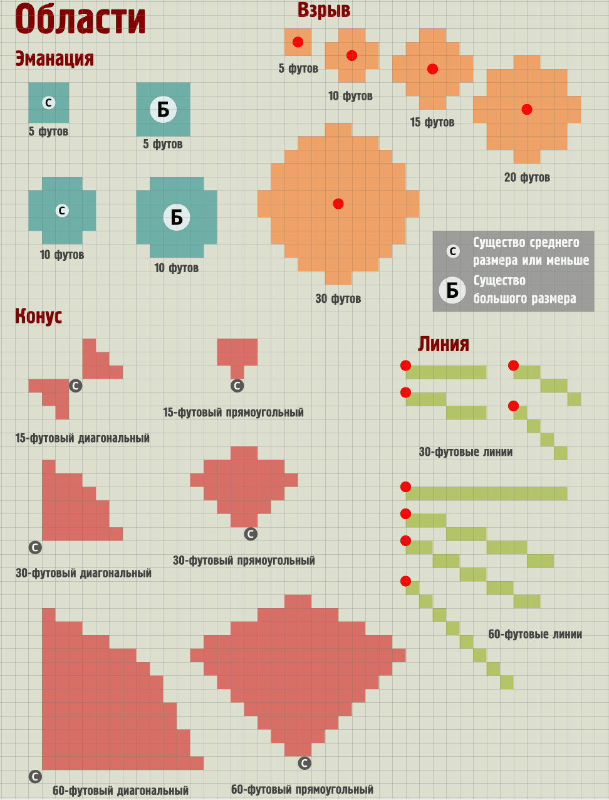
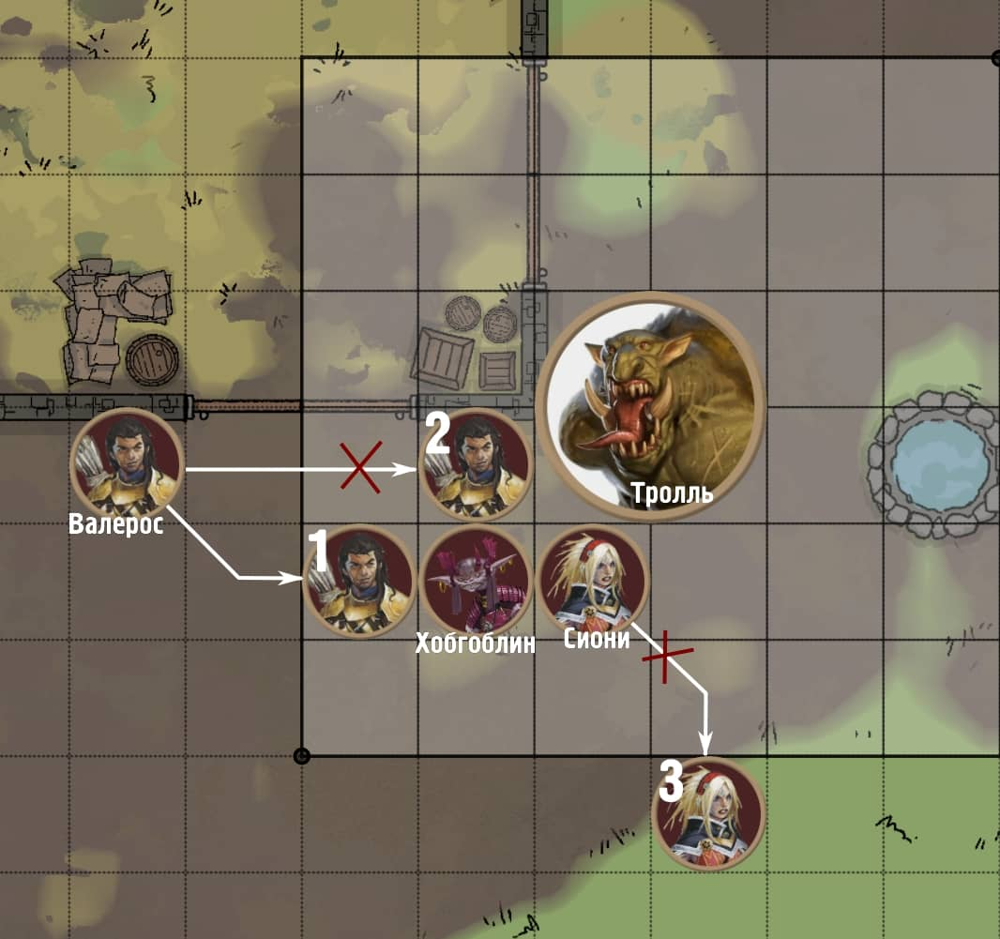
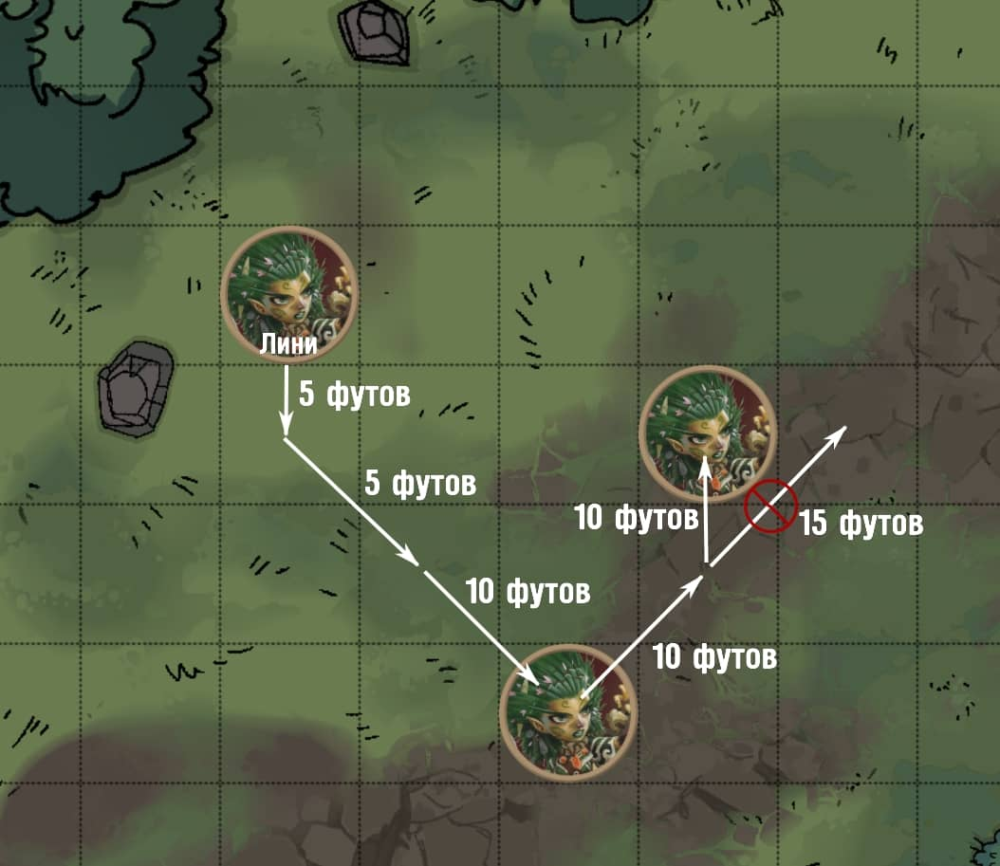
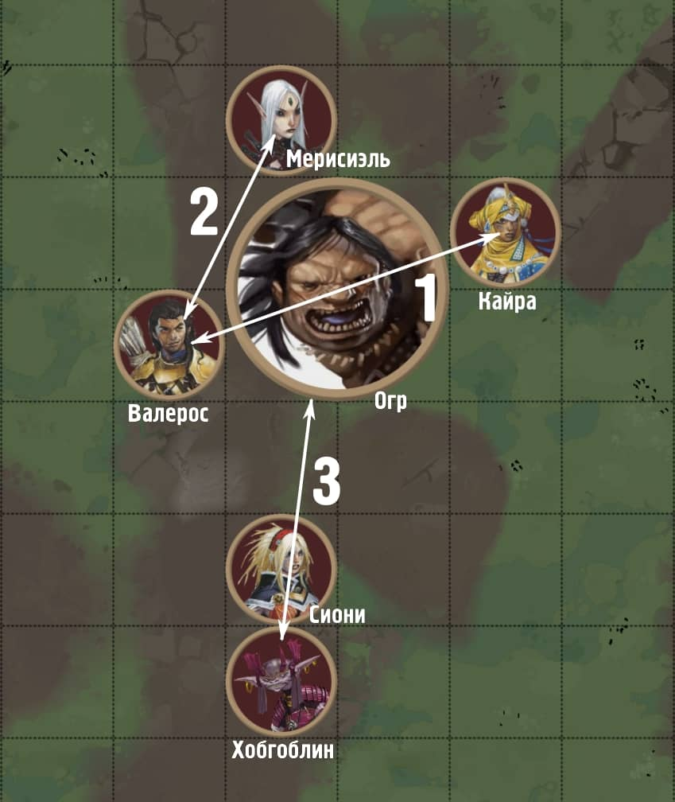

.. include:: /helpers/roles.rst

.. _ch9--playing-the-game:

9. Ведение игры (Playing the Game)
===========================================================================================================

.. epigraph::

   *К этому моменту у вас есть персонаж и вы готовы играть в Pathfinder! Или быть может вы ГМ и готовитесь начать ваше первое приключение. Как бы там ни было, эта глава предоставляет полные правила упомянутые в Главе 1:* :ref:`ch1--introduction` *. Глава начинается с описания общих правил и соглашений того как ведется игра, и потом представляет подробные аспекты правил каждого режима игры.*

-----------------------------------------------------------------------------

Перед тем как погружаться в основы игры важно понять три режима игры, которые определяют темп приключения и конкретные правила, которые вы будете использовать в данное время.
Каждый режим имеет различный темп и представляет разный уровень опасности для персонажей.
Мастер определяет какой режим подходит для истории в данный момент и совершает переход между ними.
Вероятнее всего вы будете переходить между режимами исследования и столкновения в течение приключения до того как отправитесь в поселение, чтобы совершить что-нибудь в режиме отдыха.

Самый запутанный из режимов это **режим столкновения**.
Здесь имеют место самые активные действия и он чаще всего используется для сражений или других рискованных ситуаций.
Как правило Мастер переключается в режим столкновения с просьбой игроков "сделать бросок инициативы", чтобы определить порядок в котором все действующие лица будут совершать ходы во время столкновения.
Затем, время делится на раунды, каждый из которых длится примерно 6 секунд в игровом мире.
Каждый раунд, игровые персонажи, другие существа, а иногда даже опасности или явления используют свой ход в порядке инициативы.
В начале хода участника, он получает в свое распоряжение определенное количество действий (обычно 3 для персонажей игроков и других существ) а также специальное действие называемое реакцией.
Посредством этих действий и того, как вы их используете, вы взаимодействуете с миром в рамках столкновения.
Полные правила о режиме столкновения начинаются в разделе :ref:`ch9--Encounter-Mode`.

В **режиме исследования** время более гибкое и игра идет в свободной форме.
В этом режиме, минуты, часы или даже дни игрового мира проходят быстро по мере того как персонажи путешествуют по местности, исследуют необитаемые участки подземелья или отыгрывают роли во время общественных мероприятий.
Часто, процесс исследования приводит к столкновениям и Мастер переключит игру в соответствующий режим до окончания столкновения и возврата в режим исследования.
Полные правила о режиме исследования начинаются в разделе :ref:`ch9--Exploration-Mode`.

Третий режим это **отдых**.
Во время него игроки подвергаются меньшему риску и течение времени измеряется днями или более.
Именно в это время вы можете выковать магический меч, изучить заклинание или приготовиться к следующему приключению.
Полные правила о режиме отдыха начинаются в разделе :ref:`ch9--Downtime-Mode`.

.. _ch9--General-Rules:

Основные правила (`General Rules <https://2e.aonprd.com/Rules.aspx?ID=312>`_)
----------------------------------------------------------------------------------------------------------

Прежде чем изучать правила для каждого режима игры вам необходимо понять некоторые основные правила.
Они так или иначе используются в каждом режиме игры.

.. sidebar:: Игровые соглашения (Game Conventions)

	В Pathfinder много специальных правил, но во время игры вы всегда должны учитывать эти общие рекомендации.

	.. rubric:: Последнее слово за Мастером (The GM Has the Final Say)

	Если вы не уверены как применить правило, решение за Мастером.
	Разумеется Pathfinder это игра, и при рассмотрение правил, Мастеру рекомендуется прислушиваться ко мнению каждого и принять решение, которое будет честным и принесет удовольствие от игры.

	.. rubric:: Частные случаи превыше общих (Specific Overrides General)

	Основной принцип Pathfinder - частные правила превыше общих.
	Если два правила конфликтуют, то более специфичное имеет приоритет.
	Если после этого все еще остается неясность, то Мастер определяет какое правило использовать.
	Например, правило гласит что при при атаке существа с состоянием :c_concealed:`скрыт`, то для попадания вы должны совершить чистую проверку с КС 5 на попадание.
	Чистые проверки не получают преимуществ от модификаторов, бонусов и не получают штрафы, но умение, специально созданное, чтобы преодолеть скрытность может переопределить и изменить это.
	Если правило не уточняет иначе, то применяется общее правило из этой главы.
	Хотя некоторые специальные правила еще могут указывать на общие правила для предоставления подробностей, вы всегда должны использовать по умолчанию общие правила, даже если об этом не сказано прямо.

	.. rubric:: Округление (Rounding)

	Вам может потребоваться вычислить часть значения, как пример снизить урон наполовину. Всегда округляйте до меньшего значения если не сказано обратное.
	Например если заклинание наносит 7 урона, а существо получает половину, то оно получит 3 урона.

	.. rubric:: Умножение (Multiplying)

	Когда больше одного эффекта умножат одно и то же число, не умножайте несколько раз последовательно. Вместо этого сложите множители в один, уменьшая все после второго на 1.
	Для примера, если одно умение удваивает продолжительность одного из ваших заклинаний, а другое тоже удваивает его продолжительность, то вы утроите продолжительность, а не учетверите ее.

	.. rubric:: Дублирование эффектов (Duplicate Effects)

	Когда вы подверглись какому-то эффекту несколько раз, применяется только эффект высшего уровня или более новый если они одного уровня.
	Например, если вы использовали :ref:`spell--m--Mage-Armor` и потом сотворили его снова, то все еще получаете преимущество только от одного из заклинаний.
	Повторное сотворение заклинания на ту же цель могло бы дать большую продолжительность, если второй раз было бы наложено как заклинание бо́льшего уровня, но в противном случае это не принесет преимуществ.

	.. rubric:: Двусмысленные правила (Ambiguous Rules)

	Иногда правило можно истолковать по разному.
	Если одна версия слишком хороша, чтобы быть правдой, скорее всего так и есть.
	Если судя по формулировке, правило имеет сомнительные последствия или не работает как задумано, найдите решение со своей группой, вместо того, чтобы использовать правило буква в букву.

Принятие решений (`Making Choices <https://2e.aonprd.com/Rules.aspx?ID=313>`_)
----------------------------------------------------------------------------------------------------------

Pathfinder - игра в которой ваши решения определяют направление истории.
На протяжении игры Мастер описывает что происходит в игровом мире и спрашивает игроков "И так, что будете делать?".
Ваш выбор и ответные действия Мастера ведут к уникальному опыту.
Каждая игра отличается, потому что вы вряд ли, если вообще, совершите такие же действия как другая группа игроков.
То же самое касается и Мастеров.
Два разных Мастера проведут одно и то же приключение акцентируя внимание на разных моментах во время исследований и представляя каждое столкновение с разным размахом.

Часто ваши действия не имеют непосредственного риска или последствий.
Если вы идете по лесной тропинке и подходите к развилке Мастер спросит "Какой путь вы выбираете?".
Вы можете выбрать правую или левую тропинку.
Также вы можете сойти с тропы или пойти обратно в город.
Как только ваш выбор сделан, Мастер скажет что происходит после этого.
В конечном счете этот выбор может повлиять на дальнейшие столкновения, но в большинстве случаев сразу ничего опасного не произойдет.

Но иногда результат вашего выбора не определен заранее.
В таких случаях вы попытаетесь совершить проверку.

.. _ch9--Checks:

Проверки (`Checks <https://2e.aonprd.com/Rules.aspx?ID=314>`_)
----------------------------------------------------------------------------------------------------------

Когда успех не определен, будь то ваш взмах мечом по мерзкому чудовищу, попытка перепрыгнуть пропасть, или напряженная попытка вспомнить имя второй племянницы графа на званом вечере - вы совершаете проверку.
В Pathfinder есть много видов проверок, от проверки навыков до бросков атак и спасбросков, но все они следуют простым шагам.

#. Бросьте d20 и определите применяемые модификаторы, бонусы и штрафы
#. Вычислите результат
#. Сравните результат с классом сложности (КС)
#. Определите степень успешности и эффект

Проверки и классы сложности (КС) бывают разными.
Когда вы взмахиваете мечом по чудовищу, то совершаете бросок атаки против Класса Брони (КБ) который является КС для попадания по другому существу.
Если вы перепрыгиваете через пропасть, то совершаете проверку навыка Атлетика с КС основанным на дистанции, которую пытаетесь перепрыгнуть.
Когда вспоминаете имя второй племянницы графа, то совершаете проверку :ref:`skill--Recall-Knowledge`.
Вы можете использовать навык Общества или Знаний подходящий по ситуации, а КС зависит от того насколько распространено знание об имени племянницы, или от того сколько напитков выпил персонаж во время вчерашнего знакомства с ней.

Независимо от деталей, чтобы совершить успешную проверку, для любой проверки вы должны бросить d20 и получить результат больше или равный КС.
Каждый из этих шагов описан далее.

.. _ch9--Checks--Step1:

Шаг 1: Бросьте d20 и определите применяемые модификаторы, бонусы и штрафы (Roll D20 and Identify The Modifiers, Bonuses, and Penalties That Apply)
~~~~~~~~~~~~~~~~~~~~~~~~~~~~~~~~~~~~~~~~~~~~~~~~~~~~~~~~~~~~~~~~~~~~~~~~~~~~~~~~~~~~~~~~~~~~~~~~~~~~~~~~~~~~~~~~~~~~~~~~~~~~~~~~~~~~~~~~~~~~~~~~~~~~~~~~~~

Начните с броска d20.
Потом вы определите все соответствующие модификаторы, бонусы и штрафы применимые к броску.
**Модификатор** может быть как положительным так и отрицательным, но **бонус** всегда положительный, а **штраф** всегда отрицательный.
Сумма всех модификаторов, бонусов и штрафов которые вы применяете к броску d20 называется вашим общим модификатором значения.

Почти все проверки позволяют вам добавлять к броску **модификатор характеристики**.
Модификатор характеристики представляет ваши возможности в чистом виде и получается из значения характеристики (см. :ref:`ch1--Ability-Scores--Modifiers`).
Какой именно модификатор использовать, зависит от предпринимаемых действий.
Обычно взмах мечом использует модификатор **Силы**, тогда как припоминание имени племянницы графа зависит от модификатора **Интеллекта**.

Когда предпринимаете проверку чего-либо, чему вы обучены, вы еще добавляете свой **бонус мастерства**.
Этот бонус зависит от вашего уровня мастерства: нетренирован, обучен, эксперт, мастер, легенда.
Если вы нетренированы, то бонус равен +0 и вы должны полагаться только на ситуативные бонусы.
Иначе бонус равняется уровню вашего персонажа + определенному значению в зависимости от уровня мастерства.
Если вы обучены навыку, то бонус равняется вашему уровню + 2, а высшие уровни мастерства еще больше увеличивают дополнительный бонус.

+--------------------+------------------+
| Уровень мастерства | Бонус мастерства |
+====================+==================+
| нетренирован       | 0                |
+--------------------+------------------+
| обучен             | ваш уровень + 2  |
+--------------------+------------------+
| эксперт            | ваш уровень + 4  |
+--------------------+------------------+
| мастер             | ваш уровень + 6  |
+--------------------+------------------+
| легенда            | ваш уровень + 8  |
+--------------------+------------------+

Так же часто встречаются три других типа бонусов: бонусы обстоятельства, бонусы предмета, бонусы состояния.
Если у вас есть разные типы бонусов, применимые к одному броску, то вы добавляете их все.
Но если у вас есть несколько бонусов одного типа, то при броске вы можете использовать только наивысший, другими словами они не "стэкаются".
Например, если у вас есть бонус мастерства и бонус предмета то вы добавляете оба к результату броска d20, но если у вас два бонуса предмета, которые могут применяться к одной проверке, то добавляется только наибольший из них.

**Бонусы обстоятельств** обычно относятся к ситуациям в которых вы находитесь при проверке.
Например использование :ref:`action--Raise-a-Shield` с баклером дает вам бонус обстоятельства +1 КБ.
Нахождение за укрытием дает вам бонус обстоятельства +2 КБ.
Если вы за укрытием с поднятым щитом, то получаете только бонус обстоятельства +2 КБ от укрытия, так как это бонусы одного типа и применяется наибольший.

**Бонусы предметов** даются обычным или магическим предметом, который вы надели или используете.
Например, доспех дает бонус предмета к КБ, а расширенная лаборатория алхимика дает бонус предмета к проверкам Ремесла при создании алхимических предметов.

**Бонусы состояний** обычно исходят от заклинаний, других магических эффектов или чего-то применяющего на вас полезные, как правило временные эффекты.
Например, заклинание :ref:`spell--h--Heroism` уровня дает бонус состояния +1 к броскам атак, проверкам Восприятия, спасброскам и проверкам навыков.
Если вы были под действием *героизма* и кто-то сотворил заклинание :ref:`spell--b--Bless`, которое тоже дает бонус состояния +1 к атакам, то ваши броски атак получат только бонус состояния +1, так как оба заклинания дают к этим броскам бонус состояния +1 и вы применяете только наибольший бонус состояния.

Штрафы работают похожим образом.
Вы можете иметь **штрафы обстоятельств**, **штрафы состояний**, а иногда даже **штрафы предметов**.
Как и бонусы одного типа, из штрафов применяется только один с худшим значением (наибольшим отрицательным).
Однако, к единичному броску вы можете применять вместе бонусы и штрафы одинакового типа.
Например, если бы у вас был бонус состояния +1 от заклинания *героизм*, но штраф состояния -2 от :c_sickened:`тошноты`, вы бы применили их вместе к броску, так что *героизм* все так же помог бы, хоть вы и чувствуете себя плохо.

В отличие от бонусов, штрафы могут быть **нетипизированными**, в таком случае они не будут классифицированны как "обстоятельства", "предмета" или "состояния".
В отличие от других штрафов, вы всегда добавляете все ваши нетипизированные штрафы вместо того чтобы брать наихудший.
Например, когда вы используете действия с признаком "атака", то в этом ходу вы подвергаетесь штрафу множественной атаки для всех атак после первой, а когда атакуете цель находящуюся за пределами нормального шага дистанции оружия, то подвергаетесь штрафу на дальность атаки.
Так как оба эти штрафа нетипизированные, при многократных атаках по отдаленной цели, вы примените к броску оба штрафа - штраф множественной атаки и штраф за дистанцию.

После того как вы определили все модификаторы, бонусы и штрафы можете переходить к следующему шагу.

.. _ch9--Checks--Step2:

Шаг 2: Вычислите результат (Calculate the Result)
~~~~~~~~~~~~~~~~~~~~~~~~~~~~~~~~~~~~~~~~~~~~~~~~~~~~~~~~~~~~~~~~~~~~~~~~~~~~~~~~~~~~~~~~~~~~~~~~~~~

Это простой шаг.
Добавьте все модификаторы, бонусы и штрафы, которые были получены на шаге 1, таким образом получив ваш общий модификатор.
Дальше добавьте его к результату броска d20.
Эта сумма - ваш результат проверки.

.. _ch9--Checks--Step3:

Шаг 3: Сравните результат с классом сложности (КС) (Compare the Result to the DC)
~~~~~~~~~~~~~~~~~~~~~~~~~~~~~~~~~~~~~~~~~~~~~~~~~~~~~~~~~~~~~~~~~~~~~~~~~~~~~~~~~~~~~~~~~~~~~~~~~~~

Этот шаг может быть простым или напряженным.
Иногда вы будете знать **Класс Сложности (КС)** проверки.
В этих случаях, если результат больше или равен КС то это успех!
Если вы получили что-то меньше КС то это провал.

В остальное время вы можете сразу не знать КС.
Чтобы переплыть реку потребуется совершить проверку Атлетики, но она не имеет установленного КС.
Как в таком случае узнать об успехе или провале?
Вы сообщаете свой результат Мастеру и он говорит был это успех или провал, или же произошло что-то другое.
Не смотря на то, что вы можете выяснить КС методом проб и ошибок, КС иногда меняется, так что спрашивать Мастера о том, была ли проверка успешной, является лучшим способом узнать прошли вы ее или нет.

.. _ch9--Checks--Step3--Calculating-DCs:

Вычисление КС (Calculating DCs)
"""""""""""""""""""""""""""""""""""""""""""""""""""""""""""""""""""""""""""

Всякий раз, когда вы делаете проверку, то сравниваете свой результат с КС.
Когда кто-то или что-то пытается совершить проверку против вас, вместо того, чтобы обе стороны кидали проверки друг против друга, Мастер (или игрок, если противник другой игрок) сравнивает их результат с фиксированным КС на основе соответствующего показателя.
Ваш КС для показателя равняется 10 + общий модификатор показателя.

.. _ch9--Checks--Degree-of-Success:

Шаг 4: Определите степень успешности и эффект (Determine the Degree of Success and Effect)
~~~~~~~~~~~~~~~~~~~~~~~~~~~~~~~~~~~~~~~~~~~~~~~~~~~~~~~~~~~~~~~~~~~~~~~~~~~~~~~~~~~~~~~~~~~~~~~~~~~

В большинстве случаев важен не только успех или провал, но и то на сколько впечатляюще вы преуспели или провалились.
Исключительные результаты, независимо от того хорошие или плохие, могут вызвать критический успех или критический провал проверки.

Вы критически преуспеваете при проверке, если результат превосходит КС на 10 или более.
Если проверка является броском атаки, то это называется критическим попаданием.
Вы так же можете критически провалить проверку.
Правила по критическим провалам, иногда называемым недоразумением, аналогичны критическому успеху, но в обратную сторону: если вы проваливаете проверку на 10 или более, то это критический провал.

Если при броске на кости выпадает 20 ("натуральная 20"), то ваш успех на одну ступень выше, чем если бы он был выражен просто цифрами.
Аналогично, если вы выбросили 1 на d20 кости ("натуральная 1"), то ваш результат на одну ступень хуже.
Обычно это значит, что натуральная 20 является критическим успехом, а натуральная 1 - критическим провалом.
Однако если вы противостоите очень высокому КС, то с натуральной 20 вы можете получить лишь обычный успех или даже провалить проверку если 20 в сумме с общим модификатором будет на 10 или более ниже КС.
Аналогично, если ваш модификатор характеристики так высок, что его добавление к 1 от броска d20 превысит КС на 10 и более, то вы можете преуспеть даже если при броске получили натуральную 1!
Если способность, магический предмет, заклинание или другой эффект не указывает критические успех или провал, рассматривайте их как обычные успех и провал соответственно.

Некоторые другие умения могут менять степень успеха ваших бросков.
При определении эффекта умения, которая меняет степень успеха, всегда в первую очередь применяйте изменение результата вызванное натуральной 20 или 1, прежде чем примените другие корректировки.

.. _ch9--Specific-Checks:

Определенные проверки (`Specific Checks <https://2e.aonprd.com/Rules.aspx?ID=320>`_)
----------------------------------------------------------------------------------------------------------

В то время как большинство проверок следуют этим простым правилам, полезно знать о нескольких видах определенных проверок, о том, как они используются и как отличаются от остальных.

.. _ch9--Attack-Rolls:

Броски атак (`Attack Rolls <https://2e.aonprd.com/Rules.aspx?ID=321>`_)
~~~~~~~~~~~~~~~~~~~~~~~~~~~~~~~~~~~~~~~~~~~~~~~~~~~~~~~~~~~~~~~~~~~~~~~~~~~~~~~~~~~~~~~~~~~~~~~~~~~

Когда вы используете действие :ref:`action--Strike` или выполняете атаку заклинанием, то вы совершаете проверку называемую "бросок атаки".
Броски атак имеют различные формы и зачастую сильно зависят от используемого оружия, но есть 3 основных вида: броски атак ближнего боя, броски дистанционных атак и броски атак заклинаниями.
Броски атак заклинаниями работают немного по другому и поэтому будут описаны отдельно далее.

.. versionchanged:: /errata-r2
	Поправлена формулировка первого предложения, так как некоторые думали что проверки действий навыков как :ref:`skill--Athletics--Grapple` и :ref:`skill--Athletics--Trip` являются одновременно проверками навыков и "бросками атаки".
	Таким образом, это не дает получать бонус от например :ref:`spell--b--Bless`, :ref:`spell--focus--Inspire-Courage`

	"Атака" - любая проверка, которая имеет признак "атака". Она использует и увеличивает штраф множественной атаки.
	"Бросок атаки" - одна из основных типов проверок в игре (вместе со спасбросками, проверками навыков и проверками Восприятия). Они используются для Ударов и атак заклинаниями, и по традиции целятся в Класс брони (КБ).
	Некоторые действия навыков имеют признак "атаки", в особенности действия Атлетики, такие как Захват и Опрокинуть.
	Для этих умений вы все еще применяете "проверку навыка", а не "бросок атаки".
	"Штраф множественной атаки" также применяется к этим навыкам.

**Броски атак ближнего боя** используют Силу как основной модификатор характеристики по умолчанию.
Если вы используете оружие или атаку имеющее признак :w_finesse:`точное`, тогда можете использовать модификатор Ловкости.

.. note::
	**Бросок атаки ближнего боя = бросок d20 + модификатор Силы** (или Ловкости для оружия с признаком :w_finesse:`точное`) **+ бонус мастерства + другие бонусы + штрафы**

**Броски дистанционных атак** используют модификатор Ловкости.

.. note::
	**Бросок дистанционной атаки = бросок d20 + модификатор Ловкости + бонус мастерства + другие бонусы + штрафы**

При атаке оружием, будь то ближнего или дальнего боя, вы добавляете ваш бонус мастерства используемого оружия.
Ваш класс определяет уровень мастерства владением для различного оружия.
Иногда у вас будет разный уровень мастерства для разного оружия.
Например на 5-м уровне, воин получает особенность класса "мастерство оружия", которая дает ему мастерский уровень владения простым и воинским оружием для одной выбранной группы оружия, экспертный уровень с улучшенным оружием той же группы и другого простого и воинского оружия, и обученный со всем другим улучшенным оружием.

Бонусы которые вы применяете к атакам могут быть получены из различных источников.
Бонусы обстоятельства от помощи со стороны союзников или из-за выгодной ситуации.
Бонусы состояний обычно даются от заклинаний и других магических содействий.
Бонус предмета для атаки идет от магического оружия, особенно от рун мощи оружия.

Штрафы на броски атак идут так же от обстоятельств и эффектов.
Штрафы обстоятельства получаются от рискованных тактических приемов или пагубных ситуаций, штрафы состояний от заклинаний и магии действующей против вас, а штрафы предметов случаются когда вы используете :ref:`низкокачественный предмет <ch6--Shoddy-Items>`.
При совершении бросков атак возможно применение двух основных нетипизированных штрафов.
Это штраф множественной атаки, а второй - штраф за дистанцию.
Первый применяется всякий раз, когда вы делаете больше одного атакующего действия в свой ход, а второй только для дистанционного или метательного оружия.
Они описаны далее.

.. _ch9--MAP:

Штраф множественной атаки (Multiple Attack Penalty)
"""""""""""""""""""""""""""""""""""""""""""""""""""""""""""""""""""""""""""""

Во время своего хода, чем больше атак вы совершаете после первой, тем менее точным вы становитесь.
Когда вы второй раз используете :t_attack:`атакующее` действие во время своего хода, вы получаете штраф -5 к броску атаки.
Когда вы атакуете третий и более раз, то получаете к броскам атак штраф -10.
Каждая проверка, имеющая признак :t_attack:`атака`, считается к вашему штрафу множественной атаки, включая :ref:`Удары (Strikes) <action--Strike>`, атаки заклинаниями, определенные действия навыков как :ref:`skill--Athletics--Shove` и многие другие.

Некоторое оружие и умения уменьшают штрафы множественных атак, как например :w_agile:`быстрые` оружия, которые снижают эти штрафы до -4 на вторую атаку и -8 на последующие.

+----------------------+---------------------------+---------+
|        Атака         | Штраф множественной атаки | Быстрое |
+======================+===========================+=========+
| Первая               | Нет                       | Нет     |
+----------------------+---------------------------+---------+
| Вторая               | -5                        | -4      |
+----------------------+---------------------------+---------+
| Третья и последующие | -10                       | -8      |
+----------------------+---------------------------+---------+

Всегда вычисляйте ваш штраф множественной атаки для используемого при атаки оружия.
Например, вы владеете длинным мечом в одной руке и коротким мечом (у которого есть признак :w_agile:`быстрое`) в другой, и собираетесь во время хода совершить три :ref:`Удара (Strikes) <action--Strike>` этими оружиями.
Первый Удар на этом ходу не имеет штрафа независимо от используемого оружия.
Второй Удар будет иметь штраф -5 при использовании длинного меча или -4 с коротким мечем.
Как и для второй атаки, штраф для третьей атаки зависит от конкретного оружия, используемого при Ударе.
Он будет -10 с длинным мечом и -8 с коротким мечом, независимо от оружия использованного для предыдущих Ударов.

Штраф множественной атаки применяется только во время вашего хода, так что вам не надо следить за ним при использовании :ref:`action--Attack-of-Opportunity` или похожей реакции, которая позволяет сделать Удар во время чьего-либо хода.

.. sidebar:: Перемещение и атака (Striding And Striking)

	Два самых простых и распространенных действия, которые вы будете использовать в бою это :ref:`action--Stride` и :ref:`action--Strike`.

	:ref:`action--Stride` это действие имеющее признак :t_move:`движение` и позволяющее пройти на количество футов вплоть до значения вашей Скорости.
	Часто вам будет необходимо Перемещаться несколько раз, чтобы добраться до врага на расстоянии или убежать от опасности!
	Действия :t_move:`движения` часто могут провоцировать реакции или свободные действия.
	Однако, в отличие от других действий, действие :t_move:`движения` может провоцировать реакции не только когда вы используете это действие, но еще и за каждые 5 футов которые вы проходите во время его использования, как описано в :ref:`ch9--Move-Actions-That-Trigger-Reactions`.
	Действие :ref:`action--Step` позволяет вам переместиться не провоцируя реакции, но только на 5 футов за раз.

	:ref:`action--Strike` это действие имеющее признак :t_attack:`атака` и позволяющее атаковать оружием, которым вы владеете или без оружия (например кулаками).

	Если вы используете оружие ближнего боя или безоружную атаку, то ваша цель должна быть в пределах вашей досягаемости; если вы атакуете дистанционным оружием, ваша цель должна быть в пределах дистанции.
	Ваша досягаемость это то, как далеко вы можете вытянуть часть тела, чтобы совершить безоружную атаку или крайняя дистанция атаки для оружия ближнего боя.
	Обычно она 5 футов, но определенное оружие и большие существа имеют бо́льшую длину атаки.
	Ваша дистанция это то, как далеко вы можете атаковать дистанционным оружием или каким-то видом магических атак.
	Различное оружие и магические атаки имеют разную максимальную дистанцию, а дистанционное оружие становится менее эффективным при превышении шага дистанции.

	Использование Удара несколько раз за ход имеет последствия.
	Штраф множественной атаки (смотрите :ref:`ch9--MAP`) налагается на каждую атаку после первой, независимо от того, являются ли они Ударами, специальными атаками как действие навыка Атлетики :ref:`skill--Athletics--Grapple`, или атака заклинанием.

.. _ch9--Range-Penalty:

Штраф за дистанцию (`Range Penalty <https://2e.aonprd.com/Rules.aspx?ID=323>`_)
"""""""""""""""""""""""""""""""""""""""""""""""""""""""""""""""""""""""""""""""""

Дистанционное и :w_thrown:`метательное` оружие имеют шаг дистанции, и атаки с ним становятся менее точными против целей находящихся дальше (подробнее смотрите :ref:`ch6--Range`).
Пока цель находится на границе или внутри указанного шага дистанции, также называемого первым шагом дистанции, вы не получаете штрафов на бросок атаки.
Если вы атакуете цель за пределами этой дистанции, то получаете штраф -2 за каждый дополнительный шаг дистанции после первого.
Вы можете атаковать цель дистанционным или метательным оружием, на расстоянии, вплоть до 6 шагов дистанции, но чем дальше, тем тяжелее попасть по цели.

Например шаг дистанции арбалета 120 футов.
Если вы стреляете в цель не далее, чем на этом расстоянии, то вы не получаете штрафа за расстояние.
Если цель дальше, чем в 120 футах от вас, но не далее чем в 240 футах, то вы получаете штраф за дистанцию -2.
Если цель на расстоянии между 240 и 360 футами, то вы получаете штраф за дистанцию -4 и так далее, пока не достигните последнего диапазона: между 600 и 720 футами в котором получаете штраф за дистанцию -10.

.. _ch9--AC:

Класс брони (`Armor Class <https://2e.aonprd.com/Rules.aspx?ID=324>`_)
"""""""""""""""""""""""""""""""""""""""""""""""""""""""""""""""""""""""""""""""""

Броски атак сравниваются со специальным классом сложности, называемым **Класс Брони (КБ)**, который показывает насколько тяжело врагам попасть по вам :ref:`Ударами (Strikes) <action--Strike>` или другими атакующими действиями.
Как и с другими проверками и КС, результат броска атаки должен быть больше или равен вашего КБ, чтобы считаться успешным и позволить врагу нанести вам урон.

.. note::
	**Класс брони = 10 + модификатор Ловкости** (вплоть до ограничения модификатора Ловкости доспеха) **+ бонус мастерства + бонус предмета к КБ от доспеха + другие бонусы + штрафы**

Используйте бонус мастерства для надетой категории доспеха (легкий, средний, тяжелый).
Если вы не носите доспех, то используйте ваше мастерство защиты без доспеха.

Класс Брони может получать бонусы из разных источников как и броски атак.
Сам по себе доспех дает бонус предмета, так что другие бонусы предметов обычно не будут применяться к вашему КБ, но магический доспех может увеличить бонус предмета получаемый от вашего доспеха.

Как и бонусы, штрафы к КБ применяются от ситуаций и эффектов.
Штрафы обстоятельств исходят от невыгодных ситуаций, а штрафы состояний от эффектов препятствующих вашим умениям или из-за поломанного доспеха.
Вы получаете штраф предмета когда носите низкокачественный доспех (см. :ref:`ch6--Shoddy-Items`).

.. _ch9--Spell-Attack-Rolls:

Броски атак заклинаниями (`Spell Attack Rolls <https://2e.aonprd.com/Rules.aspx?ID=325>`_)
~~~~~~~~~~~~~~~~~~~~~~~~~~~~~~~~~~~~~~~~~~~~~~~~~~~~~~~~~~~~~~~~~~~~~~~~~~~~~~~~~~~~~~~~~~~~~~~~~~~

Если вы сотворяете заклинания, то возможно вы способны совершать броски атак заклинаниями.
Эти броски обычно совершаются, когда заклинание совершает атаку против КБ существа.

Модификатор характеристики для броска атаки заклинанием зависит от того, как вы получили доступ к своим заклинаниям.
Если ваш класс предоставляет вам способность колдовать, то используйте свой модификатор ключевой характеристики.
Врожденные заклинания используют модификатор Харизмы, если только умение, дающее их вам не говорит другое.
Заклинания фокусировки и другие источники заклинаний указывают в дающем их умении, модификатор какой характеристики использовать для атаки заклинанием.
Если у вас есть заклинания от нескольких источников или обычаев, то возможно вы используете модификаторы разных характеристик для атак заклинаниями из разных источников заклинаний.
Например, дварф жрец со способностью родословной :ref:`ancestry-feat--Dwarf--Stonewalker` будет использовать свой модификатор Харизмы при сотворении заклинания :ref:`spell--m--Meld-into-Stone` дарованного этой способностью, так как это врожденное сакральное заклинание, но она будет применять модификатор Мудрости при сотворении заклинания :ref:`spell--h--Heal` и других, используя сакральную магию жреца.

.. note::
	**Атака заклинанием = бросок d20 + модификатор характеристика колдовства + бонус мастерства + другие бонусы + штрафы**

Если у вас есть умение сотворять заклинания, то у вас будет уровень мастерства атак заклинанием и значит вы всегда добавляете бонус мастерства.
Как и ваш модификатор характеристики, уровень мастерства может варьироваться от заклинания к заклинанию, если у вас есть заклинания из разных источников.
Атаки заклинаниями могут получать преимущества от бонусов обстоятельств и бонусов состояний, однако бонусы предметов к атакам заклинаниями редки.
Штрафы влияют на атаки заклинаниями так же, как и на любой другой бросок атаки, включая ваш штраф множественной атаки.

Часто, вместо того, чтобы совершать бросок атаки заклинанием, тем кто находится в его зоне действия или тем, кто является его целью, требуется совершить спасбросок против вашего **КС заклинания (Spell DC)**, чтобы определить как оно на них подействовало.

Ваш КС заклинания рассчитывается по формуле.

.. note::
	**КС заклинания = 10 + модификатор характеристики колдовства + бонус мастерства + другие бонусы + штрафы**

.. _ch9--SpecChecks--Perception:

Восприятие (`Perception (Specific Checks) <https://2e.aonprd.com/Rules.aspx?ID=326>`_)
~~~~~~~~~~~~~~~~~~~~~~~~~~~~~~~~~~~~~~~~~~~~~~~~~~~~~~~~~~~~~~~~~~~~~~~~~~~~~~~~~~~~~~~~~~~~~~~~~~~

Восприятие измеряет вашу способность быть в курсе окружающей обстановки.
Каждое существо обладает Восприятием, которое использует чувства существа и ограничено ими (:ref:`ch9--Perception--Senses`).
Всякий раз, когда вам надо выполнить проверку на основе вашей осведомленности, вы совершаете проверку Восприятия.
Ваше Восприятие использует модификатор Мудрости и рассчитывается по следующей формуле.

.. note::
	**Проверка Внимания = бросок d20 + модификатор Мудрости + бонус мастерства + другие бонусы + штрафы**

Почти все существа хотя бы обучены Восприятию, так что вы почти всегда добавляете бонус мастерства в проверки Восприятия.
Вы можете добавить бонус обстоятельства при выгодной ситуации или обстановке и обычно получаете бонусы состояния от заклинаний или других магических эффектов.
Предметы тоже могут дать бонус Восприятия при определенных ситуациях.
Например, хорошая подзорная труба дает бонус предмета +1 к Восприятию при осмотре чего-либо на дальней дистанции.
Штрафы обстоятельств к Восприятию случаются когда окружение или ситуация (например туман) затрудняют ваши ощущения, в то время как штрафы состояния накладываются состояниями, заклинаниями и магическими эффектами, которые осложняют использование чувств.
Вы очень редко встретите штрафы предметов или нетипизированные штрафы Восприятия.

Многие умения сравнивают результат проверки с вашим **КС Восприятия** для определения степени успеха.
Ваш КС Восприятия равен 10 + общий модификатор Восприятия.

.. _ch9--SpecChecks--Perception--Initiative:

Восприятие для инициативы (Perception for Initiative)
"""""""""""""""""""""""""""""""""""""""""""""""""""""""""

Часто вы будете делать проверки Восприятия, чтобы определить инициативу и вашу очередность в порядке ходов.
Когда это происходит, вместо того чтобы сравнивать результаты с КС, все участники столкновения будут сравнивать результаты друг с другом.
Существо с наивысшим результатом ходит первым, второй наибольший результат ходит вторым, и так далее.
Иногда, вместо Восприятия, вас могут попросить бросить проверку навыка в качестве инициативы, но вы сравниваете результаты также, как если бы кидали Восприятие.
Полные правила об инициативе можно найти в разделе про :ref:`ch9--Encounter-Mode`.

.. _ch9--SpecChecks--Saving-Throws:

Спасброски (`Saving Throws <https://2e.aonprd.com/Rules.aspx?ID=328>`_)
~~~~~~~~~~~~~~~~~~~~~~~~~~~~~~~~~~~~~~~~~~~~~~~~~~~~~~~~~~~~~~~~~~~~~~~~~~~~~~~~~~~~~~~~~~~~~~~~~~~

Есть три типа спасбросков: Стойкость, Рефлекс, Воля.
Во всех случаях, спасброски показывают вашу способность избавляться от вредных эффектов в виде недугов, урона или состояний.
Вы всегда будете добавлять бонус мастерства к каждому спасброску.
Ваш класс может иметь разные уровни мастерства для разных спасбросков, но вы как минимум будете обучены.
Некоторые обстоятельства и заклинания могут давать вам бонусы обстоятельства или состояний, а еще вы можете раздобыть доспех с :ref:`item--Resilient` или другие магические предметы, которые дают бонус предмета.

**Спасброски стойкости** позволяют уменьшать эффекты умений и недугов способных ослаблять тело.
Они используют ваш модификатор Телосложения и вычисляются по формуле.

.. note::
	**Спасбросок Стойкости = бросок d20 + модификатор Телосложения + бонус мастерства + другие бонусы + штрафы**

**Спасброски рефлекса** измеряют как быстро вы можете отреагировать на ситуацию или избежать эффектов направленных на вас.
Они используют ваш модификатор Ловкости и вычисляются по формуле.

.. note::
	**Спасбросок Рефлекса = бросок d20 + модификатор Ловкости + бонус мастерства + другие бонусы + штрафы**

**Спасброски воли** измеряет как хорошо вы можете противостоять нападениям на ваш разум и дух.
Они используют ваш модификатор Мудрости и вычисляются по формуле.

.. note::
	**Спасбросок Воли = бросок d20 + модификатор Мудрости + бонус мастерства + другие бонусы + штрафы**

Иногда вам нужно знать ваш КС для определенного спасброска.
КС для спасбросков равен 10 + общий модификатор спасброска.

В большинстве случаев, когда вы совершаете спасбросок, то не тратите свое действие или реакцию.
Вам даже не надо быть способным действовать, чтобы сделать спасбросок.
Однако, в некоторых особых случаях, вы возможно используете действие для совершения спасброска.
Например, вы можете попытаться избавиться от :c_sickened:`тошноты` потратив действие, чтобы совершить спасбросок Стойкости.

.. sidebar:: Эффекты удачи и неудачи (Fortune And Misfortune Effects)

	Эффекты :t_fortune:`удачи` и :t_misfortune:`неудачи` могут изменять то, как вы бросаете кости.
	Эти умения могут позволить вам перебросить провальный бросок, заставить перебросить удачный, позволяют бросить дважды и выбрать лучший результат, или заставить бросить дважды и выбрать худший.

	Вы не можете иметь более одного эффекта :t_fortune:`удачи` и более одного эффекта :t_misfortune:`неудачи` для одиночного броска.
	Например, если эффект позволяет вам бросить дважды и использовать лучший результат, то вы не можете после этого использовать :ref:`ancestry-feat--Halfling--Luck` (эффект :t_fortune:`удачи`), чтобы в случае провала перебросить.
	Если может быть применено несколько эффектов :t_fortune:`удачи`, то вы выбираете тот который будет использоваться.
	Если может быть применено два эффекта :t_misfortune:`неудачи`, то Мастер решает какой из них хуже и применяет его.

	Если к одному броску могут быть применены эффекты :t_fortune:`удачи` и :t_misfortune:`неудачи`, то они отменяют друг друга и вы бросаете кости как обычно.

.. _ch9--Basic-Saving-Throws:

Простые спасброски (`Basic Saving Throws <https://2e.aonprd.com/Rules.aspx?ID=329>`_)
"""""""""""""""""""""""""""""""""""""""""""""""""""""""""""""""""""""""""""""""""""""""

Иногда вас попросят сделать простой спасбросок.
Этот тип спасброска работает также как и другие, "простота" заключается в эффектах.
Как при любом спасброске, для простого спасброска вы делаете проверку и определяете был ли это критический успех, успех, провал или критический провал.
Затем, применяется один из результатов в зависимости от степени успеха, независимо от того, чем был вызван спасбросок.

| **Критический успех**: Вы не получаете урона от заклинания, опасности или эффекта заставившего сделать спасбросок
| **Успех**: Вы получаете половину урона от эффекта
| **Провал**: Вы получаете полный урон от эффекта
| **Критический провал**: Вы получаете двойной урон от эффекта

Проверки навыков (`Skill Checks <https://2e.aonprd.com/Rules.aspx?ID=330>`_)
~~~~~~~~~~~~~~~~~~~~~~~~~~~~~~~~~~~~~~~~~~~~~~~~~~~~~~~~~~~~~~~~~~~~~~~~~~~~~~~~~~~~~~~~~~~~~~~~~~~

В Pathfinder есть различные навыки от Атлетики и Медицины до Оккультизма.
Каждый предоставляет вам набор относящихся к нему действий, которые полагаются на ваши броски для проверки навыков.
Каждый навык имеет связанную с ним ключевую характеристику.
Например, Атлетика имеет дело с физическими умениями, такими как плавание и прыжки, так что ее ключевая характеристика Сила.
Медицина имеет дело с умением диагностировать и лечить раны и недуги, поэтому ее ключевая характеристика Мудрость.
Ключевые характеристики для каждого навыка указаны в Главе :ref:`ch4--skills`.
Не важно какой навык вы используете, вы вычисляете его результат проверки по следующей формуле.

.. note::
	**Проверка навыка = бросок d20 + модификатор ключевой характеристики + бонус мастерства + другие бонусы + штрафы**

Вы вряд ли обучены всем навыкам.
При использовании навыка которому вы нетренированы, ваш бонус мастерства равен +0; иначе он равен вашему уровню + 2, если вы ему обучены или больше когда вы станете экспертом или лучше.
Уровень мастерства специфичен для навыка, который вы используете.
:ref:`action--Aid` от другого персонажа или других выгодных ситуаций может дать вам бонус обстоятельства.
Бонус состояния можно получить от полезного заклинания или магического эффекта.
Иногда инструменты относящиеся к навыку могут добавить вам бонус предмета при проверках навыка.
И наоборот, невыгодные ситуации могут дать вам штраф обстоятельства при проверке навыка, а вредные заклинания, магия или состояния могут налагать штраф состояния.
Использование низкокачественных или импровизированных предметов может добавлять штрафы предметов.
Иногда действие навыка может являться атакой и в этих случаях проверка навыка может получить штраф множественной атаки, как описано в разделе :ref:`ch9--MAP`.

Когда умение требует от вас использовать КС определенного навыка, то вы можете вычислить его добавив 10 к общему модификатору навыка.

Записывание общих модификаторов (`Notating Total Modifiers <https://2e.aonprd.com/Rules.aspx?ID=331>`_)
~~~~~~~~~~~~~~~~~~~~~~~~~~~~~~~~~~~~~~~~~~~~~~~~~~~~~~~~~~~~~~~~~~~~~~~~~~~~~~~~~~~~~~~~~~~~~~~~~~~~~~~

При создании персонажа и во время приключений, вы будете записывать на листе персонажа общий модификатор для разных важных проверок.
Так как многие бонусы и штрафы зависят от текущих обстоятельств, заклинаний или других временных магических эффектов, то обычно вы не записываете их.

Бонусы предметов и штрафы, напротив, более постоянны, из-за чего вы будете записывать их.
Например, если вы используете оружие с :ref:`Руна мощи оружия +1 (+1 weapon potency) <item--Weapon-Potency>`, то вы захотите записать бонус предмета +1 к броскам атак этим оружием, поскольку вы всегда будете использовать его с атаками этим оружием.
Но если у вас есть хорошая подзорная труба, то вы не будете добавлять этот бонус предмета к заметкам о Восприятии, так как вы получаете этот бонус только при взгляде через эту подзорную трубу на большие расстояния.

.. _ch9--Special-Checks:

Специальные проверки (`Special Checks <https://2e.aonprd.com/Rules.aspx?ID=332>`_)
----------------------------------------------------------------------------------------------------------

Некоторые виды проверок используют специальные правила.
Наиболее примечательными являются чистые проверки и тайные проверки.

.. _ch9--Flat-Checks:

Чистые проверки (`Flat Checks <https://2e.aonprd.com/Rules.aspx?ID=333>`_)
~~~~~~~~~~~~~~~~~~~~~~~~~~~~~~~~~~~~~~~~~~~~~~~~~~~~~~~~~~~~~~~~~~~~~~~~~~~~~~~~~~~~~~~~~~~~~~~~~~~

Когда есть вероятность, что что-то произойдет или не случиться и это зависит только от шанса, то вы совершаете чистую проверку.
К чистой проверке никогда не добавляются никакие модификаторы, бонусы или штрафы, вы просто бросаете d20 и сравниваете результат на кости с КС.
Только умения, которые напрямую влияют на чистые проверки могут изменять их КС; большинство таких эффектов применяются только к определенным видам чистых проверок.

Если что-то может случиться или не случиться из-за более чем одной чистой проверки, то сделайте один бросок и используйте наибольший КС.
В редких случаях, когда КС чистой проверки равен 1 или меньше, то можете не делать бросок; она автоматически считается успешной.
И наоборот, если у чистой проверки КС 21 или выше, то вы автоматически проваливаете.

.. _ch9--Secret-Checks:

Тайные проверки (`Secret Checks <https://2e.aonprd.com/Rules.aspx?ID=334>`_)
~~~~~~~~~~~~~~~~~~~~~~~~~~~~~~~~~~~~~~~~~~~~~~~~~~~~~~~~~~~~~~~~~~~~~~~~~~~~~~~~~~~~~~~~~~~~~~~~~~~

Иногда, вы как игрок, не должны знать точный результат и эффект проверки.
В этих ситуациях правила (или Мастер) требуют сделать тайную проверку.
Признак :t_secret:`тайна` есть везде, где используются тайные проверки.
Этот вид проверки рассчитывается по тем же формулам что и обычный вид этой проверки, но их делает Мастер не показывая результат.
Вместо этого, Мастер просто описывает информацию или эффекты определенные результатом проверки.
Если вы не знаете о тайной проверке (например Мастер совершает бросок тайной проверки спасброска Стойкости против яда который вы не заметили), то при этой проверке вы не можете использовать умения :t_fortune:`удачи` или :t_misfortune:`неудачи` (смотрите сноску о них возле раздела :ref:`ch9--Basic-Saving-Throws`), но если эффект удачи или неудачи будет применяться автоматически, то в таком случае Мастер должен применить его при тайной проверке.
Если вы знаете, что Мастер совершает тайную проверку, как это часто бывает при :ref:`skill--Recall-Knowledge` или :ref:`action--Seek`, то вы обычно можете применить умения удачи или неудачи к этой проверке.
Просто сообщите Мастеру об этом и он ее использует.

Мастер может решить сделать любую проверку тайной, даже если обычно она делается в открытую.
И наоборот, Мастер может давать вам самим делать броски любой проверки, даже если она должна быть тайной.
Некоторые группы игроков считают такой подход проще, когда игроки сами бросают все тайные проверки и стараются избегать поведения персонажа, не основанного на его личных знаниях, в то же время другие любят секреты.
(прим.пер: описывается ситуация, когда, например рейнджер, искал следы, но при тайной проверке кинул 1 и очевидно провалил, но его персонаж продолжает вести группу по ложному следу, будучи уверенным, что они на верном пути)

.. _ch9--Damage:

Урон (`Damage <https://2e.aonprd.com/Rules.aspx?ID=335>`_)
----------------------------------------------------------------------------------------------------------

Посреди боя вы выполняете проверки, чтобы определить, можете ли вы нанести урон противнику с помощью оружия, заклинаний или алхимических смесей.
При успешной проверке вы попадаете и наносите урон.
Урон снижает Очки Здоровья существа 1 к 1 (существо получившее 6 урона, теряет 6 очков здоровья).
Полные правила могут быть найдены в разделе :ref:`ch9--HP-Healing-Dying`.

Иногда урон дается в виде фиксированного значения, но чаще вы будете делать броски урона, чтобы определить сколько урона вы нанесли.
Обычно бросок урона использует число и вид кости определяемой оружием, безоружной атакой или заклинанием, и часто дополняется различными модификаторами, бонусами и штрафами.
Как и проверки, бросок урона, особенно оружием ближнего боя, часто изменяется несколькими модификаторами, штрафами и бонусами.
Когда совершаете бросок урона, то вы проходите следующие шаги, описанные далее.

#. Бросьте кость указанную оружием, безоружной атакой или заклинанием и примените модификаторы, бонусы и штрафы применяемые к результату броска.
#. Определите тип урона.
#. Примените иммунитеты, слабости и сопротивления цели к урону.
#. Если урон все еще есть, уменьшите Очки Здоровья цели на это значение.

.. _ch9--Damage--Step1:

Шаг 1: Бросьте кости урона и примените модификаторы, бонусы и штрафы
~~~~~~~~~~~~~~~~~~~~~~~~~~~~~~~~~~~~~~~~~~~~~~~~~~~~~~~~~~~~~~~~~~~~~~~~~~~~~~~~~~~~~~~~~~~~~~~~~~~~~~~~~~~~

Ваше оружие, безоружная атака, заклинание или иногда даже магический предмет, определяют сколько костей какого вида вы используете при броске урона.
Например если вы используете обычный длинный меч, то кидаете 1d8.
Если произносите заклинание :ref:`spell--f--Fireball` 3-го уровня, то кидаете 6d6.
Иногда, особенно в случае с оружием, вы будете применять модификаторы, бонусы и штрафы на урон.

Когда вы используете оружие ближнего боя, безоружную атаку и :w_thrown:`метательное` дистанционное оружие, то наиболее частый модификатор, который вы будете добавлять к урону - ваш модификатор Силы.
Оружие с признаком :w_propulsive:`тяговое` иногда добавляет половину вашего модификатора Силы.
Обычно вы не добавляете модификатор характеристики к урону заклинанием, урону большинством дистанционного оружия или урону алхимическими бомбами и подобными предметами.

Как и при проверках, вы можете добавлять бонусы обстоятельства, состояния или бонусы предмета к броскам урона, но если есть несколько бонусов одного типа, то вы добавляете только самый большой.
И опять же, как и с проверками, вы можете применять штрафы обстоятельства, состояния, предмет и нетипизированные штрафы к броску урона и точно так же применяете только наивысший штраф если могут действовать несколько штрафов одного типа, но все нетипизированные штрафы применяются вместе.
Используйте следующие формулы.

.. note::
	**Урон ближнего боя = кость(и) урона оружия или безоружной атаки + модификатор Силы + бонусы + штрафы**

.. note::
	**Урон дальнего боя = кость(и) урона оружия + модификатор Силы** (для :w_thrown:`метательного` оружия) **+ бонусы + штрафы**

.. note::
	**Урон заклинанием (и подобными эффектами) = кость(и) урона эффекта + бонусы + штрафы**

Если объединенные штрафы атаки снизят урон до 0 или более, то вы все равно наносите 1 (единицу) урона.
Иногда стоит принять во внимание другие вещи, описанные далее.

.. versionadded:: /errata-r1
	Минимальный урон при штрафах.
	Сопротивления и т.п. все еще могут снизить урон до 0.

Увеличение урона (Increasing Damage)
""""""""""""""""""""""""""""""""""""""""""""""""""""""""""""""""""""""""

В некоторых случаях, вы при бросках урона оружием увеличиваете количество костей.
Магическое оружие гравированное руной :ref:`item--Striking`, может добавлять одну или более костей урона оружия к броску урона.
Эти дополнительные кости имеют такой же размера как и изначальные кости урона оружия.
На определенных уровнях, большинство персонажей получают возможность наносить дополнительный урон от особенности класса "специализация в оружии".

.. _ch9--Damage--Persistent-Damage:

Продолжительный урон (Persistent Damage)
""""""""""""""""""""""""""""""""""""""""""""""""""""""""""""""""""""""""

Продолжительный урон это состояние, которое причиняет урон после изначального эффекта.
В отличие от нормального урона, когда вы подвергаетесь продолжительному урону, то не получаете урон сразу.
Вместо этого, вы получаете определенный урон в конце вашего хода, после которого вы проходите чистую проверку с КС 15, чтобы узнать восстановились ли вы от продолжительного урона.
Смотрите раздел :ref:`condition--Persistent-Damage` и сноску, для полного описания состояния продолжительного урона.

.. _ch9--Damage--Double-Half:

Двойной урон и половинный урон (Doubling and Halving Damage)
""""""""""""""""""""""""""""""""""""""""""""""""""""""""""""""""""""""""

Порой вам будет необходимо удвоить урон или уменьшить его вполовину, если например результат вашего :ref:`Удара (Strike) <action--Strike>` был критическим попаданием или когда вы успешно прошли простой спасбросок Рефлекса против заклинания.
Когда это происходит, то вы кидаете бросок урона как обычно, добавляя все обычные модификаторы, бонусы и штрафы.
Потом вы соответственно удваиваете или делите пополам (округляя до меньшего целого при делении пополам).
Вместо того, чтобы удваивать весь итоговый результат, Мастер может разрешить вам бросать кости дважды, а удваивать модификаторы, бонусы и штрафы, но обычно это лучше подходит для атак по одиночным целям или заклинаний на низких уровнях, когда при броске вы кидаете мало костей урона.
Преимущества, которые вы получаете от определенных критических попаданий, как например продолжительный огненный урон от руны :ref:`item--Flaming` или дополнительная кость урона от оружия с признаком :w_fatal:`фатальное` - не удваиваются.

.. _ch9--Damage--Step2:

Шаг 2: Определите тип урона
~~~~~~~~~~~~~~~~~~~~~~~~~~~~~~~~~~~~~~~~~~~~~~~~~~~~~~~~~~~~~~~~~~~~~~~~~~~~~~~~~~~~~~~~~~~~~~~~~~~~~

После того, как вы посчитали количество наносимого урона, вам надо будет определить тип урона.
Есть много типов урона и определенные типы применяются по разному.
Удар дубинкой наносит дробящий урон.
Укол копьем наносит колющий урон.
Разряд заклинания :ref:`spell--l--Lightning-Bolt` наносит урон электричеством.
Иногда вы можете применить точный урон, нанося больше урона попав существу в уязвимое место или когда цель как-либо уязвима.
Типы урона описаны в сноске далее.

.. rst-class:: sidebar-wide

.. _ch9--Damage--Types:
.. sidebar:: Типы урона (Damage Types)

	Урон имеет несколько различных типов и категорий, которые описаны ниже.

	.. rubric:: Физический урон (Physical Damage)

	Урон, нанесенный оружием, многими физическими опасностями и несколькими заклинаниями вместе называется физическим уроном.
	Основные типы физического урона это дробящий, колющий и рубящий.
	**Дробящий урон** наносятся оружием или опасностями которые наносят травмы тупыми предметами, как удар дубиной или обвал камней.
	**Колющий урон** причиняется ударами и уколами, будь то клыки дракона или удар копьем.
	**Рубящий урон** наносится порезами от замаха меча или удара ловушки с лезвиями.

	Призраки и другие бестелесные существа имеют высокую сопротивляемость к немагическим физическим атакам (атакам без признака :t_magical:`магический`).
	Более того, большинство бестелесных существ имеет дополнительное, хотя и меньшее, сопротивление магическому физическому урону (например урон булавой с признаком :t_magical:`магический`) и большинству других типов урона.

	.. rubric:: Энергетический урон (Energy Damage)

	Многие заклинания и другие магические эффекты причиняют энергетический урон.
	Энергетический урон еще наносится природными эффектами, такими как мороз во время метели или разбушевавшийся лесной пожар.
	Основные типы энергетического урона это кислота, холод, электричество, огонь и звук.
	**Кислотный урон** может быть нанесен газами, жидкостями и некоторыми твердыми веществами растворяющими плоть и твердые материалы.
	**Урон холодом** замораживает материал при контакте с охлаждающим газом или льдом.
	**Электрический урон** поступает от разрядов молний или искр.
	**Огненный урон** жжет от тепла или возгорания.
	**Звуковой урон** причиняет вред высокочастотными вибрациями и звуковыми волнами.
	В большинстве случаев вы наносите энергетический урон сотворяя заклинания, что полезно против существ имеющих иммунитеты или сопротивления физическому урону.

	Два специальных типа энергетического урона воздействуют конкретно на живых и нежить.
	**Позитивный урон** вредит только существам-нежити, иссушая их тела и разрушая бестелесную нежить.
	**Негативный урон** вытягивает жизнь, повреждая только живых существ.

	Мощная и чистая магическая энергия может проявляться в виде **урона силой**.
	Немногое может сопротивляться этому типу урона, даже бестелесные существа как приведения и рэйфы уязвимы к нему.

	.. versionchanged:: /errata-r2
		Изменены предложения о позитивном и негативном уроне.

	.. rubric:: Урон мировоззрением (Alignment Damage)

	Оружие и эффекты помеченные конкретным мировоззрением могут наносить урон **хаосом**, **злом**, **добром** или **принципиальностью**.
	Эти типы урона применимы только к существам, которые имеют признак противоположного мировоззрения.
	Урон хаосом вредит только принципиальным существам, урон злом только добрым существам, урон добром только злым существам, а урон принципиальностью только хаотичным существам.

	.. rubric:: Ментальный урон (Mental Damage)

	Иногда эффект может быть направлен на разум с достаточной психической силой, чтобы нанести существу ощутимый урон.
	Когда это происходит, то наносится **ментальный урон**.
	Неразумные существа и существа с запрограммированным или примитивным интеллектом зачастую иммунны к ментальному урону и эффектам.

	.. rubric:: Урон ядом (Poison Damage)

	Яды, токсины и тому подобные эффекты могут причинять **урон ядом**, которому существа подвергаются по средством контакта, глотания, вдыхания или ранения.
	В добавок он может быть от атак монстра, алхимических предметов и заклинаний, урон ядом часто вызван продолжительными недугами, которые работают по специальным правилам, описанным в разделе :ref:`ch9--Afflictions`.

	.. rubric:: Урон от кровотечения (Bleed Damage)

	Другой особый тип физического урона - **кровотечение**.
	Это продолжительный урон, который представлен потерей крови.
	Таким образом, ему не подвержены неживые существа или живые существа, которым не нужна кровь для существования.
	К нему применяются слабости и сопротивления к физическому урону.
	Урон кровотечением заканчивается автоматически, если вы исцелены до своих максимальных ОЗ.

	.. versionadded:: /errata-r2
		Добавлено про прекращение урона при полном исцелении.

	.. rubric:: Точный урон (Precision Damage)

	Иногда большая часть вашей атаки может быть за счет ее точности.
	Когда вы попадаете с умением дающим вам **точный урон**, то увеличиваете указанный атакой урон, используя тот же тип урона вместо того, чтобы вести его отдельно.
	Например, :ref:`action--Strike` немагическим кинжалом, который наносит 1d6 точного урона от :ref:`внезапной атаки <class-feature--rogue--Sneak-Attack>` плута, увеличивает его колющий урон на 1d6.

	Некоторые существа иммунны к точному урону, независимо от его типа; как правило, это бесформенные создания без какой-либо уязвимой анатомии.
	Существо иммунное к точному урону проигнорирует 1d6 точного урона из примера выше, но все равно получит от Удара остальной колющий урон.
	Так как точный урон всегда имеет тот же тип что и атака, которую он усиливает, то существо с сопротивлением физическому урону, как горгулья, будет сопротивляться не только урону от кинжала, но и точному урону, хоть она и не имеет особого сопротивления от него.

	.. rubric:: Драгоценные материалы (Precious Materials)

	В свою очередь, не имея отдельной категории урона, драгоценные материалы могут изменять урон, чтобы пробивать сопротивления существа или использовать его слабости.
	Например, серебренное оружие особенно эффективно против ликантропов и обходит сопротивления физическому урону большинства дьяволов.

Шаг 3: Примените иммунитеты, слабости и сопротивления цели
~~~~~~~~~~~~~~~~~~~~~~~~~~~~~~~~~~~~~~~~~~~~~~~~~~~~~~~~~~~~~~~~~~~~~~~~~~~~~~~~~~~~~~~~~~~~~~~~~~~~~

Защиты от определенного типа урона или эффектов называются иммунитетами или сопротивлениями, а уязвимости называются слабостями.
Сначала применяйте иммунитеты, потом слабости и затем сопротивления.
Иммунитет, слабость или сопротивление к мировоззрению применяются только к урону этого типа, а не к урону от атакующего существа с этим мировоззрением.

.. _ch9--Damage--Immunity:

Иммунитет (`Immunity <https://2e.aonprd.com/Rules.aspx?ID=343>`_)
""""""""""""""""""""""""""""""""""""""""""""""""""""""""""""""""""""""""""""""""""""""""""

Когда у вас есть иммунитет к определенному типу урона, то вы полностью игнорируете урон этого типа.
Если у вас есть иммунитет к определенному состоянию или типу эффекта, то на вас не может действовать это состояние или любой эффект этого типа.
Вы все еще можете быть целью умения включающего эффект или состояние к которому вы иммунны; вы просто не применяете этот конкретный эффект или состояние.

Если у вас есть иммунитет к эффектам с определенным признаком (таким как эффекты :t_death:`смерти`, :t_poison:`яд` или :t_disease:`болезнь`), то вы невосприимчивы к эффектам с таким признаком.
Часто, эффект может обладать признаком и этим типом урона (особенно это относится к энергетическим типам урона).
В таких случаях, иммунитет применяется к эффекту, соответствующему данному признаку, а не только урону.
Вы все еще можете быть целью для способности, к которым вы иммунны; просто эффект на вас не работает.
Однако, некоторые комплексные эффекты могут иметь составляющие, которые влияют на вас даже если вы иммунны к одному из признаков эффекта; например, заклинание, которое наносит урон огнем и кислотой, все еще наносит вам кислотный урон даже если вы иммунны к огню.

Иммунитет к критическим попаданиям работает немного по другому.
Когда существо, иммунное к критическим попаданиям, получает критическое попадание от :ref:`Удара (Strike) <action--Strike>` или другой атаки наносящей урон, оно получает обычный урон вместо удвоенного.
Это не делает цель иммунной к другим эффектам критического успеха или другим действиям имеющим признак :t_attack:`атака` (как например :ref:`skill--Athletics--Grapple` и :ref:`skill--Athletics--Shove`).

Другое исключение - иммунитет к несмертельным атакам.
Если вы иммунны к несмертельным атакам, то вы иммунны ко всему урону от атак с признаком :w_nonlethal:`несмертельное`, независимо от того, какой тип урона используется.
Например, каменный голем имеет иммунитет к несмертельным атакам.
Это значит, что не важно как сильно вы бьете его кулаком, вы не нанесете ему урон, если только у ваших кулаков отсутствует признак :w_nonlethal:`несмертельное`, как если вы монах.

.. versionadded:: /errata-r2
	Предложение про то, что при наличие иммунитета, все равно можно быть целью умения.

.. _ch9--Damage--Temp-Immunity:

Временный иммунитет (`Temporary Immunity <https://2e.aonprd.com/Rules.aspx?ID=344>`_)
""""""""""""""""""""""""""""""""""""""""""""""""""""""""""""""""""""""""""""""""""""""""""

Некоторые эффекты дают вам иммунитет от этого же эффекта на некоторый промежуток времени.
Если эффект дает вам временный иммунитет, повторное применение этого эффекта не влияет на вас, пока длится временный иммунитет.
Если только эффект не говорит, что он применяется только к умению определенного существа, то не имеет значения кто создал этот эффект.
Например, заклинание :ref:`spell--b--Blindness` гласит, "Цель временно иммунна к *слепоте* на 1 минуту".
Если кто-нибудь снова сотворяет *слепоту* на это существо в течение 1 минуты, то заклинание не имеет эффекта.

Временный иммунитет не предотвращает или заканчивает уже длящиеся в данный момент эффекты, от источника временного иммунитета.
Например, если умение делает вас :c_frightened:`напуганным` и после этого вы получаете временный иммунитет к этому умению, то вы не теряете состояние :c_frightened:`напуган` из-за только что появившегося иммунитета, вы просто не становитесь снова напуганным, если до окончания временного иммунитета опять были целью этого умения.

.. _ch9--Damage--Weakness:

Слабость (`Weakness <https://2e.aonprd.com/Rules.aspx?ID=345>`_)
""""""""""""""""""""""""""""""""""""""""""""""""""""""""""""""""""""""""""""""""""""""""""

Если у вас есть слабость к определенному типу урона или урону от определенного источника, то такой тип урона особенно эффективен против вас.
Всякий раз, когда вы бы получили урон такого типа, увеличьте его на значение слабости.
Например, если вам нанесли 2d6 урона огнем и у вас есть слабость 5 к огню, то вы получите 2d6+5 урона огнем.

Если у вас есть слабость к чему-то, что обычно не наносит урон, например к воде, то когда касаетесь этого или подвергаетесь действию - получаете урон равный значению слабости.
Если у вас есть более одной слабости к одному нанесению урона, то используйте значение только самой большой слабости.
Обычно это случается только когда монстр уязвим одновременно и к типу физического урона, и материалу из которого сделано оружие.

.. versionadded:: /errata-r2
	Добавлено предложение про урон от слабости не наносящей урон (вода).

.. _ch9--Damage--Resistance:

Сопротивление (`Resistance <https://2e.aonprd.com/Rules.aspx?ID=346>`_)
""""""""""""""""""""""""""""""""""""""""""""""""""""""""""""""""""""""""""""""""""""""""""

Если у вас есть сопротивление типу урона, то каждый раз, когда получаете урон этого типа, вы уменьшаете его количество на указанную величину (вплоть до минимальных 0 урона).
Сопротивление может уточнять сочетание типов урона или других признаков.
Например, вы можете столкнуться с монстром, имеющим сопротивление к немагическому дробящему урону, это значит, что он получит меньше урона от дробящих немагических атак, но получит нормальный урон от вашей *булавы +1* (так как она :t_magical:`магическая`) или немагического копья (так как оно наносит колющий урон).
Еще сопротивление может иметь исключение.
Например, сопротивление 10 физическому урону (кроме серебра) снизит любой физический урон на 10, если только он не был нанесен серебряным оружием.

Если у вас есть более одного типа сопротивления, применимого для одного нанесения урона, то используйте значение только самого большого сопротивления.

Так же возможно иметь сопротивление ко всему урону.
Когда эффект наносит урон нескольких типов и у вас есть сопротивление всему урону, то применяйте сопротивление отдельно к каждому типу урона.
Если атака нанесет 7 рубящего урона и 4 урона огнем, то сопротивление 5 всему урону уменьшит рубящий урон до 2 и полностью нивелирует урон огнем.

Шаг 4: Если урон остался, уменьшите Очки Здоровья цели
~~~~~~~~~~~~~~~~~~~~~~~~~~~~~~~~~~~~~~~~~~~~~~~~~~~~~~~~~~~~~~~~~~~~~~~~~~~~~~~~~~~~~~~~~~~~~~~~~~~~~

После применения иммунитетов, сопротивлений и слабостей цели к урону, если все еще остался урон, то вычтите его из Очков Здоровья цели 1 к 1.
Больше подробностей об Очках Здоровья можно найти в разделе :ref:`ch9--HP-Healing-Dying`.

.. _ch9--Nonlethal-Attacks:

Несмертельные атаки (`Nonlethal Attacks <https://2e.aonprd.com/Rules.aspx?ID=348>`_)
""""""""""""""""""""""""""""""""""""""""""""""""""""""""""""""""""""""""""""""""""""""""""

Вы можете совершить несмертельную атаку, чтобы нокаутировать кого-нибудь, вместо того, чтобы убивать (смотрите :ref:`ch9--KnockedOut-Dying`).
Оружие с признаком :w_nonlethal:`несмертельное` (включая кулаки) делает это автоматически.
Совершая несмертельную атаку при использовании оружия без признака :w_nonlethal:`несмертельное`, вы получаете штраф обстоятельства -2 на бросок атаки.
Еще вы получаете этот штраф совершая смертельную атаку оружием с признаком :w_nonlethal:`несмертельное`.

Заклинания и другие эффекты, имеющие признак :w_nonlethal:`несмертельное`, которые снижают ОЗ существа до 0, вместо того чтобы убить существо, отправляют его в нокаут.

.. versionadded:: /errata-r2
	Добавлено последнее предложение для упоминания заклинаний и других эффектов.

.. _ch9--Conditions:

Состояния (`Conditions <https://2e.aonprd.com/Rules.aspx?ID=349>`_)
----------------------------------------------------------------------------------------------------------

Результаты различных проверок могут накладывать на вас состояния, или что реже на предмет.
Состояния определенным образом изменяют ваше состояние бытия.
Вы можете быть охвачены страхом или стать быстрее с помощью заклинания или магического предмета.
Одно состояние определяет то что происходит, когда существо пьет вашу кровь или жизненную силу, а другие - отношение существ по отношению к вам и то, как они взаимодействуют с вами.

Состояния являются продолжительными; когда вы подвержены состоянию, то его эффекты длятся пока не закончится обозначенная продолжительность, состояние пропадет или оно завершится из-за указанных в состоянии условий.
Правила по состояниям кратко изложены далее в сноске и полностью описаны в разделе :ref:`conditions`.

.. rst-class:: sidebar-wide
.. sidebar:: Состояния

	Эти состояния часто появляются в игре и подробно описаны в разделе :ref:`conditions`.
	Вот краткое описание каждого из них.

	| :ref:`condition--Blinded`: Вы не можете видеть.
	| :ref:`condition--Broken`: Предмет не может быть использован как обычно до его починки.
	| :ref:`condition--Clumsy`: Вы не можете двигаться так же легко и грациозно как обычно.
	| :ref:`condition--Concealed` Туман или подобная завеса делает вас труднодоступным для прицеливания и менее заметным.
	| :ref:`condition--Confused`: Вы беспорядочно атакуете.
	| :ref:`condition--Controlled`: Другое существо определяет ваши действия.
	| :ref:`condition--Dazzled`: Для вас все является :c_concealed:`скрытым`.
	| :ref:`condition--Deafened`: Вы не можете слышать.
	| :ref:`condition--Doomed`: Ваша душа в опасности, и вы теперь ближе к смерти.
	| :ref:`condition--Drained`: Кровопотеря или подобный эффект истощили вашу жизненную силу.
	| :ref:`condition--Dying`: Вы приближаетесь к смерти.
	| :ref:`condition--Encumbered`: Вы несете больше веса чем можете.
	| :ref:`condition--Enfeebled`: Ваши силы были истощены.
	| :ref:`condition--Fascinated`: Вы вынуждены фокусировать на чем-то свое внимание.
	| :ref:`condition--Fatigued`: Ваша защита снижена и вы не можете сосредоточиться во время исследования.
	| :ref:`condition--Flat-Footed`: Вы не способны защищаться в полной мере.
	| :ref:`condition--Fleeing`: Вы должны сбежать.
	| :ref:`condition--Friendly`: Неигровой персонаж хорошо к вам относится.
	| :ref:`condition--Frightened`: Страх делает вас менее способным атаковать и защищаться.
	| :ref:`condition--Grabbed`: Существо, объект или магия держит вас на месте.
	| :ref:`condition--Helpful`: Неигровой персонаж хочет вам помочь.
	| :ref:`condition--Hidden`: Существо, от которого вы прячетесь, знает ваше местоположение, но не может вас видеть.
	| :ref:`condition--Hostile`: Неигровой персонаж хочет нанести вам вред.
	| :ref:`condition--Immobilized`: Вы не можете двигаться.
	| :ref:`condition--Indifferent`: Неигровой персонаж не имеет определенного мнения о вас.
	| :ref:`condition--Invisible`: Существа вас не видят.
	| :ref:`condition--Observed`: Вас хорошо видно.
	| :ref:`condition--Paralyzed`: Ваше тело застыло на месте.
	| :ref:`condition--Persistent-Damage`: Вы получаете урон каждый раунд.
	| :ref:`condition--Petrified`: Вы превращены в камень.
	| :ref:`condition--Prone`: Вы лежите на земле и вас легко атаковать.
	| :ref:`condition--Quickened`: Вы получаете дополнительное действие каждый ход.
	| :ref:`condition--Restrained`: Вы связаны и не можете двигаться, или вас крепко опутало существо.
	| :ref:`condition--Sickened`: У вас болит желудок.
	| :ref:`condition--Slowed`: Вы каждый ход теряете действия.
	| :ref:`condition--Stunned` Вы не можете использовать действия.
	| :ref:`condition--Stupefied`: Вам трудно пользоваться умственными способностями и вы испытываете трудности при произнесении заклинаний.
	| :ref:`condition--Unconscious`: Вы спите или в нокауте.
	| :ref:`condition--Undetected`: Существо для которого вы необнаружены, не знает где вы.
	| :ref:`condition--Unfriendly`: Вы не нравитесь неигровому персонажу с этим состоянием.
	| :ref:`condition--Unnoticed`: Существо абсолютно не знает о вашем присутствии.
	| :ref:`condition--Wounded`: Вы были исцелены будучи при смерти, но все еще не восстановились полностью.

.. _ch9--Effects:

Эффекты (`Effects <https://2e.aonprd.com/Rules.aspx?ID=350>`_)
----------------------------------------------------------------------------------------------------------

Все, что вы делаете в игре имеет **эффект**.
Результаты многих из них легко решить во время игры.
Если вы говорите Мастеру, что вытаскиваете меч, проверок не требуется и как результат - ваш персонаж теперь держит меч.
В других случаях, определенный эффект требует более подробных правил, регулирующих последствия вашего выбора.
Многие заклинания, магические предметы и способности создают определенные эффекты, и ваш персонаж будет субъектом эффектов из-за монстров, опасностей, окружающей среды и других персонажей.

Хотя проверка может определить общее воздействие или силу эффекта, она не всегда является частью создания эффекта.
Наложение заклинания :ref:`spell--f--Fly` на себя создает эффект позволяющий вам парить в воздухе, но сотворение заклинания не требует проверки.
И наоборот, использование навыка Запугивание, чтобы :ref:`skill--Intimidation--Demoralize` противника требует проверки и ваш результат определяет исход эффекта.

Для понимания и применения эффектов используются следующие общие правила.

.. _ch9--Effects--Duration:

Продолжительность (`Duration <https://2e.aonprd.com/Rules.aspx?ID=351>`_)
~~~~~~~~~~~~~~~~~~~~~~~~~~~~~~~~~~~~~~~~~~~~~~~~~~~~~~~~~~~~~~~~~~~~~~~~~~~~~~~~~~~~~~~~~~~~~~~~~~~~~

Большинство эффектов обособленны и создают мгновенный эффект, когда вы сообщаете Мастеру какие действия вы собираетесь использовать.
Стрельба из лука, передвижение в другое место или вытаскивание чего-то из вашего снаряжения, все это совершается сразу.
Другие эффекты наоборот длятся какое-то время.
Как только продолжительность истекла - эффект заканчивается.
Правила обычно используют следующие соглашения о продолжительности, однако заклинания имеют некоторые особые продолжительности, подробно описанные в Главе 7, в разделе :ref:`ch7--Durations`.

Для эффекта, который длится несколько раундов, оставшаяся продолжительность уменьшается на 1 в начале каждого хода существа, которое создало этот эффект.
Это характерно для благотворных эффектов, для которых целями являетесь вы или ваши союзники.
Вредные эффекты часто длятся "до конца следующего хода цели" или "в течении" (through) количества ее ходов (например, "в течении следующих 3 ходов цели"), что означает, что продолжительность эффекта уменьшается в конце хода существа, а не в начале.

Вместо того, чтобы длиться фиксированное количество раундов, продолжительность может закончиться только при выполнении определенных условий (или когда они перестают выполняться).
Если это так, то эффекты длятся до тех пор, пока выполняются эти условия.

.. _ch9--Effects--Range-Reach:

Дистанция и досягаемость (`Range and Reach <https://2e.aonprd.com/Rules.aspx?ID=352>`_)
~~~~~~~~~~~~~~~~~~~~~~~~~~~~~~~~~~~~~~~~~~~~~~~~~~~~~~~~~~~~~~~~~~~~~~~~~~~~~~~~~~~~~~~~~~~~~~~~~~~~~

Действия и другие умения, которые создают эффект, обычно работают в пределах определенного диапазона или досягаемости.
Большинство заклинаний и способностей указывают **дистанцию** - максимальное расстояние от существа или объекта создающего эффект, в котором этот эффект может произойти.

Дистанционное и :w_thrown:`метательное` оружие имеет **шаг дистанции**.
Атаки с таким оружием работают нормально плоть до этой дистанции.
Атаки по целям за пределами этой дистанции получают штраф -2, который ухудшается на 2 за каждый дополнительный шаг дистанции, вплоть до максимального штрафа -10 после пяти дополнительных шагов дистанции.
Атаки за пределами этой дистанции невозможны.
Например, если вы используете короткий лук, то ваши атаки по целям на расстоянии вплоть до 60 футов не будут иметь штрафа, штраф -2 для целей в диапазоне между 60 и 120 футами, штраф -4 для целей на дистанции между 120 и 180 футами, и так далее до максимальных 360 футов.

**Досягаемость** это то, как далеко вы можете дотянуться своим телом или оружием.
:ref:`Удары (Strikes) <action--Strike>` ближнего боя полагаются на досягаемость.
Еще ваша досягаемость создает область вокруг вашего пространства, в которой существа могут спровоцировать ваши реакции.
Обычно ваша досягаемость 5 футов, но оружие с признаком :w_reach:`длинное` может увеличить ее.
Существа бо́льшего размера могут иметь бо́льшую досягаемость; например, огр имеет досягаемость 10 футов.
В отличие от измерения большинства расстояний, 10-футовая досягаемость может достигать 2 квадратов по диагонали.
Досягаемость более 10 футов измеряется как обычно; 20-футовая досягаемость достигает 3 квадратов по диагонали; 30-футовая - 4 квадрата и так далее.

.. versionchanged:: /errata-r2
	В последнем предложении было написано 25-футовая, вместо 30-футовой.

.. _ch9--Targets:

Цели (`Targets <https://2e.aonprd.com/Rules.aspx?ID=353>`_)
~~~~~~~~~~~~~~~~~~~~~~~~~~~~~~~~~~~~~~~~~~~~~~~~~~~~~~~~~~~~~~~~~~~~~~~~~~~~~~~~~~~~~~~~~~~~~~~~~~~~~

Некоторые эффекты требуют выбрать определенные цели.
Прицеливание может быть трудным или невозможным, если выбранное существо :c_undetected:`необнаружено` вами, оно не соответствует ограничениям о том кого вы можете выбрать целью, или если какое-то другое умение не позволяет ему быть целью.

Некоторые эффекты требуют, чтобы цель была готова.
Только вы можете решать готов ли ваш персонаж, а Мастер решает готовность за неигровых персонажей.
Даже если вы или ваш персонаж не знает, что это за эффект, например если персонаж :c_unconscious:`без сознания`, то вы все равно определяете готовность.

Некоторые эффекты выбирают целью союзника или требуют наличию союзника, либо другим образом ссылаются на союзника.
Это должен быть кто-то на вашей стороне, обычно другой игровой персонаж, но это может быть и кто-то посторонний, кого вы хотите защитить.
Вы не являетесь своим союзником.
Если не ясно кто является союзником или врагом, решает Мастер.

.. _ch9--Areas:

Области (`Areas <https://2e.aonprd.com/Rules.aspx?ID=354>`_)
~~~~~~~~~~~~~~~~~~~~~~~~~~~~~~~~~~~~~~~~~~~~~~~~~~~~~~~~~~~~~~~~~~~~~~~~~~~~~~~~~~~~~~~~~~~~~~~~~~~~~

Некоторые эффекты занимают область определенной формы и размера.
Эффект области всегда имеет начальную точку и распространяется из этой точки.
Есть 4 типа областей: эманации, взрывы, конусы и линии.
Когда вы играете в режиме столкновения используя сетку, то области измеряются таким же способом как и :ref:`ch9--Movement`, но дистанции областей никогда не уменьшаются из-за :ref:`сложной местности <ch9--Difficult-Terrain>` или небольшого :ref:`укрытия <ch9--Cover>`.
Вы можете использовать представленные далее диаграммы в качестве общих шаблонов областей, вместо того, чтобы каждый раз измерять квадраты.
Многие эффекты области описывают только воздействие на существ в этой области.
Мастер определяет любые воздействия эффектов на окружающую среду и ничейные объекты.

.. _ch9--Areas--Burst:

Взрыв (Burst)
""""""""""""""""""""""""""""""""""""""""""""""""""""""""""""""""""""""""""""""""""""""""""

Эффект взрыва распространяется во всех направлениях от одного угла квадрата в пределах дистанции эффекта, распространяясь во всех направлениях до заданного радиуса.
Например, когда вы сотворяете :ref:`spell--f--Fireball`, он взрывается в углу квадрата в пределах 500 футов от вас и создает 20-футовый взрыв, то есть он простирается на 20 футов во всех направлениях от угла квадрата, который вы выбрали, влияя на каждое существо, чье пространство (или даже один квадрат их пространства, в случае больших существ) находится в пределах взрыва.

.. _ch9--Areas--Cone:

Конус (Cone)
""""""""""""""""""""""""""""""""""""""""""""""""""""""""""""""""""""""""""""""""""""""""""

Конус распространяется от вас по четверти круга на сетке.
Когда вы целитесь конусом ортогонально (прим.пер: под прямыми углами), первый квадрат этого конуса должен иметь общую грань с занимаемым вами пространством, или если вы целитесь диагонально, то он должен касаться угла вашего пространства.
Если вы большого размера или более, то первый квадрат конуса может быть на грани любого квадрата вашего пространства.
Вы не можете целиться конусом так, что он будет перекрывать ваше пространство.
Конус простирается на несколько футов, расширяясь по мере распространения, как показано на диаграмме областей.
Например, когда зеленый дракон использует свое дыхание, он выдыхает конус ядовитого газа, который возникает на грани одного из квадратов его пространства и воздействует на площадь четверти круга в 30 футов по каждому из краев.

Если вы выпускаете конус из кого-то или чего-то другого, следуйте тем же правилам, по которым первый квадрат конуса должен соприкасаться с гранью или углом пространства этого существа или объекта, а не вашего.

.. _ch9--Areas--Emanation:

Эманация (Emanation)
""""""""""""""""""""""""""""""""""""""""""""""""""""""""""""""""""""""""""""""""""""""""""

Эманация исходит из каждой стороны вашего пространства, распространяясь на определенное количество футов во всех направлениях.
Например, эманация заклинания :ref:`spell--b--Bless` излучается на 5 или более футов от заклинателя.
Так как стороны пространства цели используются как начальные точки эманации, то эманация от существа большого или бо́льшего размера заполняет бо́льшую область, чем от существа среднего или меньшего размера.
Если только описание не гласит иначе, существо, создающее эффект эманации, может по своему выбору исключить существо из центра эманации, чтобы она на него не действовала.

.. versionadded:: /errata-r1
	Предложение о включении и исключении цели эманации из эффекта.
	Например, чтобы можно было исключить себя из :ref:`spell--h--Harm`.
	Предложение позднее перефразировано, так как появились эманации из которых нельзя себя исключить, например :ref:`spell--focus--Storm-Lord`.

.. _ch9--Areas--Line:

Линия (Line)
""""""""""""""""""""""""""""""""""""""""""""""""""""""""""""""""""""""""""""""""""""""""""

Линия выстреливает из вас по прямой линии в выбранном вами направлении.
Линия воздействует на каждое существо, чье пространства она пересекает.
Ширина линии равна 5 футам, если только в эффекте не сказано иначе.
Например, область заклинания :ref:`spell--l--Lightning-Bolt` это 60-футовая линия шириной 5 футов.

.. _ch9--Line-of-Effect:

Линия эффекта (`Line of Effect <https://2e.aonprd.com/Rules.aspx?ID=359>`_)
~~~~~~~~~~~~~~~~~~~~~~~~~~~~~~~~~~~~~~~~~~~~~~~~~~~~~~~~~~~~~~~~~~~~~~~~~~~~~~~~~~~~~~~~~~~~~~~~~~~~~

При создании эффекта вам обычно нужен свободный путь к цели заклинания, исходной точке области эффекта или месту, где вы что-то создаете заклинанием или другой способностью.
Это называется линия эффекта.
У вас есть линия эффекта, если только существо не находится полностью за твердой физической преградой.
Видимость не имеет значения для линии эффекта, как и решетки и другие преграды, которые не являются полностью сплошными объектами.
Обычно для поддержания линии эффекта достаточно зазора в 1 квадратный фут (прим.пер: ~929 кв.см), однако последнее слово за Мастером.

Существа или цели в области эффекта должны иметь линию эффекта до точки из которой исходит этот эффект, чтобы попасть под его действие.
Если между целью и изначальной точкой распространения эффекта нет линии эффекта, то он не применяется к цели.
Например, если есть сплошная стена между источником области :ref:`spell--f--Fireball` и существом в области радиуса взрыва, то стена блокирует эффект - существо незатронуто *огненным шаром* и не должно совершать против него спасбросок.
Аналогично, любые длящиеся эффекты, созданные умением с областью, перестают влиять на любого, кто выходит за пределы линии эффекта.

.. _ch9--Line-of-Sight:

Линия обзора (`Line of Sight <https://2e.aonprd.com/Rules.aspx?ID=360>`_)
~~~~~~~~~~~~~~~~~~~~~~~~~~~~~~~~~~~~~~~~~~~~~~~~~~~~~~~~~~~~~~~~~~~~~~~~~~~~~~~~~~~~~~~~~~~~~~~~~~~~~

Некоторые эффекты требуют наличия линии обзора до цели.
До тех пор, пока вы можете точно ощущать область (подробнее в разделе :ref:`ch9--Perception--Senses`) и она не блокирована сплошным препятствием (см. раздел :ref:`ch9--Cover`), то у вас есть линия обзора.
Область во тьме препятствует линии обзора, если у вас нет ночного зрения, но опускающиеся решетки и другие несплошные препятствия - нет.
Если вы не уверены насколько сплошной является преграда, то обычно для поддержания линии обзора достаточно зазора в 1 квадратный фут (прим.пер: ~929 кв.см), однако последнее слово за Мастером.

.. _ch9--Afflictions:

Недуги (`Afflictions <https://2e.aonprd.com/Rules.aspx?ID=361>`_)
----------------------------------------------------------------------------------------------------------

Болезни и яды являются видами недугов, так же как проклятия и радиация.
Недуг может заразить существо на долгое время, прогрессируя в стадии, которые ослабляют еще сильнее.
Уровень недуга равен уровню монстра, опасности или предмета вызвавшего этот недуг или в случае с заклинаниями, уровень указан в его описании.

Формат (Format)
~~~~~~~~~~~~~~~~~~~~~~~~~~~~~~~~~~~~~~~~~~~~~~~~~~~~~~~~~~~~~~~~~~~~~~~~~~~~~~~~~~~~~~~~~~~~~~~~~~~~~

Описываясь в заклинании, как предмет или в описании монстра, недуги описываются в следующем формате.

Название и признаки (Name and Traits)
""""""""""""""""""""""""""""""""""""""""""""""""""""""""""""""""""""""""""""""""""""""""""

В начале идет название, после него следуют признаки в скобках, включая признак вида недуга (:t_curse:`проклятие`, :t_disease:`болезнь`, :t_poison:`яд` и так далее).
Если недуг требует указания уровня, то он следует далее в скобках, после чего идут необычные детали, как например ограничения на избавление от состояний вызванных недугом.

.. sidebar:: Пример недуга
	
	Чтобы увидеть как работает яд, давайте взглянем на алхимический предмет :ref:`item--Arsenic`.
	В описании предмета указано, что вы не можете уменьшить состояние :c_sickened:`тошнота`, пока находитесь под эффектом мышьяка, а также есть следующий текст о том, как работает недуг.

	| **Спасбросок**: Стойкость КС 18
	| **Возникновение**: 10 минут
	| **Макс.продолжительность**: 5 минут
	| **Стадия 1**: 1d4 урона ядом и состояние :c_sickened:`тошнота 1` (1 минута)
	| **Стадия 2**: 1d6 урона ядом и состояние :c_sickened:`тошнота 2` (1 минута)
	| **Стадия 3**: 2d6 урона ядом и состояние :c_sickened:`тошнота 3` (1 минута)

	Например, если вы выпили бокал вина с примесью мышьяка, то сделаете первичный спасбросок Стойкости с указанным КС 18.
	Если провалитесь то перейдете на стадию 1.
	Из-за периода возникновения ничего не произойдет в течении 10 минут, но после них вы получить 1d4 урона ядом и получаете состояние :c_sickened:`тошнота 1`.
	Как указано в описании, вы не можете избавиться от :c_sickened:`тошноты`.
	Периодичность 1-й стадии равна 1 минуте (как указано в скобках), поэтому вы пытаетесь пройти новый спасбросок через 1 минуту.
	Если вы справились, то уменьшаете стадию на 1 и восстанавливаетесь от яда.
	Если проваливаете снова, то стадия увеличивается на 1 до 2-й и вы получаете 1d6 урона ядом и состояние :c_sickened:`тошнота 2`.

	Если ваш первичный спасбросок против мышьяка был крит.провалом, то вы получите сразу стадию 2.
	После 10 минут периода возникновения, вы получите 1d6 урона ядом и состояние :c_sickened:`тошнота 2`.
	Успех при втором спасброске уменьшит стадию на 1 до стадии 1 и вы получите только 1d4 урона.
	Провал второго спасброска увеличит стадию на 1 до стадии 3.

	Если вы достигли стадии 3 яда, либо провалив стадию 2, либо критически провалив стадию 1, то вы получите 2d6 урона ядом и состояние :c_sickened:`тошнота 3`.
	Если вы провалили или критически провалили спасбросок на стадии 3, то повторите эффекты стадии 3.

	Так как яд имеет максимальную продолжительность 5 минут, то вы восстанавливаетесь после него через 5 минут, неважно на какой стадии вы были.

Спасбросок (Saving Throw)
""""""""""""""""""""""""""""""""""""""""""""""""""""""""""""""""""""""""""""""""""""""""""

Когда вы изначально сталкиваетесь с недугом, то должны совершить спасбросок против него.
Эта первая попытка предотвратить недуг называется первичным спасброском.
Недуг обычно требует спасброска Стойкости, но точный спасбросок и его КС перечислены после названия и вида недуга.
Заклинания, которые могут отравить вас обычно используют КС заклинания колдующего.

При успешном первичном спасброске недуг на вас не действует.
Вам не надо совершать дальнейшие спасброски против недуга, если только вы снова не подвергнитесь ему.

Если вы проваливаете первичный спасбросок, то по истечении периода возникновения недуга (если применяется), вы переходите к стадии 1 недуга и подвергаетесь указанному эффекту.
При критическом провале, после периода возникновения (если применяется), вы переходите к стадии 2 недуга и подвергаетесь ее эффекту.
Стадии недуга описаны далее.

.. _ch9--Afflictions--Onset:

Возникновение (Onset)
""""""""""""""""""""""""""""""""""""""""""""""""""""""""""""""""""""""""""""""""""""""""""

Некоторые недуги имеют период возникновения.
В случае таких недугов, вы не получаете эффекты первой стадии сразу после провала первичного спасброска, а только после завершения периода возникновения.
Если эта запись отсутствует в описании, то значит, что вы сразу получаете эффекты первой стадии (или вторую в случае критического провала) после провала первичного спасброска.

Максимальная продолжительность (Maximum Duration)
""""""""""""""""""""""""""""""""""""""""""""""""""""""""""""""""""""""""""""""""""""""""""

Если недуг длится только определенное время, то у него указывается максимальная продолжительность.
После окончания продолжительности недуг проходит.
Иначе недуг длится пока вы не пройдете достаточно спасбросков, чтобы восстановиться, как описано далее в разделе "Стадии".

.. _ch9--Afflictions--Stages:

Стадии (Stages)
""""""""""""""""""""""""""""""""""""""""""""""""""""""""""""""""""""""""""""""""""""""""""

Обычно недуг имеет несколько стадий, каждая из которых указывает эффект и периодичность в скобках.
Когда вы достигаете определенной стадии недуга, то подвергаетесь эффектам перечисленным для этой стадии.

По окончании указанного периода стадии вы должны совершить новый спасбросок.
При успехе стадия уменьшается на 1; при критическом успехе на 2.
После этого вы начинаете подвергаться эффектам новой стадии.
Если стадия снижается ниже 1, то недуг заканчивается и вам больше не надо совершить дальнейшие спасброски, если только вы снова не подвергнитесь недугу.

При провале стадия увеличивается на 1; при критическом провале стадия увеличивается на 2.
После этого вы начинаете подвергаться эффектам новой стадии.
Если провал или крит.провал увеличит стадию выше максимальной, то недуг повторяет эффекты самой высокой стадии.

Состояния от недугов (Conditions from Afflictions)
~~~~~~~~~~~~~~~~~~~~~~~~~~~~~~~~~~~~~~~~~~~~~~~~~~~~~~~~~~~~~~~~~~~~~~~~~~~~~~~~~~~~~~~~~~~~~~~~~~~~~

Недуги могут дать вам состояния с большей или меньшей длительностью, чем сам недуг.
Например, если недуг вызвал состояние :c_drained:`истощен`, но имеет макс.продолжительность 5 минут, то вы остаетесь :c_drained:`истощенным` даже после окончания недуга, как обычно для состояния :c_drained:`истощен`.
Или вы могли успешно пройти чистую проверку, чтобы убрать продолжительный урон от продолжающегося недуга, но вам все еще надо совершить спасбросок, чтобы избавиться от самого недуга, и провал может вызвать новый продолжительный урон.

Множественное воздействие (Multiple Exposures)
~~~~~~~~~~~~~~~~~~~~~~~~~~~~~~~~~~~~~~~~~~~~~~~~~~~~~~~~~~~~~~~~~~~~~~~~~~~~~~~~~~~~~~~~~~~~~~~~~~~~~

Множественное воздействие того же проклятия или болезни, что уже действуют на вас, не имеют эффекта.
Однако, в случае яда, провал изначального спасброска против нового воздействия увеличивает стадию на 1 (на 2 при крит.провале) не затрагивая максимальную продолжительность.
Это так же работает если у вас еще не наступил период возникновения, однако это не изменяет время до возникновения.

.. _ch9--Virulent-Afflictions:

Вирулентные недуги (Virulent Afflictions)
~~~~~~~~~~~~~~~~~~~~~~~~~~~~~~~~~~~~~~~~~~~~~~~~~~~~~~~~~~~~~~~~~~~~~~~~~~~~~~~~~~~~~~~~~~~~~~~~~~~~~

От недугов с признаком :t_virulent:`вирулентный` тяжелее избавиться.
Вам необходимо совершить два успешных спасброска подряд, чтобы снизить стадию вирулентного недуга на 1.
Критический успех снижает стадию вирулентного недуга только на 1 а не на 2.

.. _ch9--Counteracting:

Противодействие (`Counteracting <https://2e.aonprd.com/Rules.aspx?ID=371>`_)
----------------------------------------------------------------------------------------------------------

Некоторые эффекты пытаются противодействовать заклинаниям, недугам, состояниям или другим эффектам.
Проверки противодействия сравнивают мощность двух сил и определяют кто победил.
Успешное противодействие заканчивает эффект, если только не описано иначе.

При совершении проверки противодействия, добавьте модификатор соответствующего навыка или другой подходящий для вашей проверки модификатор, против КС цели.
Если вы противодействуете недугу, то КС указан в его блоке характеристик.
Если это заклинание, используйте КС заклинателя.
Мастер может рассчитать КС на основе уровня эффекта цели.
Для заклинаний, модификатор проверки противодействия равен модификатору характеристики колдовства + бонус мастерства в колдовстве + любые бонусы и штрафы применимые к проверкам противодействия.
То, чему вы можете противодействовать зависит от результата проверки и уровня цели.
Если эффект - заклинание, то его уровень является уровнем противодействия.
Иначе, уровень противодействия определяется делением уровня пополам с округлением до большего целого.
Если уровень эффекта неясен и исходит от существа, то поделите уровень существа пополам и округлите до большего целого.

| **Критический успех**: Противодействуете цели, если ее уровень противодействия не более чем на 3 уровня выше уровня противодействия вашего эффекта
| **Успех**: Противодействуете цели, если ее уровень противодействия не более чем на 1 уровень выше уровня противодействия вашего эффекта
| **Провал**: Противодействуете цели, если ее уровень противодействия ниже уровня противодействия вашего эффекта
| **Критический провал**: Вы провалили противодействие цели

.. _ch9--HP-Healing-Dying:

Очки Здоровья, исцеление и при смерти (`Hit Points, Healing, and Dying <https://2e.aonprd.com/Rules.aspx?ID=372>`_)
-------------------------------------------------------------------------------------------------------------------

Все существа и объекты имеют Очки Здоровья (ОЗ).
Ваше максимальные значение Очков Здоровья представлет ваше здоровье и заряд героизма когда вы отдохнули и чувствуете себя хорошо.
Ваши максимальные ОЗ включают ОЗ полученные на 1-м уровне от родословной и класса, те которые вы получаете на последующих уровнях от класса и от других источников (как например общая способность :ref:`feat--Toughness`).
Когда вы получаете урон, то уменьшаете свои Очки Здоровья на количество урона.

Некоторые заклинания, предметы и другие эффекты, как и простой отдых, могут исцелить живых и неживых существ.
Когда вы исцелены, то восстанавливаете ОЗ в указанном количестве, вплоть до ваших максимальных ОЗ.

.. _ch9--KnockedOut-Dying:

Нокаут и при смерти (`Knocked Out and Dying <https://2e.aonprd.com/Rules.aspx?ID=373>`_)
~~~~~~~~~~~~~~~~~~~~~~~~~~~~~~~~~~~~~~~~~~~~~~~~~~~~~~~~~~~~~~~~~~~~~~~~~~~~~~~~~~~~~~~~~~~~~~~~~~~~~

Очки здоровья существа не могут опуститься ниже 0.
Когда большинство существ достигают 0 ОЗ они умирают и убираются из игры, если только атака не была :w_nonlethal:`несмертельной`, в этом случае они в нокауте на значительное время (обычно 1 минута или более).
Когда нежить или :t_construct:`конструкт` достигают 0 ОЗ они уничтожаются.

Игровые персонажи, их компаньоны и другие значимые персонажи и существа не умирают автоматически достигнув 0 ОЗ.
Вместо этого они в нокауте и находятся при смерти.
На усмотрение Мастера, злодеи, мощные монстры, особые неигровые персонажи и враги со специальными умениями, которые, вероятно, вернут их в бой (такие как :ref:`cr_ability--Ferocity`, :ref:`cr_ability--Regeneration` или исцеляющая магия), тоже могут использовать эти правила.

Как у игрового персонажа, когда ваши ОЗ опускаются до 0, вы в нокауте со следующими эффектами:

* Вы мгновенно перемещаетесь в порядке инициативы на позицию сразу перед ходом, во время которого ваше здоровье снизилось до 0.
* Вы получаете состояние :c_dying:`при смерти 1`. Если эффект нокаутировавший вас был критически успешен со стороны атаковавшего либо был результатом вашего критического провала, то вместо этого вы получаете :c_dying:`при смерти 2`. Если у вас есть состояние :c_wounded:`ранен` (см. :ref:`ch9--Recovery--Wounded`), то увеличьте значение :c_dying:`при смерти` на величину состояния :c_wounded:`ранен`. Если урон был от :w_nonlethal:`несмертельной` атаки или эффекта, то вы не получаете состояние :c_dying:`при смерти`, а находитесь без сознания с 0 ОЗ.

.. versionchanged:: /errata-r1
	В 1-м пункте убрано упоминание эффекта или существа, отправивших вас в нокаут.

.. _ch9--KnockedOut-Dying--Damage:

Получение урона при смерти (Taking Damage while Dying)
""""""""""""""""""""""""""""""""""""""""""""""""""""""""""""""""""""""""""""""""""""""""""

Если вы получили урон когда уже находитесь :c_dying:`при смерти`, то увеличьте величину этого состояния на 1, или на 2, если урон был нанесен критическим попаданием или из-за вашего критического провала.
Если у вас есть состояние :c_wounded:`ранен`, не забывайте добавлять его величину к состоянию :c_dying:`при смерти`.

.. _ch9--Recovery-Checks:

Проверки восстановления (`Recovery Checks <https://2e.aonprd.com/Rules.aspx?ID=375>`_)
~~~~~~~~~~~~~~~~~~~~~~~~~~~~~~~~~~~~~~~~~~~~~~~~~~~~~~~~~~~~~~~~~~~~~~~~~~~~~~~~~~~~~~~~~~~~~~~~~~~~~

Когда вы :c_dying:`при смерти`, в начале каждого своего хода вы должны совершить чистую проверку с КС равным 10 + ваше текущее значение :c_dying:`при смерти`, чтобы узнать становится вам лучше или хуже.
Это называется проверка восстановления.
Результаты этой проверки следующие.

| **Критический успех**: Ваше состояние :c_dying:`при смерти` уменьшается на 2
| **Успех**: Ваше состояние :c_dying:`при смерти` уменьшается на 1
| **Провал**: Ваше состояние :c_dying:`при смерти` увеличивается на 1
| **Критический провал**: Ваше состояние :c_dying:`при смерти` увеличивается на 2

.. _ch9--Conditions-Related-to-Death-and-Dying:

Состояния относящиеся к смерти и умиранию (Conditions Related to Death and Dying)
~~~~~~~~~~~~~~~~~~~~~~~~~~~~~~~~~~~~~~~~~~~~~~~~~~~~~~~~~~~~~~~~~~~~~~~~~~~~~~~~~~~~~~~~~~~~~~~~~~~~~

Чтобы понять правила нокаутов и как умирание работает в игре вам понадобится немного больше информации о состояниях, использующихся с этими правилами.
Далее представлены правила о состояниях :c_dying:`при смерти`, :c_unconscious:`без сознания`, :c_wounded:`ранен` и :c_doomed:`обречен`.

При смерти (`Dying <https://2e.aonprd.com/Rules.aspx?ID=377>`_)
""""""""""""""""""""""""""""""""""""""""""""""""""""""""""""""""""""""""""""""""""""""""""

Вы истекаете кровью или как-то иначе находитесь на пороге смерти.
Пока вы имеете это состояние то находитесь :c_unconscious:`без сознания`.
Состояние :c_dying:`при смерти` всегда имеет величину.
Если оно достигает 4, вы умираете.
Если вы :c_dying:`при смерти`, то должны совершить проверки восстановления (см. :ref:`ch9--Recovery-Checks`) каждый раунд в начале своего хода, чтобы определить, становится вам лучше или хуже.

Если вы теряете состояние :c_dying:`при смерти` успешно пройдя проверку восстановления и все еще имеете 0 ОЗ, то остаетесь :c_unconscious:`без сознания`, но можете очнуться как описано в этом состоянии (см. далее).
Вы теряете состояние :c_dying:`при смерти` автоматически и приходите в сознание если у вас 1 или более ОЗ.
Всякий раз, когда вы лишаетесь состояния :c_dying:`при смерти`, вы получаете состояние :c_wounded:`ранен 1` или увеличиваете его на 1 если оно у вас уже было.

Без сознания (`Unconscious <https://2e.aonprd.com/Rules.aspx?ID=378>`_)
""""""""""""""""""""""""""""""""""""""""""""""""""""""""""""""""""""""""""""""""""""""""""

Вы спите или в нокауте.
Вы не можете действовать.
Вы получаете штраф состояния -4 к КБ, Восприятию и спасброскам Рефлекса, и имеете состояния :c_blinded:`слепота` и :c_flat_footed:`застигнут врасплох`.
Когда вы получаете это состояние, то падаете ничком, роняете все предметы, которыми владеете или которые держите в руках, если только эффект не требует обратного или Мастер решил что вы в таком положении, что не выпустите их из рук.

**Если вы без сознания потому что при смерти**, вы не можете очнуться пока у вас 0 ОЗ.
Если вам восстановили 1 или более ОЗ посредствам исцеления, вы теряете состояния :c_dying:`при смерти` и :c_unconscious:`без сознания` и можете действовать как обычно в свой следующий ход.

**Если вы без сознания с 0 ОЗ но не при смерти**, вы естественным образом возвращаетесь к 1 ОЗ и приходите в сознание после достаточного кол-ва времени.
Мастер определяет как долго вы остаетесь без сознания, минимум от 10 минут до нескольких часов.
Если вы получаете исцеление в это время, то теряете состояние :c_unconscious:`без сознания` и можете действовать как обычно в свой следующий ход.

**Если без сознания и у вас более 1 ОЗ** (обычно потому что вы спите или из-за эффекта), вы приходите в сознание одним из перечисленных способов.
Каждый из которых лишает вас :c_unconscious:`бессознательного` состояния.

* Вы получили урон, он не опустил ОЗ до 0 (если урон снижает ОЗ до 0, то вы остаетесь :c_unconscious:`без сознания` и получаете состояние :c_dying:`при смерти` как обычно).
* Вы были исцелены, но не средствами естественного исцеления от отдыха.
* Кто-то толкает или трясет вас с помощью действия :ref:`action--Interact`.
* Вокруг вас раздается громкий шум, однако пробуждение не происходит автоматически. В начале вашего хода вы автоматически совершаете проверку Восприятия с КС шума (или шума с наименьшим КС, если источников шума несколько), пробуждаясь в случае успеха. Для битвы это обычно КС 5, но если существа пытаются не шуметь вокруг вас, проверка Восприятия делается против их КС Скрытности. Некоторые магические эффекты усыпляют вас так сильно, что вам по позволяется совершать эту проверку.
* Если вы просто спите, Мастер решает пробудить вас, потому что у вас был спокойный ночной сон или что-то нарушило этот отдых.

.. _ch9--Recovery--Wounded:

Ранен (`Wounded <https://2e.aonprd.com/Rules.aspx?ID=379>`_)
""""""""""""""""""""""""""""""""""""""""""""""""""""""""""""""""""""""""""""""""""""""""""

Вы были серьезно травмированны в бою.
Каждый раз, когда вы теряете состояние :c_dying:`при смерти`, то получаете состояние :c_wounded:`ранен 1` если у вас его еще не было.
Если у вас уже было состояние :c_wounded:`ранен`, то вы увеличиваете его значение на 1.
Если вы получили состояние :c_dying:`при смерти` уже имея :c_wounded:`ранен`, то увеличьте значение состояния :c_dying:`при смерти` на величину состояния :c_wounded:`ранен`.
Состояние :c_wounded:`ранен` пропадает если кто-то успешно восстановил вам ОЗ с помощью :ref:`skill--Medicine--Treat-Wounds` или вы восстановлены до полных ОЗ и отдыхаете 10 минут.

Обречен (`Doomed <https://2e.aonprd.com/Rules.aspx?ID=380>`_)
""""""""""""""""""""""""""""""""""""""""""""""""""""""""""""""""""""""""""""""""""""""""""

Ваша жизнь угасает, приближая вас к смерти.
Некоторые мощные заклинания и злые существа могут нанести вам состояние :c_doomed:`обречен`.
Обреченность всегда имеет значение.
Максимальное значение :c_dying:`при смерти`, при котором вы умираете уменьшается на значение :c_doomed:`обречен`.
Например, если вы были :c_doomed:`обречены 1`, то умерли бы при достижении :c_dying:`при смерти 3` вместо обычных :c_dying:`при смерти 4`.
Если ваше максимальное значение :c_dying:`при смерти` когда-либо уменьшится до 0 вы мгновенно умираете.
После смерти вы перестаете быть обреченным.

Ваше значение обреченности уменьшается на 1 каждый раз после ночного отдыха.

Смерть (`Death <https://2e.aonprd.com/Rules.aspx?ID=381>`_)
~~~~~~~~~~~~~~~~~~~~~~~~~~~~~~~~~~~~~~~~~~~~~~~~~~~~~~~~~~~~~~~~~~~~~~~~~~~~~~~~~~~~~~~~~~~~~~~~~~~~~

После того как вы умираете, вы не можете действовать или подвергаться воздействию заклинаний, которые нацелены на существ (если только они не направлены конкретно на мертвых существ), и по всем остальным признакам вы считаетесь объектом.
Когда вы умираете, ваши ОЗ снижены до 0, если значение было отличное от 0, и их нельзя увеличить выше 0 пока вы мертвы.
Некоторая магия может вернуть существ к жизни, как например ритуал :ref:`ritual--Resurrect` или заклинание :ref:`spell--r--Raise-Dead`.

Героическое восстановление (`Heroic Recovery <https://2e.aonprd.com/Rules.aspx?ID=382>`_)
~~~~~~~~~~~~~~~~~~~~~~~~~~~~~~~~~~~~~~~~~~~~~~~~~~~~~~~~~~~~~~~~~~~~~~~~~~~~~~~~~~~~~~~~~~~~~~~~~~~~~

Если у вас есть хотя бы 1 Очко Геройства (см. :ref:`ch9--Hero-Points`), то вы можете потратить все оставшиеся Очки Геройства в начале хода или когда ваше состояние :c_dying:`при смерти` увеличится.
Вы полностью теряете состояние :c_dying:`при смерти` и становитесь стабилизированным с 0 ОЗ.
Вы не получаете состояние :c_wounded:`ранен` или увеличиваете его значение при потери :c_dying:`при смерти` таким способом, но если у вас уже было состояние :c_wounded:`ранен`, то вы не теряете и не уменьшаете его.

.. versionchanged:: /errata-r1
	Формулировка приведена в соответствие с остальными упоминаниями в книге. Изначально говорилось, что вы приходите в сознание с 1 ОЗ.

.. _ch9--Death-Effects-and-Instant-Death:

Эффекты смерти и мгновенная смерть (`Death Effects and Instant Death <https://2e.aonprd.com/Rules.aspx?ID=383>`_)
~~~~~~~~~~~~~~~~~~~~~~~~~~~~~~~~~~~~~~~~~~~~~~~~~~~~~~~~~~~~~~~~~~~~~~~~~~~~~~~~~~~~~~~~~~~~~~~~~~~~~~~~~~~~~~~~~~

Некоторые заклинания и умения могут мгновенно убить вас или приблизить вас ближе к смерти без необходимости сначала уменьшать ОЗ до 0.
Эти умения имеют признак :t_death:`смерть` и обычно связаны с негативной энергией и противоположны жизни.
Если ваши ОЗ уменьшены до 0 эффектом :t_death:`смерти`, то вы мгновенно умираете без необходимости достигать :c_dying:`при смерти 4`.
Если эффект гласит, что сразу убивает вас, то вы умираете без снижения ОЗ до 0 и необходимости достижения :c_dying:`при смерти 4`.

.. _ch9--Massive-Damage:

Огромный урон (`Massive Damage <https://2e.aonprd.com/Rules.aspx?ID=384>`_)
~~~~~~~~~~~~~~~~~~~~~~~~~~~~~~~~~~~~~~~~~~~~~~~~~~~~~~~~~~~~~~~~~~~~~~~~~~~~~~~~~~~~~~~~~~~~~~~~~~~~~

Вы мгновенно умираете, если за раз получили урон больше или равный вашим удвоенным максимальным ОЗ.

.. _ch9--Temporary-HP:

Временные очки здоровья (`Temporary Hit Points <https://2e.aonprd.com/Rules.aspx?ID=385>`_)
~~~~~~~~~~~~~~~~~~~~~~~~~~~~~~~~~~~~~~~~~~~~~~~~~~~~~~~~~~~~~~~~~~~~~~~~~~~~~~~~~~~~~~~~~~~~~~~~~~~~~

Некоторые заклинания или умения дают вам временные Очки Здоровья.
Ведите их учет отдельно от ваших текущих и максимальных ОЗ; когда вы получаете урон, то сначала уменьшайте ваши временные ОЗ.
Большинство временных ОЗ длятся ограниченное время.
Вы не можете вернуть потерянные временные ОЗ с помощью исцеления, но можете получить еще от других умений.
Вы можете иметь временны ОЗ только от одного источника за раз.
Если у вас уже есть временные ОЗ когда вы получаете еще, выберите сохранить ли имеющиеся и их длительность или получить новые временные ОЗ с их длительностью.

.. _ch9--Fast-Healing-and-Regeneration:

Быстрое исцеление и регенерация (`Fast Healing and Regeneration <https://2e.aonprd.com/Rules.aspx?ID=796>`_)
~~~~~~~~~~~~~~~~~~~~~~~~~~~~~~~~~~~~~~~~~~~~~~~~~~~~~~~~~~~~~~~~~~~~~~~~~~~~~~~~~~~~~~~~~~~~~~~~~~~~~~~~~~~~

Существо с быстрым исцелением или регенерация восстанавливает указанное количество Очков Здоровья в начале своего хода.
Существо с регенерацией имеет дополнительные преимущества.
Пока регенерация активна, его состояние :c_dying:`при смерти` не может увеличиться до значения, которое убьет его (это препятствует большинству существ достигнуть :c_dying:`при смерти` выше 3).
Однако, если оно получает урон с указанным в записи о регенерации типом, то его регенерация отключается до конца его следующего хода, в том числе для спровоцировавшего урона.

.. versionadded:: /errata-r1
	Раздел о быстром лечении и регенерации.

.. _ch9--Items-and-HP:

Предметы и очки здоровья (`Items and Hit Points <https://2e.aonprd.com/Rules.aspx?ID=386>`_)
~~~~~~~~~~~~~~~~~~~~~~~~~~~~~~~~~~~~~~~~~~~~~~~~~~~~~~~~~~~~~~~~~~~~~~~~~~~~~~~~~~~~~~~~~~~~~~~~~~~~~

Предметы имеют Очки Здоровья как и существа, но правила о нанесении им урона отличаются (см. :ref:`ch6--Item-Damage`).
Предмет имеет показатель Твердость, который снижает урон наносимый предмету на это значение.
Предмет получает любой оставшийся урон.
Если ОЗ предмета уменьшено до 0, то он уничтожен.
Еще у предмета есть Предел Поломки.
Если его ОЗ снижаются до этого значения или ниже, то он :c_broken:`сломан`, что означает невозможность его использования как обычно и он не дает бонусов.
Урон ничейного предмета обычно требует прямой атаки по нему, что и может быть осложнено его Твердостью или иммунитетами.
Обычно вы не можете атаковать используемый объект (надетый или используемый кем-либо).

.. _ch9--Actions:

Действия (`Actions <https://2e.aonprd.com/Rules.aspx?ID=387>`_)
-----------------------------------------------------------------------------------------------------------

Вы воздействуете на окружающий мир в первую очередь с помощью действий, которые производят эффекты.
Действия точнее всего измерены и ограничены во время режима столкновения, но даже когда вам не важно строго их отслеживать, они остаются тем способом, которым вы взаимодействуете с игровым миром.
Есть 4 типа вида действий: одиночные, активности, реакции и свободные действия.

.. sidebar:: Обозначения действий
	
	Эти обозначения появляются в описаниях как сокращения видов действий.

	| |д-1| Одиночное действие
	| |д-2| Активность из двух действий
	| |д-3| Активность из трех действий
	| |д-р| Реакция
	| |д-св| Свободное действие

**Одиночные действия** могут быть завершены за очень короткое время.
Они самодостаточны, и их эффекты производятся в пределах одного этого действия.
Во время режима столкновения, в начале своего хода вы получаете 3 действия, которые можете использовать, как описано в разделе :ref:`ch9--Enc--Turns`.

**Активности** обычно занимают больше времени и требуют использовать несколько действий, которые должны быть выполнены последовательно.
:ref:`action--Stride` это одиночное действие, но :ref:`class-feat--fighter--Sudden-Charge` это активность в которой вы используете :ref:`action--Stride` и :ref:`action--Strike`, чтобы произвести ее эффект.

**Реакции** имеют триггеры которые должны быть выполнены, чтобы вы использовали реакцию.
Вы можете использовать реакцию в любое время когда сработал триггер, не зависимо от того ваш ли это ход или нет.
Во время столкновения вы каждый раунд получаете 1 реакцию, которую можете использовать как описано в разделе :ref:`ch9--Enc--Turns`.
Вне столкновений ваше использование реакций более гибкое и на усмотрение Мастера.
Реакции обычно срабатывают из-за других существ или событий, которые вы не контролируете. 

**Свободные действия** не расходуют действия или реакцию во время хода.
Свободное действие без триггера следует тем же правилам, что и одиночное действие (за исключением расходования действия), а свободное действие с триггером использует правила реакции (за исключением расходования реакции).

.. _ch9--Activities:

Активности (`Activities <https://2e.aonprd.com/Rules.aspx?ID=388>`_)
~~~~~~~~~~~~~~~~~~~~~~~~~~~~~~~~~~~~~~~~~~~~~~~~~~~~~~~~~~~~~~~~~~~~~~~~~~~~~~~~~~~~~~~~~~~~~~~~

Активности обычно включают в себя использование нескольких действий для создания бо́льшего эффекта, чем вы можете произвести с помощью одиночного действия, или объединяя несколько одиночных действий для создания эффекта, отличного от простой суммы этих действий.
В некоторых случаях, обычно при колдовстве, активность может состоять лишь из 1 действия, 1 реакции или даже 1 свободного действия.

Активность может заставить вас использовать определенные действия во время ее выполнения.
Вы не должны тратить дополнительные действия для их выполнения, так как они уже включены в активность (смотрите далее в сноске :ref:`Вспомогательные действия (Subordinate Actions) <ch9--Activities--Subordinate-Actions>`).

Чтобы получить эффекты активности, вам необходимо использовать все ее действия разом.
Это значит, что во время столкновений вам надо завершить ее во время своего хода.
Если во время столкновения активность нарушается или прерывается (см. далее :ref:`ch9--Disrupting-Actions`), то вы теряете все потраченные на нее действия.

.. _ch9--Activities--Exploration-and-Downtime:

Активности режимов исследования и отдыха (Exploration and Downtime Activities)
""""""""""""""""""""""""""""""""""""""""""""""""""""""""""""""""""""""""""""""""""""""""""

Вне столкновений активности могут занимать минуты, часы или даже дни.
Эти активности обычно имеют признак :t_exploration:`исследование` или :t_downtime:`отдых`, чтобы обозначить для использования во время какого из режимов они предназначены.
Вы часто можете и дальше заниматься чем-то другим, пока вы выполняете эти активности, при условии, что они не являются значительными активностями сами по себе.
Например, если вы :ref:`Ремонтируете (Repair) <skill--Crafting--Repair>` предмет, то можете ходить чтобы размять ноги или поговорить с кем-то, но вы не можете в это же время заниматься :ref:`activity--gen--Decipher-Writing`.

Если активность прервана или нарушена вне столкновения, как описано далее в разделе :ref:`ch9--Disrupting-Actions`, то вы обычно теряете время затраченное на выполнение, но не более этого.

.. sidebar:: Углубленные правила по действиям (In-Depth Action Rules)

	Эти правила проясняют некоторые особенности использования действий.

	.. rubric:: Одновременные действия (Simultaneous Actions)

	Вы можете использовать за раз только одно одиночное действие, активность или свободное действие, которое не имеет триггера.
	Вы должны закончить одно, прежде чем начать другое.
	Например, активность :ref:`class-feat--fighter--Sudden-Charge` гласит, что вы должны :ref:`Переместиться (Stride) <action--Stride>` дважды и потом :ref:`Ударить (Strike) <action--Strike>`, поэтому вы не можете использовать :ref:`action--Interact`, чтобы открыть дверь во время движения или сделать часть движения, ударить а затем закончить движение.

	Свободные действия с триггерами и реакции работают иначе.
	Вы можете использовать их всякий раз когда происходит триггер, даже если он происходит во время другого действия.

	
	.. _ch9--Activities--Subordinate-Actions:
	.. rubric:: Вспомогательные действия (Subordinate Actions)

	Действие может разрешать вам использовать действия попроще, обычно одно из :ref:`Простых действий (Basic Actions) <ch9--Enc--Basic-Actions>`, при других обстоятельствах или с другими эффектами.
	Это вспомогательное действие все еще обладает своими обычными признаками и эффектами, но изменено так, как описано в крупном действии.
	Например, активность, которая позволяет вам :ref:`Переместиться (Stride) <action--Stride>` на расстояние вплоть до половины вашей Скорости, изменяет вашу нормальную дистанцию Перемещения.
	Перемещение все еще будет иметь признак :t_move:`движение`, спровоцирует реакции случающиеся при перемещении и так далее.
	Вспомогательное действие не получает никакие признаки крупного действия, если только не сказано об обратном.
	Действие, которое позволяет вам использовать вспомогательное действие не требует тратить больше действий или реакций для этого; их расход уже учтен в крупном действии.

	Использование активности не тоже самое, что использование любых его вспомогательных действий.
	К примеру, состояние :c_quickened:`ускорен`, полученное от заклинания :ref:`spell--h--Haste` позволяет вам каждый ход потратить дополнительное действие на :ref:`action--Stride` или :ref:`action--Strike`, но вы не можете использовать это дополнительно действие на активность, которая включает в себя Перемещение или Удар.
	В качестве другого примера, если вы использовали действие, которое уточняет "Если следующее действие, которое вы используете - :ref:`action--Strike`", то активность включающая в себя Удар не будет считаться, потому что ваше следующее действие это начало активности, а не использование простого действия Удар.

.. _ch9--Actions-with-Triggers:

Действия с триггерами (`Actions with Triggers <https://2e.aonprd.com/Rules.aspx?ID=390>`_)
~~~~~~~~~~~~~~~~~~~~~~~~~~~~~~~~~~~~~~~~~~~~~~~~~~~~~~~~~~~~~~~~~~~~~~~~~~~~~~~~~~~~~~~~~~~~~~~~

Вы можете использовать свободные действия с триггерами и реакциями только в ответ на определенные события.
Каждая такая реакция и свободное действие указывает триггер, который должен произойти для его выполнения.
Когда его триггер соответствует, и *только* тогда когда он соответствует, вы можете использовать эту реакцию или свободное действие, хотя вам не обязательно использовать это действие, если вы этого не хотите.

Есть только несколько простых реакций и свободных действий, которые могут использовать все персонажи.
Вы с большей вероятностью получаете действия с триггерами от своего класса, способностей и магических предметов.

Ограничения триггеров (Limitation on Triggers)
""""""""""""""""""""""""""""""""""""""""""""""""""""""""""""""""""""""""""""""""""""""""""

Триггеры, указанные в описаниях реакций и некоторых свободных действия, ограничивают вас тем когда можно использовать эти действия.
Вы можете использовать только одно действие в ответ на данный триггер.
Например, если у вас есть реакция и свободное действие у которых есть триггер "ваш ход начинается", то вы можете использовать любое из них, но не оба.

Если два триггера похожи, но не идентичны, то Мастер определяет, можно ли использовать по одному действию в ответ на каждый триггер, либо же они фактически являются одним и тем же.
Обычно это решение будет основываться на том, что происходит в повествовании.

Это ограничение одного действия на триггер распространяется на каждое существо; в ответ на данный триггер, свою реакцию или свободное действие могут использовать более одного существа.

.. _ch9--Actions--Other-Actions:

Другие действия (`Other Actions <https://2e.aonprd.com/Rules.aspx?ID=392>`_)
~~~~~~~~~~~~~~~~~~~~~~~~~~~~~~~~~~~~~~~~~~~~~~~~~~~~~~~~~~~~~~~~~~~~~~~~~~~~~~~~~~~~~~~~~~~~~~~~

Иногда вам нужно предпринять что-то, что не описано предопределенными в игре действиями.
Когда это происходит, правила говорят вам, сколько действий вам нужно потратить, а также какие признаки ваше действие может иметь.
Например, заклинание которое позволяет вам сменить цели может гласить, что вы можете сделать это "потратив одиночное действие, которое имеет признак :t_concentrate:`концентрация`".
Мастер так же может использовать такой подход, когда персонаж пытается сделать что-то не описанное правилами.

.. _ch9--Actions--Gaining-and-Losing:

Получение и потеря действий (`Gaining and Losing Actions <https://2e.aonprd.com/Rules.aspx?ID=393>`_)
~~~~~~~~~~~~~~~~~~~~~~~~~~~~~~~~~~~~~~~~~~~~~~~~~~~~~~~~~~~~~~~~~~~~~~~~~~~~~~~~~~~~~~~~~~~~~~~~~~~~~~

Состояния могут изменять количество действий, которые вы можете использовать за ход или можете ли вы их вовсе использовать.
Например, состояние :c_slowed:`замедлен`, заставляет вас терять действия, в то время как состояние :c_quickened:`ускорен` добавляет действия.
Состояния подробно описаны в приложении в разделе :ref:`conditions`.
Когда вы теряете действия, будь то из-за состояний или иным путем, и если между ними есть какая-либо разница, то вы выбираете какое из них потерять.
Например, заклинание :ref:`spell--h--Haste` делает вас :c_quickened:`ускоренным`, но оно ограничивает на что вы можете потратить дополнительное действие.
Если вы теряете действие во время активного эффекта *ускорения*, то вы можете выбрать потерять действие от *ускорения*, так как оно более ограничено по сравнению с вашими основными действиями.

Некоторые эффекты еще более ограничены.
Определенные умения вместо или в дополнение к изменению количества действий, конкретно говорят что вы не можете использовать реакции.
Самые ограничивающие виды сокращения действий, это такие в которых эффект указывает, что вы совсем не можете действовать: это значит, что вы не можете использовать никакие действия, или даже говорить.
Когда вы не можете действовать, вы не восстанавливаете действия и реакции в начале своего хода.

.. _ch9--Disrupting-Actions:

Прерывание действий (`Disrupting Actions <https://2e.aonprd.com/Rules.aspx?ID=394>`_)
~~~~~~~~~~~~~~~~~~~~~~~~~~~~~~~~~~~~~~~~~~~~~~~~~~~~~~~~~~~~~~~~~~~~~~~~~~~~~~~~~~~~~~~~~~~~~~~~

Различные умения и состояния, такие как :ref:`action--Attack-of-Opportunity`, могут прерывать действие.
Когда действие прервано, вы все еще используете израсходованные на них действия или реакции, и расходуете любую стоимость, но эффект действия не происходит.
В случае активности, вы обычно до конца хода теряете все действия потраченные на нее.
Например, если вы начинали активность :ref:`action--Cast-a-Spell` требующую 3 действия, и первое действие было прервано, то вы теряете все 3 действия которые израсходовали на нее.

Мастер решает какие эффекты вызывает прерывание, помимо простой отмены эффектов, которые бы случились при прерывании действия.
Например, :ref:`action--Leap` прерванный в процессе не отправит вас назад туда, где вы его начали, а прерванная передача предмета может вызвать падение предмета на землю вместо того, чтобы оставаться в руках существа, которое пыталось отдать его.

.. _ch9--Movement:

Передвижение (`Movement <https://2e.aonprd.com/Rules.aspx?ID=395>`_)
----------------------------------------------------------------------------------------------------------

Ваше передвижение и расположение определяют как вы взаимодействуете с миром.
Передвижение в режимах исследования и отдыха относительно гибки и свободны.
Передвижение в режиме столкновения, наоборот регулируется правилами описанными в разделе :ref:`ch9--Enc--Movement-in-Encounters`.
Следующие правила применяются не зависимо от режима игры.

.. _ch9--Movement--Types:

Виды перемещения (`Movement Types <https://2e.aonprd.com/Rules.aspx?ID=396>`_)
~~~~~~~~~~~~~~~~~~~~~~~~~~~~~~~~~~~~~~~~~~~~~~~~~~~~~~~~~~~~~~~~~~~~~~~~~~~~~~~~~~~~~~~~~~~~~~~~

Существа в Pathfinder парят в облаках, покоряют отвесные скалы и двигаются под землей.
У большинства существ есть Скорость, которая определяет как быстро они могут передвигаться по земле.
Некоторые умения дают вам другие способы двигаться, как например по воздуху или под землей.

Каждый из этих специальных видов передвижения имеет свое значение Скорости.
Многие существа естественным образом имеют эти Скорости.
Различные виды передвижения перечислены далее.
Так как действие :ref:`action--Stride` может быть использовано только с вашей нормальной Скоростью, перемещение с использованием одного из этих видов передвижения требует использования специального действия, и вы не можете :ref:`Шагнуть (Step) <action--Step>` во время использования этих видов передвижения.
Так как Скорость сама по себе ссылается на вашу наземную Скорость, то правила, касающиеся этих специальных видов перемещения, уточняют применяемые к ним виды перемещения.
Хотя Скорости это не провери, но они могут иметь бонусы предмета, обстоятельства и состояния, а так же штрафы.
Они не могут снизить вашу Скорость ниже 5 футов, если только не указано иное.

Переключение с одного вида перемещения на другой требует закончить ваше действие, которое имеет первый вид перемещения, и использовать действие, которое имеет второй вид перемещения.
Например, если вы :ref:`Вскарабкались (Climber) <skill--Athletics--Climb>` на 10 футов по уступу, то потом можете :ref:`Переместиться (Stride) <action--Stride>` на 10 футов вперед.

.. _ch9--Speed:

Скорость (`Speed <https://2e.aonprd.com/Rules.aspx?ID=397>`_)
""""""""""""""""""""""""""""""""""""""""""""""""""""""""""""""""""""""""""""""""""""""""""

Большинство персонажей и монстров обладают характеристикой скорости, также называемой наземной Скоростью, которая отражает как быстро они могут двигаться по земле.
Когда вы используете действие :ref:`action--Stride`, вы двигаетесь на количество футов, равное вашей Скорости.
Многие другие умения тоже позволяют вам двигаться, от :ref:`Ползания (Crawling) <action--Crawl>` до :ref:`Прыгания (Leaping) <action--Leap>`, и большинство из них в определенной степени основаны на вашей Скорости.
Всякий раз, когда правило упоминает Скорость без уточнения ее вида, оно ссылается на наземную Скорость.

.. _ch9--Speed--Burrow:

Скорость рытья (`Burrow Speed <https://2e.aonprd.com/Rules.aspx?ID=398>`_)
""""""""""""""""""""""""""""""""""""""""""""""""""""""""""""""""""""""""""""""""""""""""""

Скорость рытья позволяет вам рыть сквозь землю.
Если у вас есть Скорость рытья, то вы можете использовать действие :ref:`action--Burrow`.
Рытье обычно не оставляет за вами тоннель, если только умение не заявляет об этом прямо.
Большинству существ надо задерживать дыхание во время рытья, и может требоваться виброчувствительность (см. :ref:`ch9--Senses--Tremorsense`) для точного ориентирования.

.. _ch9--Speed--Climb:

Скорость карабканья (`Climb Speed <https://2e.aonprd.com/Rules.aspx?ID=399>`_)
""""""""""""""""""""""""""""""""""""""""""""""""""""""""""""""""""""""""""""""""""""""""""

Скорость карабканья позволяет вам двигаться вверх и вниз по наклонным и вертикальным поверхностям.
Вместо совершения проверок Атлетики, чтобы :ref:`skill--Athletics--Climb` на указанное расстояние, вы автоматически преуспеваете и двигаетесь на расстояние вплоть до Скорости карабканья.

Вам все еще может потребоваться совершать проверки Атлетики, чтобы :ref:`skill--Athletics--Climb` в опасных условиях, по экстремально сложным поверхностях или, чтобы преодолеть горизонтальные участки как например уступы или потолок.
Вы также можете выбрать бросок проверки Атлетики для Карабканья, чтобы попытаться получить критический успех, а не принимать автоматический успех.
Ваша Скорость карабканья дает вам бонус обстоятельства +4 к проверкам Атлетики для Карабканья.

Если у вас есть Скорость карабканья, вы не :c_flat_footed:`застигнуты врасплох` во время карабканья.

.. _ch9--Speed--Fly:

Скорость полета (`Fly Speed <https://2e.aonprd.com/Rules.aspx?ID=400>`_)
""""""""""""""""""""""""""""""""""""""""""""""""""""""""""""""""""""""""""""""""""""""""""

Пока у вас есть Скорость полета, вы можете использовать действия :ref:`action--Fly` и :ref:`action--Arrest-a-Fall`.
Еще вы можете :ref:`Маневрировать в полете (Maneuver in Flight) <skill--Acrobatics--Maneuver-in-Flight>`, если обучены навыку Акробатики.

Ветер может влиять на то как вы используете действие :ref:`action--Fly`.
В общем, движение против ветра использует те же правила, что и движение по сложной местности (или особо сложной местности, при полете вверх), а движение по ветру позволяет вам двигаться на 10 футов за каждые потраченные 5 футов скорости (не объединяется с движением строго вниз).
Для подробной информации о расходовании перемещений смотрите раздел :ref:`ch9--Enc--Movement-in-Encounters`.

Движение вверх и вниз относительны гравитации там где вы находитесь; если вы в области с нулевой гравитацией, то движение вверх и вниз равнозначно движению по горизонтали.

.. _ch9--Speed--Swim:

Скорость плавания (`Swim Speed <https://2e.aonprd.com/Rules.aspx?ID=401>`_)
""""""""""""""""""""""""""""""""""""""""""""""""""""""""""""""""""""""""""""""""""""""""""

Со Скоростью плавания, вы можете двигаться в воде с небольшим сопротивлением.
Вместо совершения проверок Атлетики, чтобы :ref:`skill--Athletics--Swim` на указанное расстояние, вы автоматически преуспеваете и двигаетесь на расстояние вплоть до Скорости плавания.
Движение вверх и вниз все еще читается движение по сложной местности.

Вам все еще может потребоваться совершать проверки :ref:`skill--Athletics--Swim` в опасных условиях или чтобы пересечь бурные воды.
Вы также можете выбрать бросок проверки Атлетики для Плавания, чтобы попытаться получить критический успех, а не принимать автоматический успех.
Ваша Скорость плавания дает вам бонус обстоятельства +4 к проверкам Атлетики для Плавания.

Обладание Скоростью плавания не обязательно означает, что вы можете дышать под водой, так что вы скорее всего должны задерживать дыхание под водой, чтобы не утонуть (см. :ref:`ch9--Enc--Drowning-Suffocation`).

.. _ch9--Falling:

Падение (`Falling <https://2e.aonprd.com/Rules.aspx?ID=402>`_)
~~~~~~~~~~~~~~~~~~~~~~~~~~~~~~~~~~~~~~~~~~~~~~~~~~~~~~~~~~~~~~~~~~~~~~~~~~~~~~~~~~~~~~~~~~~~~~~~

Когда вы падаете более 5 футов, то во время приземления получаете дробящий урон, равный половине расстояния которое падали.
Считайте падения более 1.500 футов как если бы они были 1.500 футов (750 урона).
Если вы получаете какой-либо урон от падения, то вы приземляетесь :c_prone:`ничком`.
Вы падаете на 500 футов в первый раунд падения, и по 1.500 футов за каждый раунд после этого.

Вы можете среагировать и :ref:`action--Grab-an-Edge`, чтобы уменьшить урон от некоторых падений.
В дополнение, если вы падате в воду, снег или другое относительно мягкое вещество, то можете считать падение, как если бы оно было на 20 футов короче, или на 30 футов если вы ныряли умышленно.
Уменьшение расстояния не может быть более чем глубина вещества (например при падении в воду глубиной 10 футов, вы считаете падением лишь на 10 футов короче).

Падение на существо (`Falling on a Creature <https://2e.aonprd.com/Rules.aspx?ID=403>`_)
""""""""""""""""""""""""""""""""""""""""""""""""""""""""""""""""""""""""""""""""""""""""""

Если вы приземляетесь на существо, оно должно совершить спасбросок Рефлекса с КС 15.
Приземление прямо на существо после длительного падение почти невозможно.

| **Критический успех**: Существо не получает урон
| **Успех**: Существо получает дробящий урон, равный 1/4 урона от падения полученного вами
| **Провал**: Существо получает дробящий урон, равный половине урона от падения полученного вами
| **Критический провал**: Существо получает такое же количество дробящего урона от падения что и вы

Падающие объекты (`Falling Objects <https://2e.aonprd.com/Rules.aspx?ID=404>`_)
""""""""""""""""""""""""""""""""""""""""""""""""""""""""""""""""""""""""""""""""""""""""""

Упавший объект получает урон так же как и падающее существо.
Если объект приземляется на существо, оно может совершить спасбросок Рефлекса по тем же правилам, что и при падении существа на другое существо.
Опасности и заклинания включающие в себя падающие объекты, как например камнепад, имеют свои правила взаимодействия с существами и нанесением урона.

.. _ch9--Perception:

Восприятие (`Perception <https://2e.aonprd.com/Rules.aspx?ID=405>`_)
----------------------------------------------------------------------------------------------------------

Ваше Восприятие определяет вашу способность замечать что-либо, искать что-то скрытое, и понять что происходит что-то подозрительное.
Эта характеристика часто используется для бросков инициативы и определения порядка ходов в столкновении, и оно также используется для действия :ref:`action--Seek`.

Правила описывающие проверку Восприятия находятся в разделе "Определенных проверок" - :ref:`ch9--SpecChecks--Perception`.
Дальнейшие правила описывают эффекты воздействия освещенности и видимости на то, как ваши определенные сенсорные чувства ощущают мир, а также правила по которым Восприятие помогает ощущать и обнаруживать существ.

Свет (`Light <https://2e.aonprd.com/Rules.aspx?ID=406>`_)
~~~~~~~~~~~~~~~~~~~~~~~~~~~~~~~~~~~~~~~~~~~~~~~~~~~~~~~~~~~~~~~~~~~~~~~~~~~~~~~~~~~~~~~~~~~~~~~~

Количество света в области может влиять на то, как вы видите.
Есть три уровня света: яркий свет, тусклый свет и темнота.
Правила в этой книге предполагают, что все существа находятся на ярком свету, если не указано обратное.
Источник света указывает в каком радиусе он излучает яркий свет, и он излучает тусклый свет в удвоенном радиусе.

.. _ch9--Perception--Bright-Light:

Яркий свет (`Bright Light <https://2e.aonprd.com/Rules.aspx?ID=407>`_)
""""""""""""""""""""""""""""""""""""""""""""""""""""""""""""""""""""""""""""""""""""""""""

При ярком свете, таком как солнечный, существа и предметы хорошо видны всем, у кого среднее зрением или лучше.
Некоторые виды существ :c_dazzled:`ослеплены` или :c_blinded:`слепы` от яркого света.

.. _ch9--Perception--Dim-Light:

Тусклый свет (`Dim Light <https://2e.aonprd.com/Rules.aspx?ID=408>`_)
""""""""""""""""""""""""""""""""""""""""""""""""""""""""""""""""""""""""""""""""""""""""""

Области в тени или освещенные слабыми источниками света, находятся в тусклом свете.
Существа и объекты находящие в тусклом свете имеют состояние :c_concealed:`скрыт`, если только смотрящий не обладает ночным зрением или сумеречным зрением (смотрите :ref:`ch9--Perception--Special-Senses`), или точным чувством отличным от зрения.

.. _ch9--Perception--Darkness:

Темнота (`Darkness <https://2e.aonprd.com/Rules.aspx?ID=409>`_)
""""""""""""""""""""""""""""""""""""""""""""""""""""""""""""""""""""""""""""""""""""""""""

Существо или объект в темноте, :c_hidden:`спрятан` или :c_undetected:`необнаружен`, если только смотрящий не обладает ночным зрением или точным чувством отличным от зрения (смотрите :ref:`ch9--Perception--Special-Senses`).
Существо без ночного зрения или другого способа ощущать в темноте, находясь в темноте имеет состояние :c_blinded:`слепота`, хотя оно может видеть освещенные области за пределами темноты.
Если существо может видеть освещенную область, то оно может нормально видеть существ в этой освещенной области.
На усмотрение Мастера, после нахождения в темноте, неожиданное появление яркого света может :c_dazzled:`ослепить` вас на короткое время.

.. _ch9--Perception--Senses:

Чувства (`Senses <https://2e.aonprd.com/Rules.aspx?ID=410>`_)
~~~~~~~~~~~~~~~~~~~~~~~~~~~~~~~~~~~~~~~~~~~~~~~~~~~~~~~~~~~~~~~~~~~~~~~~~~~~~~~~~~~~~~~~~~~~~~~~

Способ, которым существо может использовать Восприятие, зависит от имеющихся у него чувств.
Основные концепции, которые вам надо знать для понимая чувств это то, что они бывают точными, неточными и есть 3 состояния обнаружения цели в которых она может находиться: :c_observed:`замечен`, :c_hidden:`спрятан`, или :c_undetected:`необнаружен`.
Зрение, слух и нюх - три основных чувства, но они не одинаково точны.

.. _ch9--Perception--Senses--Precise:

Точные чувства (`Precise Senses <https://2e.aonprd.com/Rules.aspx?ID=411>`_)
""""""""""""""""""""""""""""""""""""""""""""""""""""""""""""""""""""""""""""""""""""""""""

Среднее зрение это точное чувство, оно может быть использовано, чтобы воспринимать мир в деталях.
Единственный способ без проблем выбрать целью существо - использовать точное чувство.
Обычно, с помощью точного чувства, вы можете автоматически обнаружить существо, если только оно не :c_hidden:`прячется` или загорожено окружением, в таком случае, вы можете использовать простое действие :ref:`action--Seek`, чтобы лучше обнаружить существо.

.. _ch9--Perception--Senses--Imprecise:

Неточные чувства (`Imprecise Senses <https://2e.aonprd.com/Rules.aspx?ID=412>`_)
""""""""""""""""""""""""""""""""""""""""""""""""""""""""""""""""""""""""""""""""""""""""""

Слух это неточное чувство, оно не может обнаружить все детали в отличие от точного чувства.
Обычно вы можете автоматически ощутить присутствие существа с помощью неточного чувства, но вместо состояния :c_observed:`замечен` оно будет :c_hidden:`спрятано`.
Оно может быть :c_undetected:`необнаружено` вами, если использует Скрытность или находится в обстановке искажающей чувство, например, в случае со слухом - шумная комната.
В этих случаях, чтобы обнаружить существо вы должны использовать простое действие :ref:`action--Seek`.
В лучшем случае, неточное чувство может быть использовано, чтобы сделать :c_undetected:`необнаруженное` существо (или то, о присутствии которого вы даже не подозревали) едва :c_hidden:`спрятанным`, но не может сделать его :c_observed:`замеченным`.

.. _ch9--Perception--Senses--Vague:

Смутные чувства (`Vague Senses <https://2e.aonprd.com/Rules.aspx?ID=413>`_)
""""""""""""""""""""""""""""""""""""""""""""""""""""""""""""""""""""""""""""""""""""""""""

Персонаж так же имеет различные смутные чувства, которые предупреждают вас, что что-то находится здесь, но их недостаточно, чтобы обнаружить где точно находится это "что-то".
Наиболее полезное из этих чувств, для обычного персонажа, это нюх.
В лучшем случае, смутное чувство может быть использовано, чтобы почувствовать присутствие :c_unnoticed:`незамеченного` существа, сделав его :c_undetected:`необнаруженным`.
Даже после этого, смутного чувства не достаточно, чтобы существо стало :c_hidden:`спрятано` или :c_observed:`замечено`.

Когда одно существо может заметить другое, Мастер почти всегда использует самое точное из доступных чувств.

Правила Pathfinder предполагают, что существо имеет зрение в качестве единственного точного чувства и слух как единственное неточное.
Однако, некоторые персонажи и существа, обладают точными или неточными чувствами не соответствующими этому предположению.
Например, персонаж с плохим зрением может относить это чувство к неточному, животное с умением нюха может использовать его как неточное, а существо с эхолокацией или подобным умением, может использовать слух как точное чувство.
Такие чувства обычно имеют специальные названия и представлены как "эхолокация (точное)", "нюх (неточное) 30 футов" и тому подобные.

.. _ch9--Perception--Special-Senses:

Особые чувства (`Special Senses <https://2e.aonprd.com/Rules.aspx?ID=414>`_)
~~~~~~~~~~~~~~~~~~~~~~~~~~~~~~~~~~~~~~~~~~~~~~~~~~~~~~~~~~~~~~~~~~~~~~~~~~~~~~~~~~~~~~~~~~~~~~~~

В то время, как человек может испытывать трудности с тем, чтобы различить существ в тусклом свете, эльф может прекрасно видеть таких существ.
И хотя эльфы не испытывают трудностей со зрением при лунном свете, их зрение не видит в полной темноте, чего не скажешь о дварфах.

Особые чувства дают бо́льшую осведомленность, что позволяет существу с этими чувствами игнорировать или снижать эффекты состояний :c_undetected:`необнаружен`, :c_hidden:`спрятан` и :c_concealed:`скрыт` (подробнее описано далее в разделе :ref:`ch9--Detecting-Creatures`), когда дело касается недостатков обычного зрения.
Далее приведены примеры распространенных особых чувств.

.. _ch9--Perception--Darkvision:

Ночное зрение и Сильное ночное зрение (Darkvision and Greater Darkvision)
""""""""""""""""""""""""""""""""""""""""""""""""""""""""""""""""""""""""""""""""""""""""""
Существо с ночным зрением или сильным ночным зрением может прекрасно видеть в темноте и при тусклом свете, однако лишь в черно-белом спектре.
Некоторые виды магической тьмы, как например заклинание :ref:`spell--d--Darkness` 4-го уровня, препятствует обычному ночному зрению.
Однако, существо обладающее сильным ночным зрением может видеть даже в такой магической темноте.

.. _ch9--Perception--Low-Light-Vision:

Сумеречное зрение (Low-Light Vision)
""""""""""""""""""""""""""""""""""""""""""""""""""""""""""""""""""""""""""""""""""""""""""
Существо с сумеречным зрением может хорошо видеть при тусклом свете, как будто это яркий свет, поэтому оно игнорирует состояние :c_concealed:`скрыт` вызванное тусклым освещением.

.. _ch9--Perception--Scent:

Нюх (Scent)
""""""""""""""""""""""""""""""""""""""""""""""""""""""""""""""""""""""""""""""""""""""""""
Нюх участвует в восприятии существ или объектов по запаху и обычно является смутным чувством.
Дистанция указана в умении и она работает только, если обнаруживаемое существо или объект источает запах (например, бестелесные существа обычно не пахнут).

Если существо источает сильный запах или находится против ветра, Мастер может удвоить или даже утроить дистанцию нюха, чтобы обнаружить это существо, а так же уменьшить ее, если существо находится с подветренной стороны.

.. _ch9--Senses--Tremorsense:

Виброчувствительность (Tremorsense)
""""""""""""""""""""""""""""""""""""""""""""""""""""""""""""""""""""""""""""""""""""""""""
Виброчувствительность позволяет существу ощущать вибрации от движения по твердой поверхности.
Обычно это неточное чувство с ограниченной дистанцией (указанной в умении).
Виброчувствительность работает только, если обнаруживающее существо и субъект на одной и той же поверхности и только, если субъект движется по поверхности (или зарывается в нее).

.. _ch9--Detecting-Creatures:

Обнаружение существ (`Detecting Creatures <https://2e.aonprd.com/Rules.aspx?ID=419>`_)
~~~~~~~~~~~~~~~~~~~~~~~~~~~~~~~~~~~~~~~~~~~~~~~~~~~~~~~~~~~~~~~~~~~~~~~~~~~~~~~~~~~~~~~~~~~~~~~~

Есть три состояния, которые измеряют степень ощущения существа: :c_observed:`замечен`, :c_hidden:`спрятан`, и :c_undetected:`необнаружен`.
Однако, состояния :c_concealed:`скрыт` и :c_invisible:`невидимый` могут частично замаскировать существо, а состояние :c_unnoticed:`незамечен` обозначает, что вы не имеете понятия о том, что существо находится поблизости.
В дополнение к описанию здесь, вы можете найти эти состояния в приложении :ref:`Conditions`.

За исключением :c_invisible:`невидимости`, эти состояния относительны наблюдателя, и возможно такое, что для вас существо имеет состояние :c_observed:`замечен`, но для вашего союзника оно :c_hidden:`спрятано`.
Когда вы пытаетесь целиться в существо, которое трудно увидеть или почувствовать иначе, применяются различные помехи.
Большинство этих правил применяется как к существам, так и к объектам, которые вы пытаетесь обнаружить.

Обычно Мастер следит за тем как хорошо существа могут обнаруживать друг друга, так как ни одна группа не обладает всей информацией.
Например, вы можете думать, что существо находится в последнем месте где вы его обнаружили, но ему :ref:`Прокрасться (Sneak) <skill--Stealth--Sneak>` оттуда.
Либо вы можете думать, что существо не видит вас в темноте, но оно обладает ночным зрением.

Вы можете попытаться избежать обнаружения использовав навык Скрытность, чтобы :ref:`expl-activity--Avoid-Notice`, :ref:`skill--Stealth--Hide` или :ref:`skill--Stealth--Sneak`, либо использовать Обман, чтобы :ref:`skill--Deception--Create-a-Diversion`.

.. _ch9--Detecting-Creatures--Other-Senses:
.. sidebar:: Обнаружение другими чувствами (Detecting With Other Senses)

	Если монстр использует чувство отличное от зрения, Мастер может адаптировать переменные, которые не позволяют его противникам быть обнаруженными, к эквивалентам, которые работают с чувствами монстра.
	Например, существо с эхолокацией может использовать слух как основное чувство.
	Это значит, что его добыча будет :c_concealed:`скрыта` в шумном помещении, :c_hidden:`спрятана` при сильном грохоте, или даже :c_invisible:`невидима` в области действия заклинания :ref:`spell--s--Silence`.

	.. rubric:: Использование Скрытности с другими чувствами (Using Stealth with Other Senses)

	Навык Скрытность создан для использования действия :ref:`skill--Stealth--Hide`, чтобы избежать зрительного обнаружения, и :ref:`expl-activity--Avoid-Notice` и :ref:`skill--Stealth--Sneak`, чтобы не быть одновременно увиденным и услышанным.
	Для многих особых чувств, игрок может описать как он избегает обнаружения с их помощью используя наиболее подходящее из действия Скрытности.
	Например, существо наступает на землю тихо, чтобы избежать обнаружения виброчувствительностью будет использовать действие Красться.

	В некоторых случаях, проверка навыка Скрытности на основе Ловкости не имеет особого смысла.
	Например, когда сталкиваетесь с существом которое может чувствовать сердцебиение, то игровой персонаж для избежания обнаружения может медитировать, чтобы замедлить биение сердца используя Мудрость вместо Ловкости, как модификатора характеристики для проверки Скрытности.
	Когда существо, которое может обнаружить вас, обладает несколькими чувствами, как например оно может услышать вас или увидеть, то для такой проверки игровой персонаж будет использовать наименее подходящий из модификаторов характеристик.

.. _ch9--Detecting--Observed:

Замечен (Observed)
""""""""""""""""""""""""""""""""""""""""""""""""""""""""""""""""""""""""""""""""""""""""""

В большинстве ситуаций вы можете ощущать существ не испытывая трудностей и целиться в них как обычно.
В этом случае существа :c_observed:`замечены`.
Чтобы заметить что-либо требуется точное чувство, что для большинства существ является зрением, но смотрите сноску :ref:`Обнаружение другими чувствами (Detecting With Other Senses) <ch9--Detecting-Creatures--Other-Senses>`, по поводу советов о существах, которые не используют зрение как их основное чувство.
Если вы не можете заметить существо, то оно :c_hidden:`спрятано`, :c_undetected:`необнаружено` либо :c_unnoticed:`незамечено`, и вам нужно будет учитывать эти ограничения, если собираетесь целиться в него.
Даже если существо :c_observed:`замечено`, оно еще может быть :c_concealed:`скрыто`.

.. _ch9--Detecting--Hidden:

Спрятан (Hidden)
""""""""""""""""""""""""""""""""""""""""""""""""""""""""""""""""""""""""""""""""""""""""""

:c_hidden:`Спрятанное` существо, лишь едва заметно.
Вы знаете какое пространство занимает :c_hidden:`спрятанное` существо, но не более.
Возможно существо только что зашло за укрытие и успешно использовало действие :ref:`skill--Stealth--Hide`.
Ваша цель может быть в густом тумане или за водопадом, где вы можете видеть некоторое движение, но не можете определить точное местоположение.
Может быть вы были :c_blinded:`ослеплены` или существо под эффектом :ref:`spell--i--Invisibility`, но вы использовали простое действие :ref:`action--Seek`, чтобы определить его примерное местоположение только на слух.
Независимо от деталей, для :c_hidden:`спрятанного` существа вы :c_flat_footed:`застигнуты врасплох`.

Когда вы целитесь в :c_hidden:`спрятанное` существо, то до броска для определения желаемого эффекта, вы обязаны сделать чистую проверку с КС 11.
Если вы ее проваливаете, то существо невредимо, однако использованное действие расходуется, как и любое заклинание, и другие ресурсы.
Вы остаетесь :c_flat_footed:`застигнуты врасплох` для существа, независимо от того, смогли вы прицелиться в него или нет.

.. _ch9--Detecting--Undetected:

Необнаружен (Undetected)
""""""""""""""""""""""""""""""""""""""""""""""""""""""""""""""""""""""""""""""""""""""""""

Если существо :c_undetected:`необнаружено`, то вы не знаете какое пространство оно занимает, вы для него :c_flat_footed:`застигнуты врасплох`, и вы не можете с легкостью целиться в него.
Используя простое действие :ref:`action--Seek` вы можете помочь себе найти необнаруженное существо, обычно делая его :c_hidden:`спрятанным` от вас а не :c_undetected:`необнаруженным`.
Если существо :c_undetected:`необнаружено`, это не обязательно значит, что вы не осведомлены о его присутствии, вы можете подозревать о необнаруженных существах в помещении с вами, хотя и не можете найти в каком пространстве они находятся.
За существ о которых вы абсолютно не подозреваете отвечает состояние :c_unnoticed:`незамечен`.

Целиться в :c_undetected:`необнаруженное` существо тяжело.
Если вы подозреваете, что поблизости существо, то можете выбрать квадрат на поле и попытаться атаковать его.
Это работает также, как прицеливание в :c_hidden:`спрятанное` существо, но чистая проверка и бросок атаки делаются Мастером :t_secret:`тайно`.
Мастер не скажет вам причину промаха, было ли это из-за провала чистой проверки, недостаточного броска атаки или выбора неверного квадрата.
Мастер может разрешить вам, таким же образом, попытаться выбрать целью необнаруженное существо некоторыми заклинаниями или другими умениями.
:c_undetected:`Необнаруженные` существа подвергаются эффектам по области как обычно.

Например, подозревая, что вражеский эльф-волшебник сотворил заклинание :ref:`spell--i--Invisibility` и использовал :ref:`skill--Stealth--Sneak`.
Вы подозреваете, что Скорость эльфа 30 футов, он возможно прошел 15 футов к открытой двери.
Вы подходите и атакуете пространство возле двери, в 15 футах от места где начал эльф.
Мастер тайно делает бросок атаки и чистую проверку, но он знает, что вы ошиблись и эльф был в соседнем пространстве!
Мастер говорит, что вы промахнулись, поэтому вы на всякий случай решаете атаковать соседнюю клетку.
На этот раз, это верная клетка, Мастер тайно делает бросок атаки и чистую проверку, обе успешны и значит вы попадаете по цели!

.. _ch9--Detecting--Unnoticed:

Незамечен (Unnoticed)
""""""""""""""""""""""""""""""""""""""""""""""""""""""""""""""""""""""""""""""""""""""""""

Если вы понятия не имеете о присутствии существа, то оно :c_unnoticed:`незамечено` для вас.
:c_undetected:`Необнаруженные` существа также могут быть :c_unnoticed:`незамеченными`.
Это состояние обычно важно для умений, которые могут быть использованы только против целей абсолютно не знающих о вашем присутствии.

.. _ch9--Concealment-and-Invisibility:

Скрытие и невидимость (`Concealment and Invisibility <https://2e.aonprd.com/Rules.aspx?ID=424>`_)
~~~~~~~~~~~~~~~~~~~~~~~~~~~~~~~~~~~~~~~~~~~~~~~~~~~~~~~~~~~~~~~~~~~~~~~~~~~~~~~~~~~~~~~~~~~~~~~~~~

Состояния :c_concealed:`скрыт` и :c_invisible:`невидимый` описывают обстоятельства, при которых существо становится трудно увидеть.

.. _ch9--Concealment-and-Invisibility--Concealed:

Скрыт (Concealed)
""""""""""""""""""""""""""""""""""""""""""""""""""""""""""""""""""""""""""""""""""""""""""

Это состояние защищает существо, если оно находится в тумане, тусклом свете, или между чем-то, что затрудняет видимость, но не является для эффектов физическим барьером.
Эффект или вид местности, который описывает область сокрытия, делает всех существ в внутри нее :c_concealed:`скрытыми`.

Когда вы целитесь в существо, которое для вас :c_concealed:`скрыто`, то должны совершить чистую проверку с КС 5 прежде, чем сделаете бросок для определения вашего эффекта.
Если проверка провалилась, то вы не воздействуете на цель.
Состояние :c_concealed:`скрыт` не меняет применяемые к существу основные категории обнаружения.
Существо в легком тумане все еще :c_observed:`замечено`, хотя и :c_concealed:`скрыто`.

Невидимость (Invisible)
""""""""""""""""""""""""""""""""""""""""""""""""""""""""""""""""""""""""""""""""""""""""""

Существо с состоянием :c_invisible:`невидимый` (от заклинания :ref:`spell--i--Invisibility` или от :ref:`item--Invisibility-Potion`) автоматически :c_undetected:`необнаружено` для любых существ полагающихся только на зрение, как на их единственное точное чувство.
Точные чувства отличные от зрения игнорируют состояние :c_invisible:`невидимый`.

Вы можете использовать простое действие :ref:`action--Seek`, чтобы попытаться выяснить местоположение :c_invisible:`невидимого` существа, сделав его лишь :c_hidden:`спрятанным` от вас.
Это длится до момента, пока невидимое существо успешно не использует :ref:`skill--Stealth--Sneak`, чтобы снова стать :c_undetected:`необнаруженным`.
Если существо уже :c_observed:`замечено` вами когда становится :c_invisible:`невидимым`, то сначала оно :c_hidden:`спрятано`, так как вы знаете где оно было когда стало невидимым, однако потом оно может использовать :ref:`skill--Stealth--Sneak`, чтобы стать :c_undetected:`необнаруженным`.

Другие эффекты могут сделать :c_invisible:`невидимое` существо :c_hidden:`спрятанным`, или даже :c_observed:`замеченым` но :c_concealed:`скрытым`.
Например, если вы отслеживали следы невидимого существа по снегу, то они сделают его :c_hidden:`спрятанным`.
Подобным образом, набрасывание сетки на невидимое существо сделает его :c_observed:`замеченым`, но :c_concealed:`скрытым` пока сетка находится на существе.

.. _ch9--Hero-Points:

Очки геройства (`Hero Points <https://2e.aonprd.com/Rules.aspx?ID=427>`_)
----------------------------------------------------------------------------------------------------------

Ваши геройские поступки приносят вам Очки Геройства, которые дают вам удачу или способность не умереть на пороге смерти.
В отличие от большинства характеристик вашего персонажа, которые сохраняются длительное время, Очки Геройства сохраняются только во время игровой сессии.

Мастер в ответе за награждение Очками Геройства (рекомендации об этом находятся в разделе :ref:`ch10--Rewards--Hero-Points`).
Обычно каждый персонаж получает 1 Очко Геройства в начале сессии и может получить больше за совершение геройских подвигов, чего-нибудь бескорыстного, смелого или за пределами ожиданий.
У вас может быть максимум 3 Очка Геройства, и вы теряете все оставшиеся в конце сессии.

Вы можете потратить свои Очки Геройства двумя способами.
Это не действия и вы можете израсходовать Очки Геройства даже если не можете действовать.
Вы можете потратить Очко Геройства от имени своего фамильяра или зверя-компаньона.

* **Потратить 1 Очко Геройства** чтобы перебросить проверку. Вы обязаны использовать второй результат. Это эффект :t_fortune:`удачи` (значит, что вы не можете использовать более 1 Очка Геройства или другого эффекта :t_fortune:`удачи` за проверку).
* **Потратить все Очки Геройства** (минимум 1) чтобы избежать смерти. Вы можете сделать это, когда ваше состояние :c_dying:`при смерти` увеличится. Вы полностью теряете состояние :c_dying:`при смерти` и стабилизируетесь с 0 ОЗ. Вы не получаете состояние :c_wounded:`ранен` или увеличиваете его значение от потери состояния :c_dying:`при смерти` таким способом, но если вы уже были :c_wounded:`ранены`, то не лишаетесь его и не уменьшаете.

Описание героических поступков (Describing Heroic Deeds)
~~~~~~~~~~~~~~~~~~~~~~~~~~~~~~~~~~~~~~~~~~~~~~~~~~~~~~~~~~~~~~~~~~~~~~~~~~~~~~~~~~~~~~~~~~~~~~~~~~

Так как расходование Очков Геройства отражает ваши героические поступки или дела превосходящие ожидания, если вы тратите Очко Геройства, вы должны описать другим игрокам свой поступок или действие, совершаемое с его помощью.

Поступок вашего персонажа может основываться на уроке, полученном в прошлом приключении, спровоцирован решимостью спасти кого-то другого, или может зависеть от предмета, который попал к нему из-за предыдущего подвига.
Если вы не хотите описывать поступок или нет каких-то хороших идей как это сделать, попросите Мастера придумать что-то для вас.
Это может быть совместный процесс.
Мастер может напомнить вам о давно забытом событии произошедшем в кампании, вам остается только придумать как это событие пришло вам на ум в нужный момент, и помогло выйти за свои пределы.

.. rst-class:: game-mode
.. _ch9--Encounter-Mode:

Режим столкновения (`Encounter Mode <https://2e.aonprd.com/Rules.aspx?ID=429>`_)
---------------------------------------------------------------------------------------------------------

.. epigraph::

   *Когда важно каждое отдельное действие, вы переходите в режим столкновения.
   В этом режиме время делится на раунды, каждый из которых это 6 секунд в игровом мире.
   Каждый раунд, все участники совершают ход в установленном порядке.
   Во время вашего хода вы можете использовать действия и в зависимости от подробностей столкновения, вы можете иметь возможность использовать реакции и свободные действия во время своих и чужих ходов.*

-----------------------------------------------------------------------------

.. _ch9--Encounter-Mode--Structure:

Структура (`Structure <https://2e.aonprd.com/Rules.aspx?ID=430>`_)
~~~~~~~~~~~~~~~~~~~~~~~~~~~~~~~~~~~~~~~~~~~~~~~~~~~~~~~~~~~~~~~~~~~~~~~~~~~~~~~~~~~~~~~~~~~~~~~~~~

Столкновение играется как последовательность раундов, во время которых игровые персонажи, противники и другие участники действуют по очереди.
Вы делаете бросок инициативы, чтобы определить очередность в начале столкновения и потом играете раунд за раундом пока не придете к завершению и столкновение окончится.
Правила в этом разделе подразумевают боевые столкновения, битвы, но общая структура может использоваться для любых видов столкновений.

.. _ch9--Encounter-Mode--Step1:

Этап 1: Бросок инициативы (Roll Initiative)
""""""""""""""""""""""""""""""""""""""""""""""""""""""""""""""""""""""""""""""""""""""""""

Когда Мастер просит сделать это, вы совершаете бросок инициативы, чтобы определить свое место в порядке инициативы, которая является последовательностью в которой участники столкновения будут совершать свои ходы.
Бросок инициативы означает начало столкновения.
Наиболее часто вы будете определять инициативу вступая в битву.

Обычно, для определения своей инициативы вы делаете проверку Восприятия - чем вы более внимательны к окружению, тем быстрее можете отреагировать.
Хотя иногда, Мастер может попросить сделать бросок для проверки другого вида.
Например, если вы использовали :ref:`expl-activity--Avoid-Notice` во время исследования, то вы бросаете проверку Скрытности.
Социальное столкновение может требовать проверки Дипломатии или Обмана.

Мастер кидает броски инициативы за всех участников столкновения, кроме игровых персонажей.
Если присутствует группа идентичных существ, Мастер может сделать один бросок на всю группу, и ходить ими в любом порядке в пределах группы.
Однако это может сделать битвы менее предсказуемыми и более опасными, так что Мастер может делать броски инициативы для некоторых или всех существ по отдельности, если это не будет доставлять неудобства.

В отличие от обычной проверки, где результат сравнивается с КС, результаты бросков инициативы упорядочиваются.
Этот порядок устанавливает очередность в которой действуют участники столкновения - порядок инициативы.
Персонаж с наибольшим результатом ходит первым.
За ним следует второй и так далее, пока не дойдет до последнего с наименьшим результатом.

Если ваша инициатива равна кому-то из противников, то он ходит первым.
Если у вас одинаковая инициатива с другим игровым персонажем, вы можете между собой решить кто будет ходить первым.
После этого ваши места в порядке инициативы обычно не меняется в течение столкновения.

Этап 2: Играть раунд (Play a Round)
""""""""""""""""""""""""""""""""""""""""""""""""""""""""""""""""""""""""""""""""""""""""""

Раунд начинается, когда участник с наивысшим броском инициативы начинает свой ход, а заканчивается когда кончается ход участника с наименьшей инициативой.
Процесс получения хода описывается далее.
Еще существа могут действовать вне своих ходов с помощью реакций и свободных действий.

Этап 3: Начать следующий раунд (Begin the Next Round)
""""""""""""""""""""""""""""""""""""""""""""""""""""""""""""""""""""""""""""""""""""""""""

Когда все в столкновении походили, раунд кончается и начинается следующий.
Не делайте бросок инициативы по новой; новый раунд проходит в том же порядке, что и предыдущий, повторяя цикл до окончания столкновения.

Этап 4: Конец столкновения (End the Encounter)
""""""""""""""""""""""""""""""""""""""""""""""""""""""""""""""""""""""""""""""""""""""""""

Когда ваши враги побеждены, достигнуто какое-то перемирие в переговоре, или какое-то другое событие или обстоятельство заканчивает бой, то столкновение заканчивается.
Вы и другие участники больше не следуете установленному порядку инициативы и продолжается более свободный вид игры, обычно переходя в режим исследования.
Иногда в конце столкновения, Мастер наградит группу Очками Опыта или вы найдете ценные предметы.

.. _ch9--Enc--Turns:

Ходы (`Turns <https://2e.aonprd.com/Rules.aspx?ID=435>`_)
~~~~~~~~~~~~~~~~~~~~~~~~~~~~~~~~~~~~~~~~~~~~~~~~~~~~~~~~~~~~~~~~~~~~~~~~~~~~~~~~~~~~~~~~~~~~~~~~~~

Когда наступает ваш ход вы можете использовать одиночные действия (|д-1|), короткие активности (|д-2| и |д-3|), реакции (|д-р|) и свободные действия (|д-св|).
Когда вы закончили, ваш ход кончается и персонаж следующий за вами в порядке инициативы начинает свой ход.
Иногда важно отметить когда во время вашего хода что-то происходит, таким образом ход делится на три этапа.

Шаг 1: Начните ваш ход (Start Your Turn)
"""""""""""""""""""""""""""""""""""""""""""""""""""""""""""""""""""""""""""""

В начале вашего хода много всего происходит автоматически, это общепринятая точка отслеживания хода времени для эффектов, которые длятся несколько раундов.
В начале каждого вашего хода, пройдите эти этапы в любом порядке:

* Если вы создавали эффект, длящийся определенное количество раундов, то уменьшите оставшееся количество раундов на 1. Эффект заканчивается если его продолжительность становится равной 0. Например, если во время первого хода, вы использовали на себя заклинание длящееся 3 раунда, то оно будет действовать на вас в этом ходу, уменьшите его продолжительность до 2 раундов в начале 2-го хода, уменьшите продолжительность до 1 раунда в начале вашего 3-го хода, и закончится в начале вашего четвертого хода.
* Вы можете использовать 1 свободное действие или реакцию с триггером "Ваш ход начинается" или похожим.
* Если вы :c_dying:`при смерти`, то совершите проверку восстановления (см. :ref:`ch9--Recovery-Checks`).
* Делайте все остальное, что должно случиться в начале вашего хода, как например восстановление ОЗ от быстрого исцеления или регенерации.

Последний шаг в начале вашего хода всегда один и тот же.

* Восстановите свои 3 действия и 1 реакцию. Если вы не потратили свою реакцию с прошлого хода - вы теряете ее, так как не можете сохранить действия или реакции с одного хода, чтобы использовать их в другом. Если состояние не позволяет вам действовать, то вы не восстанавливаете действия или реакцию. Некоторые умения или состояния (такие как :c_quickened:`ускорен` и :c_slowed:`замедлен`) могут менять количество получаемых действий и то, восстановите ли вы свою реакцию. Если вы теряете действия и получаете дополнительные действия (как если бы вы были одновременно :c_quickened:`ускорены` и :c_slowed:`замедлены`), то решаете какие действия терять.

.. sidebar:: Отслеживание инициативы (Tracking Initiative)

	Мастер следит за порядком инициативы во время столкновений.
	Обычно это нормально, что игроки знают порядок инициативы, так как они видят кто когда ходит и осведомлены о результатах действий других.
	Однако Мастер может захотеть скрыть имена противников, которых игровые персонажи еще не идентифицировали.

	Когда порядок столкновения определен, обычно не обязательно отслеживать изначальные значения инициативы.
	Мастер может создать простой список, использовать очередность карт или другие индикаторы, либо использовать "Планшет для битв Pathfinder", в котором есть магнитные указатели позволяющие легко менять порядок.

	.. rubric:: Изменение порядка инициативы (Changing the Initiative Order)

	Любой способ отслеживания порядка инициативы должен быть гибким, потому что порядок может меняться.
	Существо может использовать простое действие :ref:`action--Delay`, чтобы изменить свое место в очереди, в этом случае вы можете стереть его имя из списка или переместить его указатель в сторону пока оно не вернется в порядок инициативы.
	Когда существо отправляется в нокаут, его место в порядке инициативы тоже меняется (смотри :ref:`ch9--KnockedOut-Dying`).
	Однако, использование простого действия :ref:`action--Ready` не меняет место существа в порядке инициативы, потому что заданное действие становится реакцией.

Шаг 2: Действуйте (Act)
"""""""""""""""""""""""""""""""""""""""""""""""""""""""""""""""""""""""""""""

Во время своего хода вы можете использовать действия в любом порядке каком пожелаете, но вы должны закончить одно действие или активность прежде, чем использовать другое; например, вы не можете использовать одиночное действие во время выполнения активности из 2 действий.
То, какие действия вы можете использовать, часто зависит от ваших классовых особенностей, навыков, способностей и предметов, но есть стандартные действия, которые могут использовать все и они описаны далее в разделе :ref:`ch9--Enc--Basic-Actions`.
Некоторые эффекты могут не давать вам действовать.
Если вы не можете действовать, то это значит, что вы не можете использовать никакие действия, в том числе реакции и свободные действия.

Если во время своего хода вы начинаете активность из 2 или 3 действий, то вы обязаны суметь закончить ее в свой ход.
Например, вы не можете, начать :ref:`skill--Athletics--HJump` используя последнее оставшееся действие на одном ходу и потом завершить его, как первое действие на следующем ходу.

Как только вы потратили все 3 действия, ваш хода заканчивается (как описано в Шаге 3) и начинается ход следующего существа.
Однако, вы можете использовать только некоторые из своих действий и закончить ход досрочно.
Как только ваш ход заканчивается, вы теряете все оставшиеся действия, но не реакцию или возможность использовать свободные действия.

Шаг 3: Завершите ваш ход (End Your Turn)
"""""""""""""""""""""""""""""""""""""""""""""""""""""""""""""""""""""""""""""

Как только вы закончили все, что хотели сделать доступными действиями, то достигаете конца хода.
Совершите следующие шаги в любом порядке.
После этого право хода передается следующему существу в порядке инициативы.

* Закончите любые эффекты, которые длятся до конца вашего хода. Например, заклинания с поддерживаемой продолжительностью заканчиваются в конце вашего хода, если только вы не использовали действие :ref:`action--Sustain-a-Spell` в течение хода, чтобы продлить их. Некоторые эффекты от противников так же могут длиться определенное количество ваших ходов, и вы уменьшаете оставшуюся продолжительность на 1 во время этого шага, заканчивая эффект если его продолжительность уменьшена до 0.
* Если у вас есть состояние продолжительного урона, то вы получаете урон в этот момент. После того как вы получите урон, вы можете сделать чистую проверку, чтобы закончить продолжительный урон. Потом вы пытаетесь совершить спасброски против действующих недугов. Многие другие состояния меняются в конце вашего хода, как например :c_frightened:`напуган`, которое уменьшает свое значение. Эти действия происходят в последнюю очередь, когда вы получили продолжительный урон и совершили чистые проверки от него, и сделали спасброски от любых недугов.
* Вы можете использовать 1 свободное действие или реакцию с триггером "Ваш ход заканчивается" или похожим.
* Делайте все остальное, что должно случиться в конце вашего хода.

.. rst-class:: actions-descr
.. _ch9--Enc--Basic-Actions:

Простые действия (`Basic Actions <https://2e.aonprd.com/Rules.aspx?ID=439>`_)
~~~~~~~~~~~~~~~~~~~~~~~~~~~~~~~~~~~~~~~~~~~~~~~~~~~~~~~~~~~~~~~~~~~~~~~~~~~~~~~~~~~~~~~~~~~~~~~~~~~~~~~~

Простые действия представляют обычные задачи, такие как перемещение, атака и помощь другим.
Таким образом, каждое существо может использовать простые действия, за исключением некоторых экстремальных ситуаций, и многие из этих действий используются очень часто.
В особенности - :ref:`action--Interact`, :ref:`action--Step`, :ref:`action--Stride` и :ref:`action--Strike`.
Многие способности и другие действия требуют использовать одно из этих простых действий или изменяют их, чтобы произвести другие эффекты.
Например, более сложное действие может позволить вам использовать :ref:`action--Stride` на расстояние вплоть до вашей удвоенной Скорости, вместо обычной, а большое количество активностей включают в себя :ref:`action--Strike`.

Действия, которые используются реже но все равно доступны большинству существ, перечислены в разделе :ref:`ch9--Specialty-Basic-Actions`.
Обычно они имеют требования, которые скорее всего удовлетворяют не все персонажи, как например владение щитом или наличие Скорости рытья.

В дополнение к действиям в этих двух разделах, действия для колдовства могут быть найдены в разделе :ref:`ch7--Casting-Spells`, а действия для использования магических предметов описаны начиная с раздела :ref:`ch11--Using-Items` в Главе 11.

Общедоступные простые действия
"""""""""""""""""""""""""""""""""""""""""""""""""""""""""""""""""""""""""""""""""""""""""""""

.. _action--Strike:

Удар (`Strike <https://2e.aonprd.com/Actions.aspx?ID=89>`_) |д-1|
^^^^^^^^^^^^^^^^^^^^^^^^^^^^^^^^^^^^^^^^^^^^^^^^^^^^^^^^^^^^^^^^^^^^^^^^^^^^^^^^^^^^^^^^^

- атака

Вы атакуете оружием, которым владеете или безоружной атакой, целясь в одно существо в пределах вашей досягаемости (для ближней атаки) или в пределах дистанции (для дистанционной атаки).
Сделайте бросок атаки используемого оружия или безоружной атакой и сравните результат с КБ цели для определения эффекта.
Смотрите раздел :ref:`ch9--Attack-Rolls` и :ref:`ch9--Damage` по поводу подробностей о вычислении бросков атак и урона.

| **Критический успех**: Как успех, но вы наносите двойной урон (см. :ref:`ch9--Damage--Double-Half`)
| **Успех**: Вы наносите урон, в соответствии оружию или безоружной атаке, включая любые модификаторы, бонусы и штрафы, имеющиеся у вас на урон

.. _action--Stride:

Перемещение (`Stride <https://2e.aonprd.com/Actions.aspx?ID=88>`_) |д-1|
^^^^^^^^^^^^^^^^^^^^^^^^^^^^^^^^^^^^^^^^^^^^^^^^^^^^^^^^^^^^^^^^^^^^^^^^^^^^^^^^^^^^^^^^^

- движение

Вы двигаетесь на расстояние вплоть до вашей Скорости (см. :ref:`ch9--Enc--Movement-in-Encounters`).

.. _action--Step:

Шаг (`Step <https://2e.aonprd.com/Actions.aspx?ID=87>`_) |д-1|
^^^^^^^^^^^^^^^^^^^^^^^^^^^^^^^^^^^^^^^^^^^^^^^^^^^^^^^^^^^^^^^^^^^^^^^^^^^^^^^^^^^^^^^^^

- движение

**Требования**: Ваша Скорость как минимум 10 футов

----------

Вы осторожно двигаетесь на 5 футов.
В отличие от большинства видов движения, Шаг не провоцирует реакции, такие как :ref:`action--Attack-of-Opportunity`, которые могут быть спровоцированы действиями с признаком :t_move:`движение`, либо при входе в квадрат или выходе из него.

Вы не можете Шагать на сложной местности (см. :ref:`ch9--Difficult-Terrain`), и вы не можете Шагать, применяя Скорость отличную от наземной.

.. sidebar:: Разговор (Speaking)

	Пока вы можете действовать, вы также можете говорить.
	Вам не надо тратить никакие виды действий чтобы говорить, но так как раунд длится 6 секунд, вы обычно можете сказать около одного предложения за раунд.
	Специальные использования речи, такие как проверки навыка Обман чтобы :ref:`skill--Deception--Lie`, требуют потратить действие и следовать их собственным правилам.
	Вся речь имеют признак :t_auditory:`слуховой`.
	Если вы общаетесь способом отличным от обычной речи, могут применяться другие правила.
	Например, использование языка жестов имеет :t_visual:`визуальный` признак а не :t_auditory:`слуховой`.

.. _action--Interact:

Взаимодействовать (`Interact <https://2e.aonprd.com/Actions.aspx?ID=80>`_) |д-1|
^^^^^^^^^^^^^^^^^^^^^^^^^^^^^^^^^^^^^^^^^^^^^^^^^^^^^^^^^^^^^^^^^^^^^^^^^^^^^^^^^^^^^^^^^

- воздействие

Вы используете вашу руку или руки, чтобы воздействовать на объект или местность.
Вы можете взять ничейный или убранный объект, открыть дверь, или произвести подобный эффект.
Возможно вам придется совершить проверку навыка, чтобы определить успешность Взаимодействия.

.. _action--Release:

Отпустить (`Release <https://2e.aonprd.com/Actions.aspx?ID=83>`_) |д-св|
^^^^^^^^^^^^^^^^^^^^^^^^^^^^^^^^^^^^^^^^^^^^^^^^^^^^^^^^^^^^^^^^^^^^^^^^^^^^^^^^^^^^^^^^^

- воздействие

Вы отпускаете что-то, что держите в руке или руках.
Это может означать падение предмета, убрать одну руку с оружия и продолжать держать его другой рукой, отпустить веревку держащую люстру или выполнение подобного действия.
В отличие от многих действий с признаком :t_manipulate:`воздействие`, Отпустить не провоцирует реакции, которые могут сработать от действий с признаком :t_manipulate:`воздействие` (такие как :ref:`action--Attack-of-Opportunity`).

Если вы хотите приготовиться Отпустить что-то вне вашего хода, то используйте активность :ref:`action--Ready`.

.. _action--Leap:

Прыжок (`Leap <https://2e.aonprd.com/Actions.aspx?ID=81>`_) |д-1|
^^^^^^^^^^^^^^^^^^^^^^^^^^^^^^^^^^^^^^^^^^^^^^^^^^^^^^^^^^^^^^^^^^^^^^^^^^^^^^^^^^^^^^^^^

- движение

Вы делаете осторожный короткий прыжок.
Вы можете сделать Прыжок горизонтально на расстояние вплоть до 10 футов, если ваша Скорость как минимум 15 футов, или горизонтально на расстояние вплоть до 15 футов, если ваша Скорость как минимум 30 футов.
Вы приземляетесь в пространстве где заканчивается Прыжок (это значит, что вы обычно можете пересечь 5-футовую яму, или 10-футовую яму если ваша Скорость 30 футов или более).

Если вы Прыгаете вертикально, то можете переместиться вертикально на приподнятую поверхность вплоть до 3 футов и горизонтально на 5 футов.

Прыжки на большую дистанцию требуют использовать навык Атлетика.

.. _action--Drop-Prone:

Упасть ничком (`Drop Prone <https://2e.aonprd.com/Actions.aspx?ID=78>`_) |д-1|
^^^^^^^^^^^^^^^^^^^^^^^^^^^^^^^^^^^^^^^^^^^^^^^^^^^^^^^^^^^^^^^^^^^^^^^^^^^^^^^^^^^^^^^^^

- движение

Вы ложитесь :c_prone:`ничком`.

.. _action--Crawl:

Ползти (`Crawl <https://2e.aonprd.com/Actions.aspx?ID=76>`_) |д-1|
^^^^^^^^^^^^^^^^^^^^^^^^^^^^^^^^^^^^^^^^^^^^^^^^^^^^^^^^^^^^^^^^^^^^^^^^^^^^^^^^^^^^^^^^^

- движение

**Требования**: Вы лежите :c_prone:`ничком` и ваша Скорость как минимум 10 футов

----------

Вы перемещаетесь на 5 футов ползком и остаетесь :c_prone:`ничком` на земле.

.. _action--Stand:

Встать (`Stand <https://2e.aonprd.com/Actions.aspx?ID=86>`_) |д-1|
^^^^^^^^^^^^^^^^^^^^^^^^^^^^^^^^^^^^^^^^^^^^^^^^^^^^^^^^^^^^^^^^^^^^^^^^^^^^^^^^^^^^^^^^^

- движение

Встаете из положения :c_prone:`ничком`.

.. _action--Take-Cover:

Укрыться (`Take Cover <https://2e.aonprd.com/Actions.aspx?ID=90>`_) |д-1|
^^^^^^^^^^^^^^^^^^^^^^^^^^^^^^^^^^^^^^^^^^^^^^^^^^^^^^^^^^^^^^^^^^^^^^^^^^^^^^^^^^^^^^^^^

**Требования**: Вы получаете преимущество от укрытия, находитесь рядом с чем-то, что позволяет вам укрыться, или вы лежите :c_prone:`ничком`

----------

Вы прижимаетесь к стене или садитесь за препятствие, чтобы лучше укрыться за ним (см. :ref:`ch9--Cover`).
Если бы у вас было стандартное укрытие, то вы вместо этого получаете большое укрытие, которое дает бонус обстоятельства +4 к КБ, спасброскам Рефлекса против эффектов по области, и проверкам Скрытности для :ref:`skill--Stealth--Hide`, :ref:`skill--Stealth--Sneak` или другим способом избегать обнаружения.
Иначе, вы получаете преимущества стандартного укрытия (бонус обстоятельства +2).
Это длится пока вы не покините свое текущее пространство, используете атакующее действие, :c_unconscious:`потеряете сознание`, или завершите этот эффект используя свободное действие.

.. _action--Escape:

Вырваться (`Escape <https://2e.aonprd.com/Actions.aspx?ID=79>`_) |д-1|
^^^^^^^^^^^^^^^^^^^^^^^^^^^^^^^^^^^^^^^^^^^^^^^^^^^^^^^^^^^^^^^^^^^^^^^^^^^^^^^^^^^^^^^^^

- атака

Вы пытаетесь вырваться, из состояния :c_grabbed:`схвачен`, :c_immobilized:`обездвижен` или :c_restrained:`сдерживаем`.
Выберите одно существо, объект, эффект заклинания, опасность, или другое препятствие применяющее на вас любое из этих состояний.
Совершите проверку используя ваш модификатор безоружной атаки против КС эффекта.
Обычно это КС Атлетики схватившего вас существа, КС Воровства связавшего вас, КС заклинания для эффекта заклинания или указанный КС Вырваться для объекта, опасности или другого препятствия.
Если хотите, то можете использовать проверку Акробатики или Атлетики вместо модификатора безоружной атаки (но это действие все еще будет иметь признак :t_attack:`атака`).

| **Критический успех**: Вы освобождаетесь и избавляетесь от состояний :c_grabbed:`схвачен`, :c_immobilized:`обездвижен` и :c_restrained:`сдерживаем` наложенных выбранной целью. После этого вы можете :ref:`Переместиться (Stride) <action--Stride>` на расстояние вплоть до 5 футов.
| **Успех**: Вы освобождаетесь и избавляетесь от состояний :c_grabbed:`схвачен`, :c_immobilized:`обездвижен` и :c_restrained:`сдерживаем` наложенных выбранной целью
| **Критический провал**: Вы не освобождаетесь и не можете попытаться Вырваться снова до следующего хода

.. _action--Seek:

Поиск (`Seek <https://2e.aonprd.com/Actions.aspx?ID=84>`_) |д-1|
^^^^^^^^^^^^^^^^^^^^^^^^^^^^^^^^^^^^^^^^^^^^^^^^^^^^^^^^^^^^^^^^^^^^^^^^^^^^^^^^^^^^^^^^^

- тайна
- концентрация

Вы проверяете область на наличие существ или объектов.
Если вы ищите существ, выберите область которую вы проверяете.
Если необходима точность, Мастер может позволить выбрать 30-футовый конус или 15-футовый взрыв в пределах поле зрения.
Вы можете получить штраф, если эта область находится далеко.

Если вы осуществляете Поиск объектов (включая потайные двери или опасности), то обыскиваете вплоть до 10-футового квадрата находящегося рядом с вами.
Мастер может решить, что вы должны делать Поиск в виде активности, тратя больше действий или даже минуты или часы, если ищите в особенно захламленной области.

Мастер совершает за вас одиночную :t_secret:`тайную` проверку Восприятия и сравнивает результат с КС Скрытности любых :c_undetected:`необнаруженных` или :c_hidden:`спрятанных` в области существ, или с КС обнаружения каждого объекта в области (по решению Мастера или кого-то, кто использовал :ref:`skill--Stealth--Conceal-an-Object`).
Обнаруженное вами существо может остаться :c_hidden:`спрятанным`, вместо того чтобы стать :c_observed:`замеченым`, если вы используете неточное чувство или если эффект (такой как :ref:`spell--i--Invisibility`) препятствует тому, чтобы субъект стал :c_observed:`замеченым`.

| **Критический успех**: Если вы искали существ, то любое :c_undetected:`необнаруженное` или :c_hidden:`спрятанное` существо против которого вы критически преуспели, становится для вас :c_observed:`замеченым`. Если вы искали объект, то узнаете его местоположение.
| **Успех**: Если вы искали существ, то любое :c_undetected:`необнаруженное` существо против которого вы преуспели, становится для вас :c_hidden:`спрятанным` а не :c_undetected:`необнаруженным`, а любое :c_hidden:`спрятанное` существо, становится для вас :c_observed:`замеченым`. Если вы искали объект, то по решению Мастера вы узнаете его местоположение или получаете подсказку о его примерном местонахождении.

.. _action--Sense-Motive:

Понять намерение (`Sense Motive <https://2e.aonprd.com/Actions.aspx?ID=85>`_) |д-1|
^^^^^^^^^^^^^^^^^^^^^^^^^^^^^^^^^^^^^^^^^^^^^^^^^^^^^^^^^^^^^^^^^^^^^^^^^^^^^^^^^^^^^^^^^

- тайна
- концентрация

Вы пытаетесь понять является ли поведение существа нетипичным.
Выберите одно существо и оцените его на предмет странного языка тела, признаков нервозности, и других знаков, что оно может пытаться обманывать кого-нибудь.
Мастер совершает за вас одиночную :t_secret:`тайную` проверку Восприятия и сравнивает результат с КС Обмана существа, КС заклинания действующего на ментальное состояние существа, или другой подходящий КС на усмотрение Мастера.
Обычно вы не можете "Понять намерение" того же существа снова, пока ситуация не измениться значительным образом.

| **Критический успех**: Вы определяете истинные намерения существа и понимаете, что за :t_mental:`ментальная` магия действует на него
| **Успех**: Вы можете сказать вело ли себя существо нормально, но не знаете его точные намерения или какая магия могла бы действовать на него
| **Провал**: Вы определяете, во что обманывающее существо хочет, чтобы вы верили. Если оно не обманывает, то вы считаете, что оно ведет себя нормально.
| **Критический провал**: Вы получаете ложное представление о намерениях существа.

.. _action--Aid:

Помощь (`Aid <https://2e.aonprd.com/Actions.aspx?ID=75>`_) |д-р|
^^^^^^^^^^^^^^^^^^^^^^^^^^^^^^^^^^^^^^^^^^^^^^^^^^^^^^^^^^^^^^^^^^^^^^^^^^^^^^^^^^^^^^^^^

**Триггер**: Союзник собирается использовать действие, которое требует проверки навыка или броска атаки

**Требования**: Союзник готов принять вашу помощь и вы подготовились помочь (см. далее)

----------

Вы пытаетесь помочь союзнику с задачей.
Чтобы использовать эту реакцию, вы сначала должны подготовиться для помощи, обычно используя действие во время своего хода.
Вы должны объяснить Мастеру как именно вы пытаетесь Помочь, и он решает сможете ли вы это сделать.

Когда вы используете свою реакцию Помощи, то по решению Мастера, совершите проверку навыка или сделайте бросок атаки.
Стандартный КС равен 20, но Мастер может изменить его для особенно сложных или легких задач.
В зависимости от ситуации, Мастер может добавить любые подходящие признаки для вашего подготовительного действия или в зависимости от ситуации для вашей реакции Помощи, или даже позволить вам Помочь не только при проверке навыка или броске атаки.

| **Критический успех**: Вы даете своему союзнику бонус обстоятельства +2 к спровоцировавшей проверке. Если вы мастер совершаемой вами проверки, то бонус становится +3, а если легенда то +4.
| **Успех**: Вы даете своему союзнику бонус обстоятельства +1 к спровоцировавшей проверке
| **Критический провал**: Ваш союзник получает штраф обстоятельства -1 к спровоцировавшей проверки

.. _action--Delay:

Выждать (`Delay <https://2e.aonprd.com/Actions.aspx?ID=77>`_) |д-св|
^^^^^^^^^^^^^^^^^^^^^^^^^^^^^^^^^^^^^^^^^^^^^^^^^^^^^^^^^^^^^^^^^^^^^^^^^^^^^^^^^^^^^^^^^

**Триггер**: Ваш ход начинается

----------

Вы ждете правильного момента, чтобы действовать.
Ваш оставшийся ход еще не произошел.
Вместо этого вы убираетесь из порядка инициативы.
Вы можете вернуться в порядок инициативы свободным действием, провоцируемым концом хода любого другого существа.
Это навсегда изменяет вашу инициативу.
Вы не можете использовать реакции, пока не вернетесь в порядок инициативы.
Если вы Выжидаете целый раунд без возвращения в порядок инициативы, то теряются действия хода, который вы Выжидали, ваша инициатива не меняется, и ваш следующий ход наступит в то же время что и должен был изначально.

Когда вы Выжидаете, любой продолжительный урон или другие негативные эффекты, которые обычно случаются в начале или конце вашего хода, происходят мгновенно, как только вы используете действие Выждать.
Любые положительные эффекты, которые закончились бы в любой момент вашего хода тоже завершаются.
Мастер может решить, что другие эффекты тоже заканчиваются, когда вы используете Выждать.
По сути, вы не можете Выжидать, чтобы избежать негативных последствий, которые случатся во время вашего хода или, чтобы продлить полезные эффекты которые закончатся.

.. _action--Ready:

Приготовиться (`Ready <https://2e.aonprd.com/Actions.aspx?ID=82>`_) |д-2|
^^^^^^^^^^^^^^^^^^^^^^^^^^^^^^^^^^^^^^^^^^^^^^^^^^^^^^^^^^^^^^^^^^^^^^^^^^^^^^^^^^^^^^^^^

- концентрация

Вы готовитесь использовать действие, которое произойдет вне вашего хода.
Выберите одиночное или свободное действие, которое вы можете использовать и определите триггер.
После этого ваш ход завершается.
Если определенный вами триггер случается до начала вашего следующего хода, вы можете использовать выбранное действие как реакцию (при условии, что вы все еще отвечаете требованиям, чтобы использовать его).
Вы не можете Приготовиться использовать свободное действие, которое уже имеет триггер.

Если у вас есть штраф множественной атаки и подготовленное вами действие является :t_attack:`атакующим`, то подготовленная эта атака получает штраф множественной атаки соответствующий времени когда вы использовали Приготовиться.
Это один из немногих случаев, когда штраф множественной атаки применяется вне вашего хода.

.. _ch9--Specialty-Basic-Actions:

Специальные простые действия (Specialty Basic Actions)
"""""""""""""""""""""""""""""""""""""""""""""""""""""""""""""""""""""""""""""""""""""""""""""""""""""

Эти действия полезны в определенных обстоятельствах.
Для некоторых из них у вас должен быть специальный вида перемещения (см. :ref:`ch9--Movement--Types`).

.. _action--Raise-a-Shield:

Поднять щит (`Raise a Shield <https://2e.aonprd.com/Actions.aspx?ID=98>`_) |д-1|
^^^^^^^^^^^^^^^^^^^^^^^^^^^^^^^^^^^^^^^^^^^^^^^^^^^^^^^^^^^^^^^^^^^^^^^^^^^^^^^^^^^^^^^^^

**Требования**: Вы владеете щитом

----------

Вы размещаете щит, чтобы защищаться.
Когда вы "Подняли щит", вы получаете его бонус обстоятельства к КБ.
Щит остается поднятым до начала вашего следующего хода.

.. _action--Point-Out:

Указать (`Point Out <https://2e.aonprd.com/Actions.aspx?ID=97>`_) |д-1|
^^^^^^^^^^^^^^^^^^^^^^^^^^^^^^^^^^^^^^^^^^^^^^^^^^^^^^^^^^^^^^^^^^^^^^^^^^^^^^^^^^^^^^^^^

- воздействие
- слуховой
- визуальный

**Требования**: Существо :c_undetected:`необнаружено` для одного или более союзника, но не :c_undetected:`необнаружено` вами

----------

Вы показываете на существо, которое вы видите, одному или более союзникам, жестом указывая направление и словесно описывая расстояние.
Это существо :c_hidden:`спрятано` для ваших союзников вместо того, чтобы быть :c_undetected:`необнаруженным` (см. :ref:`ch9--Detecting-Creatures`).
Это действует только на союзников, которые могут видеть вас и в месте где они могут обнаружить цель.
Если ваши союзники не могут слышать или понимать вас, они должны совершить успешную проверку Восприятия против КС Скрытности существа, иначе они неверно поймут и посчитают, что цель в другом месте.

.. _action--Fly:

Лететь (`Fly <https://2e.aonprd.com/Actions.aspx?ID=94>`_) |д-1|
^^^^^^^^^^^^^^^^^^^^^^^^^^^^^^^^^^^^^^^^^^^^^^^^^^^^^^^^^^^^^^^^^^^^^^^^^^^^^^^^^^^^^^^^^

- движение

**Требования**: У вас есть Скорость полета

----------

Вы двигаетесь по воздуху на расстояние вплоть до Скорости полета.
Движение вверх (прямо или по диагонали) использует правила передвижения по сложной местности (см. :ref:`ch9--Difficult-Terrain`).
Вы можете двигаться ровно вниз на 10 футов, за каждые потраченные 5 футов.
Если вы Летите до земли, то не получаете урона от падения.
Вы можете использовать действие Лететь, чтобы пролететь 0 футов, и тем самым зависнуть на месте.
Если к окончанию своего хода вы находитесь в воздухе и в этом раунде не использовали действие Лететь, то вы :ref:`падаете <ch9--Falling>`.

.. _action--Burrow:

Рыть (`Burrow <https://2e.aonprd.com/Actions.aspx?ID=93>`_) |д-1|
^^^^^^^^^^^^^^^^^^^^^^^^^^^^^^^^^^^^^^^^^^^^^^^^^^^^^^^^^^^^^^^^^^^^^^^^^^^^^^^^^^^^^^^^^

- движение

**Требования**: У вас есть Скорость рытья

----------

Вы прокапываете путь через грязь, песок, или подобный рыхлый материал, с вашей Скоростью рытья.
Вы не можете рыть через камни или другие субстанции, более плотные чем грязь/почва, если только у вас нет умения позволяющего так делать.

.. _action--Grab-an-Edge:

Схватиться за уступ (`Grab an Edge <https://2e.aonprd.com/Actions.aspx?ID=95>`_) |д-р|
^^^^^^^^^^^^^^^^^^^^^^^^^^^^^^^^^^^^^^^^^^^^^^^^^^^^^^^^^^^^^^^^^^^^^^^^^^^^^^^^^^^^^^^^^

- воздействие

**Триггер**: Вы падаете с края или поручня, или пролетаете мимо него

**Требования**: Ваши руки не связаны за спиной или не :c_restrained:`сдерживаемы` другим образом

----------

Когда вы падаете с края/поручня или пролетаете мимо него, вы можете попытаться схватить и возможно остановить падение.
Вы должны совершить успешный спасбросок Рефлекса, обычно с КС Карабканья.
Если вы схватились за уступ или поручень, то можете :ref:`skill--Athletics--Climb` на него используя Атлетику.

| **Критический успех**: Вы хватаетесь за уступ или поручень даже если ваши руки заняты, используя подходящий предмет удерживаемый в руках (например цепляетесь боевым топором за уступ). Вы все еще получаете урон от падения за расстояние которое падали до этого момента, но считаете падение короче на 30 футов.
| **Успех**: Если у вас есть хотя бы одна свободная рука, вы хватаетесь за уступ или поручень, останавливая падение. Вы все еще получаете урон от падения за расстояние которое падали до этого момента, но считаете падение короче на 20 футов. Если ваши руки не свободны, вы продолжаете падать, как если бы провалили проверку.
| **Критический провал**: Вы продолжаете падать, и если вы падали 20 или более футов до использования этой реакции, то от столкновения вы получаете по 10 дробящего урона за каждые 20 футов падения.

.. _action--Arrest-a-Fall:

Остановить падение (`Arrest a Fall <https://2e.aonprd.com/Actions.aspx?ID=91>`_) |д-р|
^^^^^^^^^^^^^^^^^^^^^^^^^^^^^^^^^^^^^^^^^^^^^^^^^^^^^^^^^^^^^^^^^^^^^^^^^^^^^^^^^^^^^^^^^

**Триггер**: Вы падаете

**Требования**: У вас есть Скорость полета

----------

Вы совершаете проверку Акробатики, чтобы замедлить падение.
Обычно КС равен 15, но он может быть выше из-за завихрений воздуха или других обстоятельств.

| **Успех**: Вы мягко приземляетесь, не получая урона от падения

.. _action--Avert-Gaze:

Отвести взгляд (`Avert Gaze <https://2e.aonprd.com/Actions.aspx?ID=92>`_) |д-1|
^^^^^^^^^^^^^^^^^^^^^^^^^^^^^^^^^^^^^^^^^^^^^^^^^^^^^^^^^^^^^^^^^^^^^^^^^^^^^^^^^^^^^^^^^

Вы отводите взгляд от опасности.
Вы получаете бонус обстоятельства +2 к спасброскам против :t_visual:`визуальных` умений, которые требуют от вас смотреть на существо или объект, как например взгляд медузы, превращающий в камень.
Ваш взгляд остается отвернутым до начала вашего следующего хода.

.. _action--Mount:

Оседлать (`Mount <https://2e.aonprd.com/Actions.aspx?ID=96>`_) |д-1|
^^^^^^^^^^^^^^^^^^^^^^^^^^^^^^^^^^^^^^^^^^^^^^^^^^^^^^^^^^^^^^^^^^^^^^^^^^^^^^^^^^^^^^^^^

- движение

**Требования**: Вы рядом с существом, которое как минимум на размер больше вас и готово быть вашим ездовым животным

----------

Вы взбираетесь на существо и седлаете его.
Если вы уже верхо́м, то можете использовать это действие, чтобы спешиться, передвинув ездовое животное в смежное пространство.

.. _ch9--Activities-in-Encounters:

Активности в столкновениях (`Activities in Encounters <https://2e.aonprd.com/Rules.aspx?ID=441>`_)
~~~~~~~~~~~~~~~~~~~~~~~~~~~~~~~~~~~~~~~~~~~~~~~~~~~~~~~~~~~~~~~~~~~~~~~~~~~~~~~~~~~~~~~~~~~~~~~~~~~~~~~~

Активности занимающие больше одного хода обычно не могут использоваться во время столкновения.
Типичный пример, это заклинания со временем сотворения в 1 минуту или более, а также некоторые действия навыков.
Когда вы совершаете активность во время своего хода в столкновении, то обязаны потратить все требуемые для этого действия.
Если активность прерывается в процессе, вы теряете все действия, которые потратите на нее.
Активности описаны в разделе :ref:`ch9--Activities`.

.. _ch9--Reactions-in-Encounters:

Реакции в столкновениях (`Reactions in Encounters <https://2e.aonprd.com/Rules.aspx?ID=442>`_)
~~~~~~~~~~~~~~~~~~~~~~~~~~~~~~~~~~~~~~~~~~~~~~~~~~~~~~~~~~~~~~~~~~~~~~~~~~~~~~~~~~~~~~~~~~~~~~~~~~~~~~~~

Ваши реакции позволяют вам мгновенно отвечать на происходящее вокруг вас.
Мастер решает можете ли вы использовать реакции до начала вашего первого хода, в зависимости от ситуации в которой происходит столкновение.

Когда начинается ваш первый ход, вы получаете свои действия и реакцию.
Вы можете использовать 1 реакцию за раунд.
Вы можете использовать реакцию в чей угодно ход (включая ваш собственный), но только когда случается ее триггер.
Если вы не используете реакцию, то теряете ее в начале вашего следующего хода, однако вы обычно получаете новую в начале хода.

Некоторые реакции специально предназначены для использования в бою и могут кардинально изменить ход сражения.
Один из таких примеров - "Возможность для атаки (Attack of Opportunity)", которую воин получает на 1-м уровне.

.. rst-class:: description
.. _action--Attack-of-Opportunity:

Возможность для атаки (`Attack of Opportunity <https://2e.aonprd.com/Actions.aspx?ID=8>`_) |д-р|
""""""""""""""""""""""""""""""""""""""""""""""""""""""""""""""""""""""""""""""""""""""""""""""""""

**Триггер**: Существо в пределах вашей досягаемости использует действие с признаком :t_move:`движение` или :t_manipulate:`воздействие`, совершает дистанционную атаку, или покидает квадрат во время используемого действия с признаком :t_move:`движение`

----------

Вы набрасываетесь на врага, который открылся для удара.
Совершите :ref:`action--Strike` ближнего боя по спровоцировавшему существу.
Если ваша атака является крит.попаданием, и спровоцировавшее действие было с признаком :t_manipulate:`воздействие`, то вы прерываете это действие.
Штраф множественной атаки не применим к этому Удару, и он не считается атакой увеличивающей ваш штраф множественной атаки.

|nbsp|

Эта реакция позволяет вам совершить Удар ближнего боя, если существо в пределах досягаемости использует действие с признаком :t_move:`движение` или :t_manipulate:`воздействие`, совершает дистанционную атаку, или покидает квадрат во время используемого действия :t_move:`движения`.
Диаграмма в разделе :ref:`ch9--Move-Actions-That-Trigger-Reactions` иллюстрирует примеры, которые могут провоцировать "Возможность для атаки" от существ с обычной досягаемостью, а также увеличенной.

Заметьте, что эта реакция позволяет использовать модифицированное простое действие :ref:`action--Strike`.
Это следует правилам о вспомогательных действиях (см. :ref:`Вспомогательные действия (Subordinate Actions) <ch9--Activities--Subordinate-Actions>`).
Так как ваша "Возможность для атаки" происходит вне вашего хода, ее бросок атаки не подвергается штрафу многочисленной атаки.

.. _ch9--Enc--Movement-in-Encounters:

Перемещение в столкновениях (`Movement in Encounters <https://2e.aonprd.com/Rules.aspx?ID=443>`_)
~~~~~~~~~~~~~~~~~~~~~~~~~~~~~~~~~~~~~~~~~~~~~~~~~~~~~~~~~~~~~~~~~~~~~~~~~~~~~~~~~~~~~~~~~~~~~~~~~~~~~~~

Ваше перемещение во время режима столкновения зависит от действий и других используемых умений.
Когда вы используете :ref:`action--Stride`, :ref:`action--Step`, :ref:`skill--Athletics--Swim` или :ref:`skill--Athletics--Climb`, то максимальное расстояние на которое вы можете переместиться, зависит от вашей Скорости.
Некоторые способности или магические предметы могут дать вам другие виды передвижения, позволяя вам быстро рыть землю, карабкаться, летать или плавать (см. :ref:`ch9--Movement--Types`).

Когда правила ссылаются на "стоимость движения" или "расходование движения", они описывают как много футов вашей Скорости вы должны использовать, чтобы переместиться из одной точки в другую.
Обычно, когда вы перемещаетесь по сетке, движение сто́ит 5 футов за квадрат или если не используете сетку, то пройденное количество футов.
Однако, иногда определенное расстояние тяжелее пройти из-за сложной местности (см. :ref:`ch9--Difficult-Terrain`) или других факторов.
В таком случае, вы можете потратить другое количество передвижения, чтобы переместиться из одного места в другое.
Например, вид перемещения может требовать использовать 10 футов передвижения, чтобы пройти 1 квадрат, а движение через некоторые виды местности стоит дополнительно 5 футов за квадрат.

.. _ch9--Enc--Movement-in-Encounters--Grid:

Перемещение по сетке (Grid Movement)
""""""""""""""""""""""""""""""""""""""""""""""""""""""""""""""""""""""""""""""""""""""

Если столкновение включает битву, часто является хорошей идеей отслеживать перемещение и относительное положение участников используя игровое поле Pathfinder (Flip-Mat), составное поле (Flip-Tiles) или другой вид сетки, чтобы изобразить местность, и фигурки представляющие бойцов.
Когда персонаж перемещается по сетке, каждый квадратный дюйм игровой области это 5 футов игрового мира.
Следовательно, существо двигающееся по прямой линии тратит 5 футов своего перемещения за каждый пройденный по карте квадрат.

Так как движение по диагонали покрывает большее расстояние, вы рассчитываете такое передвижение по другому.
Первый квадрат диагонального движения за ход считается за 5 футов, но второй уже за 10 футов, и после этого вы их чередуете.
Например, при перемещении по диагонали на 4 квадрата, вы будете считать 5 футов, потом 10 футов, потом 5 футов и потом 10 футов, итого пройдя 30 футов.
Вы считаете свое суммарное диагональное передвижение в течение всего вашего хода, но сбрасываете его в конце хода.

.. _ch9--Size-Space-Reach:

Размер, пространство и досягаемость (`Size, Space, and Reach <https://2e.aonprd.com/Rules.aspx?ID=445>`_)
""""""""""""""""""""""""""""""""""""""""""""""""""""""""""""""""""""""""""""""""""""""""""""""""""""""""""

Существа и объекты разных размеров занимают разное количество пространства.
Размеры и пространство, которое они занимают на сетке указаны в :ref:`table--9-1`.
Таблица 9-1 также перечисляет типичную досягаемость существ каждого размера, для высоких (большинство двуногих) и длинных (большинство четырехногих) существ.
Смотрите раздел :ref:`ch9--Effects--Range-Reach` для подробностей о досягаемости.

Колонка "Пространство" указывает размер стороны квадрата пространства, которое занимает существо; существо большого размера занимает 10-на-10 футов пространства (4 квадрата на сетке).
Иногда часть существа может продолжаться за границы этого пространства, как например у гигантского осьминога, хватающего вас своими щупальцами.
В этом случае Мастер обычно разрешает вам атаковать вытянутые части, даже если вы не достаете основной части существа.
Существа и объекты маленького размера и более занимают как минимум 1 квадрат сетки, и существа таких размеров обычно не могут занимать одно пространство, за исключением тех случаев, когда персонаж верхом на ездовом животном.
Правила о движении через пространства других существ описаны далее.

.. _table--9-1:

.. table:: Таблица 9-1: Размер и досягаемость (Size And Reach)

	+--------------------------+--------------+----------------+-----------------+
	| Размер                   | Пространство | | Досягаемость | | Досягаемость  |
	|                          |              | | (высокое)    | | (длинное)     |
	+==========================+==============+================+=================+
	| Крошечный (Tiny)         | < 5 футов    | 0 футов        | 0 футов         |
	+--------------------------+--------------+----------------+-----------------+
	| Маленький (Small)        | 5 футов      | 5 футов        | 5 футов         |
	+--------------------------+--------------+----------------+-----------------+
	| Средний (Medium)         | 5 футов      | 5 футов        | 5 футов         |
	+--------------------------+--------------+----------------+-----------------+
	| Большой (Large)          | 10 футов     | 10 футов       | 5 футов         |
	+--------------------------+--------------+----------------+-----------------+
	| Огромный (Huge)          | 15 футов     | 15 футов       | 10 футов        |
	+--------------------------+--------------+----------------+-----------------+
	| Исполинский (Gargantuan) | 20 футов и > | 20 футов       | 15 футов        |
	+--------------------------+--------------+----------------+-----------------+

Несколько существ крошечного размера могут занимать один и тот же квадрат.
Один квадрат могут занимать как минимум 4 таких существа, хотя Мастер может решить, что туда может поместиться даже больше.
Крошечные существа могут занимать пространство в котором уже находится существо бо́льшего размера, а если их досягаемость 0 футов, то они обязаны так делать, чтобы атаковать.

.. _ch9--Move-Actions-That-Trigger-Reactions:

Движения провоцирующие реакции (Move Actions That Trigger Reactions)
""""""""""""""""""""""""""""""""""""""""""""""""""""""""""""""""""""""""""""""""""""""""""""""""""

Некоторые реакции и свободные действия провоцируются существом, использующим действие с признаком :t_move:`движение`.
Наиболее примечательный пример это :ref:`action--Attack-of-Opportunity`.
Действия с признаком :t_move:`движение` могут провоцировать реакции или свободные действия на протяжении всего пройденного расстояния.
Каждый раз, когда вы выходите из квадрата (или двигаетесь 5 футов без использования сетки) в пределах досягаемости существа, ваше перемещение провоцирует такие реакции и свободные действия (однако не более одного раза за :t_move:`движение`, для конкретного реагирующего существа).
Если вы используете действие :t_move:`движения`, но не выходите из квадрата, триггер случится в конце этого действия или умения.

Некоторые действия, такие как :ref:`action--Step`, уточняют, что они не провоцируют реакции или свободные действия реагирующие на передвижение.

	Провоцирующие перемещения (Triggering Moves)

	#. Валерос может приблизиться к позиции №1 действием :ref:`action--Stride`, не вызывая реакции.
	#. Если Валерос приближается таким образом к позиции №2, то он провоцирует реакции хобгоблина и тролля. Тролль имеет досягаемость 10 футов, поэтому Валерос провоцирует реакции от обоих врагов, когда он выходит из второго квадрата и переходит в третий (прим.пер: по направлению движения).
	#. Если Сиони :ref:`Перемещается (Strides) <action--Stride>` в позицию №3, она провоцирует реакции от хобгоблина и тролля. Из-за досягаемости в 10 футов, тролль может использовать реакцию когда Сиони покидает любой из квадратов. Она может дважды :ref:`Шагнуть (Step) <action--Step>`, чтобы добраться туда избегая провоцирования реакций, но это потребует 2 действия вместо 1-го.

.. _ch9--Move-Through-Creature-Space:

Перемещение через пространство существа (`Moving Through a Creature's Space <https://2e.aonprd.com/Rules.aspx?ID=447>`_)
"""""""""""""""""""""""""""""""""""""""""""""""""""""""""""""""""""""""""""""""""""""""""""""""""""""""""""""""""""""""""""""""""""

Вы можете проходить через пространство существа готового к этому.
Если вы хотите пройти через пространство неготового существа, которое не желает вас пропускать, то можете :ref:`skill--Acrobatics--Tumble-Through` через его пространство, используя Акробатику.
Вы не можете закончить свой ход в квадрате занятом другим существом, однако вы можете закончить действие :t_move:`движения` в его квадрате, если сразу после этого используете другое действие :t_move:`движения`, чтобы покинуть этот квадрат.
Если два существа случайно заканчивают ход в одном квадрате, Мастер решает какое из них будет вынуждено уйти из квадрата (или упадет :c_prone:`ничком`).

Выведенные из строя существа и существа ничком (Prone and Incapacitated Creatures)
^^^^^^^^^^^^^^^^^^^^^^^^^^^^^^^^^^^^^^^^^^^^^^^^^^^^^^^^^^^^^^^^^^^^^^^^^^^^^^^^^^^^^^^^^^

Вы можете находиться в одном пространстве с существом лежащим :c_prone:`ничком`, если оно готово, :c_unconscious:`без сознания` или мертво, и если оно вашего размера или меньше.
В некоторых ситуациях Мастер может разрешить вам взбираться на мертвое тело или существо :c_unconscious:`без сознания` которое больше вас.
Существо лежащее :c_prone:`ничком` не может встать, когда кто-то занимает его пространство, но оно может :ref:`action--Crawl` в место, где сможет встать, или может попытаться :ref:`skill--Athletics--Shove` другое существо в сторону.

.. _ch9--Creatures-of-Different-Sizes:

Существа разных размеров (Creatures of Different Sizes)
^^^^^^^^^^^^^^^^^^^^^^^^^^^^^^^^^^^^^^^^^^^^^^^^^^^^^^^^^^^^^^^^^^^^^^^^^^^^^^^^^^^^^^^^^^

В большинстве случаев, вы можете двигаться через пространство существа как минимум на три размера больше вас (:ref:`table--9-1`).
Это значит, что существо среднего размера может двигаться через пространство исполинского существа, а маленькое существо через пространство огромного существа.
Аналогично, большие существа могут двигаться через пространство существа на три или более размера меньше своего.
Вы все еще не можете закончить движение в пространстве занятом существом.

Крошечные существа являются исключениями.
Они могут проходить через пространства существ и даже могут заканчивать там свое передвижение.

Объекты (Objects)
^^^^^^^^^^^^^^^^^^^^^^^^^^^^^^^^^^^^^^^^^^^^^^^^^^^^^^^^^^^^^^^^^^^^^^^^^^^^^^^^^^^^^^^^^^

Так как предметы не так подвижны, как существа, они больше заполняют собой место.
Это значит, что вы не всегда можете двигаться через их пространство, как это делается в случае с пространством занятым существом.
Вы можете занять пространство со статуей вашего размера, но не с широкой колонной.
Мастер решает, можете ли вы двигаться по пространству объекта как обычно, применяются ли для этого специальные правила, или вы вовсе не можете пройти по этому квадрату.

.. _ch9--Forced-Movement:

Принудительное перемещение (`Forced Movement <https://2e.aonprd.com/Rules.aspx?ID=451>`_)
""""""""""""""""""""""""""""""""""""""""""""""""""""""""""""""""""""""""""""""""""""""""""""""""""

Когда эффект обязывает вас переместиться или если вы начали падать, то расстояние которое вы преодолеете определяется эффектом который двигает вас, а не вашей Скоростью.
Так как вы не действуете сами для этого перемещения, оно не провоцирует реакции срабатывающие от движения.

Если принудительное перемещение сдвинет вас в пространство, которое вы не можете занять, так как например, на пути объект или у вас нет нужного вида перемещения, то вы останавливаетесь в последнем месте которое можете занять.
Обычно существо или эффект, принуждающий к движению, выбирает путь, по которому пойдет жертва.
Если вас толкнули или притянули, то обычно вас могут переместить по опасной местности, столкнуть с уступа и т.п.
Умения, которые перемещают вас каким-то иным образом, не могут ставить вас в подобные опасные места, если только в их описании не сказано иначе.
Во всех случаях, Мастер имеет последнее слово, если есть сомнения о том куда можно принудительно переместить существо.

.. _ch9--Terrain:

Местность (`Terrain <https://2e.aonprd.com/Rules.aspx?ID=452>`_)
""""""""""""""""""""""""""""""""""""""""""""""""""""""""""""""""""""""""""""""""""""""""""""""""""

Несколько видов местности могут усложнить ваше перемещение: замедлив, нанеся урон или подвергнув вас опасности.

.. _ch9--Difficult-Terrain:

Сложная местность (`Difficult Terrain <https://2e.aonprd.com/Rules.aspx?ID=453>`_)
^^^^^^^^^^^^^^^^^^^^^^^^^^^^^^^^^^^^^^^^^^^^^^^^^^^^^^^^^^^^^^^^^^^^^^^^^^^^^^^^^^^^^
Сложной местностью является любая, которая затрудняет ваше перемещение, варьирующаяся от особенно неровных или неустойчивых поверхностей до толстого земного покрытия и других бесчисленных препятствий.
Перемещение в квадрат **сложной местности** (difficult terrain) стоит дополнительные 5 футов движения (или если вы не используете сетку, перемещение на 5 футов в сложную местность или по 5 футам в области сложной местности).
Перемещение в квадрат **особо сложной местности** (greater difficult terrain) стоит дополнительные 10 футов движения.
Эта дополнительная стоимость передвижения не увеличивается при движении по диагонали.
Вы не можете :ref:`Шагнуть (Step) <action--Step>` на сложной местности.

Перемещение, которое вы совершаете во время прыжка, игнорирует перепрыгиваемую местность.
Некоторые умения (такие как полет или :t_incorporeal:`бестелесность`) позволяют вам избегать замедления перемещения от некоторых видов сложной местности.
Другие определенные умения позволяют вам игнорировать сложную местность при путешествии пешком.
Такие умения так же позволяют вам двигаться по особо сложной местности с нормальной стоимостью перемещения для сложной местности, хотя и не позволят игнорировать особо сложную местность, если только способность не говорит обратное.

.. _ch9--Hazardous-Terrain:

Опасная местность (`Hazardous Terrain <https://2e.aonprd.com/Rules.aspx?ID=454>`_)
^^^^^^^^^^^^^^^^^^^^^^^^^^^^^^^^^^^^^^^^^^^^^^^^^^^^^^^^^^^^^^^^^^^^^^^^^^^^^^^^^^^^^
Опасная местность наносит вам урон, каждый раз, когда вы двигаетесь по ней.
Бассейн кислоты и яма горящих углей являются примерами опасной местности.
Количество и тип урона зависит от конкретной опасной местности.

.. _ch9--Narrow-Surfaces:

Узкие поверхности (`Narrow Surfaces <https://2e.aonprd.com/Rules.aspx?ID=455>`_)
^^^^^^^^^^^^^^^^^^^^^^^^^^^^^^^^^^^^^^^^^^^^^^^^^^^^^^^^^^^^^^^^^^^^^^^^^^^^^^^^^^^^^
Узкая поверхность так опасно тонка, что вам надо :ref:`skill--Acrobatics--Balance`, иначе рискуете упасть.
Даже при успехе, вы :c_flat_footed:`застигнуты врасплох` на узкой поверхности.
Каждый раз, когда по вам попадают атакой или вы проваливаете спасбросок на узкой поверхности, вы должны совершить успешный спасбросок Рефлекса (с тем же КС, что и для при Балансировании), иначе падаете.

.. _ch9--Uneven-Ground:

Неровная земля (`Uneven Ground <https://2e.aonprd.com/Rules.aspx?ID=456>`_)
^^^^^^^^^^^^^^^^^^^^^^^^^^^^^^^^^^^^^^^^^^^^^^^^^^^^^^^^^^^^^^^^^^^^^^^^^^^^^^^^^^^^^
Неровная земля это неустойчивая область, в которой вам надо :ref:`skill--Acrobatics--Balance` иначе вы рискуете упасть :c_prone:`ничком` и возможно поранитесь, в зависимости от особенностей неровной поверхности.
Вы :c_flat_footed:`застигнуты врасплох` на неровной поверхности.
Каждый раз, когда по вам попадают атакой или вы проваливаете спасбросок на неровной поверхности, вы должны совершить успешный спасбросок Рефлекса (с тем же КС, что и для при Балансировании), иначе падаете :c_prone:`ничком`.

.. _ch9--Terrain--Inclines:

Склоны (`Inclines <https://2e.aonprd.com/Rules.aspx?ID=457>`_)
^^^^^^^^^^^^^^^^^^^^^^^^^^^^^^^^^^^^^^^^^^^^^^^^^^^^^^^^^^^^^^^^^^^^^^^^^^^^^^^^^^^^^
Склоны это настолько крутые области, что вам требуется :ref:`skill--Athletics--Climb`, используя навык Атлетики, чтобы продвинуться выше.
Вы :c_flat_footed:`застигнуты врасплох` когда Карабкаетесь по склонам.

	Подсчет перемещений (Counting Movement)

	Лини решает :ref:`Переместиться (Stride) <action--Stride>`.
	Ее Скорость 20 футов.
	Она идет строго на юг, тратя 5 футов Скорости, потом по диагонали, тратя еще 5 футов.
	Ее следующее движение по диагонали стоит 10 футов, так как это ее второе диагональное движение за ход.
	Она тратит все свои 20 футов Скорости и заканчивает это Перемещение.

	Она использует :ref:`action--Seek` и что-то привлекает ее внимание на северо-востоке, поэтому она решает пойти туда.
	Однако, осыпавшиеся камни это сложная местность, поэтому каждый квадрат стоит дополнительные 5 футов Скорости.
	Она двигается по диагонали, тратя 10 футов перемещения, так как это ее нечетная диагональ.
	Она хочет пойти снова на северо-восток, но это будет стоит ей 15 футов (10 футов за четную диагональ и 5 за сложную местность).
	Вместо этого она решает пойти ровно на север.
	Это стоит ей 10 футов, так что она использует все 20 футов своей Скорости и ее действия заканчиваются.

.. _ch9--Flanking:

Взятие в тиски (`Flanking <https://2e.aonprd.com/Rules.aspx?ID=458>`_)
""""""""""""""""""""""""""""""""""""""""""""""""""""""""""""""""""""""""""""""""""""""""""""""""""

Когда вы и союзник берете врага в тиски, ему тяжелее защищаться от вас.
Существо :c_flat_footed:`застигнуто врасплох` (получая штраф обстоятельства -2 к КБ) для тех существ, которые берут его в тиски.

Чтобы взять врага в тиски, вы и союзник должны быть на противоположных сторонах или углах существа.
Линия, проведенная через центры ваших с союзником пространств, должна проходить через противоположные стороны или углы пространства противника.
В дополнение, вы и союзник оба должны быть способны действовать, владеть оружием ближнего боя или способны совершать безоружную атаку, не быть под действием эффектов не дающих вам атаковать, и противник должен быть у вас обоих в досягаемости.
Если вы владеете :w_reach:`длинным` оружием, то для взятия в тиски используете вашу досягаемость с этим оружием.

	Взятие в тиски (Flanking)

	#. Валерос и Кайра берут в тиски огра, так как они могут провести линию друг к другу через противоположные стороны его пространства. Для них огр :c_flat_footed:`застигнут врасплох`, получая штраф обстоятельства -2 к КБ.
	#. Мерисиэль не берет в тиски огра, так как не может провести линию до Валероса или Кайры через противоположные стороны пространства огра, и огр не находится в досягаемости Сиони.
	#. Хобгоблин и огр берут в тиски Сиони, так как она в досягаемости их обоих и они могут провести между собой линию, которая пройдет через противоположные стороны ее пространства. Если бы у огра не было досягаемости в 10 футов, то эти два существа не взяли бы ее в тиски.

.. _ch9--Cover:

Укрытие (`Cover <https://2e.aonprd.com/Rules.aspx?ID=459>`_)
""""""""""""""""""""""""""""""""""""""""""""""""""""""""""""""""""""""""""""""""""""""""""""""""""

Когда вы за препятствием, которое может блокировать оружие, защищать от взрывов и затруднить ваше обнаружение, то вы находитесь за **укрытием**.
Стандартное укрытие дает вам бонус обстоятельства +2 к КБ, спасброскам Рефлекса против эффектов по области и к проверкам Скрытности для действий :ref:`skill--Stealth--Hide`, :ref:`skill--Stealth--Sneak` или другим образом избегать обнаружения.
Вы можете получить преимущество как от **большого укрытия**, использовав простое действие :ref:`action--Take-Cover`, увеличивая бонус обстоятельства до +4.
Если укрытие не особенно надежное, обычно являющееся существом, то вы получаете **небольшое укрытие**, которое дает бонус обстоятельства +1 к КБ.
Существо со стандартным укрытием или большим укрытием может попытаться использовать Скрытность, чтобы :ref:`skill--Stealth--Hide`, но небольшого укрытия для этого недостаточно.

+-------------+-------------------------------+---------------------+
| Вид укрытия |             Бонус             | Можно ли Спрятаться |
+=============+===============================+=====================+
| Небольшое   | +1 к КБ                       | Нет                 |
+-------------+-------------------------------+---------------------+
| Стандартное | +2 к КБ, Рефлексу, Скрытности | Да                  |
+-------------+-------------------------------+---------------------+
| Большое     | +4 к КБ, Рефлексу, Скрытности | Да                  |
+-------------+-------------------------------+---------------------+

Укрытие относительно, так что вы можете быть в укрытие от одного существа, но не от другого.
Укрытие применяется только если ваш путь до цели частично блокирован.
Если существо полностью за стеной или чем-то подобным, то у вас нет линии эффекта (см. :ref:`ch9--Line-of-Effect`) и обычно вы вовсе не можете целиться в него.

Обычно Мастер может быстро решить имеет ли ваша цель укрытие.
Если вы не уверены или нужна бо́льшая точность, то нарисуйте линию от центра вашего пространства до центра пространства цели.
Если линия проходит через любую местность или объект, который заблокировал бы эффект, значит цель имеет стандартное укрытие (или большое укрытие, если препятствие чрезвычайно надежное или цель использовала :ref:`action--Take-Cover`).
Если линия проходит через существо, то цель имеет небольшое укрытие.
Когда оцениваете укрытие для эффекта по области, рисуйте линию от центра эффекта до центра пространства существа.

	Укрытие (Cover)

	#. У Валероса и огра нет никакого укрытия друг от друга. Линия из центра пространства Валероса до центра пространства огра не проходит через блокирующую местность или других существ.
	#. Огр и Сиони имеют друг от друга небольшое укрытие. Линия между центрами их пространств не проходит через блокирующую местность, но проходит через пространство Валероса.
	#. Огр и Мерисиэль имеют стандартное укрытие относительно друг друга. Линия между центрами их пространств проходит через блокирующую местность.
	#. Кайра и огр едва могут видеть друг друга, но имеют укрытие друг относительно друга так как линия через центры их пространств проходит через блокирующую местность. Так как блокирующей местности много, Мастер может объявить это большим укрытием.

Укрытие и большие существа (`Cover and Large Creatures <https://2e.aonprd.com/Rules.aspx?ID=460>`_)
^^^^^^^^^^^^^^^^^^^^^^^^^^^^^^^^^^^^^^^^^^^^^^^^^^^^^^^^^^^^^^^^^^^^^^^^^^^^^^^^^^^^^^^^^^^^^^^^^^^^

Если существо между вами и целью на два или больше размера больше вас и цели, то пространство этого существа блокирует эффект достаточно, чтобы считать стандартным укрытием вместо небольшого.
Мастер может решить, что существо не получает укрытия от местности, которая не достаточно велика для него.
Например дракон огромного размера не получит преимущества находясь за столбом шириной в 1 фут.

Особые обстоятельства (`Special Circumstances <https://2e.aonprd.com/Rules.aspx?ID=461>`_)
^^^^^^^^^^^^^^^^^^^^^^^^^^^^^^^^^^^^^^^^^^^^^^^^^^^^^^^^^^^^^^^^^^^^^^^^^^^^^^^^^^^^^^^^^^^^^^^^^^^^

В некоторых ситуациях, ваш Мастер может разрешить преодолеть укрытие цели.
Если вы находитесь рядом с бойницей для стрельбы, то вы можете стрелять без штрафа, но у вас есть большое укрытие против того, кто стреляет в вас издалека.
Ваш Мастер может позволить вам уменьшить или пренебречь укрытием, выглядывая из-за угла или тому подобное.
Обычно для этого требуется подготовительное действие, и Мастер может оценивать укрытие от края или угла вашего пространства, а не от центра.

.. _ch9--Special-Battles:

Особые сражения (`Special Battles <https://2e.aonprd.com/Rules.aspx?ID=462>`_)
~~~~~~~~~~~~~~~~~~~~~~~~~~~~~~~~~~~~~~~~~~~~~~~~~~~~~~~~~~~~~~~~~~~~~~~~~~~~~~~~~~~~~~~~~~~~~~~~~~~~~~~~

Некоторые битвы происходят когда персонажи находятся на ездовых животных, в море или поднимаются к небесам.

.. _ch9--Mounted-Combat:

Бой верхом (`Mounted Combat <https://2e.aonprd.com/Rules.aspx?ID=463>`_)
""""""""""""""""""""""""""""""""""""""""""""""""""""""""""""""""""""""""""""""""""""""""""""""""""

Вы можете ехать в бой на ездовом животном.
Как указано в специальном простом действии :ref:`action--Mount`, ездовое животное должно быть как минимум на размер больше вас, и готово быть вашим ездовым животным.
Ездовое животное действует в вашем порядке инициативы.
Вы должны использовать действие :ref:`skill--Nature--Command-an-Animal`, чтобы заставить скакуна потратить его действия.
Если вы не сделаете этого, животное впустую тратит их.
Если у вас есть общая способность :ref:`feat--Ride`, то вы получаете автоматический успех когда Командуете ездовым животным.

Например, если вы верхом на лошади и делаете 3 атаки, то ваша лошадь останется неподвижна так как вы не командовали ей.
Если вместо этого, вы использовали свое первое действие, и успешно дали :ref:`skill--Nature--Command-an-Animal`, то можете заставить коня :ref:`Переместиться (Stride) <action--Stride>`.
Вы можете потратить свое следующее действие на атаку или скомандовать лошади атаковать, но не все вместе.

Атаки верхом (`Mounted Attacks <https://2e.aonprd.com/Rules.aspx?ID=464>`_)
^^^^^^^^^^^^^^^^^^^^^^^^^^^^^^^^^^^^^^^^^^^^^^^^^^^^^^^^^^^^^^^^^^^^^^^^^^^^^^^^^^^^^

Вы и ваш скакун сражаетесь вместе, как одно целое.
Следовательно, вы делите штраф множественной атаки.
Например, если вы :ref:`Ударили (Strike) <action--Strike>`, а потом дали :ref:`skill--Nature--Command-an-Animal`, чтобы Ударил скакун, то его атака получает штраф множественной атаки -5.

Вы занимаете все клетки вашего ездового животного с целью совершения атак.
Если вы были среднего размера на ездовом животном большого размера, то можете атаковать существо с одной стороны вашего скакуна, а следующим действием атаковать с другой стороны.
Если у вас досягаемость больше обычной, дистанция частично зависит от размера ездового животного.
На скакуне среднего размера и менее, вы используете свою нормальную досягаемость.
На большом или огромном скакуне, вы можете атаковать любой квадрат смежный с ездовым животным, если ваша досягаемость 5 или 10 футов, или любой квадрат в пределах 10 футов от скакуна (включая по диагонали), если у вас досягаемость 15 футов.

Защита верхом (`Mounted Defenses <https://2e.aonprd.com/Rules.aspx?ID=465>`_)
^^^^^^^^^^^^^^^^^^^^^^^^^^^^^^^^^^^^^^^^^^^^^^^^^^^^^^^^^^^^^^^^^^^^^^^^^^^^^^^^^^^^^

Когда вы верхом, атакующие могут целиться в вас или скакуна.
Все, что действует на нескольких существ (как эффекты по области), действует на вас обоих пока вы оба в области.
Вы в досягаемости или дистанции атакующего, если любой из квадратов ездового животного в досягаемости или дистанции атакующего.
Так как ваш скакун больше вас и вы делите с ним его пространство, у вас есть небольшое укрытие против атак целящихся в вас, когда скакун на линии атаки.

Так как вы не можете двигаться так же свободно как обычно, будучи верхом, вы получаете штраф обстоятельства -2 к спасброскам Рефлекса.
В дополнение, единственное действие :t_move:`движения`, которое вы можете использовать - :ref:`action--Mount`, чтобы спешиться.

.. _ch9--Aerial-Combat:

Воздушный бой (`Aerial Combat <https://2e.aonprd.com/Rules.aspx?ID=466>`_)
""""""""""""""""""""""""""""""""""""""""""""""""""""""""""""""""""""""""""""""""""""""""""""""""""

Многие монстры могут летать, а игровые персонажи могут использовать заклинания и предметы, чтобы получить возможность летать.
Чтобы передвигаться по воздуху, летающие существа должны использовать действие :ref:`action--Fly`.
Для выполнения особенно сложного маневра, такого как изменить курс на 180 градусов или пролететь через узкую щель, может потребоваться использование Акробатики для :ref:`skill--Acrobatics--Maneuver-in-Flight`.
Существа могут падать с небес, используя правила падения из раздела :ref:`ch9--Falling`.
На усмотрение Мастера, некоторые наземные действия могут не работать в воздухе.
Например, летающее существо не может использовать :ref:`action--Leap`.

.. sidebar:: Бой в 3-х изменениях (Three-dimensional Combat)

	Сражаясь в воздухе и воде, вам может потребоваться отслеживать положение в трех измерениях.
	Для летающих существ, вы можете использовать один из следующих методов:

	* Найдите платформы на которую можно поставить фигурки летающих существ
	* Поставьте рядом с существом кубик показывающий количество квадратов высоты
	* Сделайте стопку кубиков или жетонов, по 1 на 5 футов высоты
	* Пишите высоту рядом с существом на сетке

	В подводных сражениях, выберите плоскость которая будет основой, обычно это уровень воды, морское дно или неподвижный объект от которого можно измерять дистанцию.

	Как и с наземными перемещениями, движение по диагонали вверх или вниз в 3D пространстве требует дополнительных 10 футов за каждую четную диагональ.
	Оценивайте взятие в тиски во всех направлениях, существа сверху и снизу врага могут брать в тиски так же эффективно как и с противоположных сторон.

.. _ch9--Aquatic-Combat:

Водный бой (`Aquatic Combat <https://2e.aonprd.com/Rules.aspx?ID=467>`_)
""""""""""""""""""""""""""""""""""""""""""""""""""""""""""""""""""""""""""""""""""""""""""""""""""

Используйте эти правила для сражений в воде или под водой:

* Вы :c_flat_footed:`застигнуты врасплох`, если только у вас нет Скорости плавания
* Вы получаете сопротивление 5 к кислоте и огню
* Вы получаете штраф обстоятельства -2 к режущим или дробящим атакам ближнего боя проходящим через воду
* Дистанционные атаки, наносящие дробящий или рубящий урон автоматически промахиваются, если атакующий или цель под водой, а колющие дистанционные атаки совершенные существами под водой или против подводных целей имеют вдвое уменьшенный шаг дистанции
* Под водой вы не можете сотворять огненные заклинания или использовать действия с признаком :t_fire:`огонь`
* На усмотрение Мастера, некоторые наземные действия могут не работать под водой или когда держитесь на поверхности воды

.. _ch9--Enc--Drowning-Suffocation:

Тонуть и задыхаться (`Drowning and Suffocation <https://2e.aonprd.com/Rules.aspx?ID=468>`_)
^^^^^^^^^^^^^^^^^^^^^^^^^^^^^^^^^^^^^^^^^^^^^^^^^^^^^^^^^^^^^^^^^^^^^^^^^^^^^^^^^^^^^^^^^^^^^^

Вы можете задерживать дыхание на количество раундов равное 5 + модификатор Телосложения.
Уменьшайте ваш оставшийся воздух на 1 в конце каждого своего хода, или на 2 если вы атаковали или сотворяли заклинание в этот ход.
Еще вы теряете воздуха на 1 раунд, когда по вам критически попадают или вы критически проваливаете спасбросок против эффектов наносящих урон.
Если вы говорите (включая сотворение заклинаний со словесными компонентами или активируя предметы с командными компонентами) то теряете весь оставшийся воздух.

Когда у вас кончается воздух, то вы :c_unconscious:`теряете сознание` и начинаете задыхаться.
Вы не можете прийти в сознание и должны совершать спасбросок Стойкости с КС 20 в конце каждого своего хода.
При провале, вы получаете 1d10 урона, а при критическом провале умираете.
При второй и последующих проверках, КС увеличивается на 5, а урон на 1d10; увеличение КС и урона накапливаются.
Как только ваш доступ к воздуху восстановлен, вы перестаете задыхаться и больше не :c_unconscious:`без сознания` (если только вы не с 0 ОЗ).

.. rst-class:: game-mode
.. _ch9--Exploration-Mode:

Режим исследования (`Exploration Mode <https://2e.aonprd.com/Rules.aspx?ID=469>`_)
---------------------------------------------------------------------------------------------------------

.. epigraph::

   *В то время, как в столкновениях для сражений используют раунды, исследование является более свободной формой игры.
   Мастер определяет течение времени, так как вы можете путешествовать верхом по скалистому нагорью, вести переговоры с торговцами или спускаться в подземелье в поисках опасности и сокровища.
   Исследование не имеет непосредственной опасности как режим столкновения, но оно имеет свои собственные трудности.*

-----------------------------------------------------------------------------

Большая часть режима исследования включает в себя передвижение и отыгрыш роли.
Вы можете путешествовать из одного города в другой, болтая с парой торговцев на заставе по пути, или, возможно, иметь короткую беседу с бдительными городскими стражниками в вашем месте назначения.
Вместо того, чтобы измерять скорость своего движения 5-футовыми квадратами каждый раунд, вы измеряете ее в футах или милях в минуту, час или день, используя свою скорость путешествия.
Вместо того, чтобы принимать решение о действии каждый ход, вы будете использовать активность исследования, а также, как правило, проводить некоторое время каждый день, отдыхая и совершая ежедневные приготовления.

.. _ch9--Travel-Speed:

Скорость путешествия (`Travel Speed <https://2e.aonprd.com/Rules.aspx?ID=470>`_)
~~~~~~~~~~~~~~~~~~~~~~~~~~~~~~~~~~~~~~~~~~~~~~~~~~~~~~~~~~~~~~~~~~~~~~~~~~~~~~~~~~~~~~~~~~~~~~~~~~~~~

В зависимости от того, как Мастер отслеживает перемещение, вы двигаетесь в футах или милях, в зависимости от Скорости вашего персонажа, с соответствующим типом движения.
Стандартные коэффициенты указаны в таблице ниже.

.. _table--9-2:

.. table:: Таблица 9-2: Скорость путешествия

	+----------+-----------+----------+-----------+
	| Скорость | Футы/мин. | Мили/час | Мили/день |
	+==========+===========+==========+===========+
	| 10 футов |       100 | 1        |         8 |
	+----------+-----------+----------+-----------+
	| 15 футов |       150 | 1-1/2    |        12 |
	+----------+-----------+----------+-----------+
	| 20 футов |       200 | 2        |        16 |
	+----------+-----------+----------+-----------+
	| 25 футов |       250 | 2-1/2    |        20 |
	+----------+-----------+----------+-----------+
	| 30 футов |       300 | 3        |        24 |
	+----------+-----------+----------+-----------+
	| 35 футов |       350 | 3-1/2    |        28 |
	+----------+-----------+----------+-----------+
	| 40 футов |       400 | 4        |        32 |
	+----------+-----------+----------+-----------+
	| 50 футов |       500 | 5        |        40 |
	+----------+-----------+----------+-----------+
	| 60 футов |       600 | 6        |        48 |
	+----------+-----------+----------+-----------+

**Заметка**: (1 миля ≈ 1.6 км)

Коэффициенты в :ref:`table--9-2` предполагают путешествие по ровной и чистой местности, в определенном темпе, который не утомляет.
Движение по сложной местности снижает указанные коэффициенты в 2 раза.
Особо сложная местность снижает указанные коэффициенты в 3 раза.
Если путешествие требует совершить проверку навыка, такую как карабканье по горам или плавание, Мастер может попросить совершить проверку раз в час, используя таблицу и ваши результаты чтобы определить ваш прогресс.

.. _ch9--Expl-Activities:
.. rst-class:: expl-activities

Активности исследования (`Exploration Activities <https://2e.aonprd.com/Rules.aspx?ID=471>`_)
~~~~~~~~~~~~~~~~~~~~~~~~~~~~~~~~~~~~~~~~~~~~~~~~~~~~~~~~~~~~~~~~~~~~~~~~~~~~~~~~~~~~~~~~~~~~~~~~~~~~~

Когда вы путешествуете и исследуете, скажите Мастеру чем вы в общем хотите заниматься в это время.
Если вы не делаете ничего, кроме как неуклонно продвигаетесь к своей цели, вы двигаетесь на полной скорости движения, указанной в :ref:`table--9-2`.

Когда вы хотите что-то делать, помимо простого путешествия, то вы описываете что делаете.
Нет необходимости вдаваться в излишние подробности, такие как "Я толкаю дверь при помощи кинжала, чтобы проверить на ловушки".
Вместо этого достаточно объявить "Я обыскиваю область на опасности".
Мастер найдет подходящую активность исследования для вашего описания, и объявит ее результат.
Некоторые активности исследования ограничивают вашу скорость и эффективность путешествия.

Это наиболее распространенные активности во время исследования.

.. sidebar:: Активности исследования у навыков (Skill Exploration Activities)

	Глава :ref:`ch4--skills` включает многочисленные дополнительные активности исследования, которые объединены здесь.

	:ref:`skill--Arcana--Borrow-an-Arcane-Spell`: Вы используете навык Аркана, чтобы приготовить заклинание из чьей-то книги заклинаний.

	:ref:`skill--Intimidation--Coerce`: Вы используете Запугивание, чтобы пригрозить существу, чтобы оно сделало как вы скажете.

	:ref:`skill--Survival--Cover-Tracks`: Вы используете навык Выживания, чтобы запутать следы.

	:ref:`activity--gen--Decipher-Writing`: Вы используете подходящий навык, чтобы понять архаические, изотерические или запутанные тексты.

	:ref:`skill--Diplomacy--Gather-Info`: Вы используете Дипломатию, чтобы опрашивать область дабы узнать о конкретных личностях или теме.

	:ref:`expl-activity--Identify-Alchemy`: Вы используете навык Ремесло и набор алхимика, чтобы идентифицировать алхимический предмет.

	:ref:`expl-activity--Identify-Magic`: Используя различные навыки, вы можете узнать о магическом предмете, месте или действующем эффекте.

	:ref:`skill--Deception--Impersonate`: Вы используете навык Обман и гримерный набор, чтобы замаскироваться.

	:ref:`expl-activity--Learn-a-Spell`: Вы используйте этот навык в соответствии с обычаем заклинания, чтобы получить доступ к новому заклинанию.

	:ref:`skill--Diplomacy--Make-an-Impression`: Вы используете Дипломатию, чтобы произвести хорошее впечатление на кого-то.

	:ref:`skill--Crafting--Repair`: С помощью набора для ремонта и навыка Ремесло, вы чините поврежденный предмет.

	:ref:`skill--Survival--Sense-Direction`: Вы используете навык Выживание, чтобы получить представление о том, где вы находитесь или определить стороны света.

	:ref:`skill--Acrobatics--Squeeze`: Используя Акробатику, вы протискиваетесь через очень узкое пространство.

	:ref:`skill--Survival--Track`: Вы используете навык Выживание, чтобы находить существ и следовать по их следам.

	:ref:`skill--Medicine--Treat-Wounds`: Вы используете навык Медицины, чтобы лечить раны живых существ.

.. _expl-activity--Avoid-Notice:

Избегать обнаружения (`Avoid Notice <https://2e.aonprd.com/Actions.aspx?ID=511>`_)
"""""""""""""""""""""""""""""""""""""""""""""""""""""""""""""""""""""""""""""""""""""""""""""""""""

- исследование

Вы делаете проверку Скрытности, чтобы избегать обнаружения, и двигаетесь с половиной скорости.
Если у вас есть способность навыка :ref:`feat--Swift-Sneak`, то можете двигаться с полной Скоростью, а не с половинчатой, но вы все еще в это время не можете использовать другие активности исследования.
Если у вас есть способность :ref:`feat--Legendary-Sneak`, то можете двигаться на полной скорости и использовать вторую активность исследования.
Если вы "Избегаете обнаружения" в момент начала столкновения, то вместо Восприятия, вы обычно кидаете проверку Скрытности одновременно для инициативы и, чтобы определить :c_unnoticed:`заметили` ли вас враги (в зависимости от их КС Восприятия, как обычно для :ref:`skill--Stealth--Sneak`, и независимо от их результатов инициативы).

.. _expl-activity--Defend:

Защищаться (`Defend <https://2e.aonprd.com/Actions.aspx?ID=512>`_)
"""""""""""""""""""""""""""""""""""""""""""""""""""""""""""""""""""""""""""""""""""""""""""""""""""

- исследование

Вы двигаетесь с половиной скорости путешествия с поднятым щитом.
Если начинается сражение, вы получаете преимущества :ref:`action--Raise-a-Shield` до начала вашего первого хода.

.. _expl-activity--Detect-Magic:

Обнаружение магии (`Detect Magic <https://2e.aonprd.com/Actions.aspx?ID=513>`_)
"""""""""""""""""""""""""""""""""""""""""""""""""""""""""""""""""""""""""""""""""""""""""""""""""""

- исследование
- концентрация

Вы используете заклинание :ref:`spell--d--Detect-Magic` через равные промежутки времени.
Вы двигаетесь с половиной скорости путешествия или медленнее.
У вас нет шансов случайно незаметить магическую ауру на скорости путешествия вплоть до 300 футов/мин, но вы должны двигаться не быстрее 150 футов/мин, чтобы обнаружить магические ауры до того, как группа окажется в них.

.. _expl-activity--Follow-The-Expert:

Повторять за экспертом (`Follow The Expert <https://2e.aonprd.com/Actions.aspx?ID=514>`_)
"""""""""""""""""""""""""""""""""""""""""""""""""""""""""""""""""""""""""""""""""""""""""""""""""""

- исследование
- концентрация
- слуховой
- визуальный

Выберите союзника, выполняющего повторяющуюся проверку навыка во время исследования, например, карабканье или другую тактику исследования, требующую проверку навыка (как :ref:`expl-activity--Avoid-Notice`).
Союзник должен быть хотя бы экспертом этого навыка и быть готовым содействовать.
Когда вы "Повторяете за экспертом", вы придерживаетесь их тактики или делаете похожие проверки навыков.
Благодаря помощи своего союзника, вы можете добавить к проверке навыка ваш уровень, как бонус мастерства, даже если вы необучены ему.
В дополнение, вы получаете бонус обстоятельства к проверке навыка, в зависимости от уровня мастерства союзника (+2 за эксперта, +3 за мастера, и +4 за легенду).

.. _expl-activity--Hustle:

Спешить (`Hustle <https://2e.aonprd.com/Actions.aspx?ID=515>`_)
"""""""""""""""""""""""""""""""""""""""""""""""""""""""""""""""""""""""""""""""""""""""""""""""""""

- исследование
- движение

Вы прикладываете усилия, чтобы двигаться с удвоенной скоростью путешествия.
Вы можете Спешить только в течении минут, равных вашему модификатору Телосложения × 10 (минимум 10 минут).
Если вы в группе, которая Спешит, используйте самый маленький модификатор Телосложения, среди всех членов группы, чтобы определить как быстро двигается вся группа.

.. _expl-activity--Investigate:

Исследовать (`Investigate <https://2e.aonprd.com/Actions.aspx?ID=516>`_)
"""""""""""""""""""""""""""""""""""""""""""""""""""""""""""""""""""""""""""""""""""""""""""""""""""

- исследование
- концентрация

Вы ищите информацию о окружении пока путешествуете с половиной скорости.
Вы используете :ref:`skill--Recall-Knowledge` как :t_secret:`тайную` проверку, чтобы собрать информацию о различных вещах, которые вы можете видеть или встречать пока путешествуете.
Во время Исследования, вы можете использовать любой навык, который имеет действие :ref:`skill--Recall-Knowledge`, но Мастер решает, подходит ли навык для информации которую вы можете узнать.

.. _expl-activity--Repeat-A-Spell:

Повторять заклинание (`Repeat A Spell <https://2e.aonprd.com/Actions.aspx?ID=517>`_)
"""""""""""""""""""""""""""""""""""""""""""""""""""""""""""""""""""""""""""""""""""""""""""""""""""

- исследование
- концентрация

Вы постоянно повторяете одно и то же заклинание, пока двигаетесь с половиной скорости.
Обычно, это заклинание является чарами, эффект которых вам нужен в случае начала битвы, и оно должно быть заклинанием, которое вы можете сотворять за 2 или менее действий.
Чтобы предотвратить :c_fatigued:`утомление` во время постоянного колдовства, вы будете использовать эту активность только когда случится что-то необычное.

Вместо этого, вы можете использовать эту активность, чтобы продолжать :ref:`action--Sustain-a-Spell` или :ref:`action--Sustain-an-Activation` предмета с поддерживаемой длительностью.
Большинство таких эффектов таких заклинаний или предметов могут поддерживаться в течение 10 минут, хотя некоторые уточняют, что могут поддерживаться в течение другого времени.

.. _expl-activity--Scout:

Разведывать (`Scout <https://2e.aonprd.com/Actions.aspx?ID=518>`_)
"""""""""""""""""""""""""""""""""""""""""""""""""""""""""""""""""""""""""""""""""""""""""""""""""""

- исследование
- концентрация

Вы разведываете впереди и позади группы, чтобы замечать опасности, двигаясь с половиной скорости.
В начале следующего столкновения, каждое существо в вашей группе получает бонус обстоятельства +1 к броскам инициативы.

.. _expl-activity--Search:

Искать (`Search <https://2e.aonprd.com/Actions.aspx?ID=519>`_)
"""""""""""""""""""""""""""""""""""""""""""""""""""""""""""""""""""""""""""""""""""""""""""""""""""

- исследование
- концентрация

Вы тщательно :ref:`Ищете (Seek) <action--Seek>` спрятанные двери, скрытые опасности и так далее.
Обычно вы можете сделать обоснованное предположение о том, какие места лучше всего проверить и двигаться с половиной скорости, но если вы хотите быть тщательным и гарантировать, что вы проверили все, то вам нужно путешествовать со Скоростью не более 300 футов/мин или 150 футов/мин, чтобы убедиться, что вы все тщательно проверили до того как наткнуться на это.
Вы всегда можете двигаться еще медленнее когда Ищете, чтобы тщательней осмотреть область, а способность :ref:`feat--Expeditious-Search` увеличивает эти максимальные Скорости.
Если вы наткнетесь на секретную дверь, предмет или опасность во время поиска, то Мастер свободно сделает :t_secret:`тайную` проверку :ref:`Поиска (Seek) <action--Seek>`, чтобы узнать, заметили ли вы спрятанный объект или опасность.
В местах с большим количеством объектов для поиска, вы должны остановиться и потратить значительно больше времени на тщательный поиск.

.. _ch9--Expl--Rest-Daily-Preps:

Отдых и дневные приготовления (`Rest and Daily Preparation <https://2e.aonprd.com/Rules.aspx?ID=472>`_)
~~~~~~~~~~~~~~~~~~~~~~~~~~~~~~~~~~~~~~~~~~~~~~~~~~~~~~~~~~~~~~~~~~~~~~~~~~~~~~~~~~~~~~~~~~~~~~~~~~~~~~~~

Вы справляете лучше когда достаточно отдыхаете и готовитесь.
Раз в 24 часа, вы можете отдохнуть (обычно 8 часов), после чего вы восстанавливаете Очки Здоровья, равные модификатору Телосложения (минимум 1) помноженному на ваш уровень, и вы можете оправиться от некоторых состояний или улучшить их (см. :ref:`ch9--Conditions`).
Сон в доспехах сказывается на качестве отдыха, делая вас :c_fatigued:`утомленным`.
Если вы двигались более 16 часов без отдыха, то становитесь :c_fatigued:`утомленным` (вы не можете восстановиться от этого, пока не отдохнете хотя бы 6 часов подряд).

После отдыха вы совершаете свои ежедневные приготовления, которые занимают примерно 1 час.
Вы можете приготовиться, только если отдохнули, и только раз в день.
Приготовления включают в себя следующее:

* Заклинатели восстанавливают слоты заклинаний, а готовящиеся заклинатели выбирают заклинания, которые хотят сделать доступными на день
* Сбрасываются Очки Фокусировки, другие умения которые обновляются во время приготовлений, и умения которые могут быть использованы только определенное количество раз в день, включая использования магических предметов
* Вы надеваете доспех и экипируете оружие и другое снаряжение
* Вы инвестируете вплоть до 10 надеваемых магических предметов, чтобы получить их преимущества на день

.. rst-class:: game-mode
.. _ch9--Downtime-Mode:

Режим отдыха (`Downtime Mode <https://2e.aonprd.com/Rules.aspx?ID=473>`_)
---------------------------------------------------------------------------------------------------------

.. epigraph::

   *Режим отдыха играется по дням, нежели по минутам или по сценам.
   Обычно этот режим используется когда вы в поселении или в безопасном месте, возможно восстанавливаетесь после приключений или изучаете найденный артефакт.*

-----------------------------------------------------------------------------

Режим отдыха дает вам время полностью отдохнуть, заняться ремеслом или профессиональной деятельностью, выучить новые заклинания, переобучиться способностям, или просто повеселиться.
Вы можете продать предметы накопленные за время приключений, купить новые вещи и выполнять другие активности, определенные вашими способностями, навыками и поселением, где вы проводите время.

.. _ch9--Downtime--Long-Term-Rest:

Долгий отдых (`Long-Term Rest <https://2e.aonprd.com/Rules.aspx?ID=474>`_)
~~~~~~~~~~~~~~~~~~~~~~~~~~~~~~~~~~~~~~~~~~~~~~~~~~~~~~~~~~~~~~~~~~~~~~~~~~~~~~~~~~~~~~~~~~~~~~~~~~~~~~

Вы можете провести целый день и ночь отдыхая во время этого режима, чтобы восстановить Очки Здоровья в количестве равном вашему модификатору Телосложения (минимум 1) помноженному на ваш удвоенный уровень.

.. sidebar:: Активности отдыха у навыков (Skill Downtime Activities)

	Глава :ref:`ch4--skills` включает несколько активностей отдыха, которые перечислены здесь.

	:ref:`skill--Crafting--Craft`: Используя навык Ремесла, вы можете создавать предметы из материалов.

	:ref:`skill--Society--Create-Forgery`: Вы подделываете документ.

	:ref:`expl-activity--Earn-Income`: Вы зарабатываете деньги, обычно используя Ремесло, Знания, или Выступление.

	:ref:`downtime--Subsist`: Вы ищите еду и кров в дикой природе или в поселении.

	:ref:`skill--Medicine--Treat-Disease`: Вы тратите время ухаживая за больным существом в надежде вылечить его.

.. _ch9--Downtime--Retraining:

Переобучение (`Retraining <https://2e.aonprd.com/Rules.aspx?ID=475>`_)
~~~~~~~~~~~~~~~~~~~~~~~~~~~~~~~~~~~~~~~~~~~~~~~~~~~~~~~~~~~~~~~~~~~~~~~~~~~~~~~~~~~~~~~~~~~~~~~~~~~~~~

Переобучение предлагает способ изменить некоторые выборы вашего персонажа, что полезно когда вы хотите выбрать другой путь для персонажа или изменить решения, которые не соответствуют вашим ожиданиям.
Вы можете переобучиться способностям, навыкам, и некоторым выбираемым особенностям класса.
Вы не можете при помощи переобучения изменить родословную, наследие, предысторию, класс или очки характеристик.
Когда переобучаетесь, вы не можете выполнять другие активности отдыха.

Обычно переобучение требует от вас потратить время на обучение у учителя, независимо от того, влечет ли это за собой физическую тренировку, обучение в библиотеке или погружение в общий магический транс.
Ваш Мастер определяет можете ли вы получить подходящую подготовку, и может ли вообще что-то быть переизучено.
В некоторых случаях вам придется заплатить своему инструктору.

Некоторые умения может быть сложно или невозможно перетренировать (например, чародей может перетренировать наследие крови только при чрезвычайных обстоятельствах).

В целом, при переобучении вы не можете делать выбор чего-то, что не могли выбрать изначально.
Например, вы не можете обменять способность навыка 2-го уровня на способность 4-го, или на ту, для которой вы не удовлетворяете предварительным условиям на момент взятия изначальной способности.
Если вы не помните, удовлетворяли ли условиям в то время, спросите Мастера о помощи.
Если из-за переподготовки вы перестаете соответствовать предварительным условиям умения, то не можете использовать это умение.
Вам может потребоваться перетренировать последовательно несколько умений, чтобы получить все нужные вам.

Способности (`Feats <https://2e.aonprd.com/Rules.aspx?ID=476>`_)
""""""""""""""""""""""""""""""""""""""""""""""""""""""""""""""""""""""""""""""""""""""""""

Чтобы поменять одну из способностей вы можете потратить неделю отдыха на переобучение.
Уберите старую способность и замените ее другой, того же типа.
Например, вы можете поменять способность навыка на другую способность навыка, но не на способность волшебника.

Навыки (`Skills <https://2e.aonprd.com/Rules.aspx?ID=477>`_)
""""""""""""""""""""""""""""""""""""""""""""""""""""""""""""""""""""""""""""""""""""""""""

Чтобы изменить одно из ваших увеличений навыка вы можете потратить неделю отдыха на переобучение.
Уменьшите ваш уровень мастерства в навыке, понизив его на одну ступень, и увеличьте на одну ступень уровень мастерства в другом навыке.
Новый уровень мастерства, должен быть такого же уровня или ниже, чем и предыдущий.
Например, если ваш бард мастер Выступления и Скрытности, и эксперт Оккультизма, вы можете уменьшить уровень мастерства Скрытности до эксперта и стать мастером Оккультизма, но вы не можете переопределить это увеличение навыка, чтобы стать легендой в Выступлении.
Следите за вашим уровнем, когда переназначаете увеличения навыков; уровень на котором менялось ваше мастерство навыка, может влиять на вашу возможность перетренировать способности с предварительными условиями.

Вы так же можете потратить неделю, чтобы перетренировать изначально выученные навыки, которые получали при создании персонажа.

Особенности класса (`Class Features <https://2e.aonprd.com/Rules.aspx?ID=478>`_)
""""""""""""""""""""""""""""""""""""""""""""""""""""""""""""""""""""""""""""""""""""""""""

Вы можете изменять особенность класса, которая требовала выбора, сделав другой выбор.
Для некоторых, таких как изменение заклинания в репертуаре, это занимает неделю.
Мастер скажет вам, как много времени займет перетренировать значимый выбор, например, орден друида или школу волшебника, но обычно, по меньшей мере месяц.

.. versionadded:: /errata-r2
	Добавлено про изменения заклинания в репертуаре.

.. _ch9--Downtime--Other-Activities:

Другие активности во время отдыха (`Other Downtime Activities <https://2e.aonprd.com/Rules.aspx?ID=479>`_)
~~~~~~~~~~~~~~~~~~~~~~~~~~~~~~~~~~~~~~~~~~~~~~~~~~~~~~~~~~~~~~~~~~~~~~~~~~~~~~~~~~~~~~~~~~~~~~~~~~~~~~~~~~~~

Поработайте со своим Мастером, если есть какой-то другой способ, как вы бы хотели провести время отдыха.
Возможно вам придется платить за проживание (цены на это можете найти в разделе :ref:`ch6--Cost-of-Living`).
Вы можете приобрести собственность, управлять бизнесом, стать частью гильдии или гражданской группы, выслужиться в большом городе, принять командование армией, взять ученика, завести семью или служить пастве верующих.

.. |nbsp| unicode:: 0xA0
	:trim:

.. include:: /helpers/actions.rst